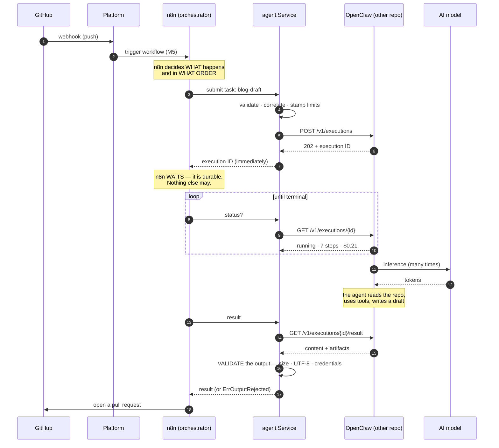

# Agent Execution — OpenClaw Integration

The platform delegates **autonomous task execution** to **OpenClaw**: read a
repository, understand it, draft a post, summarise a release.

- **Submit** — a task, and get an execution ID back immediately
- **Track** — poll it; it takes minutes, not milliseconds
- **Retrieve** — its output, *validated*, because the agent's output is untrusted
- **Cancel** — because an agent that has gone wrong is still spending money

> **This repository does not deploy OpenClaw.** Its infrastructure lives in
> `openclaw-on-aws`, which owns the compute, the sandbox, the credentials and the
> version. This repository owns the **contract** — and, because that contract is
> this repository's to define, it is [written down below](#the-contract).

The *why* is in the blog post,
[Integrating OpenClaw into an AI Agent Platform](docs/blog/integrating-openclaw-into-an-ai-agent-platform.md).

## Contents

- [Who does what](#who-does-what)
- [Why submit is fast and everything else polls](#why-submit-is-fast-and-everything-else-polls)
- [Architecture](#architecture)
- [The contract](#the-contract)
- [Configuration](#configuration)
- [Example request and response](#example-request-and-response)
- [Idempotency: a retry costs money](#idempotency-a-retry-costs-money)
- [Limits](#limits)
- [The agent's output is untrusted](#the-agents-output-is-untrusted)
- [Errors](#errors)
- [Observability](#observability)
- [Local development](#local-development)
- [Testing](#testing)
- [Adding an agent](#adding-an-agent)
- [Future multi-agent architecture](#future-multi-agent-architecture)
- [Troubleshooting](#troubleshooting)

## Who does what

The clean division, and the one the brief asks to be explicit about:

| | Owns | Does **not** own |
| --- | --- | --- |
| **The application** (this repo) | Receiving events. Deciding *that* work should happen. The contracts. | How the work is orchestrated, or how it is performed. |
| **n8n** (M5) | **Orchestration.** What happens, in what order, what to do when a step fails, and **the waiting**. | How to be an agent. It calls one; it is not one. |
| **OpenClaw** (M6) | **Execution.** One open-ended task: read this repo, use tools, produce output. | What the pipeline is. It does not know a pipeline exists. |
| **AI models** | **Inference.** Tokens in, tokens out. | Everything else. They are called *by* the agent, not by the platform. |

The distinction that matters: **orchestration is not execution.** An orchestrator's
steps are short, deterministic, and safe to retry. An agent's run is long,
non-deterministic, expensive, and **emphatically not safe to retry** — it has a
shell, it makes commits, it costs money per token.

Keeping them apart is the design. n8n knows the shape of the pipeline and cannot
write a blog post; OpenClaw can write a blog post and does not know what a pipeline
is. Neither appears in the other's code.

## Why submit is fast and everything else polls

An n8n webhook returns in milliseconds. **An agent run takes minutes to hours.**
That single fact reshapes the whole contract:

```
Submit(…)  → an execution ID, immediately     fast · retryable
Status(id) → where it is now                  cheap · pollable
Result(id) → what it produced, once terminal
Cancel(id) → stop burning money
```

> ⚠️ **Never wait for an agent in a Lambda, an HTTP handler, or the webhook path.**
>
> Blocking a request-scoped process on a twenty-minute agent means paying for a
> process to sleep — and losing the run entirely when that process is killed, which
> on this platform is a Spot instance that can be reclaimed with two minutes'
> notice.
>
> **Waiting is n8n's job.** It has wait nodes, it is durable, and it survives
> restarts. That is a large part of why the platform has an orchestrator at all.

`Service.Wait` exists for the CLI, for tests, and for a caller that has genuinely
thought about it. Its doc comment says so, at length, on purpose.

## Architecture



Note where the model appears: **the platform never calls it.** The agent does. The
platform's job stops at "run this task, within these limits, and show me what came
back".

## The contract

CloudFormation is not involved and neither is a shared library — the boundary is
**HTTP**, and this repository defines it because the repository scope says so:

> *"Component deployments live in their own repositories… This repository defines
> the contracts between them; it does not deploy them."*

`openclaw-on-aws` must expose:

| | | |
| --- | --- | --- |
| `POST` | `/v1/executions` | submit a task → **`202` + execution** |
| `GET` | `/v1/executions/{id}` | where is it → **execution** |
| `GET` | `/v1/executions/{id}/result` | what did it produce → **result** |
| `POST` | `/v1/executions/{id}/cancel` | stop spending → **`202`** |

**An execution echoes the correlation chain back.** That is part of the contract,
not a nicety: `Submit` knows the chain because it sent it, but `Status` and
`Result` are called *later*, by a different process (an n8n poll, an operator with
a CLI) that has only an execution ID. Without the echo, the one log line that says
*"the agent finished"* would be the one line that cannot be traced back to the
GitHub delivery that caused it. (It was, until running it end to end showed the
field empty.)

## Configuration

Everything is an environment variable. There is not a single OpenClaw URL, token or
agent name compiled into this repository.

| Variable | Required | Default | Notes |
| --- | --- | --- | --- |
| `OPENCLAW_BASE_URL` | ✅ | — | Where OpenClaw is. |
| `OPENCLAW_TOKEN` | ✅ | — | **Never logged, never in an error.** |
| `OPENCLAW_AGENTS` | ✅¹ | — | `task-type=agent,…`. The registry. |
| `OPENCLAW_DEFAULT_AGENT` | ¹ | *(none)* | Catches unmapped tasks. **No default by default** — silently sending `release-notes` to whichever agent happens to be default is how you get a blog post where you wanted release notes. |
| `OPENCLAW_AUTH_HEADER` | | `Authorization` | A bare token in a custom header; `Bearer …` in `Authorization`. |
| `OPENCLAW_TIMEOUT` | | `15s` | Bounds **one HTTP call** — *not* an agent run. |
| `OPENCLAW_RETRY_ATTEMPTS` / `_DELAY` | | `3` / `500ms` | Total attempts, not retries after the first. |
| `OPENCLAW_POLL_INTERVAL` | | `5s` | How often to ask whether it is done. |
| `OPENCLAW_MAX_STEPS` | | `40` | **The budget.** See [Limits](#limits). |
| `OPENCLAW_MAX_DURATION` | | `20m` | |
| `OPENCLAW_MAX_OUTPUT_BYTES` | | `1 MiB` | |
| `OPENCLAW_CA_CERT` | | — | For a private CA. **There is no "skip TLS verification".** |

¹ One of `OPENCLAW_AGENTS` or `OPENCLAW_DEFAULT_AGENT` must be set, or nothing could
ever be executed — and the config refuses to load rather than let you find that out
on the first webhook of the day.

## Example request and response

**Submitted** (`POST /v1/executions`):

```json
{
  "idempotencyKey": "blog-draft:push:delivery-abc-123",
  "correlationId": "push:delivery-abc-123",
  "workflowExecutionId": "n8n-exec-42",
  "agent": "writer",
  "taskType": "blog-draft",
  "attempt": 1,
  "task": {
    "type": "blog-draft",
    "instructions": "Draft a technical post about the changes in this commit.",
    "repository": {
      "name": "teddynted/platform",
      "url": "https://github.com/teddynted/platform",
      "branch": "main",
      "commitSha": "deadbeef",
      "commitMessage": "feat: add the thing"
    },
    "limits": { "maxSteps": 20, "maxDurationSeconds": 300, "maxOutputBytes": 1048576 }
  }
}
```

**Accepted** (`202`):

```json
{ "id": "exec-1", "agent": "writer", "status": "queued",
  "taskType": "blog-draft", "correlationId": "push:delivery-abc-123",
  "workflowExecutionId": "n8n-exec-42" }
```

**Finished** (`GET /v1/executions/exec-1/result`):

```json
{
  "id": "exec-1", "status": "succeeded", "steps": 11, "costUsd": 0.42,
  "startedAt": "2026-07-14T10:00:01Z", "finishedAt": "2026-07-14T10:02:30Z",
  "correlationId": "push:delivery-abc-123",
  "output": {
    "content": "# Reducing AI Costs\n\nA draft…",
    "artifacts": [{ "path": "post.md", "uri": "s3://aiap/post.md", "bytes": 4096 }]
  }
}
```

**Instructions come from the platform, never from the repository.** That is the
security boundary. The agent may *read* repository content; it must never be *told
what to do* by it.

## Idempotency: a retry costs money

Milestone 5 established the hazard: a timeout tells you **no answer arrived**, and
nothing about whether the request did. Here the stakes are higher.

> An n8n retry wastes a webhook. **An agent retry wastes a model** — and can open a
> second pull request.

So every submit carries a key, derived from the correlation ID and the task type:

```
X-Idempotency-Key: blog-draft:push:delivery-abc-123
```

**Stable by construction:** the same workflow step, retried, produces the same key.
Anything random here would look sophisticated and defeat the entire purpose.

OpenClaw must recognise a repeated key and return the **existing** execution rather
than starting a second agent. Verified against a stub:

```
SUBMIT:     exec-1  agent=writer  corr=push:delivery-abc-123
IDEMPOTENT: key blog-draft:push:delivery-abc-123 already seen -> reusing exec-1
```

## Limits

**Every execution has a budget, and there is no way to submit one without.**

An autonomous agent in a loop is a machine for turning money into tokens, and the
failure mode of "it kept trying" arrives as a bill. `agent.Request.Validate()`
rejects a task with no step limit or no duration limit — the default of "unlimited"
is one nobody should be able to choose by forgetting.

| | Default | |
| --- | --- | --- |
| `maxSteps` | 40 | Bounds the reasoning loop |
| `maxDuration` | 20m | Wall clock |
| `maxOutputBytes` | 1 MiB | A very long blog post |

The budget is **sent explicitly** to OpenClaw. An agent trusted to have its own
sensible default is an agent that will eventually spend all night thinking.

And the budget is logged at request time, so a bill can be traced back to whatever
authorised it.

## The agent's output is untrusted

Milestone 1 wrote it down: *"OpenClaw holds a shell. Its credentials, network
egress, and filesystem are the security boundary — not the prompt."* This is where
that stops being a slogan.

The agent **reads a repository**. On a public repo, or one that takes outside pull
requests, **that content is attacker-influenced** — a file can contain text shaped
like an instruction, and a sufficiently helpful agent may comply. The platform
cannot prevent that from *inside* the agent. What it can do is refuse to carry the
consequences onward.

So the agent's output is treated as what it is: **input from an untrusted source**,
arriving at a system that is about to turn it into a pull request or a published
post. Three checks:

1. **Size** — an agent in a loop can emit megabytes.
2. **Encoding** — invalid UTF-8 in a file that will be committed and served.
3. **Credentials** — the one that matters.

### Why a credential in the output is *rejected*, not redacted

This is the opposite of what the [n8n integration](WORKFLOWS.md#security) does to an
inbound GitHub payload, and the asymmetry is deliberate:

- A GitHub payload with a token in it is a payload we are **forwarding**. Redact
  the field, keep the rest, get on with the day.
- An agent's draft with a token in it is **something that went wrong**. Quietly
  stripping the secret and publishing the rest *hides the incident*: the agent read
  a credential, and someone needs to know that **today**.

So it fails the execution, loudly:

```
agent output REJECTED — not published
  errorKind: output_rejected
  error: the agent's output contains what looks like a credential (aws-access-key-id).
         The execution has been failed rather than published. Treat the secret as
         compromised and rotate it: the agent could read it, which means it can act on it.
```

The error names **the kind** of credential and never the value — an error that
helpfully quotes the leaked secret has leaked it into the logs, which is the thing
we are preventing. Exit code **6**, distinct from "the agent failed".

The scanner is deliberately **narrow** (AWS keys, GitHub tokens, model-provider
keys, private keys — recognisable shapes, not "anything base64-ish"). A scanner that
fires on every long string gets switched off within a week, and a scanner that is
switched off protects nothing.

**It is a seatbelt, not a solution.** It cannot stop prompt injection. It can stop
this particular way of dying.

## Errors

| Error | Means | Retried? |
| --- | --- | --- |
| `ErrUnavailable` | Could not reach OpenClaw. The agent certainly did not start. | ✅ |
| `ErrTimeout` | No answer in time. On a submit, **the execution may exist anyway.** | ✅ |
| `ErrUnauthorized` | Credentials rejected. | ❌ |
| `ErrUnknownTask` | No agent registered for it. Fails **locally**, before any spend. | ❌ |
| `ErrInvalidRequest` | Malformed, or no limits. | ❌ |
| `ErrInvalidResponse` | OpenClaw answered with something we cannot trust. | ❌ |
| `ErrNotFound` | No such execution. | ❌ |
| **`ErrAgentFailed`** | **It ran and failed.** A *result*, not a transport failure. | ❌ **never** |
| `ErrExecutionTimeout` | It hit the limits we gave it and was stopped. | ❌ |
| `ErrOutputRejected` | It produced something we refuse to publish. **Security event.** | ❌ |
| `ErrStillRunning` | You asked for the result of a live execution. | ❌ |

**Why `ErrAgentFailed` is never retried:** the agent *ran*. Retrying re-runs it —
spending the money a second time, and possibly opening a second pull request.
Re-running a failed agent is a decision for a human or for n8n's error path, not for
an HTTP client with a retry loop.

## Observability

```json
{"level":"INFO","msg":"agent execution requested","correlationId":"push:delivery-abc-123","workflowExecutionId":"n8n-exec-42","taskType":"blog-draft","runtime":"openclaw","repository":"teddynted/platform","maxSteps":20,"maxDuration":"5m0s","idempotencyKey":"blog-draft:push:delivery-abc-123"}
{"level":"INFO","msg":"agent execution started","executionId":"exec-1","agent":"writer","status":"queued","attempts":1,"submitMs":6}
{"level":"INFO","msg":"agent execution completed","executionId":"exec-1","correlationId":"push:delivery-abc-123","workflowExecutionId":"n8n-exec-42","taskType":"blog-draft","agent":"writer","status":"succeeded","steps":11,"costUsd":0.42,"durationMs":149000,"polls":3,"outputBytes":69,"artifacts":1}
```

**The correlation chain is the point.** GitHub delivery → n8n execution → agent
execution. When a pull request appears and nobody knows why, one line answers it.

**Cost and steps are logged even on failure.** "It failed after 40 steps and $1.80"
is a different problem from "it failed immediately", and only one of them is a bug
in the prompt.

`errorKind` is the sentinel's name, not the message — an alert built on a message
breaks the first time someone improves the wording.

CloudWatch Logs Insights:

```
fields correlationId, executionId, errorKind, steps, costUsd, durationMs
| filter msg = "agent execution completed" or msg like /REJECTED/
| stats sum(costUsd) as spend, count() by taskType
```

## Local development

```bash
export OPENCLAW_BASE_URL=http://localhost:8088     # plain http: localhost only
export OPENCLAW_TOKEN=local-dev-token
export OPENCLAW_AGENTS='blog-draft=writer,repo-analysis=analyst'

go run ./cmd/agent list                            # what is wired up

go run ./cmd/agent submit blog-draft \
  --correlation push:delivery-abc-123 --workflow-execution n8n-exec-42 \
  --instructions "Draft a post about this commit." \
  --repo teddynted/platform --sha deadbeef --max-steps 20 --max-duration 5m

go run ./cmd/agent watch  exec-1                   # follow it
go run ./cmd/agent cancel exec-1                   # STOP SPENDING
```

`submit` returns immediately — that is the honest shape. `run` submits and waits,
for when you can afford to.

> **Re-running an existing request?** Pass the **original** `--correlation`. Without
> it the CLI mints a fresh idempotency key, and OpenClaw will treat the re-run as a
> brand-new request — starting a **second agent**, and spending again. The CLI warns
> you when it has to invent one.

`Ctrl-C` stops *watching*, not the agent. Stopping the agent is `agent cancel`, and
conflating them would mean a stray `Ctrl-C` silently killed a twenty-minute run.

## Testing

```bash
go test ./internal/agent/ ./internal/openclaw/ ./internal/httpx/
go test -race ./...
```

OpenClaw is mocked with `httptest`. What the tests pin down:

| | |
| --- | --- |
| **Submit does not wait** | A terminal status from `Submit` fails the test. If it waited, nothing could call it. |
| **Idempotency** | A retried submit reuses the **same** key; the same request always produces the same key. |
| **Retry policy** | `5xx`/`429`/timeouts retried; `401`/`404`/`400` **not** — with the call count asserted. |
| **A submit timeout warns** the execution may exist anyway. |
| **Limits are mandatory** | A task with no budget cannot be submitted, including by forgetting. |
| **An unknown status → `running`** | Never terminal. Treating an unknown state as terminal would discard a live execution or invent a result. |
| **A credential in the output is REJECTED** | And the error never quotes the secret, and tells someone to rotate it. |
| **Ordinary prose is not flagged** | A scanner with false positives gets switched off. |
| **Giving up waiting ≠ the agent stopped** | It is still running, and still spending. |
| **The seam** | The `Service` runs entirely against a fake runtime, with no HTTP at all. |

## Adding an agent

**Configuration, not code:**

```bash
OPENCLAW_AGENTS=blog-draft=writer,repo-analysis=analyst,release-notes=summariser
```

A new *task type* is one constant in `internal/agent`. A new *agent* is one entry
above. Neither is a new client, a new interface, or a new retry policy — which is
the test of whether this integration is actually reusable.

## Future multi-agent architecture

The pieces this milestone deliberately leaves in place for later, without building
them:

- **Multiple collaborating agents.** The registry already maps *task type → agent*,
  so two tasks can go to two different agents today. A *chain* of them is an n8n
  workflow, not a change here — which is exactly the point of having an
  orchestrator.
- **Human approval.** An n8n wait node between "drafted" and "published". The agent
  integration does not need to know.
- **Long-running tasks.** Already the assumption: submit/poll, not request/response.
- **Agent memory, tool calling, RAG.** All *inside* OpenClaw, behind the contract.
  The platform passes instructions and limits; how the agent thinks is its business.
- **Bedrock / Ollama / local models.** The agent calls the model — the platform
  never does. Swapping the model is a change in `openclaw-on-aws`, and this
  repository does not notice. *(The provider abstraction the platform owns arrives
  in Milestones 8–10.)*
- **A result path.** Today the caller polls. When an agent should announce itself,
  it should publish to the platform's **own event bus** (Milestone 2), which is a
  nicer shape than a callback URL.

## Troubleshooting

| Symptom | Cause / fix |
| --- | --- |
| **Two pull requests from one commit** | OpenClaw is not honouring `idempotencyKey`. This is the cause until proven otherwise: a timeout on our side is *expected* to produce a retry, and the key is the only thing that stops it becoming a second agent. |
| `ErrOutputRejected` | The agent put something credential-shaped in its output. **This is a security event, not a formatting problem.** Rotate the secret; the agent could read it, which means it can act on it. Then ask why the agent had access. |
| `ErrUnknownTask` although it is in `OPENCLAW_AGENTS` | The task type string must match exactly. `agent list` prints what is actually registered. |
| An execution runs forever | It cannot: it has limits. If it *seems* to, you are watching `Wait` — whose timeout bounds **your patience**, not the agent. The agent is still running; `agent cancel` stops it. |
| Cost is higher than expected | Check `steps` in the completion log. An agent that used its whole step budget was probably confused, not thorough — read its instructions. |
| `ErrStillRunning` from `result` | The execution has not finished. Poll `status`, or `watch`. |
| Everything works but the logs have no `correlationId` | OpenClaw is not echoing the chain back (see [the contract](#the-contract)). Submit will still carry it; `status`/`result` will not. |
