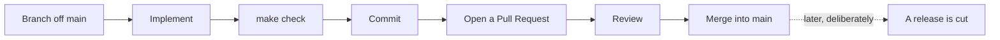

# Contributing

Thanks for considering a contribution. This document covers how to get set up, how to write a change that fits, and what happens to it afterwards.

For how releases work, see [RELEASE_MANAGEMENT.md](RELEASE_MANAGEMENT.md). For why the architecture is the way it is, start with the [ADRs](docs/adr/).

---

## What this repository is

A design and documentation project for an AI agent platform on AWS, plus the Go tooling that releases it. Most contributions are to `docs/`. The only application code is [`cmd/release`](cmd/release/) and [`internal/`](internal/).

## Prerequisites

| Tool | Why |
|---|---|
| **Go** (see [`go.mod`](go.mod) for the version) | Building and testing the release CLI |
| **git** on `PATH` | The release tooling shells out to it — [ADR-0014](docs/adr/0014-exec-git-rather-than-go-git.md) |

Nothing else. The Go module has exactly one third-party dependency.

## Getting started

```bash
git clone git@github.com:teddynted/designing-an-ai-agent-platform-on-aws.git
cd designing-an-ai-agent-platform-on-aws

make check     # fmt, vet, test — the same gate CI applies
```

---

## The workflow



Releases are a **separate, deliberate act**. Merging does not release anything. See [RELEASE_MANAGEMENT.md](RELEASE_MANAGEMENT.md).

### Branches

Branch off `main`. Name the branch for the work, not for yourself:

```
release-management
milestone-1-initial-architecture
fix/numstat-rename-parsing
```

### Pull Requests

- One coherent change per PR. If the title needs an "and", consider two PRs.
- `make check` must pass before you open it.
- Explain **why**, not what. The diff already says what.
- If the change alters an architectural decision, it needs an ADR. ADRs are immutable once accepted — a changed decision is a *new* ADR that supersedes the old one, so the reasoning trail survives.

---

## Commit messages

**Your commit subjects become the changelog.** This is not a style preference; it is a mechanical fact. The release tooling reads `git log`, classifies each subject, and writes the result into `CHANGELOG.md` and the GitHub Release notes. A vague subject produces a vague changelog entry, and nobody edits it afterwards.

Write the subject as an **English imperative**, describing what the commit does to the codebase:

```
Add the roadmap registry
Fix the numstat rename parser
Remove milestone framing throughout
Harden the tag parser against empty paths
```

Not `Added…`, not `adds…`, not `fixing…`.

### How the leading verb picks a category

The classifier matches the first word of the subject. These verbs are recognised:

| Category | Verbs |
|---|---|
| **Added** | `add` `introduce` `create` `implement` `support` `draw` `document` |
| **Fixed** | `fix` `correct` `repair` `resolve` `prevent` `stop` `avoid` `handle` |
| **Removed** | `remove` `delete` `drop` |
| **Deprecated** | `deprecate` |
| **Security** | `harden` `sanitise` `sanitize` |
| **Changed** | `change` `update` `rename` `restore` `move` `rework` `refactor` `simplify` `improve` `tighten` `clarify` |

**An unrecognised verb yields Changed** — the category that asserts least. Nothing guesses from the diff, and nothing calls a language model. A wrong guess in a changelog is worse than a vague one, because a changelog is read as a record.

A subject mentioning `CVE-`, `vulnerabilit…`, `injection`, `credential leak`, or `RCE` is promoted to **Security** regardless of its verb. A security fix filed under *Fixed* is a security fix nobody notices.

### Conventional Commits also work

If you prefer them, they take precedence over the verb heuristic:

```
feat: add rename detection          → Added
feat(git): add rename detection     → Added, scoped
fix: correct the numstat parser     → Fixed
docs: explain the seam              → Changed
security: pin the action            → Security
```

### Breaking changes

Either marker works, and both file the entry under **Changed** with a `**Breaking:**` prefix:

```
feat!: drop the v1 endpoint
feat(api)!: drop the v1 endpoint
```

or a footer on any body line:

```
feat: rework routing

BREAKING CHANGE: the X-Route header moved to a query parameter
```

### What gets dropped

These never appear in release notes. They are true statements about the repository that no reader of a release note wants:

- Merge commits — `Merge pull request …`, `Merge branch …`
- Conventional types `chore` `ci` `build` `test` `tests` `style`
- Release mechanics — subjects starting `Bump version`, `Prepare release`, `Release v`

Use them freely. They cost nothing.

### Checking your work

Before opening a PR, see exactly how your commits will read to a user:

```bash
make notes
```

This prints the release notes for the next release and writes nothing. If a commit landed under the wrong heading, **fix the commit subject, not the changelog**.

> A note on trailers: this project does not add `Co-Authored-By` trailers for AI assistance.

---

## Testing

```bash
make test      # go test ./...
make race      # go test -race ./...
make cover     # per-package coverage
make check     # fmt, vet, test — run this before every PR
```

Every external system sits behind an interface, so **the whole suite runs with no network and no repository on disk**:

- `git.Runner` is faked with a table of canned command output. Tests assert on the *exact arguments issued*, because the difference between `base..head` and `base...head` is the difference between a correct release note and a wrong one.
- `github.Transport` is faked with canned HTTP responses.
- `release.Clock` is fixed, so generated dates are assertable.

Prefer **table-driven tests**. Name cases for the behaviour they pin down, not for their inputs.

If you fix a bug, add the test that would have caught it. The `-z` parser's trailing-NUL handling exists because a test demanded it.

---

## Documentation

Documentation is the primary artefact of this repository, not an afterthought.

| Change | Where |
|---|---|
| An architectural decision | A new ADR in [`docs/adr/`](docs/adr/), plus a row in its [index](docs/adr/README.md) |
| How a part of the platform works | The matching chapter in [`docs/architecture/`](docs/architecture/) |
| Release process or versioning | [RELEASE_MANAGEMENT.md](RELEASE_MANAGEMENT.md) |
| Contributor-facing process | This file |

House style, observed rather than enforced:

- **Say what it costs.** Every ADR carries an explicit *negative consequences* section, because that is the part people skip and the part that matters in eighteen months.
- **Cross-reference; do not duplicate.** One fact, one home, links from everywhere else.
- Mermaid diagrams over images where the diagram is structural — they render on GitHub and diff cleanly.
- British spelling in prose.

---

## Releasing

You almost certainly do not need to. Releases are cut by maintainers, deliberately, from `main`:

```bash
make release-patch    # a backwards-compatible fix
make release-minor    # a backwards-compatible feature
make release-major    # a breaking change
```

The full lifecycle, the responsibilities of each actor, and the SemVer rules are documented in [RELEASE_MANAGEMENT.md](RELEASE_MANAGEMENT.md).
