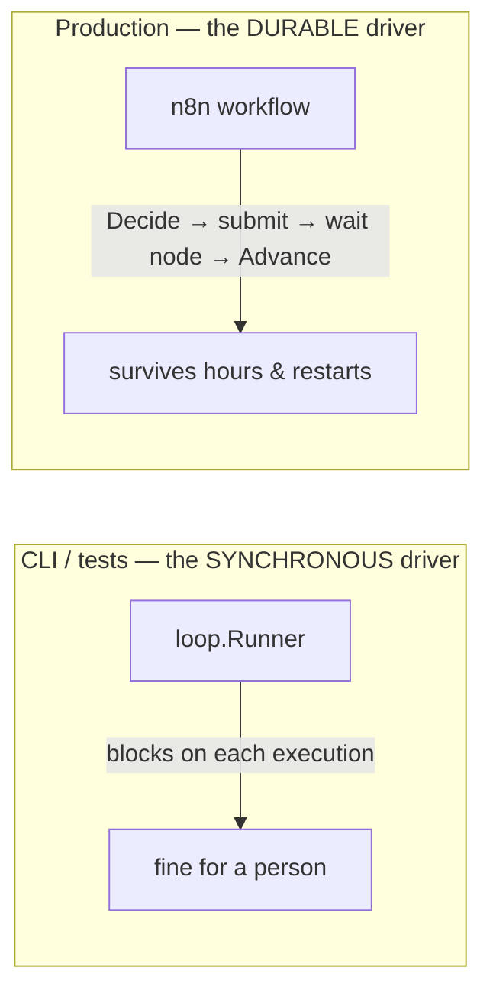

# Loop Engineering — An Explicit, Bounded, Recoverable Agent Loop

The platform can now pursue a **goal** autonomously: plan it, execute the tasks, judge the
results, reflect on failures, adapt, and stop safely — an iterative loop rather than a single
request and response.

```bash
loop run --goal "Draft a blog post about the changes in this release" --repo owner/name
```

The word that matters is **engineering**. The loop is not a model left to run until it
decides it is done; it is an explicit state machine the platform owns, inspects, bounds,
persists, and can stop. Every iteration's decision — retry, replan, ask a human, finish — is
made by code you can read and test, not inferred inside a model you cannot.

> **This is the platform's THIRD loop, and it is none of the other two.** The agent's own
> reasoning loop runs inside OpenClaw (Milestone 6); the tool loop runs inside a single
> inference (Milestone 9). This one runs *above* both, orchestrating them — and keeping the
> three distinct is the whole design. See [Three loops](#three-loops-and-this-is-the-third).

> **This repository runs no model and no agent.** Reasoning is delegated to the inference
> plane (Ollama or Bedrock, via the [Milestone 10 router](ROUTING.md)); execution is
> delegated to OpenClaw. The loop **controller** is what this milestone owns — and it imports
> neither, which is what makes it independent of both.

The *why* is in the blog post,
[Building Autonomous AI Agents with Loop Engineering](docs/blog/building-autonomous-ai-agents-with-loop-engineering.md).

## Contents

- [Three loops, and this is the third](#three-loops-and-this-is-the-third)
- [The agent lifecycle](#the-agent-lifecycle)
- [Where each stage runs](#where-each-stage-runs)
- [The controller is a pure reducer](#the-controller-is-a-pure-reducer)
- [Planning](#planning)
- [Execution](#execution)
- [Evaluation](#evaluation)
- [Reflection](#reflection)
- [The retry framework](#the-retry-framework)
- [Stopping conditions](#stopping-conditions)
- [State and recovery](#state-and-recovery)
- [Workflow integration: who drives the loop](#workflow-integration-who-drives-the-loop)
- [Configuration](#configuration)
- [IAM and security](#iam-and-security)
- [Observability](#observability)
- [Extensibility](#extensibility)
- [Testing](#testing)
- [Troubleshooting](#troubleshooting)

## Three loops, and this is the third

Blurring these is the mistake the design exists to avoid.

| Loop | Milestone | Runs | Driven by | Bounded by |
| --- | --- | --- | --- | --- |
| The agent's reasoning loop | 6 | **inside OpenClaw**, behind HTTP | the agent | `agent.Limits.MaxSteps` |
| The tool loop | 9 | **inside one inference** (`Converse`) | the model | turns, cost |
| **The loop controller** | **11** | **above both**, in the platform | **the platform (or n8n)** | iterations, retries, timeout, cost, stop conditions |

The tool loop lets a model call tools within one conversation — think, act, think — and
trusts the model to converge. The agent's loop autonomously executes one open-ended task,
entirely behind a boundary the platform cannot see into. The **loop controller** is the level
above: it takes a goal, decomposes it into tasks, runs each (as a whole agent execution or a
reasoning step), evaluates the result, reflects on failures, and decides whether to continue
— all explicitly, where the platform can bound and observe it.

## The agent lifecycle

```
Goal
 └─► Planning ──► Task selection ──► Execution ──► Evaluation ──► Reflection
                        ▲                                             │
                        │                    Decision ◄───────────────┘
                        │                        │
                        └──── retry / next ◄──────┤
                                                 │
                              replan ◄────────────┤
                                                 │
                              stop ◄──────────────┘
                                │
                            Summary
```

Each stage is independently testable, because the controller that sequences them is a pure
function ([below](#the-controller-is-a-pure-reducer)) — "why did the loop replan here?" is a
question answered by a struct literal in a test, not by re-running a model.

## Where each stage runs

The loop orchestrates; it does not do the work itself. Each stage is delegated across a
boundary the platform already had, and this mapping is what keeps the milestone from
reinventing the agent:

| Stage | Runs on | Why |
| --- | --- | --- |
| **Plan · Evaluate · Reflect · Summarise** | the **inference plane** (`llm.Structured`, routed by M10) | Reasoning. Single-shot, structured, **no side effects, safe to retry, cheap.** What the inference plane is *for*. |
| **Execute a task** | **OpenClaw** (the agent runtime) | The one step with side effects, real cost, minutes-to-hours, **not safe to retry**. "OpenClaw executes tasks." |
| **Waiting** across long executions | **n8n** | An agent run takes hours; the controller must never hold a process open for one. |

So the loop is **orchestration, not execution** — the distinction Milestone 5 drew and
Milestone 6 sharpened. It sits where an orchestrator sits, and every boundary beneath it is
untouched.

## The controller is a pure reducer

The controller is two pure functions, and neither does any I/O:

```go
Decide(state, config, now) Action           // what should happen next?
Advance(state, config, result, now) State    // fold the result of an action back in
```

A **Runner** performs the actions the reducer asks for and feeds the results back. That
separation is not tidiness — it buys every hard requirement of the milestone at once:

- **Stopping conditions are ALWAYS enforced.** They are checked at the top of `Decide`, which
  runs before *every* action, so no code path can begin expensive work with a budget already
  blown. It is the one road all traffic travels — the same discipline `llm.Service` uses to
  check the context window in one place so no provider can forget.
- **State survives interruption.** The state is a plain value with JSON tags; persist it,
  reload it, call `Decide` again. A Spot reclaim mid-loop loses only the in-flight action.
- **n8n can drive it durably**, because the controller never waits (see
  [Workflow integration](#workflow-integration-who-drives-the-loop)).
- **Every stage is a table test** — no model, no agent, no network.

The stages themselves are **interfaces** the loop declares (`Planner`, `Executor`,
`Evaluator`, `Reflector`, `Summariser`) and `internal/loop/adapter` implements against the
real planes. The loop core imports neither `internal/llm` nor `internal/agent`, and
`internal/architecture_test.go` fails the build if that ever changes.

## Planning

The planner turns a goal into an ordered set of **tasks** — as few as will do the job, since
every task is an agent execution that costs time and money. Each task has an id, a `type` (a
capability the runtime can perform), a description, instructions, and optional dependencies,
so a plan is a small graph, not just a list.

- The planner is asked to choose task types **only from what the runtime actually offers** —
  the plan schema enumerates them — so a plan cannot name work no agent can do.
- Claude is the preferred reasoner (it plans better), but planning is **provider-agnostic**:
  it is one `llm.Structured` call, routed by Milestone 10 to whatever is configured. Ollama
  can plan; Claude plans better.
- The plan is validated by the loop itself (`Plan.Validate`) beyond the schema: unique ids,
  resolvable dependencies, no task depending on itself. A plan the loop would deadlock on is
  rejected, and the model is asked to repair it.

`loop plan --goal … --repo …` runs *only* this stage and prints the plan — for iterating on
the planning prompt without spending a cent on executions.

## Execution

The executor runs one task as a **whole OpenClaw execution** and records the outcome. It is
the only stage that changes anything in the world.

- Instructions come from the **platform's** planning, never from repository content — the
  Milestone 6 security boundary, preserved.
- The outcome carries success, output, cost, duration, the execution id, and — the field the
  whole retry decision rests on — whether the failure was **transient**. The executor maps
  the runtime's errors to that flag exactly as the router maps a provider's: unreachable or
  timed-out is transient; the agent ran and failed is not.
- Each attempt (including a retry) is a **distinct** agent execution: the correlation folds in
  the task and the attempt number, so a retry is a fresh run rather than an idempotent replay
  of the failed one — while a transport retry within a single submit stays idempotent.

Tasks run **sequentially in dependency order** here. Parallel execution of independent tasks
is a driver change, not a plan change — the plan already carries the dependency graph — and
is deliberately left for a later milestone.

## Evaluation

After every execution, the evaluator — a reasoning step — produces a **structured verdict**,
not prose, because the reducer branches on it:

| Field | Meaning |
| --- | --- |
| `taskSucceeded` | Did this task actually do what it was asked? (Stricter than "the agent exited 0".) |
| `goalAchieved` | Is the whole objective met? The only thing that lets the loop finish. |
| `retry` | Attempt this task again? (Honoured only if transient and within budget.) |
| `replan` | Is the whole approach wrong, needing a different plan? |
| `humanRequired` | Does this need a person? A deliberate hand-off, not a failure. |
| `confidence` | How sure, in [0, 1]. Feeds the confidence gate. |

The **confidence gate** (`LOOP_MIN_CONFIDENCE`) downgrades a low-confidence "success" to a
retryable failure — because a low-confidence pass is exactly where a wrong-but-plausible
result slips into a pull request.

## Reflection

When a task fails and will be retried, the reflector — a reasoning step — analyses *why* and
proposes a change: usually a sharper, corrected set of **instructions** for the next attempt.

> Reflection improves the agent's **behaviour without changing the platform's code.** The
> revised instructions are authored on the platform's side of the boundary and replace the
> failed task's instructions for the next attempt.

Reflection is on by default and can be turned off (`LOOP_REFLECTION=false`), in which case a
retryable failure goes straight back to execution unchanged. A purely transient failure that
better instructions cannot help leaves the instructions untouched and simply retries.

## The retry framework

The loop's retry layer sits *above* the two that already exist — the provider's per-inference
retries and the agent runtime's per-call retries. It is a different job: those retry a single
network call that blipped; this retries a whole **task**.

- **`LOOP_MAX_RETRIES`** attempts per failed task, then the loop stops or replans.
- **Exponential backoff** (`LOOP_RETRY_DELAY` × `LOOP_BACKOFF_MULTIPLIER`, capped at
  `LOOP_MAX_RETRY_DELAY`). A multiplier of `1.0` is a fixed delay.
- **Only transient failures are retried.** A deterministic failure — the agent ran and
  produced something we rejected, the objective is impossible — is never retried, because the
  next attempt fails the same way and bills again.
- **The delay is a value the reducer emits, not a sleep it takes.** The driver waits — a
  `time.Sleep` in the CLI, a durable n8n wait node in production — so a backoff survives a
  process that dies during it.

Infinite retry loops are impossible by construction: the retry budget is finite, and above it
the hard iteration cap (`LOOP_MAX_ITERATIONS`) guarantees termination regardless.

## Stopping conditions

Checked at the top of `Decide`, before any action, on every cycle — so they are **always
enforced**. Every one is configurable, and the loop summarises before it stops, so even an
aborted run produces an account.

| Reason | Trips when |
| --- | --- |
| `goal-achieved` | The evaluator declared the objective met. (The happy one.) |
| `max-iterations` | Total execution attempts hit `LOOP_MAX_ITERATIONS`. The backstop that guarantees termination. |
| `max-retries` | A task exhausted its retry budget. |
| `max-replans` | The plan was rebuilt `LOOP_MAX_REPLANS` times without success. |
| `timeout` | The whole loop's wall clock hit `LOOP_TIMEOUT`. |
| `cost-exceeded` | The running cost — executions **and** reasoning — hit `LOOP_MAX_COST_USD`. |
| `human-required` | The evaluator asked for a person. (Milestone 14 makes this an n8n approval gate.) |
| `critical-failure` | A stage engine broke, or a task failed unrecoverably. |

The cost cap counts **both halves of the bill** — the agent executions and the reasoning
steps — because a cap blind to reasoning is a cap that lies.

## State and recovery

The entire loop is a serialisable value (`loop.State`): the goal, the current plan, the task
cursor, completed and failed outcomes, the reflection history, every counter, the running
cost, and the pending result between stages. Nothing lives on a goroutine's stack.

So recovery is: **persist the state after each step, and on a fresh process, load it and call
`Decide`.** The reducer resumes exactly where it stopped. Crucially, the *pending outcome*
survives serialisation — a loop reclaimed right after an expensive execution evaluates the
result it already has rather than paying to re-run the agent, which is the one thing recovery
must avoid.

## Workflow integration: who drives the loop

The reducer never waits, so it has two drivers, and they call the same two functions:



- **The `loop.Runner`** (this repo) is synchronous: it blocks on each agent execution. That is
  correct for the CLI and for tests, and it carries the same warning `agent.Service.Wait`
  does — **never wrap it in a Lambda, an HTTP handler, or the webhook path.**
- **In production, n8n drives the loop**: call `Decide`, submit the agent execution the action
  asks for, let a durable wait node poll it, then call `Advance` with the outcome — across a
  run that may last hours, on infrastructure built to survive restarts. That driver is an n8n
  workflow, not code here — exactly as the waiting for a single agent execution is (see
  [AGENTS.md](AGENTS.md)).

The full production path: `Workflow trigger → n8n → [Decide → OpenClaw execution → Evaluate →
Reflect → Advance] → Completion → Result`, with Claude (or Ollama) doing the reasoning and the
Milestone 10 router choosing which.

## Configuration

Everything is an environment variable. The loop holds **no endpoint, region, model or
credential** — those belong to the planes it delegates to.

| Variable | Default | Notes |
| --- | --- | --- |
| `LOOP_MAX_ITERATIONS` | `12` | Hard cap on execution attempts. The termination backstop; never disable in production. |
| `LOOP_MAX_RETRIES` | `2` | Attempts per failed task. |
| `LOOP_MAX_REPLANS` | `2` | Times the plan may be rebuilt. |
| `LOOP_RETRY_DELAY` | `2s` | Base backoff. |
| `LOOP_MAX_RETRY_DELAY` | `30s` | Backoff cap. |
| `LOOP_BACKOFF_MULTIPLIER` | `2.0` | `1.0` = fixed delay. |
| `LOOP_TIMEOUT` | `30m` | The whole loop's wall clock. |
| `LOOP_MAX_COST_USD` | `5.0` | Cost cap (executions + reasoning). `0` disables — do so deliberately. |
| `LOOP_REFLECTION` | `true` | Learn from a failure before retrying. |
| `LOOP_MIN_CONFIDENCE` | `0` | Downgrade a success below this confidence to a retry. |

Plus the planes' own configuration: `LLM_PROVIDER` / `LLM_ROUTER_*` (which model reasons — see
[INFERENCE.md](INFERENCE.md) and [ROUTING.md](ROUTING.md)) and `OPENCLAW_*` (which runtime
executes — see [AGENTS.md](AGENTS.md)).

## IAM and security

The loop adds **no new permissions and no new credentials.** It calls nothing itself; the two
planes it delegates to authenticate exactly as they did:

- **Reasoning** — Bedrock via AWS IAM (the EC2 instance role, no static key — see
  [INFERENCE.md](INFERENCE.md#the-two-permissions-bedrock-needs)), or Ollama over the VPC.
- **Execution** — OpenClaw via its bearer token (`OPENCLAW_TOKEN`, never logged).

The security properties that are the loop's own:

- **Instructions are the platform's, never the repository's** — at planning, execution, and
  reflection. Repository content is data the agent may read, never instruction it obeys. This
  is the Milestone 6 boundary, and the loop is careful not to launder repository text into a
  task's instructions through reflection.
- **The agent's output is untrusted** and is validated by OpenClaw before the loop sees it
  (size, UTF-8, credential-scan — see [AGENTS.md](AGENTS.md#the-agents-output-is-untrusted)).
- **Bounds are mandatory and enforced in one place**, so an autonomous loop cannot spend
  without limit — the failure mode a loop most needs protection from.
- **`humanRequired` is a first-class stop**, so the loop hands off rather than guesses when it
  should not decide.

## Observability

Structured logs, designed for CloudWatch, emitted by the Runner (the reducer is pure and logs
nothing). Every stage carries the correlation chain, so a loop's cost and decisions trace back
to the goal — and the goal back to the GitHub delivery.

```json
{"level":"INFO","msg":"route selected... ","phase":"planning","action":"plan","reason":"no plan yet; planning the goal"}
{"level":"INFO","msg":"planned","tasks":2,"iteration":0}
{"level":"INFO","msg":"executing task","taskId":"analyse-repo","taskType":"repo-analysis","attempt":0,"retryCount":0}
{"level":"INFO","msg":"task executed","success":false,"transient":true,"executionId":"exec-1","costUsd":0.21}
{"level":"INFO","msg":"evaluated","taskSucceeded":false,"retry":true,"confidence":0.6,"decision":"the analysis missed the point"}
{"level":"INFO","msg":"reflected","adjustment":"narrow to the Go files","revisedInstructions":true}
{"level":"WARN","msg":"loop stopped before achieving the goal","stop":"max-iterations","iterations":12,"costUsd":1.84,"durationMs":142000}
```

The fields a loop question actually needs: `phase`, `action`, `reason` (why the loop did that),
`iteration`, `taskId`, `attempt`/`retryCount`, `transient`, the evaluator's `decision`, and on
the terminal line `stop`, `iterations`, `costUsd`, `durationMs`. A stop is logged at **WARN**,
not ERROR — a bound doing its job is not a crash, and an alert on "the loop failed" must not
fire every time a cost cap works.

```
fields correlationId, phase, action, stop, iterations, costUsd
| filter msg = "loop stopped before achieving the goal" or msg = "loop completed — goal achieved"
| stats count() by stop
```

## Extensibility

The architecture is shaped for what comes later without building it:

- **Dynamic planning strategies** are new `Planner` implementations. The interface already
  returns a plan; a cost-aware or memory-aware planner is a different implementation behind it.
- **Parallel execution** is a driver change — the plan's dependency graph is already there.
- **Human-in-the-loop approval** (Milestone 14) already has its signal: `humanRequired` stops
  the loop cleanly, ready to become an n8n approval gate.
- **Multi-agent systems, long-term memory, MCP servers, tool registries, RAG** all sit behind
  the stage interfaces or beneath the execution boundary. A memory-backed evaluator, a
  retrieval-augmented planner — each is an adapter change, and the reducer never notices.

None of these are implemented in this milestone; they are what the seams are *for*.

## Testing

```bash
go test ./internal/loop/...              # the reducer, the runner, the adapters — no I/O
go test ./internal/ -run Architecture    # the seam: loop imports neither llm nor agent
go test -race ./...
```

The whole controller is tested against **fake engines** — struct literals that say "the plan
is this, the outcome is that" — with no model and no OpenClaw. That this is possible is the
point of the interfaces. What the tests pin down:

| | |
| --- | --- |
| **The lifecycle** | plan → execute → evaluate → done, each transition a pure step. |
| **Retry + reflection** | a transient failure is reflected on, and the revised instructions reach the executor. |
| **A deterministic failure is never retried** | the same doomed task is not re-run for a second bill. |
| **The loop cannot run forever** | retry budget and iteration cap both stop it; asserted by call count. |
| **Stops are enforced before any action** | a blown budget never starts an expensive task. |
| **A stopped loop still summarises** | a caller always gets an account. |
| **State round-trips through JSON** | the pending outcome survives, so recovery does not re-execute. |
| **The executor maps failures to transience** | the one thing the retry decision depends on. |

## Troubleshooting

| Symptom | Cause / fix |
| --- | --- |
| The loop stops at `max-iterations` immediately | The objective is too big for the budget, or the plan is going in circles. Read the plan (`loop plan …`) and the per-iteration logs; raise `LOOP_MAX_ITERATIONS` only if the work genuinely needs it. |
| A task retries and fails identically | It is a **deterministic** failure being treated as transient, or reflection is off. Check `transient` in the logs; a task that failed on its merits needs reflection (or a replan), not a blind retry. |
| The loop stops at `cost-exceeded` sooner than expected | Reasoning counts too. A long tool-using reasoning step or many replans add up — check `costUsd` per stage. |
| `human-required` with no obvious reason | The evaluator judged the objective ambiguous or the next step unsafe. Read its `decision` in the log. This is working as intended — it is asking rather than guessing. |
| The loop "changed its approach" mysteriously | It reflected. The `reflectionHistory` in the state and the `reflected` log lines show what changed and why. |
| `loop run` hangs | It is blocking on an agent execution (minutes to hours) — that is the synchronous Runner. In production, n8n drives it without blocking. |
| Two agent executions for one retried task | Correct — a retry is a **fresh** execution by design. Idempotency only collapses transport retries within one submit. |
| The loop will not start | A plane is misconfigured. `loop config` shows what is wired; the error names the missing `LLM_*` or `OPENCLAW_*` variable. |
