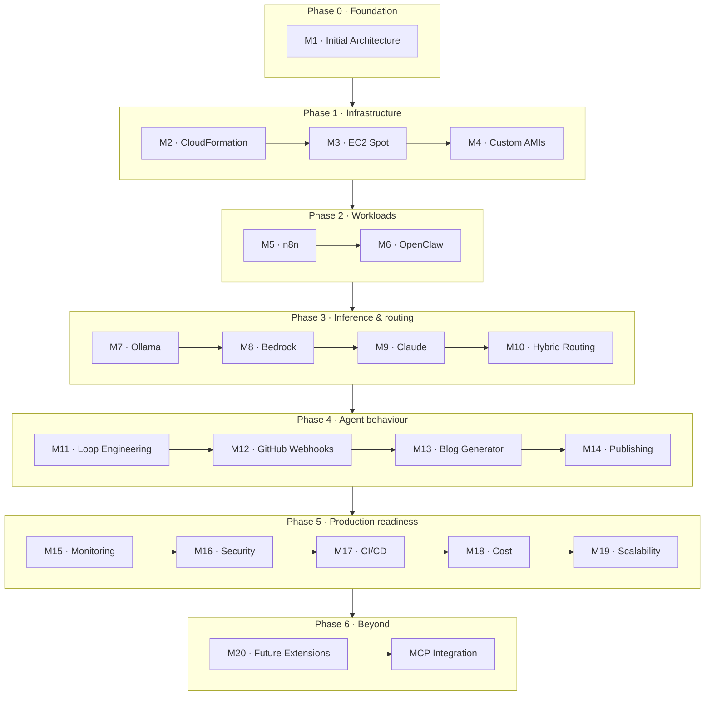

# Designing an AI Agent Platform on AWS

[](#roadmap)
[](#milestone-1--initial-architecture)
[](https://semver.org/spec/v2.0.0.html)
[](https://www.conventionalcommits.org/en/v1.0.0/)

> **Status: planning.**
> This repository is in its planning phase. Apart from the repository's own
> release tooling, **nothing described below has been built yet.** Every
> milestone, component, and integration on this page is a statement of intent,
> not of fact. Implementation begins with
> [Milestone 1 — Initial Architecture](#milestone-1--initial-architecture).

An open design study and reference implementation for running **autonomous AI
agents on AWS**: how to host them, how to feed them models, how to let them act
on a repository, and how to keep the bill and the blast radius small.

---

## Contents

- [Project Overview](#project-overview)
- [Vision](#vision)
- [Goals](#goals)
- [What exists today](#what-exists-today)
- [Key Features (Planned)](#key-features-planned)
- [High-Level Architecture Overview](#high-level-architecture-overview)
- [Technology Stack](#technology-stack)
- [Repository Scope](#repository-scope)
- [Related Repositories](#related-repositories)
- [Roadmap](#roadmap)
- [Planned Technical Blog Series](#planned-technical-blog-series)
- [Future Enhancements](#future-enhancements)
- [Contributing](#contributing)
- [License](#license)

---

## Project Overview

An AI agent is an ordinary workload with three unusual properties. It is
**stateful** where most serverless workloads are not. It is **expensive per
request** in a way that rewards careful model routing. And it is a **confused
deputy with a shell** — software that will do what it is told by whoever manages
to tell it something.

This project treats each of those properties as an architectural problem rather
than a prompt-engineering one, and works through the answers on AWS in public.

The platform being designed will host a workflow engine, an agent runtime, and a
model-inference tier, wire them to a GitHub repository, and let the resulting
agents do real work: reading issues, opening pull requests, and publishing what
they learn.

## Vision

**Autonomous agents should be boring to operate.**

A team should be able to run agents on their own infrastructure with the same
confidence they run a web service: predictable cost, understood failure modes, a
security boundary that holds, and an upgrade path that does not involve
rewriting the platform every time a model provider changes its API.

That means:

- **The model provider is a seam, not a foundation.** Swapping a local model for
  a hosted one should be a routing decision, not a migration.
- **Interruption is a design input.** Spot capacity is cheap precisely because it
  goes away. Work belongs where interruption is free; state belongs where it
  survives.
- **Prompt injection is a privilege problem.** An agent that cannot reach
  production credentials cannot leak them, however it is persuaded.

## Goals

| # | Goal | Why it matters |
| --- | --- | --- |
| 1 | Decompose the platform by **statefulness and interruption tolerance**, not by service | Lets each tier use the cheapest capacity it can survive on |
| 2 | Make the **inference provider swappable** behind one abstraction | Local, hosted, and frontier models become a routing choice |
| 3 | Run the interruption-tolerant tiers on **EC2 Spot** | The dominant cost of self-hosted inference is idle GPU |
| 4 | Give agents a **sandboxed blast radius** | An agent with a shell is a security boundary, not a feature |
| 5 | Make the platform **observable and affordable by default** | Cost and telemetry are milestones, not afterthoughts |
| 6 | Document every decision as a **standalone blog post** | The reasoning is the deliverable, not just the templates |

## What exists today

Being explicit, because everything else on this page is aspirational:

| Component | Status | Notes |
| --- | --- | --- |
| Release management tooling | ✅ **Implemented** | A Go CLI and workflows that version, tag, and publish this repository. See [RELEASE_MANAGEMENT.md](RELEASE_MANAGEMENT.md) |
| Platform architecture | 📋 Planned | [Milestone 1](#milestone-1--initial-architecture) |
| AWS infrastructure | 📋 Planned | [Milestone 2](#milestone-2--cloudformation-infrastructure) onwards |
| Every integration below | 📋 Planned | Nothing is deployed |

No CloudFormation template, deployment script, or application component exists in
this repository yet.

## Key Features (Planned)

None of the following are built. They describe what the platform is intended to
do once the roadmap is complete.

- **Three-plane architecture** — a serverless control plane, a stateful agent
  plane, and a stateless inference plane, each sized and priced independently.
- **Hybrid AI routing** — one abstraction over local models, Amazon Bedrock, and
  the Claude API, choosing a provider per request by cost, latency, and
  capability.
- **Spot-first inference** — GPU capacity on EC2 Spot, with a managed backstop so
  an interruption degrades latency rather than availability.
- **Self-hosted workflow orchestration** — n8n as the durable orchestrator
  between events, agents, and the outside world.
- **Agent runtime** — OpenClaw as the agent execution environment, with a
  sandboxed filesystem and credential boundary.
- **Loop engineering** — explicit control over how an agent iterates, when it
  stops, and what it is allowed to spend.
- **GitHub-native automation** — webhooks in, pull requests out.
- **Automated technical publishing** — an agent that reads a repository and
  drafts the post explaining it.
- **Cost circuit-breakers** — budget limits enforced by the platform, not by
  hoping.

## High-Level Architecture Overview

The platform is planned as three planes, separated by how much state they hold
and how much interruption they tolerate. This is the shape the design starts
from; Milestone 1 will validate or revise it.


Three ideas carry the design:

1. **Decomposition by statefulness.** The inference plane holds no state, so it
   can run on Spot capacity that disappears without warning. The agent plane
   holds conversation and workspace state, so it cannot.
2. **The provider is a seam.** Because every model call passes through one
   abstraction, a Spot GPU interruption can fail over to Bedrock. That backstop
   is what makes Spot safe to rely on.
3. **The agent is a deputy.** OpenClaw holds a shell. Its credentials, network
   egress, and filesystem are the security boundary — not the prompt.

## Technology Stack

Planned. Chosen at Milestone 1 and revisited as the roadmap proceeds.

| Layer | Technology | Milestone |
| --- | --- | --- |
| Infrastructure as code | AWS CloudFormation | [M2](#milestone-2--cloudformation-infrastructure) |
| Compute | EC2, Auto Scaling groups, EC2 Spot | [M3](#milestone-3--ec2-spot-instances) |
| Machine images | Custom AMIs | [M4](#milestone-4--custom-amis) |
| Workflow orchestration | Self-hosted n8n | [M5](#milestone-5--self-hosted-n8n-integration) |
| Agent runtime | OpenClaw | [M6](#milestone-6--openclaw-integration) |
| Local inference | Ollama | [M7](#milestone-7--ollama-integration) |
| Managed inference | Amazon Bedrock | [M8](#milestone-8--amazon-bedrock-integration) |
| Frontier inference | Claude API | [M9](#milestone-9--claude-integration) |
| Automation | GitHub webhooks and Actions | [M12](#milestone-12--github-webhook-automation) |
| Observability | Amazon CloudWatch | [M15](#milestone-15--monitoring--observability) |
| Release tooling | Go (standard library only) | ✅ implemented |

## Repository Scope

This repository is the **platform repository**. It owns the architecture, the
shared AWS estate, and the cross-cutting concerns that no single component can
own alone.

### This repository will own

- Platform architecture and architectural decision records
- AWS infrastructure and shared AWS resources (networking, IAM, shared storage)
- AI workflow orchestration
- Provider abstraction over model backends
- Agent orchestration
- Loop engineering
- GitHub automation
- Monitoring and observability
- Security
- CI/CD for the platform
- Cost optimisation
- Scalability

### This repository will not own

Component **deployments** live in their own repositories, so that each can be
versioned, released, and rolled back independently of the platform. This
repository defines the contracts between them; it does not deploy them.

| Repository | Owns | This repository provides |
| --- | --- | --- |
| [`self-hosted-n8n-on-aws`](#related-repositories) | Deployment of the n8n workflow engine | The VPC, shared storage, and the events n8n consumes |
| [`openclaw-on-aws`](#related-repositories) | Deployment of the OpenClaw agent runtime | The credential boundary, sandbox policy, and agent contracts |
| [`ollama-on-aws`](#related-repositories) | Deployment of Ollama inference nodes | The Spot fleet strategy and the provider abstraction that calls it |
| [`ai-github-repository-blog-generator`](#related-repositories) | The blog-generation agent itself | The webhook plumbing and publishing pipeline it plugs into |

### The boundary, drawn

```mermaid
flowchart LR
    subgraph platform["This repository — platform"]
        arch["Architecture and ADRs"]
        infra["Shared AWS infrastructure"]
        abstraction["Provider abstraction"]
        orchestration["Agent and workflow orchestration"]
        crosscut["Security · Monitoring · Cost · CI/CD"]
    end

    subgraph components["Component repositories — deployments"]
        r1["self-hosted-n8n-on-aws"]
        r2["openclaw-on-aws"]
        r3["ollama-on-aws"]
        r4["ai-github-repository-blog-generator"]
    end

    platform -- "defines contracts,<br/>exports shared resources" --> components
    components -- "consume, deploy,<br/>version independently" --> platform
```



**The rule:** if a change affects more than one component, it belongs here. If it
affects exactly one, it belongs in that component's repository.

## Related Repositories

None of these are wired to this repository yet. The integration milestones below
establish the contracts.

| Repository | Purpose | Integrated at |
| --- | --- | --- |
| `self-hosted-n8n-on-aws` | Deploys the n8n workflow engine on AWS | [M5](#milestone-5--self-hosted-n8n-integration) |
| `openclaw-on-aws` | Deploys the OpenClaw agent runtime on AWS | [M6](#milestone-6--openclaw-integration) |
| `ollama-on-aws` | Deploys Ollama inference nodes on AWS | [M7](#milestone-7--ollama-integration) |
| `ai-github-repository-blog-generator` | An agent that reads a repository and drafts a technical post | [M13](#milestone-13--ai-github-repository-blog-generator-integration) |

## Roadmap

Twenty milestones, in six phases, followed by one planned future extension. Each
milestone is a working increment and a blog post. **None have been started.**



### Phase 0 — Foundation

#### Milestone 1 — Initial Architecture

*Documentation only. No infrastructure is created.*

- **Objective** — Establish the platform architecture, its constraints, and the
  decisions that follow from them, before any resource exists.
- **Primary focus** — Decomposition by statefulness and interruption tolerance;
  the security model for an agent with a shell; the cost model.
- **Related technologies** — Architectural decision records, Mermaid, AWS
  Well-Architected Framework.
- **Expected outcome** — An architecture document set and a numbered series of
  ADRs, each recording its rejected alternatives and negative consequences.

### Phase 1 — Infrastructure

#### Milestone 2 — CloudFormation Infrastructure

- **Objective** — Express the shared AWS estate as code: networking, IAM, and
  shared storage.
- **Primary focus** — Stack decomposition, cross-stack exports, and what belongs
  to the platform rather than to a component.
- **Related technologies** — AWS CloudFormation, VPC, IAM, EFS.
- **Expected outcome** — A reproducible, teardownable baseline environment that
  component repositories can build on.

#### Milestone 3 — EC2 Spot Instances

- **Objective** — Run interruption-tolerant capacity on Spot without making the
  platform unreliable.
- **Primary focus** — Interruption handling, capacity-optimised allocation, and
  which planes may and may not use Spot.
- **Related technologies** — EC2 Spot, Auto Scaling groups, instance rebalance
  recommendations.
- **Expected outcome** — A Spot fleet whose interruptions are visible, absorbed,
  and cheap.

#### Milestone 4 — Custom AMIs

- **Objective** — Cut instance cold-start time by baking dependencies into the
  image.
- **Primary focus** — Image pipelines, versioning, and the cold-start budget for
  GPU inference nodes.
- **Related technologies** — EC2 Image Builder, custom AMIs.
- **Expected outcome** — Versioned AMIs that reduce time-to-ready, measured
  against the unbaked baseline.

### Phase 2 — Workloads

#### Milestone 5 — Self-hosted n8n Integration

- **Objective** — Introduce a durable orchestrator between events, agents, and
  the outside world.
- **Primary focus** — Queue-mode topology, workflow state durability, and the
  boundary with `self-hosted-n8n-on-aws`.
- **Related technologies** — n8n, shared storage, message queues.
- **Expected outcome** — Events reliably drive workflows, and workflows survive
  the loss of a node.

#### Milestone 6 — OpenClaw Integration

- **Objective** — Give the platform an agent runtime that can act, not merely
  answer.
- **Primary focus** — Sandboxing, the credential boundary, and recovering the
  stateful singleton after failure.
- **Related technologies** — OpenClaw, IAM, network egress control.
- **Expected outcome** — An agent that can run tools inside a blast radius the
  platform defines.

### Phase 3 — Inference and routing

#### Milestone 7 — Ollama Integration

- **Objective** — Serve open-weight models from the platform's own GPU capacity.
- **Primary focus** — Model loading, GPU utilisation, and surviving Spot
  interruption mid-request.
- **Related technologies** — Ollama, EC2 GPU instances, EC2 Spot.
- **Expected outcome** — Local inference at a known cost per token, and a known
  failure mode.

#### Milestone 8 — Amazon Bedrock Integration

- **Objective** — Add a managed inference backstop that needs no capacity
  planning.
- **Primary focus** — Failover from self-hosted capacity; the economics of
  managed versus self-hosted inference.
- **Related technologies** — Amazon Bedrock.
- **Expected outcome** — Spot interruption degrades latency and cost, never
  availability.

#### Milestone 9 — Claude Integration

- **Objective** — Reach frontier capability for the tasks that need it.
- **Primary focus** — Which tasks justify frontier cost; prompt caching; token
  budgets.
- **Related technologies** — Claude API.
- **Expected outcome** — A capability tier the router can reach for, deliberately
  and accountably.

#### Milestone 10 — Hybrid AI Routing

- **Objective** — Choose a provider per request rather than per deployment.
- **Primary focus** — Routing on cost, latency, capability, and availability;
  making the provider a seam in practice, not just in principle.
- **Related technologies** — The provider abstraction, all three model backends.
- **Expected outcome** — One interface, three backends, and a routing policy that
  can be reasoned about and changed without redeploying agents.

### Phase 4 — Agent behaviour and automation

#### Milestone 11 — Loop Engineering

- **Objective** — Control how an agent iterates: when it continues, when it
  stops, and what it may spend.
- **Primary focus** — Termination conditions, budget circuit-breakers, and
  recovering from an agent that will not converge.
- **Related technologies** — The agent runtime, the budget circuit-breaker.
- **Expected outcome** — Agents that finish, and that cannot spend without limit.

#### Milestone 12 — GitHub Webhook Automation

- **Objective** — Let repository events drive the platform.
- **Primary focus** — Webhook ingress, signature verification, idempotency, and
  replay.
- **Related technologies** — GitHub webhooks, the control plane.
- **Expected outcome** — An issue or a pull request can start an agent, exactly
  once.

#### Milestone 13 — AI GitHub Repository Blog Generator Integration

- **Objective** — Integrate the first real agent: one that reads a repository and
  drafts the post explaining it.
- **Primary focus** — The contract between the platform and an agent it does not
  own.
- **Related technologies** — `ai-github-repository-blog-generator`, the agent
  plane.
- **Expected outcome** — A working agent whose deployment lives in its own
  repository.

#### Milestone 14 — Publishing Automation

- **Objective** — Take a drafted post from generation to published, with a human
  in the loop.
- **Primary focus** — Review gates, the pull-request workflow, and what an agent
  may never publish unattended.
- **Related technologies** — GitHub Actions, the agent plane.
- **Expected outcome** — Drafts arrive as pull requests; humans merge them.

### Phase 5 — Production readiness

#### Milestone 15 — Monitoring & Observability

- **Objective** — Make the platform's behaviour, cost, and failures visible.
- **Primary focus** — Agent-specific telemetry: tokens, loop iterations, provider
  mix, Spot interruptions.
- **Related technologies** — Amazon CloudWatch, structured logging.
- **Expected outcome** — Dashboards and alarms for the questions an operator will
  actually ask.

#### Milestone 16 — Security

- **Objective** — Harden the boundary around software that does what it is told.
- **Primary focus** — Prompt injection as a privilege-escalation problem; least
  privilege; egress control; secret handling.
- **Related technologies** — IAM, AWS Secrets Manager, network policy.
- **Expected outcome** — An agent that cannot reach what it does not need, however
  it is persuaded.

#### Milestone 17 — CI/CD

- **Objective** — Deliver platform changes safely and repeatably.
- **Primary focus** — Infrastructure validation, change review, and staged
  rollout.
- **Related technologies** — GitHub Actions, CloudFormation change sets.
- **Expected outcome** — Reviewed, tested, reversible infrastructure changes.

#### Milestone 18 — Cost Optimization

- **Objective** — Make the platform affordable to leave running.
- **Primary focus** — Idle GPU, batch inference, prompt caching, and enforced
  budgets.
- **Related technologies** — Spot, Bedrock batch, AWS Budgets.
- **Expected outcome** — A measured cost model, and circuit-breakers that hold.

#### Milestone 19 — Scalability

- **Objective** — Establish how the platform grows, and where it stops.
- **Primary focus** — Scaling each plane independently; queue depth as the
  scaling signal; known limits.
- **Related technologies** — Auto Scaling, queue-based load levelling.
- **Expected outcome** — Documented scaling behaviour, and honest limits.

### Phase 6 — Beyond

#### Milestone 20 — Future Extensions

- **Objective** — Extend the platform beyond its original workloads.
- **Primary focus** — Additional agents, additional providers, and multi-tenancy.
- **Related technologies** — To be determined by what the earlier milestones
  teach.
- **Expected outcome** — A platform other people can build agents on.

#### Model Context Protocol (MCP) Integration

*Planned future milestone. Sequenced after the roadmap above.*

- **Objective** — Expose the platform's tools and context to agents over a
  standard protocol.
- **Primary focus** — MCP servers for the platform's own capabilities; the
  security boundary around tools an agent may call.
- **Related technologies** — Model Context Protocol.
- **Expected outcome** — Agents built elsewhere can use this platform's tools
  without bespoke integration.

## Planned Technical Blog Series

Each milestone is intended to become a **standalone technical blog post**. The
reasoning is the deliverable; the templates are a by-product.

Every post is planned to cover:

- **The design decision** and the alternatives that were rejected
- **The implementation**, in enough detail to reproduce
- **The AWS architecture** for that stage, with diagrams
- **What went wrong**, and what the constraint turned out to be

A post is expected to be worth writing only when a milestone taught something
that could not be read off the documentation. Where a milestone teaches nothing,
that is worth saying too.

The series is intended to be readable in order, as the story of a platform being
built, or out of order, as a set of independent AWS design studies.

## Future Enhancements

Beyond the roadmap, and deliberately unscheduled:

- **Model Context Protocol integration** — see the
  [milestone above](#model-context-protocol-mcp-integration)
- **Multi-tenancy** — several teams, one platform, isolated blast radii
- **Multi-region** — for latency, or for surviving the loss of a region
- **Fine-tuning and evaluation pipelines** — measuring whether a model change
  helped
- **Alternative agent runtimes** — the agent plane should be a seam too
- **A managed control plane** — offering the platform to others as a service

## Repository tooling

While the platform is unbuilt, this repository already versions and releases
itself with a Go-native, dependency-free release management system:

```bash
go run ./cmd/release check           # is this repository fit to release from?
go run ./cmd/release minor --dry-run # preview the next release, change nothing
```

It is the one part of this repository that is implemented and tested. See
[RELEASE_MANAGEMENT.md](RELEASE_MANAGEMENT.md) for the release workflow, and
[docs/architecture.md](docs/architecture.md) for how that tooling is built.

## Contributing

Contributions are welcome once implementation begins.

While the project is in its planning phase, the most useful contribution is a
**challenge to the plan**: an assumption that will not hold, a milestone in the
wrong order, a cost model that will not survive contact with a bill. Please open
an issue.

[CONTRIBUTING.md](CONTRIBUTING.md) currently documents the workflow for the
repository's release tooling — commit conventions, tests, and how a change
becomes a release. It will be extended to cover platform contributions at
[Milestone 1](#milestone-1--initial-architecture).

## License

**No licence has been chosen yet.** This repository does not currently contain a
`LICENSE` file, which means default copyright applies and the work is not yet
open source in any usable sense.

A licence will be added before the first platform milestone is published. Until
then, please open an issue if you wish to use any part of this work.
