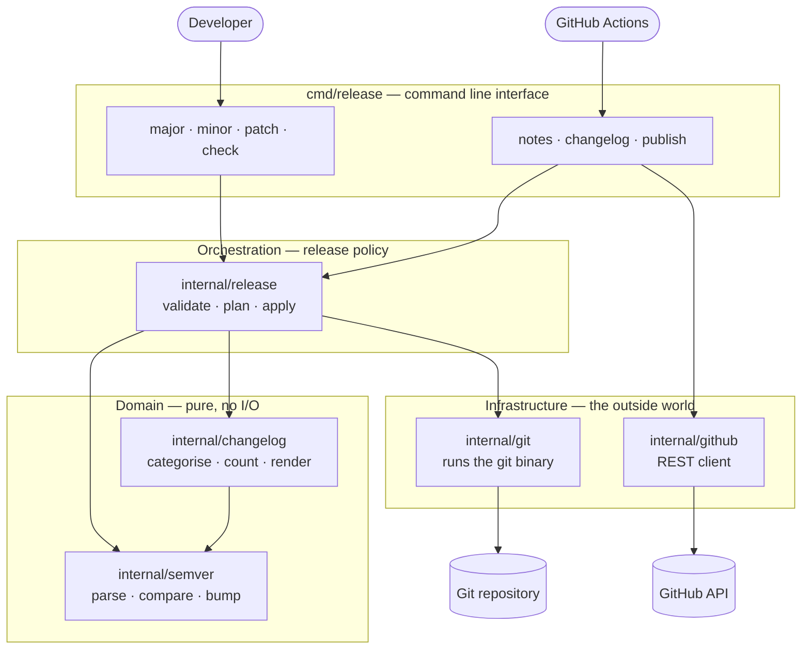
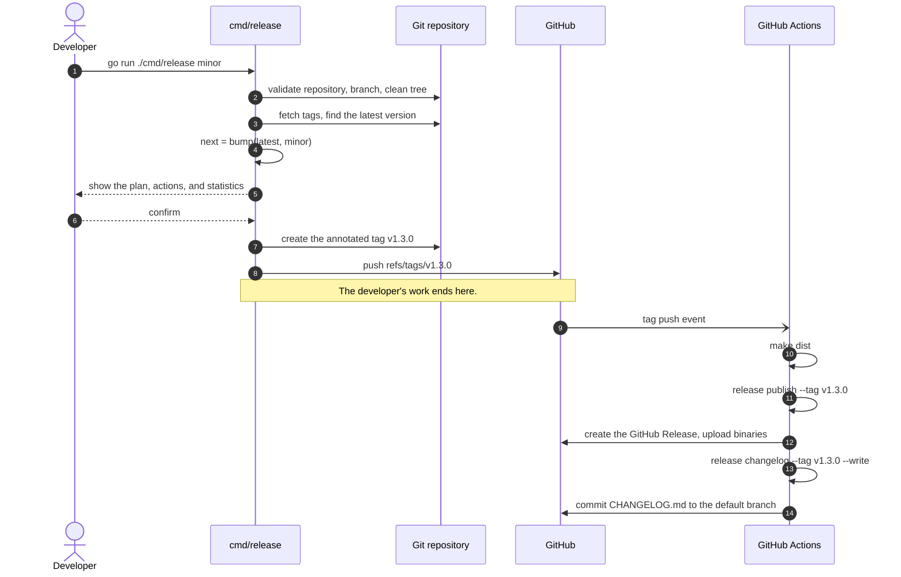

# Go-Native Semantic Versioning & Release Management

[](https://github.com/teddynted/designing-an-ai-agent-platform-on-aws/actions/workflows/ci.yml)
[](https://semver.org/spec/v2.0.0.html)
[](https://www.conventionalcommits.org/en/v1.0.0/)

A complete release management system written entirely in Go. One CLI decides the
next [Semantic Version](https://semver.org/spec/v2.0.0.html), validates the
repository, and creates the annotated Git tag. Pushing that tag triggers GitHub
Actions, which uses the *same* CLI to generate the changelog, render the release
notes, and publish the GitHub Release.

There is no Bash pipeline, no `semantic-release`, no Node.js toolchain, and no
third-party Go dependency — only the standard library.

```console
$ go run ./cmd/release minor
ℹ Validating the repository
✓ Preflight checks passed

Release plan

Repository      teddynted/designing-an-ai-agent-platform-on-aws
Branch          main
Current         v1.2.3
Next            v1.3.0 (minor)
Commits         12
Release Date    2026-07-10

Planned Actions

✓ Create Git tag v1.3.0
✓ Push tag to origin
✓ Generate release notes
✓ Create GitHub Release

Release Statistics

Version Bump     Minor
Commits          12
Features         4
Fixes            3
Documentation    2
Refactors        1
Other            2

Create and push v1.3.0? [y/N] y

✓ Created annotated tag v1.3.0
✓ Pushed v1.3.0 to origin

ℹ GitHub Actions will now generate the changelog and publish the release
```

## Why one binary

Version rules are easy to get subtly wrong, and wrong versions are permanent: a
published tag cannot be recalled. The usual failure is duplication — a shell
script that computes the version for tagging, and a workflow that recomputes it
for the changelog, drifting apart over time.

Here the rules are written once, in `internal/semver`, and every consumer calls
into it. The developer's terminal and the CI runner execute the same code.

## Quick start

```bash
# Preview the next release without touching anything.
go run ./cmd/release minor --dry-run

# Run the preflight validations on their own.
go run ./cmd/release check

# Cut a release: validate, tag, push. The workflow does the rest.
go run ./cmd/release patch
```

Or through the Makefile, which is a thin wrapper around the same commands:

```bash
make check
make release-patch
```

## Architecture

Dependencies point inwards. The domain packages — versioning and changelog
rendering — perform no I/O and know nothing about Git or GitHub. The
orchestrator holds the release policy. Only the outermost packages touch the
network or the filesystem.



`internal/release` talks to Git through an interface, so the whole release
workflow is exercised in tests against an in-memory repository. See
[docs/architecture.md](docs/architecture.md) for the per-package contract.

## The release workflow

A release has exactly two halves, split at the moment the tag is pushed. The
developer decides the version; automation reacts to it.



## Commands

| Command | Purpose |
| --- | --- |
| `release major` | Tag the next major release, for incompatible changes |
| `release minor` | Tag the next minor release, for new backwards-compatible features |
| `release patch` | Tag the next patch release, for backwards-compatible bug fixes |
| `release check` | Run the preflight validations without tagging |
| `release notes` | Render the release notes for a tag |
| `release changelog` | Render a `CHANGELOG.md` entry, or write it into the file |
| `release publish` | Create or update the GitHub Release for a tag |
| `release version` | Print the version of the tool itself |

Every command accepts `-h`. The flags, the validation rules, and the
troubleshooting guide are in [RELEASE_MANAGEMENT.md](RELEASE_MANAGEMENT.md).

### Useful flags

```bash
go run ./cmd/release minor --dry-run           # preview everything, change nothing
go run ./cmd/release minor --pre rc            # cut v1.3.0-rc.0 instead of v1.3.0
go run ./cmd/release patch --no-push           # tag locally, push by hand later
go run ./cmd/release patch --sign              # create a GPG-signed tag
go run ./cmd/release notes --template my.tmpl  # render notes your way
```

## Dry runs

`--dry-run` performs every read and every calculation, then stops before the
first write. It creates no tag, pushes nothing, and calls no API. Because a
release is irreversible, the run says so before anything else reaches the
screen:

```console
$ go run ./cmd/release minor --dry-run
──────────────────────────────────────

DRY RUN

No Git tags will be created.
No GitHub releases will be published.
No repository changes will be made.

──────────────────────────────────────

ℹ Validating the repository
✓ Preflight checks passed

Release plan
…

Planned Actions

• Would create Git tag v1.3.0
• Would push tag to origin
• Would generate release notes
• Would create GitHub Release
```

The action list mirrors the flags you passed. With `--no-push` it stops after
the tag, because a tag that is never pushed triggers no workflow and produces no
release — the list never promises work that will not happen.

The dry run also prints the release notes exactly as they would be published, to
stdout, so they can be piped or diffed while the progress output stays on
stderr:

```bash
go run ./cmd/release minor --dry-run > notes.md
```

`release publish --dry-run` does the same for an existing tag.

## Release note categories

Commit subjects are read as
[Conventional Commits](https://www.conventionalcommits.org/en/v1.0.0/). The type
decides which section a change appears under; the type and the `!` marker tell a
reviewer which bump is appropriate — but the bump itself is always chosen
explicitly by a human, because only a human can judge whether a change breaks a
downstream consumer.

| Commit type | Section | Suggested bump |
| --- | --- | --- |
| `feat` | 🚀 Features | `minor` |
| `fix` | 🐛 Bug Fixes | `patch` |
| `perf` | ⚡ Performance | `patch` |
| `refactor` | ♻️ Refactoring | `patch` |
| `docs` | 📚 Documentation | `patch` |
| `revert` | ⏪ Reverts | depends |
| `test` | 🧪 Tests | none |
| `build` | 📦 Build System | none |
| `ci` | 🔧 Continuous Integration | none |
| `style` | 🎨 Styles | none |
| `chore` | 🧹 Chores | none |
| anything else | Other Changes | — |

Three rules govern the output:

- **Empty sections are omitted.** A release with no fixes has no Bug Fixes
  heading.
- **Nothing is ever dropped.** A subject that is not a Conventional Commit, or
  carries a type no category claims, appears under **Other Changes**.
- **Breaking changes are called out twice.** A `feat!:` or a `BREAKING CHANGE:`
  footer is listed under **⚠️ Breaking Changes** at the top, where it cannot be
  missed, and again under its own type, where it belongs chronologically. The
  explanatory note appears only in the callout.

Subjects are tidied for reading: the `type(scope):` prefix is removed, the first
letter is capitalised, and a trailing full stop is dropped. So
`feat(cli): add semantic versioning.` becomes:

```markdown
- **cli:** Add semantic versioning ([abc1234](https://github.com/…/commit/abc1234))
```

The footer links to the diff, or announces a first release when there is nothing
to compare against:

```markdown
Compare changes:
https://github.com/teddynted/repo/compare/v1.2.3...v1.3.0
```

### Adding or hiding a category

`DefaultCategories()` in `internal/changelog` is data, not code. Adding a
category is one struct literal, and every commit type it claims is grouped and
counted automatically:

```go
{Key: "security", Title: "Security", Icon: "🔒", Label: "Security", Types: []string{"sec"}}
```

Setting `Hidden: true` keeps a category out of the rendered notes while still
counting its commits in the statistics — a chore is still work that went into
the release.

## Custom release-note templates

Notes are rendered with [`text/template`](https://pkg.go.dev/text/template). The
built-in layout is `changelog.DefaultNotesTemplate`; pass `--template` to any
command that renders notes to replace it:

```bash
go run ./cmd/release notes --tag v1.3.0 --template .github/notes.tmpl
go run ./cmd/release publish --tag v1.3.0 --template .github/notes.tmpl
```

A template is executed against `changelog.Data`, whose fields are documented in
`internal/changelog/render.go`. The useful ones:

| Field | Meaning |
| --- | --- |
| `.Tag`, `.Version` | `v1.3.0` and `1.3.0` |
| `.Date` | Release date, ISO-8601 |
| `.Bump` | `major`, `minor`, or `patch`; empty when unknown |
| `.IsFirstRelease` | True when there is no previous tag |
| `.CompareURL` | Diff against the previous tag; empty for a first release |
| `.Groups` | Non-empty categories, Breaking Changes first |
| `.Stats` | `.Commits`, `.Breaking`, and `.Counts` |

Each `.Groups` element carries `.Heading`, `.Title`, `.Icon`, and `.Items`; each
item carries `.Text` (scope and subject, ready to print), `.Link`, `.Title`,
`.Scope`, `.ShortSHA`, `.URL`, and `.BreakingNote`.

```gotemplate
# {{.Tag}} ({{.Date}})
{{range .Groups}}
## {{.Heading}}
{{range .Items}}
- {{.Text}} {{.Link}}
{{- end}}
{{end}}
{{- if .IsFirstRelease}}Initial release.{{else}}Compare: {{.CompareURL}}{{end}}
```

Two things stay fixed on purpose. A malformed template fails the command rather
than publishing a half-rendered release. And the annotated tag's message always
uses the built-in layout, because a Git tag is metadata and should not change
shape because a project restyled its release notes.

## Project layout

```text
cmd/release/            The CLI: flags, glyphs, tables, prompts, exit codes
internal/semver/        Semantic Versioning 2.0.0: parse, compare, bump
internal/git/           A thin, testable wrapper around the git binary
internal/changelog/     Conventional Commits, categories, statistics, templates
internal/github/        A dependency-free GitHub REST client
internal/release/       Validation, version calculation, tagging: the policy
.github/workflows/      CI, and the post-tag release automation
docs/                   Architecture and per-package responsibilities
```

## Requirements

- Go 1.25 or newer
- Git 2.x on `PATH`
- For `publish`: a `GITHUB_TOKEN` with `contents: write`

## Documentation

- [RELEASE_MANAGEMENT.md](RELEASE_MANAGEMENT.md) — the version and release
  lifecycles, the full CLI reference, and troubleshooting
- [CONTRIBUTING.md](CONTRIBUTING.md) — development workflow, commit conventions,
  and how a change becomes a release
- [docs/architecture.md](docs/architecture.md) — package responsibilities, the
  dependency rule, and how to extend the system
- [CHANGELOG.md](CHANGELOG.md) — generated, never edited by hand
