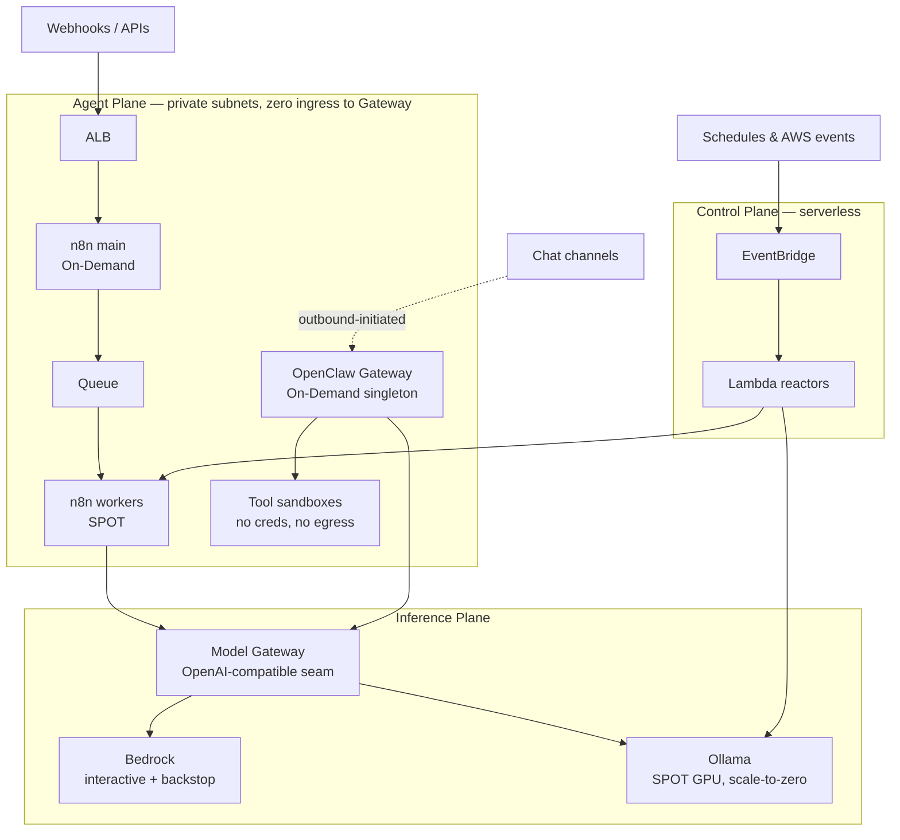

# Designing an AI Agent Platform on AWS

A production-ready platform for running **autonomous AI agents** and **event-driven AI workflows** on AWS — supporting both managed inference (Amazon Bedrock) and self-hosted inference (Ollama), orchestrated through **n8n** and **OpenClaw**.

> **Status: Milestone 1 — Initial Architecture.** Design and documentation only. No application implementation, no CloudFormation templates, no workflows. This milestone establishes the architectural foundation that later milestones build on.

---

## The design in one page

An AI agent platform is not one workload. It is **three workloads with opposing operational characteristics**, and almost every decision in this design follows from separating them.

| | Control Plane | Agent Plane | Inference Plane |
|---|---|---|---|
| **State** | None | **Durable; some unrecoverable by automation** | None (weights are read-only artifacts) |
| **Interruption tolerance** | N/A | **None** | **High** |
| **Scaling** | Event-driven | Vertical (+ Spot for stateless workers) | Horizontal, **scale to zero** |
| **Compute** | Lambda + EventBridge | On-Demand EC2 + EFS | **Spot** EC2 + Bedrock |

**Spot Instances belong where interruption is free. State belongs where it survives.** Draw that line and cost optimisation stops fighting high availability.

Three ideas carry the rest:

1. **Separate the planes.** Cheap, interruptible, horizontal compute (inference) is architecturally distinct from expensive, durable, singleton compute (agent runtime). Conflating them forces a choice between losing chat sessions and overpaying for GPUs. → [ADR-0002](docs/adr/0002-three-plane-decomposition.md)

2. **The model provider is a seam, not a dependency.** Bedrock and Ollama sit behind one OpenAI-compatible interface, so provider choice becomes a *routing policy* rather than an architectural commitment. This is also what makes Spot GPUs safe: **Bedrock is Ollama's availability backstop**, which converts a Spot capacity shortfall from an outage into a higher bill. → [ADR-0003](docs/adr/0003-model-gateway-seam.md)

3. **An autonomous agent is a confused deputy with a shell.** OpenClaw's own docs put it plainly: *"the agent can do anything you can do."* Prompt injection is therefore a **privilege** problem, not a content-filtering problem. We assume the model will be fully persuaded and design blast radius accordingly. → [ADR-0010](docs/adr/0010-agent-sandbox-containment.md)

## Architecture at a glance

Two details are load-bearing and easy to miss:

- **The chat arrow is dashed.** Most OpenClaw channels are outbound-initiated, so the agent runtime needs **no inbound ingress at all** — no SSH, no bastion, no public IP, zero security-group ingress rules. Its remaining attack surface is entirely semantic.
- **Nothing reaches a model provider directly.** Everything goes through the Model Gateway seam.

## Documentation

### Architecture

| Doc | Answers |
|---|---|
| [01 — Overview](docs/architecture/01-overview.md) | The central design problem and the three planes |
| [02 — Components](docs/architecture/02-components.md) | Responsibilities, state, failure modes, placement |
| [03 — AWS Services](docs/architecture/03-aws-services.md) | Which services, why, and what was rejected |
| [04 — Flows](docs/architecture/04-flows.md) | How requests and events actually move |
| [05 — Network & Boundaries](docs/architecture/05-network-and-boundaries.md) | VPC, trust zones, zero-ingress agent runtime |
| [06 — Deployment](docs/architecture/06-deployment.md) | Stack layering, golden AMI pipeline, startup time |
| [07 — Scalability & HA](docs/architecture/07-scalability-and-ha.md) | Scaling axes, Spot strategy, honest RTO/RPO |
| [08 — Security](docs/architecture/08-security.md) | The agent threat model, and standard AWS controls |
| [09 — Cost](docs/architecture/09-cost.md) | Cost model, seven levers, worked estimate, traps |
| [10 — Operations](docs/architecture/10-operations.md) | The agent run as the unit of observability |
| [11 — Extensibility](docs/architecture/11-extensibility.md) | The four seams, and where the design resists change |
| [12 — Risks](docs/architecture/12-risks-assumptions-constraints.md) | Assumptions, constraints, risk register |

### Decisions

Twelve [ADRs](docs/adr/) record what was chosen, what was rejected, and what it costs. If you read three, read [0002](docs/adr/0002-three-plane-decomposition.md), [0003](docs/adr/0003-model-gateway-seam.md), and [0010](docs/adr/0010-agent-sandbox-containment.md).

### Blog

This milestone is written to become the technical article *Designing an AI Agent Platform on AWS*. See [docs/blog/](docs/blog/README.md) for the narrative spine and source mapping.

## Technology

| Layer | Choice |
|---|---|
| Infrastructure as Code | CloudFormation (nested stacks, layered by rate of change) |
| Compute | EC2 Spot (workers, GPU inference) · EC2 On-Demand (stateful singletons) · Lambda (control plane) |
| Images | Custom AMIs via EC2 Image Builder — three variants, weights baked in |
| Network | VPC, 3-tier, multi-AZ · S3 Gateway Endpoint · `bedrock-runtime` interface endpoint |
| Events | EventBridge (routing) · SQS (durable buffering, scale-to-zero signal) |
| Storage | S3 · EBS gp3 · **EFS** (Gateway state — regional, survives an AZ) |
| Workflow orchestration | n8n, queue mode |
| Agent runtime | OpenClaw Gateway |
| Inference | Amazon Bedrock (default, backstop) · Ollama on Spot GPU (bulk, private) |
| Observability | CloudWatch (EMF), CloudTrail, GuardDuty |

## Three things this design admits

Documentation that claims completeness is not documentation.

1. **Conversational availability is ~99.5%, not 99.9%.** The OpenClaw Gateway is a singleton — chat channel device-links cannot be shared between processes. HA is fast recovery (3–5 min), not active-active. Raising it requires sharding. → [07 §7.4](docs/architecture/07-scalability-and-ha.md)

2. **Prompt injection is contained, not solved.** A fully persuaded agent can still use its auto-approved tools. The mitigation is keeping that set small and boring. → [08 §8.8](docs/architecture/08-security.md)

3. **The two controls that matter most do not exist yet.** The budget circuit-breaker and the sandbox boundary are what stand between this platform and its two most likely incidents — a runaway agent and a compromised one. **The platform must not be pointed at production data or real credentials until they are built.** → [12 §12.4](docs/architecture/12-risks-assumptions-constraints.md)

## Milestones

| # | Scope | Status |
|---|---|---|
| **1** | **Initial architecture and design rationale** | **✅ this milestone** |
| 2 | CloudFormation stacks, AMI pipeline, sandbox boundary, budget circuit-breaker | Planned |
| 3 | Model Gateway with token metering and routing policy | Planned |
| 4 | Agent quality metrics, approval workflow, injection signals | Planned |
| 5 | Chaos testing — verify the RTOs in this document are facts, not claims | Planned |

Milestone 2 opens with a single validation task: **confirm that OpenClaw's state directory works correctly on EFS.** Every high-availability claim here depends on it, and it has not been tested. → [12 §12.1](docs/architecture/12-risks-assumptions-constraints.md)
