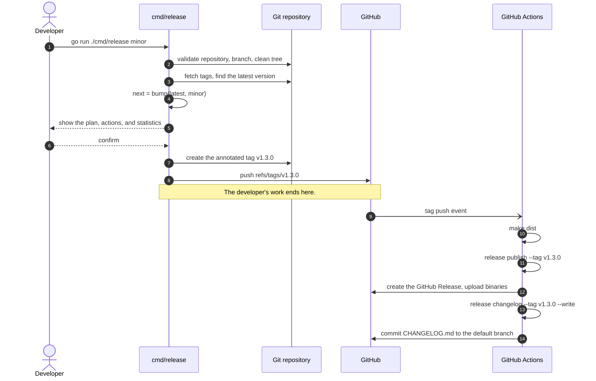

# Go-Native Semantic Versioning & Release Management

[](https://github.com/teddynted/designing-an-ai-agent-platform-on-aws/actions/workflows/ci.yml)
[](https://semver.org/spec/v2.0.0.html)
[](https://www.conventionalcommits.org/en/v1.0.0/)

A complete release management system written entirely in Go. One CLI decides the
next [Semantic Version](https://semver.org/spec/v2.0.0.html), validates the
repository, and creates the annotated Git tag. Pushing that tag triggers GitHub
Actions, which uses the *same* CLI to generate the changelog, render the release
notes, and publish the GitHub Release.

There is no Bash pipeline, no `semantic-release`, no Node.js toolchain, and no
third-party Go dependency — only the standard library.

```console
$ go run ./cmd/release minor

Validation

✓ Git repository — inside a Git work tree
✓ Release branch — on main
✓ Working tree — clean
✓ Untracked files — none
✓ Branch synchronised — up to date with origin/main
✓ GitHub authentication — GITHUB_TOKEN is set

Release Plan

Repository    teddynted/designing-an-ai-agent-platform-on-aws
Branch        main
Remote        origin
Commit        486bcb2

Version Information

Current Version     v1.2.3
Next Version        v1.3.0
Increment Type      Minor
Previous Release    2026-07-01
Days Since          9 days ago
Release Date        2026-07-10

Planned Actions

✓ Create Git tag v1.3.0
✓ Push tag to origin
✓ Generate release notes
✓ Create GitHub Release

Release Statistics

Total Commits       5
Features            2
Fixes               1
Documentation       1
Breaking Changes    1
Files Changed       30
Lines Added         +2,881
Lines Removed       -651

Contributors

• Teddy Kekana (3 commits)
• Ada Lovelace (2 commits)

Release Confidence

✓ ★★★★★ Ready to release

Create and push v1.3.0? [y/N] y

Releasing

✓ Created annotated tag v1.3.0
✓ Pushed v1.3.0 to origin

Timing

Validation             137ms
Version calculation    412ms
Release notes            3ms
Git operations         890ms
Total                  1.44s

Summary

✓ Released v1.3.0

  GitHub Actions will now generate the changelog and publish the release.
```

## Why one binary

Version rules are easy to get subtly wrong, and wrong versions are permanent: a
published tag cannot be recalled. The usual failure is duplication — a shell
script that computes the version for tagging, and a workflow that recomputes it
for the changelog, drifting apart over time.

Here the rules are written once, in `internal/semver`, and every consumer calls
into it. The developer's terminal and the CI runner execute the same code.

## Quick start

```bash
# Preview the next release without touching anything.
go run ./cmd/release minor --dry-run

# Run the preflight validations on their own.
go run ./cmd/release check

# Cut a release: validate, tag, push. The workflow does the rest.
go run ./cmd/release patch
```

Or through the Makefile, which is a thin wrapper around the same commands:

```bash
make check
make release-patch
```

## Architecture

Dependencies point inwards. The domain packages — versioning and changelog
rendering — perform no I/O and know nothing about Git or GitHub. The
orchestrator holds the release policy. Only the outermost packages touch the
network or the filesystem.


`internal/release` talks to Git through an interface, so the whole release
workflow is exercised in tests against an in-memory repository. See
[docs/architecture.md](docs/architecture.md) for the per-package contract.

## The release workflow

A release has exactly two halves, split at the moment the tag is pushed. The
developer decides the version; automation reacts to it.



## Commands

| Command | Purpose |
| --- | --- |
| `release major` | Tag the next major release, for incompatible changes |
| `release minor` | Tag the next minor release, for new backwards-compatible features |
| `release patch` | Tag the next patch release, for backwards-compatible bug fixes |
| `release check` | Run the preflight validations without tagging |
| `release notes` | Render the release notes for a tag |
| `release changelog` | Render a `CHANGELOG.md` entry, or write it into the file |
| `release publish` | Create or update the GitHub Release for a tag |
| `release version` | Print the version of the tool itself |

Every command accepts `-h`. The flags, the validation rules, and the
troubleshooting guide are in [RELEASE_MANAGEMENT.md](RELEASE_MANAGEMENT.md).

### Useful flags

```bash
go run ./cmd/release minor --dry-run           # preview everything, change nothing
go run ./cmd/release minor --pre rc            # cut v1.3.0-rc.0 instead of v1.3.0
go run ./cmd/release patch --no-push           # tag locally, push by hand later
go run ./cmd/release patch --sign              # create a GPG-signed tag
go run ./cmd/release notes --template my.tmpl  # render notes your way
go run ./cmd/release check --verify-auth       # check GITHUB_TOKEN against the API
go run ./cmd/release minor --verbose            # narrate each phase
```

`--verify-auth` is opt-in because cutting a tag never calls the GitHub API — the
workflow publishes. Verifying a credential the command will not use would add a
network dependency to an operation that otherwise works offline.

## Reading the report

Every release prints the same sections, in the same order. Each answers one
question.

| Section | Answers |
| --- | --- |
| **Validation** | Is this repository fit to release from? |
| **Release Plan** | Where is the release being cut from? |
| **Version Information** | What version, from what, and how long has it been? |
| **Planned Actions** | What is about to happen? |
| **Release Statistics** | What does the release contain? |
| **Contributors** | Who worked on it? |
| **Release Notes Preview** | What will be published? |
| **Release Confidence** | Should this go out? |
| **Timing** | Where did the time go? |
| **Summary** | What happened, and what next? |

**Validation** reports every check at once rather than stopping at the first
problem, so one run tells you everything to fix. A check is a failure only when
it blocks a release: a missing `GITHUB_TOKEN` is a warning, because the workflow
publishes, not your terminal.

**Release Confidence** is derived from those checks, never asserted. Five stars
means every check passed; each warning costs one, to a floor of two. Every
warning behind the rating is listed beneath it — a rating without its reasons is
decoration.

**Timing** reports what was measured, never an estimate. Predicting how long a
push will take is guesswork, and a confidently wrong number is worse than none.

The **Release Notes Preview** goes to stdout while the report goes to stderr, so
the notes can be redirected on their own:

```bash
go run ./cmd/release minor --dry-run > notes.md
```

## Dry runs

`--dry-run` performs every read and every calculation, then stops before the
first write. It creates no tag, pushes nothing, and calls no API. Because a
release is irreversible, it says so before anything else reaches the screen, and
again when it finishes:

```console
$ go run ./cmd/release minor --dry-run
────────────────────────────────────────────────────────────────

DRY RUN

  Nothing will be modified.
  Nothing will be pushed.
  Nothing will be published.

────────────────────────────────────────────────────────────────

Validation
…

Planned Actions

• Would create Git tag v1.3.0
• Would push tag to origin
• Would generate release notes
• Would create GitHub Release

…

Summary

✓ Dry run completed successfully

  No tag was created. Nothing was pushed. Nothing was published.

  Run:

      release minor

  to publish v1.3.0.
```

The final command is reconstructed from the flags you passed, so a dry run of
`minor --pre rc --sign` tells you to run `release minor --pre rc --sign`.
Presentation flags are left out, and `--dry-run` never appears.

The action list mirrors those flags too. With `--no-push` it stops after the
tag, because a tag that is never pushed triggers no workflow and produces no
release — the list never promises work that will not happen.

`release publish --dry-run` does the same for an existing tag.

## Terminal output

The report adapts to the terminal it is printed to.

| Flag | Effect |
| --- | --- |
| `--ascii` | Replace the Unicode icons with `+ ! x i -` |
| `--no-color` | Disable colour; `NO_COLOR` is honoured too |
| `--verbose` | Narrate each phase as it runs |
| `--debug` | Add internal diagnostics: resolved config, tag counts |

Width comes from the terminal itself, or from `COLUMNS` when you export it, and
falls back to 80 columns when the output is redirected. Long messages wrap under
their text rather than under their icon; overlong table values are truncated
rather than wrapped, so the columns never break.

The ASCII fallback is chosen automatically when the locale is not UTF-8, so a
terminal in the `C` locale renders markers rather than mojibake. `RELEASE_ASCII`
forces it.

Diagnostics never appear in a normal run. `--verbose` and `--debug` write to
stderr alongside the report, and never to the generated notes.

## Release note categories

Commit subjects are read as
[Conventional Commits](https://www.conventionalcommits.org/en/v1.0.0/). The type
decides which section a change appears under; the type and the `!` marker tell a
reviewer which bump is appropriate — but the bump itself is always chosen
explicitly by a human, because only a human can judge whether a change breaks a
downstream consumer.

| Commit type | Section | Suggested bump |
| --- | --- | --- |
| `feat` | 🚀 Features | `minor` |
| `fix` | 🐛 Bug Fixes | `patch` |
| `perf` | ⚡ Performance | `patch` |
| `refactor` | ♻️ Refactoring | `patch` |
| `docs` | 📚 Documentation | `patch` |
| `revert` | ⏪ Reverts | depends |
| `test` | 🧪 Tests | none |
| `build` | 📦 Build System | none |
| `ci` | 🔧 Continuous Integration | none |
| `style` | 🎨 Styles | none |
| `chore` | 🧹 Chores | none |
| anything else | Other Changes | — |

Three rules govern the output:

- **Empty sections are omitted.** A release with no fixes has no Bug Fixes
  heading.
- **Nothing is ever dropped.** A subject that is not a Conventional Commit, or
  carries a type no category claims, appears under **Other Changes**.
- **Breaking changes are called out twice.** A `feat!:` or a `BREAKING CHANGE:`
  footer is listed under **⚠️ Breaking Changes** at the top, where it cannot be
  missed, and again under its own type, where it belongs chronologically. The
  explanatory note appears only in the callout.

Subjects are tidied for reading: the `type(scope):` prefix is removed, the first
letter is capitalised, and a trailing full stop is dropped. So
`feat(cli): add semantic versioning.` becomes:

```markdown
- **cli:** Add semantic versioning ([abc1234](https://github.com/…/commit/abc1234))
```

Identical entries are deduplicated: a cherry-pick, or a commit reverted and
reapplied, is listed once.

The notes open with a one-paragraph summary and close with the contributors and
a link to the diff:

```markdown
This release introduces 2 new features, fixes 1 bug, and documents 1 change.
It contains 1 breaking change, so review the notes before upgrading.

## What's Changed
…

### Contributors

- Teddy Kekana (3 commits)
- Ada Lovelace (2 commits)

Compare changes:
https://github.com/teddynted/repo/compare/v1.2.3...v1.3.0
```

The summary is **counted, never paraphrased**. It is assembled from the commit
totals, and no commit text reaches it. A summary generated by paraphrasing
subjects would eventually describe a release inaccurately, and nobody would
notice before it was published — counting is dull and correct, which is the
right trade for a release note. `TestSummaryNeverQuotesCommitText` pins that.

Contributors are keyed on email, since the same person often commits under
several spellings of their name. A commit with no author information is skipped
rather than listed as a blank, and a release with no author information at all
simply has no Contributors section.

For a first release there is nothing to compare against, so the footer reads
`Initial release.` instead.

### Adding or hiding a category

`DefaultCategories()` in `internal/changelog` is data, not code. Adding a
category is one struct literal, and every commit type it claims is grouped and
counted automatically:

```go
{Key: "security", Title: "Security", Icon: "🔒", Label: "Security", Types: []string{"sec"}}
```

Setting `Hidden: true` keeps a category out of the rendered notes while still
counting its commits in the statistics — a chore is still work that went into
the release.

## Custom release-note templates

Notes are rendered with [`text/template`](https://pkg.go.dev/text/template). The
built-in layout is `changelog.DefaultNotesTemplate`; pass `--template` to any
command that renders notes to replace it:

```bash
go run ./cmd/release notes --tag v1.3.0 --template .github/notes.tmpl
go run ./cmd/release publish --tag v1.3.0 --template .github/notes.tmpl
```

A template is executed against `changelog.Data`, whose fields are documented in
`internal/changelog/render.go`. The useful ones:

| Field | Meaning |
| --- | --- |
| `.Tag`, `.Version` | `v1.3.0` and `1.3.0` |
| `.Date` | Release date, ISO-8601 |
| `.Bump` | `major`, `minor`, or `patch`; empty when unknown |
| `.Summary` | The counted one-paragraph summary; empty for an empty release |
| `.IsFirstRelease` | True when there is no previous tag |
| `.CompareURL` | Diff against the previous tag; empty for a first release |
| `.Groups` | Non-empty categories, Breaking Changes first |
| `.Contributors` | Authors, most prolific first; may be empty |
| `.Stats` | `.Commits`, `.Breaking`, and `.Counts` |

Each `.Groups` element carries `.Heading`, `.Title`, `.Icon`, and `.Items`; each
item carries `.Text` (scope and subject, ready to print), `.Link`, `.Title`,
`.Scope`, `.ShortSHA`, `.URL`, and `.BreakingNote`. Each `.Contributors` element
carries `.Name`, `.Email`, and `.Commits`.

```gotemplate
# {{.Tag}} ({{.Date}})
{{range .Groups}}
## {{.Heading}}
{{range .Items}}
- {{.Text}} {{.Link}}
{{- end}}
{{end}}
{{- if .IsFirstRelease}}Initial release.{{else}}Compare: {{.CompareURL}}{{end}}
```

Two things stay fixed on purpose. A malformed template fails the command rather
than publishing a half-rendered release. And the annotated tag's message always
uses the built-in layout, because a Git tag is metadata and should not change
shape because a project restyled its release notes.

## Project layout

```text
cmd/release/            The CLI: flags, glyphs, tables, prompts, exit codes
internal/semver/        Semantic Versioning 2.0.0: parse, compare, bump
internal/git/           A thin, testable wrapper around the git binary
internal/changelog/     Conventional Commits, categories, statistics, templates
internal/github/        A dependency-free GitHub REST client
internal/release/       Validation, version calculation, tagging: the policy
.github/workflows/      CI, and the post-tag release automation
docs/                   Architecture and per-package responsibilities
```

## Requirements

- Go 1.25 or newer
- Git 2.x on `PATH`
- For `publish`: a `GITHUB_TOKEN` with `contents: write`

## Documentation

- [RELEASE_MANAGEMENT.md](RELEASE_MANAGEMENT.md) — the version and release
  lifecycles, the full CLI reference, and troubleshooting
- [CONTRIBUTING.md](CONTRIBUTING.md) — development workflow, commit conventions,
  and how a change becomes a release
- [docs/architecture.md](docs/architecture.md) — package responsibilities, the
  dependency rule, and how to extend the system
- [CHANGELOG.md](CHANGELOG.md) — generated, never edited by hand
