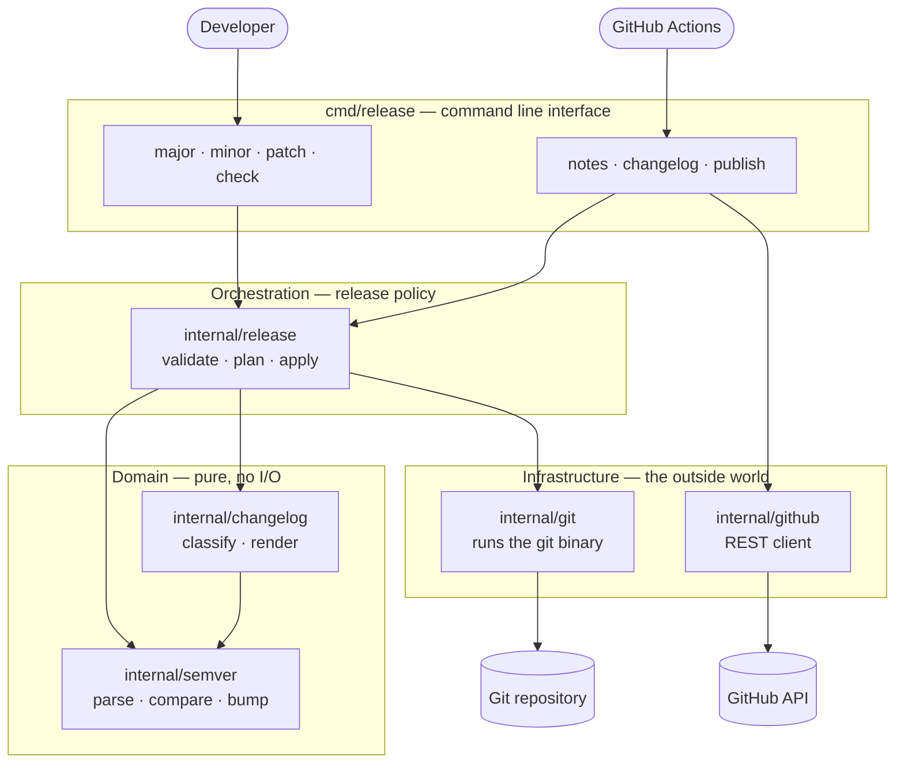
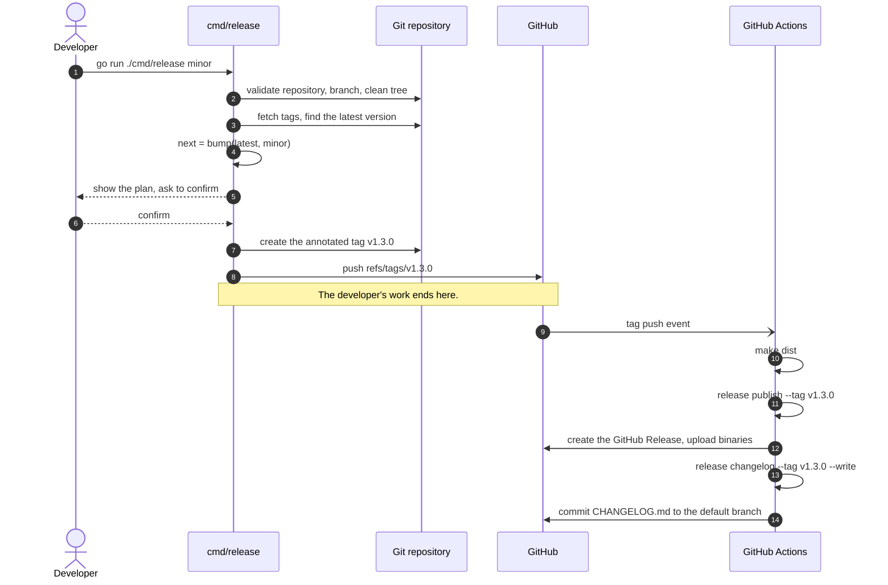

# Go-Native Semantic Versioning & Release Management

[](https://github.com/teddynted/designing-an-ai-agent-platform-on-aws/actions/workflows/ci.yml)
[](https://semver.org/spec/v2.0.0.html)
[](https://www.conventionalcommits.org/en/v1.0.0/)

A complete release management system written entirely in Go. One CLI decides the
next [Semantic Version](https://semver.org/spec/v2.0.0.html), validates the
repository, and creates the annotated Git tag. Pushing that tag triggers GitHub
Actions, which uses the *same* CLI to generate the changelog, render the release
notes, and publish the GitHub Release.

There is no Bash pipeline, no `semantic-release`, no Node.js toolchain, and no
third-party Go dependency — only the standard library.

```console
$ go run ./cmd/release minor
→ Validating the repository
✓ Preflight checks passed

Release plan
  Repository   teddynted/designing-an-ai-agent-platform-on-aws
  Branch       main
  Current      v1.2.3
  Next         v1.3.0  (minor)
  Commits      12 commits

Create and push v1.3.0? [y/N] y

✓ Created annotated tag v1.3.0
✓ Pushed v1.3.0 to origin

  GitHub Actions will now generate the changelog and publish the release.
```

## Why one binary

Version rules are easy to get subtly wrong, and wrong versions are permanent: a
published tag cannot be recalled. The usual failure is duplication — a shell
script that computes the version for tagging, and a workflow that recomputes it
for the changelog, drifting apart over time.

Here the rules are written once, in `internal/semver`, and every consumer calls
into it. The developer's terminal and the CI runner execute the same code.

## Quick start

```bash
# Preview the next release without touching anything.
go run ./cmd/release minor --dry-run

# Run the preflight validations on their own.
go run ./cmd/release check

# Cut a release: validate, tag, push. The workflow does the rest.
go run ./cmd/release patch
```

Or through the Makefile, which is a thin wrapper around the same commands:

```bash
make check
make release-patch
```

## Architecture

Dependencies point inwards. The domain packages — versioning and changelog
rendering — perform no I/O and know nothing about Git or GitHub. The
orchestrator holds the release policy. Only the outermost packages touch the
network or the filesystem.



`internal/release` talks to Git through an interface, so the whole release
workflow is exercised in tests against an in-memory repository. See
[docs/architecture.md](docs/architecture.md) for the per-package contract.

## The release workflow

A release has exactly two halves, split at the moment the tag is pushed. The
developer decides the version; automation reacts to it.



## Commands

| Command | Purpose |
| --- | --- |
| `release major` | Tag the next major release, for incompatible changes |
| `release minor` | Tag the next minor release, for new backwards-compatible features |
| `release patch` | Tag the next patch release, for backwards-compatible bug fixes |
| `release check` | Run the preflight validations without tagging |
| `release notes` | Render the release notes for a tag |
| `release changelog` | Render a `CHANGELOG.md` entry, or write it into the file |
| `release publish` | Create or update the GitHub Release for a tag |
| `release version` | Print the version of the tool itself |

Every command accepts `-h`. The flags, the validation rules, and the
troubleshooting guide are in [RELEASE_MANAGEMENT.md](RELEASE_MANAGEMENT.md).

### Useful flags

```bash
go run ./cmd/release minor --dry-run   # print the plan and the notes, change nothing
go run ./cmd/release minor --pre rc    # cut v1.3.0-rc.0 instead of v1.3.0
go run ./cmd/release patch --no-push   # tag locally, push by hand later
go run ./cmd/release patch --sign      # create a GPG-signed tag
```

## What determines the version

Commit subjects are read as
[Conventional Commits](https://www.conventionalcommits.org/en/v1.0.0/). They
decide which section of the changelog a change appears under, and they tell a
reviewer which bump is appropriate — but the bump itself is always chosen
explicitly by a human, because only a human can judge whether a change is
breaking.

| Commit | Changelog section | Suggested bump |
| --- | --- | --- |
| `feat: add pagination` | Features | `minor` |
| `fix: correct off-by-one` | Bug Fixes | `patch` |
| `feat!: drop the v1 API` | Breaking Changes, and Features | `major` |
| `perf: cache tag lookups` | Performance Improvements | `patch` |
| `docs: explain the flags` | Documentation | `patch` |
| `chore: bump the linter` | hidden | none |

A commit that does not follow the convention is never dropped: it appears under
**Other Changes**.

## Project layout

```text
cmd/release/            The CLI: flag parsing, terminal output, exit codes
internal/semver/        Semantic Versioning 2.0.0: parse, compare, bump
internal/git/           A thin, testable wrapper around the git binary
internal/changelog/     Conventional Commits parsing and Markdown rendering
internal/github/        A dependency-free GitHub REST client
internal/release/       Validation, version calculation, tagging: the policy
.github/workflows/      CI, and the post-tag release automation
docs/                   Architecture and per-package responsibilities
```

## Requirements

- Go 1.25 or newer
- Git 2.x on `PATH`
- For `publish`: a `GITHUB_TOKEN` with `contents: write`

## Documentation

- [RELEASE_MANAGEMENT.md](RELEASE_MANAGEMENT.md) — the version and release
  lifecycles, the full CLI reference, and troubleshooting
- [CONTRIBUTING.md](CONTRIBUTING.md) — development workflow, commit conventions,
  and how a change becomes a release
- [docs/architecture.md](docs/architecture.md) — package responsibilities, the
  dependency rule, and how to extend the system
- [CHANGELOG.md](CHANGELOG.md) — generated, never edited by hand
