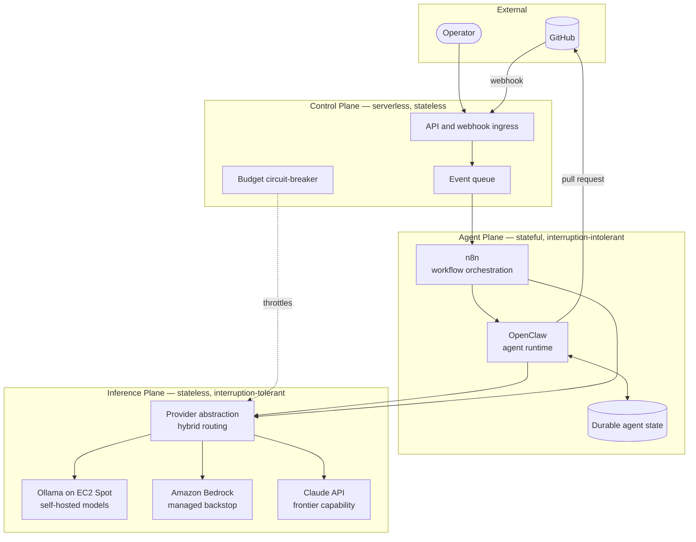
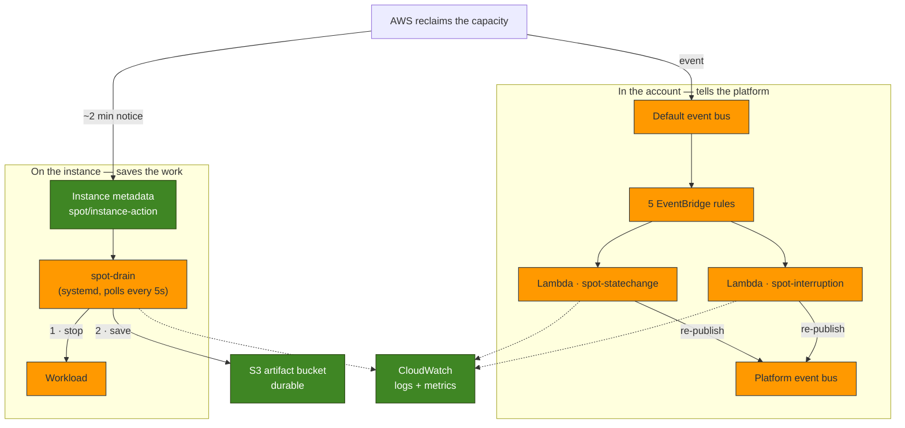
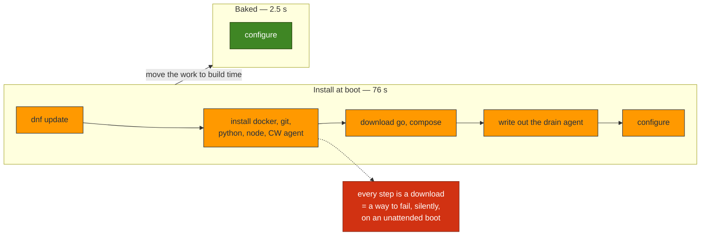
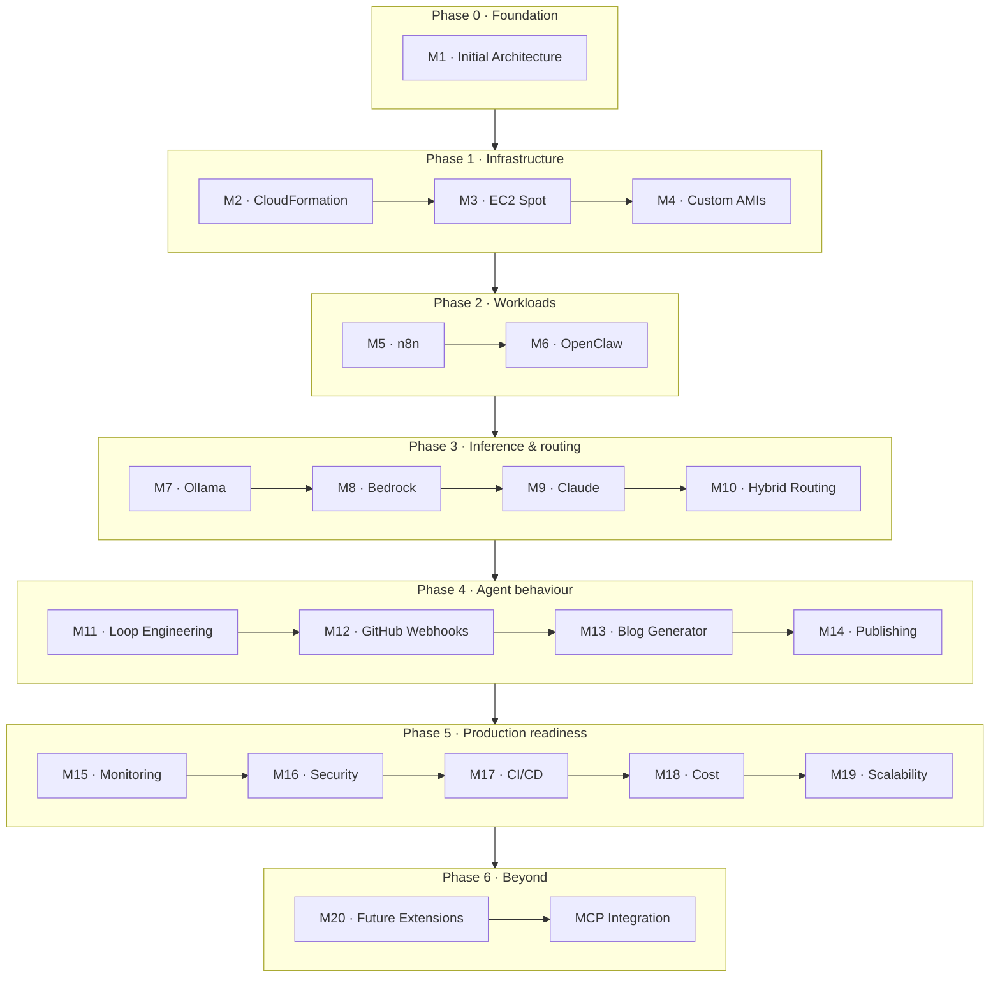
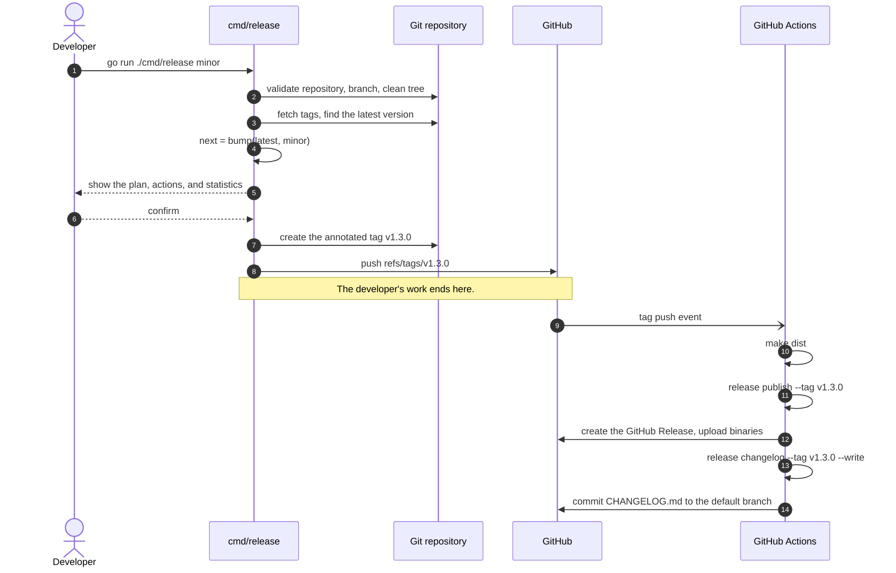

# Designing an AI Agent Platform on AWS

[](#roadmap)
[](docs/blog/designing-an-ai-agent-platform-on-aws.md)
[](docs/blog/provisioning-an-ai-agent-platform-with-cloudformation.md)
[](docs/blog/reducing-ai-infrastructure-costs-with-ec2-spot-instances.md)
[](docs/blog/optimizing-ec2-spot-instance-startup-with-custom-amis.md)
[](#milestone-5--self-hosted-n8n-integration)
[](https://semver.org/spec/v2.0.0.html)
[](https://www.conventionalcommits.org/en/v1.0.0/)

> **Status: building.**
> The foundation is real: the AWS infrastructure is
> [CloudFormation you can deploy](infra/), it runs its compute on
> [EC2 Spot with interruption handling](infra/SPOT.md), and that compute boots from
> a [custom AMI in 2.5 seconds](infra/AMI.md) instead of 76. Everything from
> [Milestone 5](#milestone-5--self-hosted-n8n-integration) on is still a statement
> of intent — no application software (OpenClaw, Ollama, n8n) runs yet. See
> [What exists today](#what-exists-today), which is kept honest.

An open design study and reference implementation for running **autonomous AI
agents on AWS**: how to host them, how to feed them models, how to let them act
on a repository, and how to keep the bill and the blast radius small.

---

## Contents

- [Project Overview](#project-overview)
- [Vision](#vision)
- [Goals](#goals)
- [What exists today](#what-exists-today)
- [Key Features (Planned)](#key-features-planned)
- [High-Level Architecture Overview](#high-level-architecture-overview)
- [Cost optimization with EC2 Spot](#cost-optimization-with-ec2-spot)
- [Startup optimization with custom AMIs](#startup-optimization-with-custom-amis)
- [Technology Stack](#technology-stack)
- [Repository Scope](#repository-scope)
- [Related Repositories](#related-repositories)
- [Roadmap](#roadmap)
- [Planned Technical Blog Series](#planned-technical-blog-series)
- [Future Enhancements](#future-enhancements)
- [Contributing](#contributing)
- [License](#license)

---

## Project Overview

An AI agent is an ordinary workload with three unusual properties. It is
**stateful** where most serverless workloads are not. It is **expensive per
request** in a way that rewards careful model routing. And it is a **confused
deputy with a shell** — software that will do what it is told by whoever manages
to tell it something.

This project treats each of those properties as an architectural problem rather
than a prompt-engineering one, and works through the answers on AWS in public.

The platform being designed will host a workflow engine, an agent runtime, and a
model-inference tier, wire them to a GitHub repository, and let the resulting
agents do real work: reading issues, opening pull requests, and publishing what
they learn.

## Vision

**Autonomous agents should be boring to operate.**

A team should be able to run agents on their own infrastructure with the same
confidence they run a web service: predictable cost, understood failure modes, a
security boundary that holds, and an upgrade path that does not involve
rewriting the platform every time a model provider changes its API.

That means:

- **The model provider is a seam, not a foundation.** Swapping a local model for
  a hosted one should be a routing decision, not a migration.
- **Interruption is a design input.** Spot capacity is cheap precisely because it
  goes away. Work belongs where interruption is free; state belongs where it
  survives.
- **Prompt injection is a privilege problem.** An agent that cannot reach
  production credentials cannot leak them, however it is persuaded.

## Goals

| # | Goal | Why it matters |
| --- | --- | --- |
| 1 | Decompose the platform by **statefulness and interruption tolerance**, not by service | Lets each tier use the cheapest capacity it can survive on |
| 2 | Make the **inference provider swappable** behind one abstraction | Local, hosted, and frontier models become a routing choice |
| 3 | Run the interruption-tolerant tiers on **EC2 Spot** | The dominant cost of self-hosted inference is idle GPU |
| 4 | Give agents a **sandboxed blast radius** | An agent with a shell is a security boundary, not a feature |
| 5 | Make the platform **observable and affordable by default** | Cost and telemetry are milestones, not afterthoughts |
| 6 | Document every decision as a **standalone blog post** | The reasoning is the deliverable, not just the templates |

## What exists today

Being explicit, because everything else on this page is aspirational:

| Component | Status | Notes |
| --- | --- | --- |
| Release management tooling | ✅ **Implemented** | A Go CLI and workflows that version, tag, and publish this repository. See [RELEASE_MANAGEMENT.md](RELEASE_MANAGEMENT.md) |
| Platform architecture | 📝 **Documented** | [Milestone 1](#milestone-1--initial-architecture): the [architecture blog post](docs/blog/designing-an-ai-agent-platform-on-aws.md) and [diagrams](docs/architecture/diagrams.md) |
| AWS infrastructure | ✅ **Implemented** | [Milestone 2](#milestone-2--cloudformation-infrastructure): VPC, IAM, EC2, S3, EventBridge, CloudWatch — eight CloudFormation stacks, deployed by CI. See [infra/](infra/) |
| EC2 Spot + interruption handling | ✅ **Implemented** | [Milestone 3](#milestone-3--ec2-spot-instances): a drain agent on the instance, EventBridge rules and Go Lambdas in the account. See [infra/SPOT.md](infra/SPOT.md) |
| Custom AMIs + fast startup | ✅ **Implemented** | [Milestone 4](#milestone-4--custom-amis): a versioned image pipeline. Boot measured at **2.5s**, down from **76s**. See [infra/AMI.md](infra/AMI.md) |
| Application software (OpenClaw, Ollama, n8n) | 📋 Planned | Nothing is installed on the instance yet — [Milestone 5](#milestone-5--self-hosted-n8n-integration) onwards |
| Every integration below | 📋 Planned | Not built |

The infrastructure is real and deployable. **No AI agent runs on it yet**: the
compute is provisioned, empty, and waiting for the workload milestones. And no
real model inference happens anywhere in this repository — the compute
deliberately stays off GPU instances, for cost and quota reasons explained in
[infra/README.md](infra/README.md).

## Key Features (Planned)

These describe what the platform is intended to do once the roadmap is complete.
Only the infrastructure beneath them exists today — see
[What exists today](#what-exists-today). The one exception is the Spot half of
"Spot-first inference": the compute *does* run on Spot, with interruptions
handled ([Milestone 3](#cost-optimization-with-ec2-spot)). The GPU and the
managed backstop are still ahead.

- **Three-plane architecture** — a serverless control plane, a stateful agent
  plane, and a stateless inference plane, each sized and priced independently.
- **Hybrid AI routing** — one abstraction over local models, Amazon Bedrock, and
  the Claude API, choosing a provider per request by cost, latency, and
  capability.
- **Spot-first inference** — GPU capacity on EC2 Spot, with a managed backstop so
  an interruption degrades latency rather than availability.
- **Self-hosted workflow orchestration** — n8n as the durable orchestrator
  between events, agents, and the outside world.
- **Agent runtime** — OpenClaw as the agent execution environment, with a
  sandboxed filesystem and credential boundary.
- **Loop engineering** — explicit control over how an agent iterates, when it
  stops, and what it is allowed to spend.
- **GitHub-native automation** — webhooks in, pull requests out.
- **Automated technical publishing** — an agent that reads a repository and
  drafts the post explaining it.
- **Cost circuit-breakers** — budget limits enforced by the platform, not by
  hoping.

## High-Level Architecture Overview

The platform is planned as three planes, separated by how much state they hold
and how much interruption they tolerate. This is the shape the design starts
from; Milestone 1 will validate or revise it.



Three ideas carry the design:

1. **Decomposition by statefulness.** The inference plane holds no state, so it
   can run on Spot capacity that disappears without warning. The agent plane
   holds conversation and workspace state, so it cannot.
2. **The provider is a seam.** Because every model call passes through one
   abstraction, a Spot GPU interruption can fail over to Bedrock. That backstop
   is what makes Spot safe to rely on.
3. **The agent is a deputy.** OpenClaw holds a shell. Its credentials, network
   egress, and filesystem are the security boundary — not the prompt.

### Full architecture (Milestone 1)

The AWS service view — arranged by trust boundary, from the external developer
and GitHub through the **AWS Cloud → Region → VPC → private subnet** nesting that
contains the agent:


The complete design — the reasoning, the AWS service choices and their
trade-offs, the data and event flows, and the security, cost, observability, and
scalability models — is documented in the Milestone 1 deliverables:

- 📄 **[Designing an AI Agent Platform on AWS](docs/blog/designing-an-ai-agent-platform-on-aws.md)** — the architecture blog post
- 🗺️ **[AWS architecture diagram](docs/architecture/aws-architecture.svg)** — the AWS service view above (Cloud / Region / VPC / subnets)
- 📐 **[Architecture diagrams](docs/architecture/diagrams.md)** — the service view plus four Mermaid flow views (high-level, event flow, component interaction, deployment boundaries)

These are design documents from Milestone 1. What is actually deployed today is
the foundation described in [What exists today](#what-exists-today) — a narrower
thing than the diagram above, and the diagram is the target it is being built
towards.

## Cost optimization with EC2 Spot

**Milestone 3.** The platform's compute runs on **EC2 Spot** — the same hardware,
the same network, the same AMI as On-Demand, at roughly **70% off** — and it
survives the interruptions that discount pays for.

> 📄 [Reducing AI Infrastructure Costs with EC2 Spot Instances](docs/blog/reducing-ai-infrastructure-costs-with-ec2-spot-instances.md) — the blog post ·
> 📐 [Spot diagrams](docs/architecture/spot-diagrams.md) ·
> 🛠️ [SPOT.md](infra/SPOT.md) — the operational reference

### The idea

You are renting capacity AWS has already built and cannot currently sell, on the
condition that it can have it back with about **two minutes' notice**. The
discount is the price of that condition. AI workloads are unusually good at
paying it: a batch of embeddings, a repository index, or a drafted blog post can
be interrupted and redone, and nobody notices.

The saving is the entire argument, and it scales with the instance:

| Instance | On-Demand 24×7 | Spot 24×7 | Saved |
| --- | --- | --- | --- |
| `t3.xlarge` (this platform's default) | ~$120/mo | ~$36/mo | ~$84/mo |
| `g5.xlarge` (GPU inference) | ~$730/mo | ~$220/mo | **~$510/mo** |
| `g5.12xlarge` (larger models) | ~$4,100/mo | ~$1,250/mo | **~$2,850/mo** |

*(Illustrative; Spot prices move and vary by region and AZ.)*

### The one thing to understand

**A Lambda cannot save your work.** By the time EventBridge has delivered the
interruption event and Lambda has cold-started, much of the window is gone — and
a function in the account cannot reach into the instance and flush a half-written
file to disk anyway.

So interruption handling is **two cooperating halves**, and neither is sufficient
alone:

| | Runs | Sees the notice via | Job |
| --- | --- | --- | --- |
| **Drain agent** | on the instance | instance metadata (IMDS) | Stop the workload. Save its output to S3. |
| **Lambda handlers** | in the account | EventBridge | Count it. Log it. Tell the rest of the platform. |

The drain agent makes Spot *safe*. The Lambdas make it *observable*.

### Architecture



### The interruption workflow

1. AWS decides to reclaim the instance and writes a notice to its metadata
   service. The clock starts: **~120 seconds.**
2. The **drain agent** (polling every 5s) sees it, stops the workload's systemd
   units, syncs `/var/lib/<project>/artifacts` to S3, and leaves a marker so a
   post-mortem can tell a clean drain from a crash. It exits, and stays exited.
3. In parallel, EventBridge delivers the same fact to the **interruption
   Lambda**, which checks the instance is this platform's (by tag — EC2's events
   carry none), counts it in CloudWatch, and re-publishes it on the platform bus.
4. The instance is terminated. **The work survives it.**

### Event flow

Five rules, on the account's **default** bus — the only bus AWS services publish
to. (A rule matching `source: aws.ec2` on a custom bus is valid, deploys cleanly,
and never fires. That one is a rite of passage.)

| Event | Meaning | Handler | Metric |
| --- | --- | --- | --- |
| `EC2 Spot Instance Interruption Warning` | ~2 minutes left | `spot-interruption` | `InterruptionWarnings` |
| `EC2 Instance Rebalance Recommendation` | Elevated risk (advisory) | `spot-interruption` | `RebalanceRecommendations` |
| State-change → `running` | Launched | `spot-statechange` | `InstancesLaunched` |
| State-change → `stopped` | Stopped | `spot-statechange` | `InstancesStopped` |
| State-change → `terminated` | Destroyed | `spot-statechange` | `InstancesTerminated` |

Metrics are dimensioned by **instance type**, because "how often is this
interrupted?" is a question about a type in an AZ — and it is the number that
decides whether a workload belongs on Spot at all.

### Deploy it

```bash
cd infra

make deploy                                 # the six core stacks (AWS CLI only)
make spot                                   # build the Go handlers + deploy 08-spot
make simulate-interruption INSTANCE_ID=i-…  # rehearse an interruption
make outputs                                # what got created
```

Full deployment, parameters, IAM, metrics, cleanup, and troubleshooting:
**[infra/SPOT.md](infra/SPOT.md)**.

### When *not* to use Spot

The part most write-ups skip. Spot is wrong for anything holding state you cannot
rebuild (n8n, a database, the control plane), long jobs that cannot checkpoint,
latency-critical serving with no fallback, and anything that cannot shut down
cleanly in two minutes.

The pattern this platform follows: **the plane that does the work goes on Spot;
the plane that remembers the work does not.**

### Screenshots

<!-- Replace these placeholders with real console captures from a live deploy. -->

| | |
| --- | --- |
| _CloudWatch: `InterruptionWarnings` by instance type_ | `docs/architecture/screenshots/spot-metrics.png` *(placeholder)* |
| _CloudWatch Logs: an interruption handled end to end_ | `docs/architecture/screenshots/spot-interruption-log.png` *(placeholder)* |
| _EventBridge: the five rules on the default bus_ | `docs/architecture/screenshots/spot-rules.png` *(placeholder)* |
| _S3: `drain/<instance-id>/` after an interruption_ | `docs/architecture/screenshots/spot-drain-artifacts.png` *(placeholder)* |

### Future improvements

Deliberately **not** built in this milestone, and each is its own piece of work:

- **An Auto Scaling group with a mixed-instances policy** — the single biggest
  win available. Diversifying across instance types and AZs with the
  `capacity-optimized` allocation strategy is what turns "the instance was
  interrupted" into "a replacement is already running". The compute stack already
  provisions through a **launch template** specifically so this needs no
  re-architecture. *(Milestone 19.)*
- **A baked AMI** to shrink the cold start an interruption costs. *(Milestone 4.)*
- **Checkpointing** in the workloads themselves, so an interrupted job resumes
  rather than restarts.
- **Alarms on the interruption rate**, not just metrics — and a dashboard.
  *(Milestone 15.)*
- **A managed fallback** so interactive inference can survive an interruption
  by failing over to Bedrock. *(Milestone 10.)*
- **Spot placement scores** to pick the least contended AZ before launching.

## Startup optimization with custom AMIs

**Milestone 4.** The platform's compute boots from a **custom AMI** — an image
where Docker, Go, Node, Python, the CloudWatch agent, and the Spot drain agent are
already installed. It boots in **2.5 seconds** instead of **76**.

> 📄 [Optimizing EC2 Spot Instance Startup with Custom AMIs](docs/blog/optimizing-ec2-spot-instance-startup-with-custom-amis.md) — the blog post ·
> 📐 [AMI diagrams](docs/architecture/ami-diagrams.md) ·
> 🛠️ [AMI.md](infra/AMI.md) — the operational reference

### The measured result

Two `c5.xlarge` instances, same subnet, minutes apart, both running *the same*
provisioning script — one at boot, one at build time:

| | Install at boot | **Baked into an AMI** | |
| --- | --- | --- | --- |
| **UserData** (what the AMI removes) | 75.12 s | **0.058 s** | **~1,300× faster** |
| **Total boot** (cloud-init, end to end) | 76.06 s | **2.54 s** | **~30× faster** |
| Network calls during boot | many | **zero** | |

**73.5 seconds removed from every launch**, bought with a **4.5-minute build that
costs about a cent** and is paid once.

That is a like-for-like comparison (both instances run the same script). The
**deployed** instance does a little more — its UserData also starts the CloudWatch
agent — and boots in **6.20 s**, verified on the live stack. Still **12× faster**,
while doing more work.

### Why this matters on Spot specifically

A Spot instance can be reclaimed with **two minutes' notice**. An instance that
needs 76 seconds before it can do anything spends **more than half of its eviction
window getting ready** — and one reclaimed in that window did no work at all. It
downloaded packages, was taken away, and left nothing behind.

Baked, the instance is working within 2.5 seconds. That is the difference between
Spot being a discount and Spot being a liability.

### UserData, before and after



The reliability win is bigger than the speed win. UserData has **no retry, no
rollback, and nowhere good to report a failure** — if step 14 of 40 fails, the
instance still boots, still passes its health checks, and is quietly broken. Every
line you remove is a line that cannot fail that way, and **the baked path cannot
fail on a package mirror because it never talks to one.**

### The AMI lifecycle

```bash
cd infra

make ami                              # build a versioned image (~4.5 min)
make ami-list                         # what exists
make deploy-ami                       # relaunch the instance onto the newest image
make deploy-ami AMI_ID=ami-<previous> # roll back
make ami-prune KEEP=3                 # retire old versions AND their snapshots
make startup-benchmark                # measure it yourself, on real instances
```

Images are versioned (`aiap-platform-v1.0.0`), immutable (a version is built once
and never rebuilt), and found by **tag**, never by an ID pasted into a runbook.
Rollback is just the previous AMI ID — the old image still exists, exactly as it was
when it worked.

### What is baked, and what is never baked

> **Bake what is the same everywhere. Configure what differs.**

One image serves dev, staging and prod, so anything environment-specific stays in
UserData. And **never bake a secret**: an AMI is a filesystem that can be copied to
another account or made public with one API call, and nobody is watching it.
Identity comes from the instance profile at runtime.

The cleanup step before the snapshot strips credentials, SSH keys, host keys,
`machine-id`, the SSM registration, and — the one that is silent —
**cloud-init's state**. Bake that and cloud-init decides it has already run, so
**UserData never runs again**: the instance boots, passes every health check, and is
completely unconfigured, with no error anywhere.

### Cost

An AMI is free; **its snapshot is not**. ~30 GB ≈ **$0.75/month per version**, and
`KEEP=3` ≈ **$2.25/month**. Snapshots are incremental within a lineage, so the real
figure is lower. Deregistering an AMI does **not** delete its snapshot — which is
how people "delete" images and keep paying for them. `make ami-prune` deletes both.

### Immutable infrastructure

**Never change a running instance. Build a new image and replace it.**

On Spot this is not a philosophy, it is arithmetic: an instance you hand-fixed can
be reclaimed two minutes later, taking the fix with it, and the replacement comes up
from the image without it. A hotfix on ephemeral compute is a fix with a random
expiry date that nothing records.

### Screenshots

<!-- Replace these placeholders with real console captures from a live deploy. -->

| | |
| --- | --- |
| _EC2: the versioned AMIs and their tags_ | `docs/architecture/screenshots/ami-list.png` *(placeholder)* |
| _cloud-init timings, both boot paths side by side_ | `docs/architecture/screenshots/ami-startup-benchmark.png` *(placeholder)* |
| _The AMI build workflow run_ | `docs/architecture/screenshots/ami-workflow.png` *(placeholder)* |

### Future improvements

Deliberately **not** built in this milestone:

- **A scheduled rebuild pipeline.** A baked image freezes the OS, so it gets
  *staler* every day — that is the trade for determinism. Patching is now a
  deployment, and it should be a cron job, not a human remembering. A monthly
  rebuild-and-roll with the previous AMI as the rollback is the right shape.
- **Auto Scaling with a mixed-instances policy.** A fast-booting image is what makes
  an ASG *work* — the difference between replacing an interrupted instance in 76
  seconds and in 3. *(Milestone 19.)*
- **A minimal image.** Every package is attack surface and snapshot cost. A serving
  image and a build image probably should not be the same image.
- **Cross-region copies**, if the platform ever runs in more than one region.
- **Image signing / attestation**, so a deploy can prove the image is one this
  pipeline built.

## Technology Stack

Planned. Chosen at Milestone 1 and revisited as the roadmap proceeds.

| Layer | Technology | Milestone |
| --- | --- | --- |
| Infrastructure as code | AWS CloudFormation | [M2](#milestone-2--cloudformation-infrastructure) |
| Compute | EC2, Auto Scaling groups, EC2 Spot | [M3](#milestone-3--ec2-spot-instances) |
| Machine images | Custom AMIs | [M4](#milestone-4--custom-amis) |
| Workflow orchestration | Self-hosted n8n | [M5](#milestone-5--self-hosted-n8n-integration) |
| Agent runtime | OpenClaw | [M6](#milestone-6--openclaw-integration) |
| Local inference | Ollama | [M7](#milestone-7--ollama-integration) |
| Managed inference | Amazon Bedrock | [M8](#milestone-8--amazon-bedrock-integration) |
| Frontier inference | Claude API | [M9](#milestone-9--claude-integration) |
| Automation | GitHub webhooks and Actions | [M12](#milestone-12--github-webhook-automation) |
| Observability | Amazon CloudWatch | [M15](#milestone-15--monitoring--observability) |
| Release tooling | Go (standard library only) | ✅ implemented |

## Repository Scope

This repository is the **platform repository**. It owns the architecture, the
shared AWS estate, and the cross-cutting concerns that no single component can
own alone.

### This repository will own

- Platform architecture and architectural decision records
- AWS infrastructure and shared AWS resources (networking, IAM, shared storage)
- AI workflow orchestration
- Provider abstraction over model backends
- Agent orchestration
- Loop engineering
- GitHub automation
- Monitoring and observability
- Security
- CI/CD for the platform
- Cost optimisation
- Scalability

### This repository will not own

Component **deployments** live in their own repositories, so that each can be
versioned, released, and rolled back independently of the platform. This
repository defines the contracts between them; it does not deploy them.

| Repository | Owns | This repository provides |
| --- | --- | --- |
| [`self-hosted-n8n-on-aws`](#related-repositories) | Deployment of the n8n workflow engine | The VPC, shared storage, and the events n8n consumes |
| [`openclaw-on-aws`](#related-repositories) | Deployment of the OpenClaw agent runtime | The credential boundary, sandbox policy, and agent contracts |
| [`ollama-on-aws`](#related-repositories) | Deployment of Ollama inference nodes | The Spot fleet strategy and the provider abstraction that calls it |
| [`ai-github-repository-blog-generator`](#related-repositories) | The blog-generation agent itself | The webhook plumbing and publishing pipeline it plugs into |

### The boundary, drawn

```mermaid
flowchart LR
    subgraph platform["This repository — platform"]
        arch["Architecture and ADRs"]
        infra["Shared AWS infrastructure"]
        abstraction["Provider abstraction"]
        orchestration["Agent and workflow orchestration"]
        crosscut["Security · Monitoring · Cost · CI/CD"]
    end

    subgraph components["Component repositories — deployments"]
        r1["self-hosted-n8n-on-aws"]
        r2["openclaw-on-aws"]
        r3["ollama-on-aws"]
        r4["ai-github-repository-blog-generator"]
    end

    platform -- "defines contracts,<br/>exports shared resources" --> components
    components -- "consume, deploy,<br/>version independently" --> platform
```



**The rule:** if a change affects more than one component, it belongs here. If it
affects exactly one, it belongs in that component's repository.

## Related Repositories

None of these are wired to this repository yet. The integration milestones below
establish the contracts.

| Repository | Purpose | Integrated at |
| --- | --- | --- |
| `self-hosted-n8n-on-aws` | Deploys the n8n workflow engine on AWS | [M5](#milestone-5--self-hosted-n8n-integration) |
| `openclaw-on-aws` | Deploys the OpenClaw agent runtime on AWS | [M6](#milestone-6--openclaw-integration) |
| `ollama-on-aws` | Deploys Ollama inference nodes on AWS | [M7](#milestone-7--ollama-integration) |
| `ai-github-repository-blog-generator` | An agent that reads a repository and drafts a technical post | [M13](#milestone-13--ai-github-repository-blog-generator-integration) |

## Roadmap

Twenty milestones, in six phases, followed by one planned future extension. Each
milestone is a working increment and a blog post. **None have been started.**



### Phase 0 — Foundation

#### Milestone 1 — Initial Architecture

✅ **Documented — design only, nothing deployed.**
[Blog post](docs/blog/designing-an-ai-agent-platform-on-aws.md) ·
[Diagrams](docs/architecture/diagrams.md)

*Documentation only. No infrastructure is created.*

- **Objective** — Establish the platform architecture, its constraints, and the
  decisions that follow from them, before any resource exists.
- **Primary focus** — Decomposition by statefulness and interruption tolerance;
  the security model for an agent with a shell; the cost model.
- **Related technologies** — Architecture documentation, Mermaid, AWS
  Well-Architected Framework.
- **Outcome** — An architecture blog post and four architecture diagrams
  (high-level, event flow, component interaction, deployment boundaries),
  covering the AWS service choices, data and event flows, and the security,
  cost, observability, and scalability models.

### Phase 1 — Infrastructure

#### Milestone 2 — CloudFormation Infrastructure

✅ **Shipped.**
[Blog post](docs/blog/provisioning-an-ai-agent-platform-with-cloudformation.md) ·
[Infrastructure](infra/) ·
[Diagrams](docs/architecture/infrastructure-diagrams.md)

- **Objective** — Express the shared AWS estate as code: networking, IAM, and
  shared storage.
- **Primary focus** — Stack decomposition, cross-stack exports, and what belongs
  to the platform rather than to a component.
- **Related technologies** — AWS CloudFormation, VPC, IAM, EC2, S3, EventBridge,
  CloudWatch.
- **Outcome** — A reproducible, teardownable baseline environment, deployed by
  CI over OIDC with no long-lived credentials.

#### Milestone 3 — EC2 Spot Instances

✅ **Shipped.**
[Blog post](docs/blog/reducing-ai-infrastructure-costs-with-ec2-spot-instances.md) ·
[SPOT.md](infra/SPOT.md) ·
[Diagrams](docs/architecture/spot-diagrams.md) ·
[Overview](#cost-optimization-with-ec2-spot)

- **Objective** — Run interruption-tolerant capacity on Spot without making the
  platform unreliable.
- **Primary focus** — Interruption handling as **two halves**: a drain agent on
  the instance (which is the only thing that can save in-flight work), and
  event-driven handlers in the account (which are the only things that can see
  the fleet). Plus: which planes may and may not use Spot.
- **Related technologies** — EC2 Spot, EventBridge, Lambda (Go), IAM, CloudWatch,
  instance rebalance recommendations, IMDS.
- **Outcome** — Compute at ~70% off, whose interruptions are visible (metrics per
  instance type), absorbed (work drained to S3 inside the two-minute window), and
  cheap. Capacity-optimised allocation across a *fleet* needs an Auto Scaling
  group and is deliberately deferred to Milestone 19; the launch template this
  milestone builds on is what makes that a drop-in change.

#### Milestone 4 — Custom AMIs

✅ **Shipped.**
[Blog post](docs/blog/optimizing-ec2-spot-instance-startup-with-custom-amis.md) ·
[AMI.md](infra/AMI.md) ·
[Diagrams](docs/architecture/ami-diagrams.md) ·
[Overview](#startup-optimization-with-custom-amis)

- **Objective** — Cut instance cold-start time by baking dependencies into the
  image.
- **Primary focus** — The image pipeline, semantic versioning and rollback, the
  bake/configure boundary (one image serves every environment, so anything
  environment-specific stays in UserData), and the security cleanup that must run
  before a snapshot.
- **Related technologies** — Custom AMIs, EC2, CloudFormation, IAM, CloudWatch Logs,
  cloud-init, SSM RunCommand.
- **Outcome** — Boot time **measured** at **2.54s**, down from **76.06s** — a ~30×
  improvement, and ~1,300× on UserData alone (75.12s → 0.058s). A boot that makes
  **zero network calls** and therefore cannot fail on a package mirror. Versioned,
  immutable images with a one-command rollback. *EC2 Image Builder was deliberately
  not used: the mechanics are the thing worth learning, and they are the mechanics
  it runs on your behalf.*

### Phase 2 — Workloads

#### Milestone 5 — Self-hosted n8n Integration

- **Objective** — Introduce a durable orchestrator between events, agents, and
  the outside world.
- **Primary focus** — Queue-mode topology, workflow state durability, and the
  boundary with `self-hosted-n8n-on-aws`.
- **Related technologies** — n8n, shared storage, message queues.
- **Expected outcome** — Events reliably drive workflows, and workflows survive
  the loss of a node.

#### Milestone 6 — OpenClaw Integration

- **Objective** — Give the platform an agent runtime that can act, not merely
  answer.
- **Primary focus** — Sandboxing, the credential boundary, and recovering the
  stateful singleton after failure.
- **Related technologies** — OpenClaw, IAM, network egress control.
- **Expected outcome** — An agent that can run tools inside a blast radius the
  platform defines.

### Phase 3 — Inference and routing

#### Milestone 7 — Ollama Integration

- **Objective** — Serve open-weight models from the platform's own GPU capacity.
- **Primary focus** — Model loading, GPU utilisation, and surviving Spot
  interruption mid-request.
- **Related technologies** — Ollama, EC2 GPU instances, EC2 Spot.
- **Expected outcome** — Local inference at a known cost per token, and a known
  failure mode.

#### Milestone 8 — Amazon Bedrock Integration

- **Objective** — Add a managed inference backstop that needs no capacity
  planning.
- **Primary focus** — Failover from self-hosted capacity; the economics of
  managed versus self-hosted inference.
- **Related technologies** — Amazon Bedrock.
- **Expected outcome** — Spot interruption degrades latency and cost, never
  availability.

#### Milestone 9 — Claude Integration

- **Objective** — Reach frontier capability for the tasks that need it.
- **Primary focus** — Which tasks justify frontier cost; prompt caching; token
  budgets.
- **Related technologies** — Claude API.
- **Expected outcome** — A capability tier the router can reach for, deliberately
  and accountably.

#### Milestone 10 — Hybrid AI Routing

- **Objective** — Choose a provider per request rather than per deployment.
- **Primary focus** — Routing on cost, latency, capability, and availability;
  making the provider a seam in practice, not just in principle.
- **Related technologies** — The provider abstraction, all three model backends.
- **Expected outcome** — One interface, three backends, and a routing policy that
  can be reasoned about and changed without redeploying agents.

### Phase 4 — Agent behaviour and automation

#### Milestone 11 — Loop Engineering

- **Objective** — Control how an agent iterates: when it continues, when it
  stops, and what it may spend.
- **Primary focus** — Termination conditions, budget circuit-breakers, and
  recovering from an agent that will not converge.
- **Related technologies** — The agent runtime, the budget circuit-breaker.
- **Expected outcome** — Agents that finish, and that cannot spend without limit.

#### Milestone 12 — GitHub Webhook Automation

- **Objective** — Let repository events drive the platform.
- **Primary focus** — Webhook ingress, signature verification, idempotency, and
  replay.
- **Related technologies** — GitHub webhooks, the control plane.
- **Expected outcome** — An issue or a pull request can start an agent, exactly
  once.

#### Milestone 13 — AI GitHub Repository Blog Generator Integration

- **Objective** — Integrate the first real agent: one that reads a repository and
  drafts the post explaining it.
- **Primary focus** — The contract between the platform and an agent it does not
  own.
- **Related technologies** — `ai-github-repository-blog-generator`, the agent
  plane.
- **Expected outcome** — A working agent whose deployment lives in its own
  repository.

#### Milestone 14 — Publishing Automation

- **Objective** — Take a drafted post from generation to published, with a human
  in the loop.
- **Primary focus** — Review gates, the pull-request workflow, and what an agent
  may never publish unattended.
- **Related technologies** — GitHub Actions, the agent plane.
- **Expected outcome** — Drafts arrive as pull requests; humans merge them.

### Phase 5 — Production readiness

#### Milestone 15 — Monitoring & Observability

- **Objective** — Make the platform's behaviour, cost, and failures visible.
- **Primary focus** — Agent-specific telemetry: tokens, loop iterations, provider
  mix, Spot interruptions.
- **Related technologies** — Amazon CloudWatch, structured logging.
- **Expected outcome** — Dashboards and alarms for the questions an operator will
  actually ask.

#### Milestone 16 — Security

- **Objective** — Harden the boundary around software that does what it is told.
- **Primary focus** — Prompt injection as a privilege-escalation problem; least
  privilege; egress control; secret handling.
- **Related technologies** — IAM, AWS Secrets Manager, network policy.
- **Expected outcome** — An agent that cannot reach what it does not need, however
  it is persuaded.

#### Milestone 17 — CI/CD

- **Objective** — Deliver platform changes safely and repeatably.
- **Primary focus** — Infrastructure validation, change review, and staged
  rollout.
- **Related technologies** — GitHub Actions, CloudFormation change sets.
- **Expected outcome** — Reviewed, tested, reversible infrastructure changes.

#### Milestone 18 — Cost Optimization

- **Objective** — Make the platform affordable to leave running.
- **Primary focus** — Idle GPU, batch inference, prompt caching, and enforced
  budgets.
- **Related technologies** — Spot, Bedrock batch, AWS Budgets.
- **Expected outcome** — A measured cost model, and circuit-breakers that hold.

#### Milestone 19 — Scalability

- **Objective** — Establish how the platform grows, and where it stops.
- **Primary focus** — Scaling each plane independently; queue depth as the
  scaling signal; known limits.
- **Related technologies** — Auto Scaling, queue-based load levelling.
- **Expected outcome** — Documented scaling behaviour, and honest limits.

### Phase 6 — Beyond

#### Milestone 20 — Future Extensions

- **Objective** — Extend the platform beyond its original workloads.
- **Primary focus** — Additional agents, additional providers, and multi-tenancy.
- **Related technologies** — To be determined by what the earlier milestones
  teach.
- **Expected outcome** — A platform other people can build agents on.

#### Model Context Protocol (MCP) Integration

*Planned future milestone. Sequenced after the roadmap above.*

- **Objective** — Expose the platform's tools and context to agents over a
  standard protocol.
- **Primary focus** — MCP servers for the platform's own capabilities; the
  security boundary around tools an agent may call.
- **Related technologies** — Model Context Protocol.
- **Expected outcome** — Agents built elsewhere can use this platform's tools
  without bespoke integration.

## Planned Technical Blog Series

Each milestone is intended to become a **standalone technical blog post**. The
reasoning is the deliverable; the templates are a by-product.

Every post is planned to cover:

- **The design decision** and the alternatives that were rejected
- **The implementation**, in enough detail to reproduce
- **The AWS architecture** for that stage, with diagrams
- **What went wrong**, and what the constraint turned out to be

A post is expected to be worth writing only when a milestone taught something
that could not be read off the documentation. Where a milestone teaches nothing,
that is worth saying too.

The series is intended to be readable in order, as the story of a platform being
built, or out of order, as a set of independent AWS design studies.

### Posts

| # | Post | Milestone | Status |
| --- | --- | --- | --- |
| 1 | [Designing an AI Agent Platform on AWS](docs/blog/designing-an-ai-agent-platform-on-aws.md) | M1 | ✅ Published |
| 2 | [Provisioning an AI Agent Platform with CloudFormation](docs/blog/provisioning-an-ai-agent-platform-with-cloudformation.md) | M2 | ✅ Published |
| 3 | [Reducing AI Infrastructure Costs with EC2 Spot Instances](docs/blog/reducing-ai-infrastructure-costs-with-ec2-spot-instances.md) | M3 | ✅ Published |
| 4 | [Optimizing EC2 Spot Instance Startup with Custom AMIs](docs/blog/optimizing-ec2-spot-instance-startup-with-custom-amis.md) | M4 | ✅ Published |
| 5+ | One per milestone, as each is built | M5+ | 📋 Planned |

## Future Enhancements

Beyond the roadmap, and deliberately unscheduled:

- **Model Context Protocol integration** — see the
  [milestone above](#model-context-protocol-mcp-integration)
- **Multi-tenancy** — several teams, one platform, isolated blast radii
- **Multi-region** — for latency, or for surviving the loss of a region
- **Fine-tuning and evaluation pipelines** — measuring whether a model change
  helped
- **Alternative agent runtimes** — the agent plane should be a seam too
- **A managed control plane** — offering the platform to others as a service

## Repository tooling (implemented)

This is the one part of the repository that already exists. While the
platform is unbuilt, the repository versions and releases *itself* with a
Go-native, dependency-free release management system. Its full documentation,
originally the front page of this repository, is preserved in full below and
in [RELEASE_MANAGEMENT.md](RELEASE_MANAGEMENT.md).

<details>
<summary><strong>Release tooling documentation</strong> (click to expand)</summary>

## Go-Native Semantic Versioning & Release Management

[](https://github.com/teddynted/designing-an-ai-agent-platform-on-aws/actions/workflows/ci.yml)
[](https://semver.org/spec/v2.0.0.html)
[](https://www.conventionalcommits.org/en/v1.0.0/)

A complete release management system written entirely in Go. One CLI decides the
next [Semantic Version](https://semver.org/spec/v2.0.0.html), validates the
repository, and creates the annotated Git tag. Pushing that tag triggers GitHub
Actions, which uses the *same* CLI to generate the changelog, render the release
notes, and publish the GitHub Release.

There is no Bash pipeline, no `semantic-release`, no Node.js toolchain, and no
third-party Go dependency — only the standard library.

```console
$ go run ./cmd/release minor

Validation

✓ Git repository — inside a Git work tree
✓ Release branch — on main
✓ Working tree — clean
✓ Untracked files — none
✓ Branch synchronised — up to date with origin/main
✓ GitHub authentication — GITHUB_TOKEN is set

Release Plan

Repository    teddynted/designing-an-ai-agent-platform-on-aws
Branch        main
Remote        origin
Commit        486bcb2

Version Information

Current Version     v1.2.3
Next Version        v1.3.0
Increment Type      Minor
Previous Release    2026-07-01
Days Since          9 days ago
Release Date        2026-07-10

Planned Actions

✓ Create Git tag v1.3.0
✓ Push tag to origin
✓ Generate release notes
✓ Create GitHub Release

Release Statistics

Total Commits       5
Features            2
Fixes               1
Documentation       1
Breaking Changes    1
Files Changed       30
Lines Added         +2,881
Lines Removed       -651

Contributors

• Teddy Kekana (3 commits)
• Ada Lovelace (2 commits)

Release Confidence

✓ ★★★★★ Ready to release

Create and push v1.3.0? [y/N] y

Releasing

✓ Created annotated tag v1.3.0
✓ Pushed v1.3.0 to origin

Timing

Validation             137ms
Version calculation    412ms
Release notes            3ms
Git operations         890ms
Total                  1.44s

Summary

✓ Released v1.3.0

  GitHub Actions will now generate the changelog and publish the release.
```

### Why one binary

Version rules are easy to get subtly wrong, and wrong versions are permanent: a
published tag cannot be recalled. The usual failure is duplication — a shell
script that computes the version for tagging, and a workflow that recomputes it
for the changelog, drifting apart over time.

Here the rules are written once, in `internal/semver`, and every consumer calls
into it. The developer's terminal and the CI runner execute the same code.

### Quick start

```bash
# Preview the next release without touching anything.
go run ./cmd/release minor --dry-run

# Run the preflight validations on their own.
go run ./cmd/release check

# Cut a release: validate, tag, push. The workflow does the rest.
go run ./cmd/release patch
```

Or through the Makefile, which is a thin wrapper around the same commands:

```bash
make check
make release-patch
```

### Architecture

Dependencies point inwards. The domain packages — versioning and changelog
rendering — perform no I/O and know nothing about Git or GitHub. The
orchestrator holds the release policy. Only the outermost packages touch the
network or the filesystem.


`internal/release` talks to Git through an interface, so the whole release
workflow is exercised in tests against an in-memory repository. See
[docs/architecture.md](docs/architecture.md) for the per-package contract.

### The release workflow

A release has exactly two halves, split at the moment the tag is pushed. The
developer decides the version; automation reacts to it.



### Commands

| Command | Purpose |
| --- | --- |
| `release major` | Tag the next major release, for incompatible changes |
| `release minor` | Tag the next minor release, for new backwards-compatible features |
| `release patch` | Tag the next patch release, for backwards-compatible bug fixes |
| `release check` | Run the preflight validations without tagging |
| `release notes` | Render the release notes for a tag |
| `release changelog` | Render a `CHANGELOG.md` entry, or write it into the file |
| `release publish` | Create or update the GitHub Release for a tag |
| `release version` | Print the version of the tool itself |

Every command accepts `-h`. The flags, the validation rules, and the
troubleshooting guide are in [RELEASE_MANAGEMENT.md](RELEASE_MANAGEMENT.md).

#### Useful flags

```bash
go run ./cmd/release minor --dry-run           # preview everything, change nothing
go run ./cmd/release minor --pre rc            # cut v1.3.0-rc.0 instead of v1.3.0
go run ./cmd/release patch --no-push           # tag locally, push by hand later
go run ./cmd/release patch --sign              # create a GPG-signed tag
go run ./cmd/release notes --template my.tmpl  # render notes your way
go run ./cmd/release check --verify-auth       # check GITHUB_TOKEN against the API
go run ./cmd/release minor --verbose            # narrate each phase
```

`--verify-auth` is opt-in because cutting a tag never calls the GitHub API — the
workflow publishes. Verifying a credential the command will not use would add a
network dependency to an operation that otherwise works offline.

### Reading the report

Every release prints the same sections, in the same order. Each answers one
question.

| Section | Answers |
| --- | --- |
| **Validation** | Is this repository fit to release from? |
| **Release Plan** | Where is the release being cut from? |
| **Version Information** | What version, from what, and how long has it been? |
| **Planned Actions** | What is about to happen? |
| **Release Statistics** | What does the release contain? |
| **Contributors** | Who worked on it? |
| **Release Notes Preview** | What will be published? |
| **Release Confidence** | Should this go out? |
| **Timing** | Where did the time go? |
| **Summary** | What happened, and what next? |

**Validation** reports every check at once rather than stopping at the first
problem, so one run tells you everything to fix. A check is a failure only when
it blocks a release: a missing `GITHUB_TOKEN` is a warning, because the workflow
publishes, not your terminal.

**Release Confidence** is derived from those checks, never asserted. Five stars
means every check passed; each warning costs one, to a floor of two. Every
warning behind the rating is listed beneath it — a rating without its reasons is
decoration.

**Timing** reports what was measured, never an estimate. Predicting how long a
push will take is guesswork, and a confidently wrong number is worse than none.

The **Release Notes Preview** goes to stdout while the report goes to stderr, so
the notes can be redirected on their own:

```bash
go run ./cmd/release minor --dry-run > notes.md
```

### Dry runs

`--dry-run` performs every read and every calculation, then stops before the
first write. It creates no tag, pushes nothing, and calls no API. Because a
release is irreversible, it says so before anything else reaches the screen, and
again when it finishes:

```console
$ go run ./cmd/release minor --dry-run
────────────────────────────────────────────────────────────────

DRY RUN

  Nothing will be modified.
  Nothing will be pushed.
  Nothing will be published.

────────────────────────────────────────────────────────────────

Validation
…

Planned Actions

• Would create Git tag v1.3.0
• Would push tag to origin
• Would generate release notes
• Would create GitHub Release

…

Summary

✓ Dry run completed successfully

  No tag was created. Nothing was pushed. Nothing was published.

  Run:

      release minor

  to publish v1.3.0.
```

The final command is reconstructed from the flags you passed, so a dry run of
`minor --pre rc --sign` tells you to run `release minor --pre rc --sign`.
Presentation flags are left out, and `--dry-run` never appears.

The action list mirrors those flags too. With `--no-push` it stops after the
tag, because a tag that is never pushed triggers no workflow and produces no
release — the list never promises work that will not happen.

`release publish --dry-run` does the same for an existing tag.

### Terminal output

The report adapts to the terminal it is printed to.

| Flag | Effect |
| --- | --- |
| `--ascii` | Replace the Unicode icons with `+ ! x i -` |
| `--no-color` | Disable colour; `NO_COLOR` is honoured too |
| `--verbose` | Narrate each phase as it runs |
| `--debug` | Add internal diagnostics: resolved config, tag counts |

Width comes from the terminal itself, or from `COLUMNS` when you export it, and
falls back to 80 columns when the output is redirected. Long messages wrap under
their text rather than under their icon; overlong table values are truncated
rather than wrapped, so the columns never break.

The ASCII fallback is chosen automatically when the locale is not UTF-8, so a
terminal in the `C` locale renders markers rather than mojibake. `RELEASE_ASCII`
forces it.

Diagnostics never appear in a normal run. `--verbose` and `--debug` write to
stderr alongside the report, and never to the generated notes.

### Release note categories

Commit subjects are read as
[Conventional Commits](https://www.conventionalcommits.org/en/v1.0.0/). The type
decides which section a change appears under; the type and the `!` marker tell a
reviewer which bump is appropriate — but the bump itself is always chosen
explicitly by a human, because only a human can judge whether a change breaks a
downstream consumer.

| Commit type | Section | Suggested bump |
| --- | --- | --- |
| `feat` | 🚀 Features | `minor` |
| `fix` | 🐛 Bug Fixes | `patch` |
| `perf` | ⚡ Performance | `patch` |
| `refactor` | ♻️ Refactoring | `patch` |
| `docs` | 📚 Documentation | `patch` |
| `revert` | ⏪ Reverts | depends |
| `test` | 🧪 Tests | none |
| `build` | 📦 Build System | none |
| `ci` | 🔧 Continuous Integration | none |
| `style` | 🎨 Styles | none |
| `chore` | 🧹 Chores | none |
| anything else | Other Changes | — |

Three rules govern the output:

- **Empty sections are omitted.** A release with no fixes has no Bug Fixes
  heading.
- **Nothing is ever dropped.** A subject that is not a Conventional Commit, or
  carries a type no category claims, appears under **Other Changes**.
- **Breaking changes are called out twice.** A `feat!:` or a `BREAKING CHANGE:`
  footer is listed under **⚠️ Breaking Changes** at the top, where it cannot be
  missed, and again under its own type, where it belongs chronologically. The
  explanatory note appears only in the callout.

Subjects are tidied for reading: the `type(scope):` prefix is removed, the first
letter is capitalised, and a trailing full stop is dropped. So
`feat(cli): add semantic versioning.` becomes:

```markdown
- **cli:** Add semantic versioning ([abc1234](https://github.com/…/commit/abc1234))
```

Identical entries are deduplicated: a cherry-pick, or a commit reverted and
reapplied, is listed once.

The notes open with a one-paragraph summary and close with the contributors and
a link to the diff:

```markdown
This release introduces 2 new features, fixes 1 bug, and documents 1 change.
It contains 1 breaking change, so review the notes before upgrading.

## What's Changed
…

### Contributors

- Teddy Kekana (3 commits)
- Ada Lovelace (2 commits)

Compare changes:
https://github.com/teddynted/repo/compare/v1.2.3...v1.3.0
```

The summary is **counted, never paraphrased**. It is assembled from the commit
totals, and no commit text reaches it. A summary generated by paraphrasing
subjects would eventually describe a release inaccurately, and nobody would
notice before it was published — counting is dull and correct, which is the
right trade for a release note. `TestSummaryNeverQuotesCommitText` pins that.

Contributors are keyed on email, since the same person often commits under
several spellings of their name. A commit with no author information is skipped
rather than listed as a blank, and a release with no author information at all
simply has no Contributors section.

For a first release there is nothing to compare against, so the footer reads
`Initial release.` instead.

#### Adding or hiding a category

`DefaultCategories()` in `internal/changelog` is data, not code. Adding a
category is one struct literal, and every commit type it claims is grouped and
counted automatically:

```go
{Key: "security", Title: "Security", Icon: "🔒", Label: "Security", Types: []string{"sec"}}
```

Setting `Hidden: true` keeps a category out of the rendered notes while still
counting its commits in the statistics — a chore is still work that went into
the release.

### Custom release-note templates

Notes are rendered with [`text/template`](https://pkg.go.dev/text/template). The
built-in layout is `changelog.DefaultNotesTemplate`; pass `--template` to any
command that renders notes to replace it:

```bash
go run ./cmd/release notes --tag v1.3.0 --template .github/notes.tmpl
go run ./cmd/release publish --tag v1.3.0 --template .github/notes.tmpl
```

A template is executed against `changelog.Data`, whose fields are documented in
`internal/changelog/render.go`. The useful ones:

| Field | Meaning |
| --- | --- |
| `.Tag`, `.Version` | `v1.3.0` and `1.3.0` |
| `.Date` | Release date, ISO-8601 |
| `.Bump` | `major`, `minor`, or `patch`; empty when unknown |
| `.Summary` | The counted one-paragraph summary; empty for an empty release |
| `.IsFirstRelease` | True when there is no previous tag |
| `.CompareURL` | Diff against the previous tag; empty for a first release |
| `.Groups` | Non-empty categories, Breaking Changes first |
| `.Contributors` | Authors, most prolific first; may be empty |
| `.Stats` | `.Commits`, `.Breaking`, and `.Counts` |

Each `.Groups` element carries `.Heading`, `.Title`, `.Icon`, and `.Items`; each
item carries `.Text` (scope and subject, ready to print), `.Link`, `.Title`,
`.Scope`, `.ShortSHA`, `.URL`, and `.BreakingNote`. Each `.Contributors` element
carries `.Name`, `.Email`, and `.Commits`.

```gotemplate
# {{.Tag}} ({{.Date}})
{{range .Groups}}
## {{.Heading}}
{{range .Items}}
- {{.Text}} {{.Link}}
{{- end}}
{{end}}
{{- if .IsFirstRelease}}Initial release.{{else}}Compare: {{.CompareURL}}{{end}}
```

Two things stay fixed on purpose. A malformed template fails the command rather
than publishing a half-rendered release. And the annotated tag's message always
uses the built-in layout, because a Git tag is metadata and should not change
shape because a project restyled its release notes.

### Project layout

```text
cmd/release/            The CLI: flags, glyphs, tables, prompts, exit codes
internal/semver/        Semantic Versioning 2.0.0: parse, compare, bump
internal/git/           A thin, testable wrapper around the git binary
internal/changelog/     Conventional Commits, categories, statistics, templates
internal/github/        A dependency-free GitHub REST client
internal/release/       Validation, version calculation, tagging: the policy
.github/workflows/      CI, and the post-tag release automation
docs/                   Architecture and per-package responsibilities
```

### Requirements

- Go 1.25 or newer
- Git 2.x on `PATH`
- For `publish`: a `GITHUB_TOKEN` with `contents: write`

### Documentation

- [RELEASE_MANAGEMENT.md](RELEASE_MANAGEMENT.md) — the version and release
  lifecycles, the full CLI reference, and troubleshooting
- [CONTRIBUTING.md](CONTRIBUTING.md) — development workflow, commit conventions,
  and how a change becomes a release
- [docs/architecture.md](docs/architecture.md) — package responsibilities, the
  dependency rule, and how to extend the system
- [CHANGELOG.md](CHANGELOG.md) — generated, never edited by hand

</details>

## Contributing

Contributions are welcome.

The infrastructure milestones are built, so there is now code to review as well
as a plan to argue with. Both are useful: a bug in the
[templates or handlers](infra/), or a **challenge to the plan** — an assumption
that will not hold, a milestone in the wrong order, a cost model that will not
survive contact with a bill. Please open an issue.

[CONTRIBUTING.md](CONTRIBUTING.md) currently documents the workflow for the
repository's release tooling — commit conventions, tests, and how a change
becomes a release. It will be extended to cover platform contributions at
[Milestone 1](#milestone-1--initial-architecture).

## License

**No licence has been chosen yet.** This repository does not currently contain a
`LICENSE` file, which means default copyright applies and the work is not yet
open source in any usable sense.

A licence will be added before the first platform milestone is published. Until
then, please open an issue if you wish to use any part of this work.
