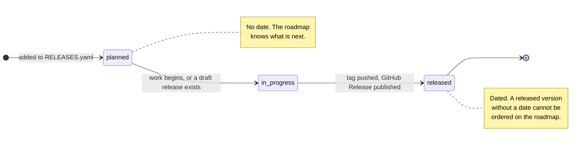
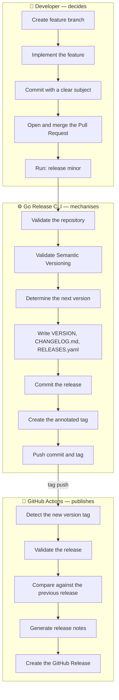
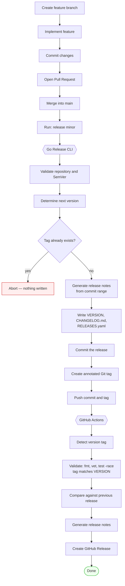
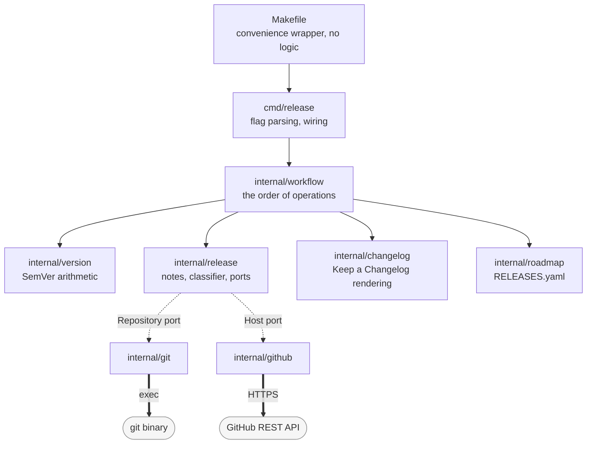

# Release Management

The definitive guide to how this project versions, tags, and publishes releases.

Releases are **automated but not automatic**. A developer decides *that* a release happens and at *what level*; everything after that decision is mechanical, and the mechanism lives in a Go CLI ([`cmd/release`](cmd/release/)) and one GitHub Actions workflow ([`.github/workflows/release.yml`](.github/workflows/release.yml)).

| If you want to… | Read |
|---|---|
| Cut a release | [Release commands](#5-release-commands) |
| Understand what version number to pick | [Semantic Versioning](#1-semantic-versioning) |
| Know who does what | [Responsibilities](#4-responsibilities) |
| Contribute a feature | [CONTRIBUTING.md](CONTRIBUTING.md) |
| Understand the code that does this | [13 — Release Management](docs/architecture/13-release-management.md) |
| Know why `git` is shelled out to, and why not `go-github` | [ADR-0014](docs/adr/0014-exec-git-rather-than-go-git.md), [ADR-0013](docs/adr/0013-hand-written-github-rest-client.md) |

> The workflow below is implemented end to end. [§10](#10-implementation-status) lists what each step does and the two invariants the tests hold it to.

---

## 1. Semantic Versioning

This project follows [Semantic Versioning 2.0.0](https://semver.org/spec/v2.0.0.html). A version is `MAJOR.MINOR.PATCH`, and each number answers a different question a consumer of this repository has.

| Level | Question it answers | Command |
|---|---|---|
| **MAJOR** | Will this break me? | `release major` |
| **MINOR** | Is there something new I can use? | `release minor` |
| **PATCH** | Is a thing I already use now less broken? | `release patch` |

### When to use each

**PATCH** — `v0.2.0` → `v0.2.1`

A backwards-compatible fix. Nothing that worked before stops working, and nothing new is available. A corrected parser, a repaired diagram, a documentation error that misled someone.

**MINOR** — `v0.1.0` → `v0.2.0`

A backwards-compatible addition. Existing behaviour is untouched; there is something new. A new architecture document, a new CLI flag, a new package. Anything a user could adopt without changing what they already do.

**MAJOR** — `v0.9.3` → `v1.0.0`

A breaking change. Something that worked before now works differently, or not at all. A removed CLI flag, a renamed file that other tooling reads, a changed default.

### The 0.x exception

While `MAJOR` is `0`, **the public API may change at any time** (SemVer §4). That is the entire meaning of `0.y.z`, and this project is currently at `0.1.0`.

In practice this means a breaking change during `0.x` bumps the **minor** version, not the major:

```
v0.1.0  →  v0.2.0    a breaking change, during initial development
v1.0.0  →  v2.0.0    the same breaking change, after 1.0.0
```

Reaching `v1.0.0` is a statement, not a milestone counter: it says *the shape of this thing is now stable enough that breaking it deserves a major bump*. Do not reach for it casually.

### Worked examples

| From | To | Because |
|---|---|---|
| — | `v0.1.0` | The first release. Initial architecture and design rationale. |
| `v0.1.0` | `v0.2.0` | Release management tooling added. New capability, nothing broken. |
| `v0.2.0` | `v0.2.1` | The `-z` diff parser mishandled a trailing NUL. A fix, nothing new. |
| `v0.2.1` | `v0.3.0` | A new `release rollback` command. Additive. |
| `v0.3.0` | `v1.0.0` | The CLI surface is declared stable. |
| `v1.0.0` | `v1.0.1` | A typo in the generated release notes. |
| `v1.0.1` | `v2.0.0` | `-repository` renamed to `-repo`. Breaks every existing invocation. |

---

## 2. Version numbering conventions

**Git tags carry the `v` prefix. The `VERSION` file does not.**

```
tag:            v0.2.0
VERSION file:   0.2.0
```

This is not decoration. `internal/git.IsReleaseTag` requires the `v`, which is what lets the tooling walk a tag namespace that also contains non-release tags — this repository has a `backup-before-rewrite` tag — and **skip them rather than crash**. A repository's tag namespace belongs to its humans too.

**`VERSION` is the answer to "what version is this working tree."** One line, bare version, trailing newline. Any tool that can read a file can read it, without git and without this module.

**Pre-releases** sort *below* their own release, per SemVer §11.3:

```
v1.0.0-alpha  <  v1.0.0-alpha.1  <  v1.0.0-beta  <  v1.0.0-rc.1  <  v1.0.0
```

A pre-release tag is published to GitHub as a pre-release automatically — the flag is inferred from the version itself, not from what you passed on the command line. Pushing `v1.0.0-rc.1` cannot silently announce itself as stable.

**Build metadata is ignored when comparing versions**, per SemVer §10. `1.0.0+build.1` and `1.0.0+build.2` have *equal precedence* — they are the same release. The changelog will not accept both.

---

## 3. The release lifecycle

A version passes through three states, recorded in [`RELEASES.yaml`](RELEASES.yaml).



`RELEASES.yaml` exists because git tags answer *what shipped* but never *what is next*, and a roadmap that lives only in prose drifts from the versions that implement it.

Versions and milestones are **two sequences, not one**. `milestone` is optional on a release: repository tooling delivers no architectural milestone. Conflating them would force every milestone reference in `docs/` to be renumbered whenever a tooling release lands. See [13 §13.7](docs/architecture/13-release-management.md#137-versions-and-milestones-are-two-sequences).

---

## 4. Responsibilities

Three actors. The boundary between them is the **tag**: everything before it is a decision, everything after it is a consequence.



### 4.1 The developer

You are responsible for:

- **Creating a feature branch** off `main`.
- **Implementing the feature.**
- **Committing changes** with subjects that read as English imperatives. Your commit subjects *become* the changelog — see [CONTRIBUTING.md](CONTRIBUTING.md#commit-messages).
- **Opening and merging a Pull Request.**
- **Executing the release command**, and choosing the level.

**After you run the release command, no further manual release steps are normally required.** You do not hand-write the changelog, tag anything by hand, draft release notes, or click anything in the GitHub UI.

The one judgement the automation cannot make for you is **which level to bump**. Nothing infers that from a diff, and nothing should.

### 4.2 The Go Release CLI

The CLI's purpose is to **automate the repetitive parts of a release while preserving a clean Git history.** It is responsible for:

- **Validating the repository** — that `VERSION` exists and parses, that `git` is on `PATH`.
- **Validating Semantic Versioning** — that the current version is well-formed and the next one is reachable from it.
- **Determining the next version** — by applying the requested bump to `VERSION`.
- **Refusing to proceed** if the target tag already exists. That means either a half-finished release or a mistaken bump. Both want a human.
- **Writing the release artefacts** — `VERSION`, the `CHANGELOG.md` entry, the `RELEASES.yaml` status.
- **Committing them** as a single release commit.
- **Creating the annotated tag** on that commit. Annotated, never lightweight: a release is an object with an author and a date, not a moving pointer.
- **Pushing** the commit and the tag.

**The order is the design.** Everything that can fail without side effects happens first — read `VERSION`, compute the next version, refuse an existing tag, generate the notes. Only then does anything get written. The tag is created *after* the release commit, so the tag points at a tree whose `CHANGELOG.md` already describes it. The push is last, because it is the first irreversible step.

`VERSION` refuses to move backwards unless explicitly forced. A pipeline that rewinds it because a stale tag was pushed is a class of bug that costs a day to diagnose and a second to prevent.

### 4.3 GitHub Actions

Actions is responsible for **post-tag activity**. It never decides anything; it reacts to a tag.

- **Detecting the new version tag** — the workflow triggers on `v*.*.*` pushes only.
- **Validating the release** — `gofmt`, `go vet`, `go test -race`, and a check that the tag matches the `VERSION` file in the tagged tree. If they disagree the notes would describe the wrong version, so the job fails.
- **Comparing releases** — via GitHub's Compare API, which performs rename detection server-side.
- **Generating release notes** — from the commit range between the previous tag and this one.
- **Creating the GitHub Release**, and marking it a pre-release when the version says so.
- **Publishing artifacts**, where applicable. This project ships no binaries today; the job is the place to add them.

Publishing is deliberately **not** part of the local flow. A release published from a developer's machine announces a release whose tag nobody else can see yet.

The publish step is **idempotent**. It upserts: a retried workflow updates the release its own first attempt created rather than failing. A release pipeline is retried more often than anyone plans for.

---

## 5. Release commands

### The three that matter

```bash
release patch    # a backwards-compatible fix        0.1.0 -> 0.1.1
release minor    # a backwards-compatible feature    0.1.0 -> 0.2.0
release major    # a breaking change                 0.1.0 -> 1.0.0
```

Without installing anything:

```bash
go run ./cmd/release patch
go run ./cmd/release minor
go run ./cmd/release major
```

### Make targets

The `Makefile` is a **convenience wrapper and holds no release logic.** Every target below expands to the `go run ./cmd/release` invocation beside it. The release logic lives in the Go application, and only there.

| Target | Expands to |
|---|---|
| `make release-patch` | `go run ./cmd/release patch` |
| `make release-minor` | `go run ./cmd/release minor` |
| `make release-major` | `go run ./cmd/release major` |
| `make release-dry-run` | `go run ./cmd/release minor --dry-run` |
| `make notes` | `go run ./cmd/release notes` |
| `make version` | `go run ./cmd/release current` |

`release-patch`, `release-minor`, and `release-major` depend on `make check` — they will not cut a release from a tree that does not format, vet, and test cleanly.

### Inspection commands

```bash
release current          # print the current version
release notes            # print the notes for the next release; write nothing
release publish v0.2.0   # publish the GitHub Release for an existing tag (CI uses this)
```

### Flags

| Flag | Meaning |
|---|---|
| `-C <dir>` | Run as if in this directory |
| `-repository <owner/name>` | GitHub repository; defaults to `$GITHUB_REPOSITORY` |
| `-remote <name>` | Remote to push to; defaults to `origin` |
| `-dry-run` | Compute everything, write nothing |
| `-no-push` | Commit and tag locally; do not push |
| `-publish` | Publish the GitHub Release as part of a bump |
| `-draft` | Publish as a draft |
| `-no-fallback` | Fail rather than fall back to local git for a comparison |
| `-v` | Verbose progress on stderr |

### Environment

| Variable | Meaning |
|---|---|
| `GITHUB_TOKEN` | A token with `contents: write`. Without it the tool reads local git only and cannot publish. |
| `GITHUB_REPOSITORY` | `owner/name`, as GitHub Actions sets it. |

`release notes` and `--dry-run` work on a laptop with **no token at all**, because the local repository can answer every question that does not involve publishing.

---

## 6. The release workflow, end to end



### Every step, explained

**1. Create a feature branch.** Off `main`. Releases are cut from `main`, so anything you want in a release must land there first.

**2. Implement the feature.** Ordinary work. Nothing about release management touches this step.

**3. Commit changes.** Your commit *subjects* are the raw material for the changelog. `Add the roadmap registry` becomes an **Added** entry; `Fix the numstat parser` becomes a **Fixed** entry. Housekeeping commits — `chore:`, `ci:`, `test:`, merge commits — are dropped from the notes entirely. See [CONTRIBUTING.md](CONTRIBUTING.md#commit-messages).

**4. Open a Pull Request.** Review happens here, not at release time. A release is not a review gate.

**5. Merge into `main`.** The merge commit itself never appears in release notes; the commits it brings in do.

**6. Run `release minor`.** You choose the level. This is the only human decision in the entire chain after the merge.

**7. The Go Release CLI takes over.** Everything from here is mechanical and, until the push, reversible.

**8. Validate the repository and SemVer.** `VERSION` must exist and parse. `git` must be on `PATH`. If either fails, nothing has been written.

**9. Determine the next version.** `0.1.0` bumped at the minor level is `0.2.0`. A bump drops any pre-release and build metadata: `1.2.3-rc.1` bumped at the patch level is `1.2.4`, not `1.2.4-rc.1`. Carrying a pre-release across a bump would assert something you did not say.

**10. Refuse if the tag exists.** `v0.2.0` already present means a half-finished release or a mistaken bump. The CLI aborts **before writing anything** — `VERSION`, `CHANGELOG.md`, and the tag list are all left exactly as they were.

**11. Generate release notes.** The commit range between the previous release tag and the commit being released is walked, each commit classified into a [Keep a Changelog](https://keepachangelog.com/) category, and merges and housekeeping dropped. The previous tag is found by *SemVer precedence*, not by position in the tag list — which is what makes it correct even though the tag being released does not exist yet.

**12. Write the release artefacts.** `VERSION` gets the new number. `CHANGELOG.md` gets a new entry inserted above the newest existing one. `RELEASES.yaml` marks the version released and stamps today's date.

**13. Commit the release.** One commit, containing exactly those three files.

**14. Create the annotated tag.** On the release commit — so that anyone who checks out `v0.2.0` sees a `CHANGELOG.md` that describes `v0.2.0`.

**15. Push the commit and the tag.** The first irreversible step, and therefore the last local one.

**16. GitHub Actions detects the tag.** The workflow triggers on `v*.*.*` pushes.

**17. Validate.** `gofmt -l`, `go vet`, `go test -race`, and the tag-matches-`VERSION` check. A failure here stops the release before anything is published.

**18. Compare against the previous release.** GitHub's Compare API, which does rename detection server-side and works even from a shallow clone. Local git is the fallback, and the fallback is never silent — a release note that quietly omits half a release is worse than one that fails.

**19. Generate release notes.** The same generator that wrote the changelog entry, rendered differently: the release body leads with a summary and ends with a compare link; the changelog entry leads with a version heading and has neither.

**20. Create the GitHub Release.** Idempotent. Marked pre-release automatically if the version carries a pre-release identifier.

**21. Done.** The tag, the changelog, and the published notes all describe the same commit.

---

## 7. Release architecture

The moving parts, and which of them talks to the outside world. Full detail — package boundaries, the seams, how it is all tested without a network — is in [13 — Release Management](docs/architecture/13-release-management.md).



Two interfaces — `Repository` and `Host` — are the only places this module meets the outside world. Both are declared by `internal/release` and satisfied *structurally*: no adapter imports them, and a test fake is a plain struct with the right methods. That is why the entire test suite runs with **no network and no repository on disk**.

`Host` is optional. With no `GITHUB_TOKEN` it is `nil`, every read falls to local git, and `release notes` still works.

---

## 8. Git history

The history of this repository is a document. It is read by people, and it is read by the release tooling, which turns commit subjects directly into changelog entries. Both readers are poorly served by noise.

**Developers create feature commits manually.** Every commit that describes a change to the project is written by a person who understood the change. Nothing generates them.

**Releases introduce exactly one commit.** A release commit contains `VERSION`, `CHANGELOG.md`, and `RELEASES.yaml` — nothing else, ever. It exists because the changelog must live *inside* the tag that it describes; without it, checking out `v0.2.0` would show you a changelog that has never heard of `v0.2.0`. That is the *only* commit the automation is permitted to create.

**Release automation never rewrites history.** No amends, no rebases, no force-pushes, no re-tagging. A tag, once pushed, is permanent — a published version is a promise about a specific tree, and moving it silently breaks everyone who fetched it. If a release is wrong, **cut a new patch release**. Never re-point a tag.

**The tag namespace belongs to humans too.** This repository carries a `backup-before-rewrite` tag. The tooling ignores every tag that is not a `v`-prefixed SemVer version, rather than crashing on it or, worse, releasing it.

**History stays predictable.** Someone reading `git log` should see feature work, punctuated by one release commit per version, and nothing else.

---

## 9. Best practices

**Dry-run first.** `make release-dry-run` computes the entire release — next version, notes, changelog entry — and writes nothing. Read the notes it prints. If a commit is filed under the wrong heading, the fix is a better commit subject next time, not a hand-edited changelog.

**Write commit subjects for the changelog.** They are the changelog. An imperative verb in the leading position carries the category: *Add*, *Fix*, *Remove*, *Deprecate*, *Harden*. An unrecognised verb yields **Changed**, the category that asserts least. See [CONTRIBUTING.md](CONTRIBUTING.md#commit-messages).

**Never hand-edit `CHANGELOG.md`.** It is generated. The tooling only ever *inserts* a new entry above the newest one — it never revisits an existing entry — so a hand-edit survives indefinitely, quietly disagreeing with the commit history it claims to summarise. Fix the commit subject instead, before the release.

**Choose the level deliberately.** Ask what a consumer would have to *do* about this release. Nothing → patch. Something optional → minor. Something mandatory → major.

**One release per merge, not one release per commit.** Releases are cheap but not free; each is a permanent, immutable statement.

**Never re-point a tag.** If `v0.2.0` is wrong, ship `v0.2.1`. Deleting and re-pushing a tag leaves everyone who already fetched it holding a different `v0.2.0` than you have.

**Use pre-releases for anything you are unsure of.** `v1.0.0-rc.1` sorts below `v1.0.0`, publishes as a pre-release automatically, and costs nothing to abandon.

**A release with no user-facing changes is allowed, and says so.** If every commit in the range was housekeeping, the changelog entry reads *No user-facing changes.* That is not an error — it is a release that honestly has nothing to announce. The CLI warns; it does not refuse.

**Let CI publish.** Do not reach for `-publish` on your laptop. It announces a release whose tag nobody else can see yet.

---

## 10. Implementation status

The workflow documented above is implemented end to end.

| Step | Status |
|---|---|
| Validate repository and SemVer | ✅ |
| Determine next version | ✅ |
| Refuse an existing tag before writing | ✅ |
| Refuse a detached HEAD before writing | ✅ |
| Generate release notes | ✅ |
| Write `VERSION`, `CHANGELOG.md`, `RELEASES.yaml` | ✅ |
| Commit the release artefacts | ✅ |
| Create the annotated tag **on the release commit** | ✅ |
| Push the commit and tag atomically | ✅ |
| GitHub Actions: detect, validate, compare, publish | ✅ |

Two invariants the tests pin down, because breaking either one is silent:

**The tag is created on the release commit, never on `HEAD`.** A tag created before the commit points at a tree that has never heard of the version it names — `git show v0.2.0:CHANGELOG.md` finds nothing, and `VERSION` at the tag reads the *previous* version, so CI's tag-matches-`VERSION` check fails on every release.

**The commit carries the release artefacts and nothing else.** A pathspec on `git commit` keeps unrelated staged work out of a commit that claims to be a version bump.

The push uses `--atomic`, so the commit and its tag land together or not at all. Half a release on the remote — a tag with no commit, or a commit with no tag — is a state nothing in this system recovers from.

---

## 11. Troubleshooting

**`tag v0.2.0 already exists; delete it or choose another level`**
A previous release attempt got as far as tagging, or `VERSION` was rolled back by hand. Nothing was written by the run that just failed. Decide whether the existing tag is correct; if it is, you have already released.

**`cannot publish v0.2.0: no GitHub token was configured`**
`GITHUB_TOKEN` is unset, or `GITHUB_REPOSITORY` is. Publishing needs both. Reading — `notes`, `current`, `--dry-run` — needs neither.

**`GitHub returned 403 … rate limit exhausted … This is a throttle, not a permissions failure`**
Exactly what it says. Wait for the reset, then re-run `release publish`; it upserts, so nothing is duplicated.

**`GitHub compare failed; falling back to local git … the comparison may be incomplete`**
The clone is probably shallow. In CI, `fetch-depth: 0` is load-bearing — `actions/checkout` fetches one commit by default, and release notes are a diff against the previous tag. Pass `-no-fallback` to make this a hard failure instead of a warning.

**`tag v0.2.0 does not match VERSION (0.1.0)`**
The tag does not point at a release commit — most likely it was created by hand. Delete it and cut the release with `release minor`, which tags the commit that carries the matching `VERSION`.

**`HEAD is detached, so there is no branch to push`**
Check out a branch, or pass `--no-push` to commit and tag locally. The refusal happens before anything is written.

**`refusing to downgrade VERSION from 0.2.0 to 0.1.0`**
Deliberate. A pipeline that rewinds `VERSION` because a stale tag was pushed is a bug that costs a day to find.

---

## See also

- [CONTRIBUTING.md](CONTRIBUTING.md) — branching, commit messages, tests
- [13 — Release Management](docs/architecture/13-release-management.md) — the architecture: packages, seams, how it is tested
- [ADR-0013](docs/adr/0013-hand-written-github-rest-client.md) — why a hand-written GitHub client, not `go-github`
- [ADR-0014](docs/adr/0014-exec-git-rather-than-go-git.md) — why the `git` binary, not `go-git`
- [CHANGELOG.md](CHANGELOG.md) — what has actually shipped
- [RELEASES.yaml](RELEASES.yaml) — what is planned
