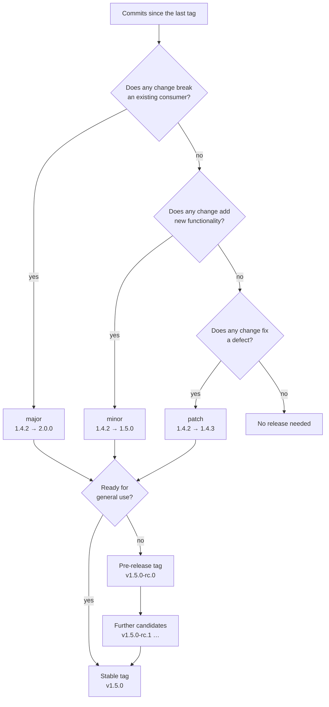
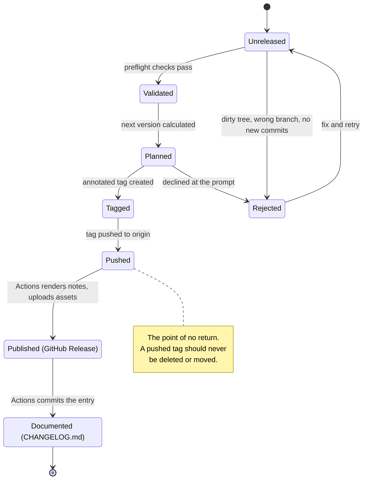

# Release Management

How this project versions, tags, and publishes itself, and what to do when a
release goes wrong.

- [Semantic Versioning](#semantic-versioning)
- [The version lifecycle](#the-version-lifecycle)
- [The release lifecycle](#the-release-lifecycle)
- [Who is responsible for what](#who-is-responsible-for-what)
- [CLI reference](#cli-reference)
- [Pre-releases](#pre-releases)
- [Troubleshooting](#troubleshooting)

## Semantic Versioning

Versions follow [Semantic Versioning 2.0.0](https://semver.org/spec/v2.0.0.html)
exactly. Given `MAJOR.MINOR.PATCH`:

| Component | Increment when | Example |
| --- | --- | --- |
| `MAJOR` | You make an incompatible API change | `1.4.2` → `2.0.0` |
| `MINOR` | You add functionality in a backwards-compatible way | `1.4.2` → `1.5.0` |
| `PATCH` | You make a backwards-compatible bug fix | `1.4.2` → `1.4.3` |

Three consequences are worth stating explicitly, because they are where most
tools get it wrong and where `internal/semver` is deliberately strict:

- **Build metadata is ignored for precedence.** `1.0.0+build.1` and
  `1.0.0+build.2` have equal rank. It never survives a bump.
- **A pre-release ranks below its release.** `1.0.0-rc.1` < `1.0.0`. Numeric
  identifiers compare numerically, so `beta.2` < `beta.11`; alphanumeric ones
  compare in ASCII order and always outrank numeric ones.
- **A pre-release graduates rather than skipping.** Patching `1.2.3-rc.1` yields
  `1.2.3`, not `1.2.4`, because the release candidate was already a candidate
  for `1.2.3`.

Tags are the version prefixed with `v`: `v1.4.2`. A repository with no tags
starts from `0.0.0`, so its first `patch` is `v0.0.1` and its first `major` is
`v1.0.0`.

The bump is always chosen by a human. Commit messages *suggest* the right one,
but no tool can reliably decide whether a change breaks a downstream consumer.

## The version lifecycle

What a set of commits implies about the next version.



## The release lifecycle

What happens to a release as it moves from an idea to a published artifact. The
states before **Pushed** are local and reversible; everything after is public.



## Who is responsible for what

The split is deliberate: the CLI owns every decision, GitHub Actions owns only
the reaction to a tag. No version arithmetic happens in YAML.

```mermaid
flowchart LR
    subgraph human["Developer"]
        h1["Write Conventional Commits"]
        h2["Choose the bump: major, minor, or patch"]
        h3["Review the plan and confirm"]
    end

    subgraph clibox["Go CLI — cmd/release"]
        c1["Validate the repository, branch, and working tree"]
        c2["Discover the previous tag"]
        c3["Calculate the next version"]
        c4["Create the annotated tag"]
        c5["Push the tag to origin"]
    end

    subgraph ci["GitHub Actions — release.yml"]
        a1["Detect the pushed tag"]
        a2["Build and checksum the binaries"]
        a3["Render the release notes"]
        a4["Create the GitHub Release and upload assets"]
        a5["Write and commit the CHANGELOG.md entry"]
    end

    human --> clibox
    clibox -- "tag push event" --> ci
```



Note that steps `a3` and `a5` are themselves invocations of the same Go CLI
(`release publish`, `release changelog --write`). The workflow contributes
orchestration and credentials, not logic.

### Why the changelog is written after the tag

`CHANGELOG.md` lives on the default branch and describes releases that already
exist. Generating it after the tag means the tag is never waiting on a commit,
and re-running the workflow for a tag is a no-op rather than a duplicate entry.

## CLI reference

Run any command with `-h` for its flags.

### Cutting a release

```bash
go run ./cmd/release major   # incompatible changes
go run ./cmd/release minor   # new, backwards-compatible functionality
go run ./cmd/release patch   # backwards-compatible bug fixes
go run ./cmd/release check   # preflight validations only
```

These run six checks before anything is written:

1. The directory is inside a Git work tree.
2. `HEAD` is on a branch permitted to release (`main` or `master` by default).
3. The working tree and index are clean, with no untracked files.
4. Tags are fetched from the remote, so a stale clone cannot reuse a version.
5. The computed tag does not already exist.
6. There is at least one commit since the previous tag.

Before it writes anything, the command prints three blocks: the **release plan**
(where the version came from), the **planned actions** (what is about to happen,
reflecting the flags you passed), and the **release statistics** (what the
release contains, by category).

| Flag | Effect |
| --- | --- |
| `--dry-run` | Print the plan and the notes; create nothing |
| `--no-push` | Create the tag locally, do not push it |
| `--yes` | Skip the confirmation prompt |
| `--pre <series>` | Cut a pre-release, e.g. `--pre rc` → `v1.3.0-rc.0` |
| `--sign` | Create a GPG-signed tag instead of an annotated one |
| `--branch <pattern>` | Permit a branch; repeatable, supports globs |
| `--any-branch` | Permit releasing from any branch |
| `--allow-dirty` | Skip the clean-working-tree check |
| `--allow-empty` | Release even with no new commits |
| `--no-fetch` | Skip fetching tags from the remote |
| `--tag-prefix <s>` | Use a prefix other than `v` |
| `--remote <name>` | Use a remote other than `origin` |
| `--template <file>` | Render notes from a `text/template` file |
| `--dir <path>` | Operate on a repository elsewhere |
| `--no-color` | Disable colour; `NO_COLOR` is honoured too |

The prompt is skipped automatically when stdin is not a terminal, so CI never
hangs waiting for an answer.

### Dry runs

`--dry-run` performs every read and every calculation, then stops before the
first write: no tag, no push, no API call. It opens with a fenced `DRY RUN`
banner, and its action list is phrased in the conditional — `Would create Git
tag v1.3.0` — so a dry run can never be mistaken for a real one at a glance.

The notes it prints are exactly what would be published. They go to stdout while
the progress output goes to stderr, so they can be redirected on their own:

```bash
go run ./cmd/release minor --dry-run > notes.md
```

Run one before every release. It is the only way to see the notes before the tag
exists, and a tag cannot be recalled.

### After the tag

```bash
go run ./cmd/release notes     --tag v1.3.0            # notes to stdout
go run ./cmd/release changelog --tag v1.3.0 --write    # insert into CHANGELOG.md
go run ./cmd/release publish   --tag v1.3.0 --asset 'dist/*'
```

`--tag` defaults to `$GITHUB_REF_NAME` when Actions is running for a tag, and
otherwise to the latest release tag, so all three are usable by hand.

`publish` needs `GITHUB_TOKEN` with `contents: write`. It creates the release,
or updates it if one already exists for that tag, which makes re-running the
workflow safe. `--dry-run` prints the notes without calling the API.

For GitHub Enterprise Server, pass `--api-url` and `--upload-url`, or set
`GITHUB_API_URL` and `GITHUB_UPLOAD_URL`.

### Customising the notes

All three commands accept `--template`, a
[`text/template`](https://pkg.go.dev/text/template) file executed against
`changelog.Data`. The fields, and a worked example, are in the
[README](README.md#custom-release-note-templates).

```bash
go run ./cmd/release publish --tag v1.3.0 --template .github/notes.tmpl
```

A malformed template fails the command rather than publishing a half-rendered
release. The annotated tag's own message always uses the built-in layout: a Git
tag is metadata, and should not change shape because a project restyled its
notes.

## Pre-releases

A pre-release lets you publish `v1.3.0-rc.0` for testing without claiming
`v1.3.0`. The GitHub Release is automatically marked as a pre-release, because
the version carries pre-release identifiers.

```bash
go run ./cmd/release minor --pre rc   # v1.2.3        -> v1.3.0-rc.0
go run ./cmd/release minor --pre rc   # v1.3.0-rc.0   -> v1.3.0-rc.1
go run ./cmd/release minor            # v1.3.0-rc.1   -> v1.3.0
```

The last step graduates the candidate: because `rc.1` was already a candidate
for `1.3.0`, the minor bump drops the identifiers instead of advancing to
`1.4.0`. Switching series (`--pre beta` after `--pre rc`) restarts the counter
at `.0` on the same core version.

## Troubleshooting

Every failure the CLI raises states what happened, why, and how to resolve it.
There is nothing to look up:

```console
$ go run ./cmd/release minor

✗ Tag "v1.3.0" already exists.

A minor bump from 1.2.3 lands on a version that is already tagged.

Possible solutions:

• choose another bump level: major, minor, or patch
• delete the local tag: git tag -d v1.3.0
• delete the remote tag: git push origin --delete v1.3.0
```

The table below is a map of the failures, in case you meet one in a CI log
rather than a terminal.

| Failure | Cause | Fix |
| --- | --- | --- |
| `… is not inside a Git repository.` | Run outside a work tree | `cd` into the repository, or pass `--dir` |
| `The working tree has uncommitted changes.` | Uncommitted or untracked files | Commit, stash, or `.gitignore` them; the offending paths are listed |
| `Releases are not allowed from branch "x".` | Releasing from a feature branch | Switch to `main`, or pass `--branch`/`--any-branch` |
| `HEAD is detached, so there is no branch to release from.` | A tag or commit is checked out | `git switch main`, or pass `--any-branch` |
| `No releasable commits since v1.2.3.` | The tag already points at `HEAD` | Commit something, or pass `--allow-empty` |
| `Tag "v1.3.0" already exists.` | The computed version is taken | Usually a pre-release series collision; check `git tag -l` |
| `Tag "v9.9.9" does not exist.` | `notes`/`publish` given an unknown tag | `git fetch --tags`, or check the spelling |
| `GITHUB_TOKEN is not set…` | `publish` has no credentials | Export a token with `contents: write` |
| `github: … 422 Validation Failed (Release.tag_name: already_exists)` | A release exists but the lookup missed it | Confirm `--repo owner/name` matches the tag's repository |

Exit codes: `1` for a failed release, `2` for a usage error, `130` for a release
you declined at the prompt.

### The push failed and the tag exists locally

`Apply` creates the tag before pushing it, so a rejected push leaves a local tag
behind. The error says so, and gives you the command:

```bash
git tag -d v1.3.0     # then fix the cause and re-run
```

### A bad version was pushed

Do not delete or move a published tag: anyone who already fetched it keeps the
old contents, and package proxies cache it permanently. Release the next patch
instead, and mark the bad GitHub Release as a draft if it is misleading.

### The changelog job cannot push

If the default branch is protected, the `GITHUB_TOKEN` issued to the workflow
cannot push to it. Either allow the `github-actions[bot]` actor to bypass the
rule, or issue a Personal Access Token with `contents: write`, store it as a
secret, and use it for that job's `actions/checkout` step.

### Release notes are empty

The workflow checks out with `fetch-depth: 0` for a reason: the CLI derives the
commit range from the previous tag, and a shallow clone has neither the tags nor
the history. If notes come out empty, confirm the full history was fetched.
