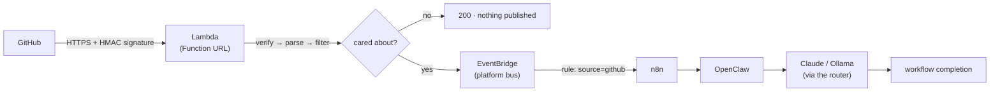

# GitHub Webhook Automation — The Platform's Front Door

The platform reacts to what happens in a repository. When you push, cut a release, or create
a branch, GitHub calls a webhook; a Lambda verifies it is really GitHub, decides whether the
platform cares, and — if it does — publishes a small, curated event onto the platform's
EventBridge bus. Everything downstream reads that bus on its own schedule.

```
GitHub → Lambda (verify · filter) → EventBridge → n8n → OpenClaw → (Claude / Ollama)
```

> **The webhook does none of the work.** It verifies, filters, and publishes an event — then
> returns. It never calls n8n, never starts an agent, never reaches a model. GitHub gives a
> webhook about ten seconds and retries the ones that time out, so a webhook that blocked on an
> agent run (minutes to hours) would time out, be retried, and start the work twice. Putting a
> durable event on a bus and getting out of the way is the whole design.

> **This repository owns the entry point, not the workflows.** The Lambda, its signature
> check, its filtering, and the EventBridge routing live here. The n8n workflows that consume
> the events live in n8n (deployed by its own repository), exactly as the agent's execution
> does.

The *why* is in the blog post,
[Automating AI Workflows with GitHub Webhooks](docs/blog/automating-ai-workflows-with-github-webhooks.md).

## Contents

- [Why webhooks, not polling](#why-webhooks-not-polling)
- [The event flow](#the-event-flow)
- [Supported events](#supported-events)
- [The security model](#the-security-model)
- [Why a curated event, not the raw payload](#why-a-curated-event-not-the-raw-payload)
- [Event filtering](#event-filtering)
- [The HTTP responses, and what they mean](#the-http-responses-and-what-they-mean)
- [Correlation: one thread through the whole platform](#correlation-one-thread-through-the-whole-platform)
- [Configuration](#configuration)
- [IAM permissions](#iam-permissions)
- [Deployment](#deployment)
- [Observability](#observability)
- [Testing](#testing)
- [Example payloads](#example-payloads)
- [Troubleshooting](#troubleshooting)

## Why webhooks, not polling

The platform could ask GitHub "anything new?" on a timer. It should not, and the reasons
compound:

- **Latency.** A poll every five minutes is, on average, two and a half minutes late. A webhook
  arrives in seconds.
- **Cost and rate limits.** Polling spends API calls to mostly learn nothing happened, against a
  rate limit that a busy account shares with everything else.
- **Correctness.** Between two polls, a branch can be created and deleted; the poll sees neither.
  A webhook sees every event, once, as it happens.

An event-driven front door is the honest shape for "react to what happens": the producer tells
you, rather than you asking the producer repeatedly whether it has anything to say.

## The event flow



Each component has one job: **GitHub** produces events; the **Lambda** authenticates and
filters them; **EventBridge** decouples and routes; **n8n** orchestrates; **OpenClaw** executes;
the **router** picks the model. The webhook's responsibility ends the instant the event is on
the bus.

## Supported events

| Event | What it is | Typical use |
| --- | --- | --- |
| `push` | Commits pushed to a branch | Draft release notes, summarise a diff |
| `release` | A release published/edited/deleted | Announce, generate notes |
| `create` | A branch or tag created | React to a new release branch |
| `delete` | A branch or tag deleted | Clean-up (usually ignored) |
| `workflow_run` | A GitHub Actions run finished | React to CI results |
| `repository` | The repository itself changed (archived, renamed…) | Governance |
| `ping` | GitHub confirming the hook is reachable | Acknowledged, never published |

**Adding an event is a one-line change** to the supported set (plus, sometimes, a field or two
in the parser) — never a change to the handler, the filter, or the routing. The handler treats
an event as a name and a handful of extracted fields, not a schema it branches on, which is what
makes the set extensible.

## The security model

The endpoint is **public** — a Lambda Function URL with `AuthType: NONE`. That is correct and
deliberate: GitHub cannot authenticate with AWS IAM, so the authentication is the one GitHub
*can* do — an **HMAC-SHA256 signature** over the request body, using a secret only GitHub and
the platform know. "No AWS auth" is not "no auth"; the auth is in the body.

Three things the verification gets right, because getting them wrong is the whole ballgame:

1. **It verifies over the raw body** — the exact bytes GitHub sent — *before* parsing. Parsing
   first and verifying a re-encoded payload would reject every legitimate request (the signature
   is over bytes, and re-encoding changes them) and, worse, would mean decoding an unverified,
   attacker-controlled body.
2. **It compares in constant time** (`hmac.Equal`). A byte-by-byte compare that returns early
   leaks, through timing, how much of a guess was right — enough to forge a signature one byte at
   a time. This is a library call precisely so nobody reimplements it with `==`.
3. **It fails closed.** No secret configured, no signature, or a bad signature: the request is
   refused and nothing downstream ever sees it. An endpoint that failed open — accepting
   unverified requests — is worse than one that is down.

The secret lives in **Secrets Manager**, fetched once at cold start, never in a Lambda
environment variable — because a secret in a function's env is readable by anyone with
`lambda:GetFunctionConfiguration`, a wider audience than "can read this one secret".

**Replay protection**, honestly scoped: the signature stops *forgery*. Replay of a genuine past
delivery is mitigated downstream — every event carries GitHub's unique delivery id, and the
agent derives its idempotency key from it, so a redelivered webhook produces one agent run, not
two (see [Correlation](#correlation-one-thread-through-the-whole-platform)). A dedicated
replay-cache (DynamoDB) is deliberately future work; the delivery id is the hook it will use.

## Why a curated event, not the raw payload

The Lambda does **not** forward GitHub's payload. It publishes a small, curated `GitHubEvent`
with the fields the platform routes on — event, action, repository, branch, sha, sender,
delivery id, correlation id. Three reasons, each sufficient alone:

- **Decoupling.** Consumers read stable fields and never parse GitHub's schema. When GitHub
  changes a payload — and it does — the change is absorbed in the parser, and no consumer
  notices. Forward the raw payload and every consumer is coupled to GitHub's JSON forever.
- **Redaction.** GitHub payloads carry commit messages, file lists, and author emails. None of
  it is anything the platform routes on, and all of it is content that should not be sprayed
  across every downstream system. What is never extracted is never published and never logged.
- **Size.** A push payload can be tens of kilobytes; EventBridge caps an entry at 256 KB. The
  curated event is a few hundred bytes.

## Event filtering

Filtering happens in the Lambda, **before anything is published** — the cheapest place to not do
work is before you have started it. The order is safe-first, then cheap-first: the dangerous
drops (fork, archived) come before the merely-uninteresting ones (allow-lists, branches), so a
reader sees the security decisions made first.

| Filter | Default | Why |
| --- | --- | --- |
| Unsupported event | accept all supported | The parser understands it, but this deployment may not want it. |
| **Fork** | **ignore** | An agent pointed at a fork reads content the fork's owner controls — the untrusted-content hazard at the front door. |
| **Archived** | **ignore** | An archived repo is inert; automating it is almost always a mistake. |
| Repository allow-list | any | Restrict to named repos when the endpoint might be pointed at by more than one. |
| **Branch deletion** | **ignore** | Nothing to check out; rarely worth a workflow. |
| Branch allow-list | any | `main,release/*` — a trailing `/*` is a prefix match. |

A filtered event is a **success**: the request was authentic, the platform simply had nothing to
do, and GitHub gets a `200`.

## The HTTP responses, and what they mean

| Status | Meaning | GitHub retries? |
| --- | --- | --- |
| `202` | Authentic, wanted, **published** to the bus | — |
| `200` | Authentic, deliberately **ignored** (a filter) or a **ping** | — |
| `401` | Signature missing or **wrong** — refused | no (terminal) |
| `400` | Authentic but **malformed** (valid signature over unparseable JSON) | no (terminal) |
| `500` | Failed to **publish** a wanted event | **yes** |

**Only a publish failure returns `500`**, because a `5xx` is the only response that asks GitHub
to redeliver — and redelivery is exactly right there: the event is wanted and was not stored, the
delivery id stays the same, so retrying is safe. A `5xx` for a bad signature or malformed body
would make GitHub retry something that fails identically forever — a retry storm. So those are
`4xx`: terminal by design.

## Correlation: one thread through the whole platform

Every delivery gets a **correlation id** of `<event>:<deliveryId>` — `push:a1b2c3…`. It is stable
for a delivery (a redelivery has the same delivery id, so the same correlation id), and it threads
the entire platform:

```
GitHub delivery  →  webhook  →  EventBridge  →  n8n  →  agent  →  inference
     push:a1b2c3 ───────────────── same id, every hop ─────────────────►
```

The agent derives its idempotency key from this id (see [AGENTS.md](AGENTS.md#idempotency-a-retry-costs-money)),
which is what stops a redelivered webhook from opening two pull requests. A random id here would
look fine and quietly break that. When a pull request appears and nobody knows why, this id is the
single thread back to the GitHub delivery that caused it.

## Configuration

All environment variables, set by the CloudFormation stack. The wiring ones have no defaults; the
filter ones default to safe values.

| Variable | Required | Default | Notes |
| --- | --- | --- | --- |
| `WEBHOOK_SECRET_ARN` | ✅ | — | Secrets Manager ARN of the shared secret. Read at cold start. |
| `EVENT_BUS_NAME` | ✅ | — | The platform bus to publish to. |
| `EVENT_SOURCE` | ✅ | — | The source consumers route on (`aiap.<env>.github`). |
| `PROJECT_NAME` / `ENVIRONMENT` | ✅ | — | Deployment identity, for the event and the logs. |
| `SUPPORTED_EVENTS` | | *(all)* | Narrow the accepted events: `push,release`. |
| `REPO_ALLOW_LIST` | | *(any)* | `owner/repo,owner/other`. |
| `BRANCH_ALLOW_LIST` | | *(any)* | `main,release/*`. |
| `IGNORE_FORKS` | | `true` | Drop events from forks. |
| `IGNORE_ARCHIVED` | | `true` | Drop events from archived repos. |
| `IGNORE_BRANCH_DELETES` | | `true` | Drop branch/tag deletions. |

CloudFormation parameters map one-to-one to these (`SupportedEvents`, `RepoAllowList`, …), plus
the optional n8n routing (`N8nWebhookUrl`, `N8nAuthApiKey`).

## IAM permissions

Least-privilege, scoped to the one bus and the one secret:

```json
[
  { "Sid": "PutPlatformEvents", "Effect": "Allow",
    "Action": "events:PutEvents", "Resource": "<the platform bus ARN>" },
  { "Sid": "ReadWebhookSecret", "Effect": "Allow",
    "Action": "secretsmanager:GetSecretValue", "Resource": "<the webhook secret ARN>" },
  { "Sid": "DecryptWebhookSecret", "Effect": "Allow", "Action": "kms:Decrypt",
    "Resource": "arn:aws:kms:*:*:key/*",
    "Condition": { "StringEquals": { "kms:ViaService": "secretsmanager.<region>.amazonaws.com" } } },
  { "Sid": "WriteLogs", "Effect": "Allow",
    "Action": ["logs:CreateLogStream", "logs:PutLogEvents"], "Resource": "<the function's log group>" }
]
```

The one `"*"` principal in the stack is on the **Function URL invoke permission**
(`lambda:InvokeFunctionUrl`, `AuthType: NONE`) — which is what makes the public endpoint callable
by GitHub at all, and is scoped to URL invocation, not arbitrary invocation.

## Deployment

The webhook needs the event bus (`05-events`) and the artifact bucket (`04-storage`).

```bash
# build + deploy (n8n routing optional)
make -C infra webhook
# with n8n routing:
make -C infra webhook N8N_WEBHOOK_URL=https://n8n.example.com/webhook/github N8N_API_KEY=…

# then configure GitHub (the deploy prints these):
#   Payload URL:  <the WebhookUrl output>
#   Content type: application/json
#   Secret:       aws secretsmanager get-secret-value \
#                   --secret-id aiap-dev-github-webhook-secret --query SecretString --output text
#   Events:       choose "push", "release", … (or "send me everything" — the filter handles the rest)
```

Without `N8N_WEBHOOK_URL`, events land on the bus and wait for a consumer — the webhook works end
to end regardless, which is why n8n routing is a separate, optional piece (n8n is deployed by its
own repository).

## Observability

Structured logs, designed for CloudWatch. The Lambda logs metadata — never the raw body, which is
attacker-controlled until verified, and repository content after.

```json
{"level":"WARN","msg":"signature verification failed","errorKind":"bad_signature","deliveryId":"a1b2c3","event":"push","bodyBytes":8241}
{"level":"INFO","msg":"webhook received; not published","disposition":"ignored","reason":"repository x/y is a fork","deliveryId":"d4e5f6","event":"push"}
{"level":"INFO","msg":"webhook published to EventBridge","deliveryId":"g7h8i9","correlationId":"push:g7h8i9","repository":"acme/platform","branch":"main","detailType":"GitHub Event","durationMs":11}
```

The fields to alarm and query on: `errorKind` (`bad_signature` is a forgery attempt or a secret
mismatch — distinct from `no_signature`, a misconfigured hook), `disposition` (accepted / ignored
/ acknowledged), `correlationId`, `deliveryId`, and `durationMs`. A `WebhookErrors` CloudWatch
alarm fires on the Lambda erroring — the only thing that returns a `5xx` — which means authentic,
wanted events are failing to publish.

```
fields deliveryId, event, disposition, reason
| filter msg = "webhook received; not published"
| stats count() by reason
```

## Testing

```bash
cd infra/lambda
go test ./internal/webhook/   # signature, parse, filter, config, handler — no AWS
go test -race ./...
```

The whole handler is tested against a **fake EventBridge**, with signed sample payloads built the
way GitHub builds them (`Sign` is the exact inverse of what the handler verifies). What the tests
pin down:

| | |
| --- | --- |
| **A correct signature verifies; a wrong one is refused** | including the SHA-1 header, a re-encoded body, and a non-hex signature. |
| **The signature is over raw bytes** | the same JSON with different whitespace must NOT verify. |
| **A bad signature publishes nothing** | the front door does not fail open. |
| **The response codes are correct** | 202 published, 200 ignored/ping, 401 unsigned, 400 malformed, 500 publish-failed. |
| **A rejected EventBridge entry is a failure** | the 200-with-`FailedEntryCount` trap surfaces as a 500, not a silent drop. |
| **Every filter rule** | fork, archived, allow-lists, branch match, deletions — as a table. |
| **The curated event is not the raw payload** | only the routing fields cross the boundary. |

## Example payloads

**Inbound** (what GitHub sends, headers abbreviated):

```
POST / HTTP/1.1
X-GitHub-Event: push
X-GitHub-Delivery: 72d3162e-cc78-11e3-81ab-4c9367dc0958
X-Hub-Signature-256: sha256=<hex hmac of the body>
Content-Type: application/json

{"ref":"refs/heads/main","after":"abc123","repository":{"full_name":"acme/platform",
 "private":false,"default_branch":"main"},"sender":{"login":"alice"}, …}
```

**Published** (what lands on the bus — curated, not the above):

```json
{
  "detail-type": "GitHub Event",
  "source": "aiap.dev.github",
  "detail": {
    "correlationId": "push:72d3162e-cc78-11e3-81ab-4c9367dc0958",
    "deliveryId": "72d3162e-cc78-11e3-81ab-4c9367dc0958",
    "event": "push", "repository": "acme/platform", "branch": "main",
    "headSha": "abc123", "sender": "alice", "private": false,
    "project": "aiap", "environment": "dev"
  }
}
```

## Troubleshooting

| Symptom | Cause / fix |
| --- | --- |
| GitHub shows a **red** delivery with `401` | The secret in GitHub does not match the one in Secrets Manager. Re-copy it: `aws secretsmanager get-secret-value …`. |
| GitHub shows `400` | A valid signature over a body the parser could not read — rare; usually a content-type that is not `application/json`. |
| Deliveries succeed (`200`) but no workflow runs | The event was **ignored** by a filter (fork, archived, allow-list, branch). The log line says which; it is a success, not a bug. |
| Deliveries return `500` and GitHub retries | The Lambda cannot publish — check the `WebhookErrors` alarm and the log. Usually an IAM or bus-name misconfiguration. |
| The webhook works but n8n never fires | `N8nWebhookUrl` was not set at deploy, so no routing rule exists. The events are on the bus; add the rule (`make webhook N8N_WEBHOOK_URL=…`). |
| Signature fails for a payload that looks right | Something re-encoded the body before verification. The signature is over the **raw** bytes; verify before parsing, never after. |
| Two agent runs from one push | A redelivery whose correlation id was not used as the idempotency key downstream — the id is `push:<deliveryId>` and is stable; the dedup belongs in n8n/the agent. |
