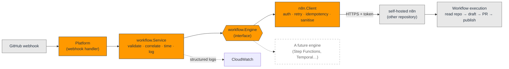

# Workflow Orchestration — n8n Integration

The platform delegates its slow, multi-step, failure-prone work to **self-hosted
n8n**. This document is the integration reference: the contract, the
configuration, the failure modes, and how to add a workflow.

- **Trigger** — the platform calls a `workflow.Service`, never n8n directly
- **Engine** — `n8n.Client` implements `workflow.Engine`; it is the only code that
  knows n8n exists
- **Contract** — one JSON body, one auth header, one idempotency key
- **Boundary** — this repository does **not** deploy n8n

> **n8n's deployment lives in [`self-hosted-n8n-on-aws`](#the-boundary).**
> This repository owns the *contract*; that one owns the *instance*. Nothing here
> provisions n8n, and nothing here should ever start to.

The *why* is in the blog post,
[Using n8n as the Workflow Engine for AI Automation](docs/blog/using-n8n-as-the-workflow-engine-for-ai-automation.md).

## Contents

- [The boundary](#the-boundary)
- [Architecture](#architecture)
- [The one hard problem: a retry is not free](#the-one-hard-problem-a-retry-is-not-free)
- [Configuration](#configuration)
- [The request contract](#the-request-contract)
- [Responses](#responses)
- [Errors](#errors)
- [Observability](#observability)
- [Security](#security)
- [Adding a workflow](#adding-a-workflow)
- [Local development](#local-development)
- [Testing](#testing)
- [Future workflows](#future-workflows)
- [Troubleshooting](#troubleshooting)

## The boundary

| | Owns | Does not own |
| --- | --- | --- |
| **This repository** (platform) | The contract: the payload, the auth header, the retry policy, the errors. The `Engine` interface. | n8n's servers, database, version, backups, or uptime. |
| **`self-hosted-n8n-on-aws`** | Deploying n8n: its compute, its database, its queue mode, its upgrades. | What the platform sends it, or why. |

The rule the repository already committed to: *if a change affects more than one
component, it belongs here; if it affects exactly one, it belongs in that
component's repository.* An n8n version bump affects n8n. The shape of the JSON we
send affects everything that sends it.

**What this repository provides n8n:** the VPC and the shared AWS estate
(Milestone 2), and the events worth reacting to. **What n8n provides back:** a
place to draw the long-running logic that would otherwise be hard-coded into a
Lambda nobody wants to redeploy to change a step.

## Architecture



**Why the `Engine` interface exists.** The obvious design is to call n8n's webhook
URL from wherever the event arrives. It works, and it welds the platform to n8n:
every caller learns the URL scheme, the auth header, the retry policy, and the
response shape. Replacing the engine — or running two during a migration — then
means touching every caller.

So the split is:

- **`workflow.Service`** does what must be identical for every engine: validate,
  correlate, time, log. If each engine logged in its own shape, no dashboard could
  span them.
- **`workflow.Engine`** is the seam. `n8n.Client` implements it. Something else
  could.

`internal/workflow` does not import `internal/n8n`. That is the test: if the
dependency ever points the other way, the abstraction is a decoration.

## The one hard problem: a retry is not free

Triggering a workflow is **not a read**. If we send a trigger, the network eats the
response, and we retry, n8n may run the workflow **twice** — and a blog-generating
workflow that runs twice opens two pull requests.

The dangerous case is a **timeout**, and it is worth being precise about why:

> A timeout tells you that **no answer arrived**. It tells you **nothing** about
> whether the request did.

The work may be running right now. So:

**Every request carries an idempotency key**, derived from the event's own ID:

```
X-Idempotency-Key: blog-generator:delivery-abc-123
```

It is **stable by construction** — the same GitHub delivery, retried by us or
replayed by an operator, produces the same key. Anything random here would defeat
the entire purpose.

That makes the **transport** at-least-once, and lets n8n make the **execution**
effectively-once — **but only if the workflow on the other side actually checks the
key.** This repository cannot enforce that.

> ⚠️ **The single most important thing to get right on the n8n side.** A workflow
> that ignores `idempotencyKey` will duplicate work the first time the network
> hiccups. It is the first thing to check when something has happened twice.
>
> In n8n: an early node that looks the key up in a store (the workflow's static
> data, a database, Redis), and short-circuits if it has been seen.

The key is sent **both** as a header and in the body, because n8n workflows find
body fields far easier to work with than headers — and a key the workflow cannot
conveniently reach is a key nobody will use.

## Configuration

Everything that differs between a laptop, dev, and prod is an environment
variable. There is not a single n8n URL, token, or workflow path compiled into
this repository.

| Variable | Required | Default | Notes |
| --- | --- | --- | --- |
| `N8N_BASE_URL` | ✅ | — | Where n8n is, e.g. `https://n8n.internal.example.com`. Deployed by the other repository. |
| `N8N_TOKEN` | ✅ | — | The shared secret n8n checks. **Never logged, never in an error.** |
| `N8N_WORKFLOWS` | ✅ | — | `name=/path,name=/path`. The registry — see [Adding a workflow](#adding-a-workflow). |
| `N8N_AUTH_HEADER` | | `X-N8N-Api-Key` | n8n's Header Auth credential lets you choose the header, so this cannot be assumed. |
| `N8N_TIMEOUT` | | `10s` | Per **attempt**, not per call. |
| `N8N_RETRY_ATTEMPTS` | | `3` | **Total** attempts, not retries after the first. `1` = never retry. |
| `N8N_RETRY_DELAY` | | `500ms` | Base for exponential backoff with full jitter, capped at 30s. |
| `N8N_MAX_PAYLOAD_BYTES` | | `1048576` | Cap on the event payload we will forward. |
| `N8N_MAX_RESPONSE_BYTES` | | `1048576` | Cap on what we will read back, so a broken engine cannot exhaust our memory. |
| `N8N_CA_CERT` | | — | PEM bundle, for an n8n behind a private CA. |

Two deliberate refusals:

- **There is no "skip TLS verification" option.** An environment variable that
  turns off certificate checking eventually gets set in production and never gets
  unset. Use `N8N_CA_CERT`.
- **`http://` to a non-local host is rejected at start-up.** The token would cross
  the network in clear text. `http://localhost` is fine, because that is how you
  develop.

A misconfiguration is **fatal at start-up**, never a surprise on the first webhook
of the day. `workflow list` prints the whole configuration safely:

```console
$ workflow list
{
  "baseUrl": "http://localhost:5678",
  "authHeader": "X-N8N-Api-Key",
  "token": "(set, 15 chars)",     ← never the value
  "retryAttempts": 3,
  "timeout": "10s",
  ...
}
workflows:
  blog-generator       → /webhook/blog
  release-notes        → /webhook/notes
```

## The request contract

One `POST`, one JSON body. This is what an n8n workflow reads, so **renaming a
field here silently breaks somebody's workflow** — treat it as an API.

```http
POST /webhook/blog HTTP/1.1
Content-Type: application/json
X-N8N-Api-Key: <token>
X-Idempotency-Key: blog-generator:delivery-abc-123
X-Correlation-Id: push:delivery-abc-123
X-Event-Type: push
X-Repository: teddynted/platform
```

```json
{
  "idempotencyKey": "blog-generator:delivery-abc-123",
  "correlationId": "push:delivery-abc-123",
  "workflow": "blog-generator",
  "requestedAt": "2026-07-14T13:37:24Z",
  "attempt": 1,
  "event": {
    "id": "delivery-abc-123",
    "type": "push",
    "repository": "teddynted/platform",
    "repositoryUrl": "https://github.com/teddynted/platform",
    "branch": "main",
    "commitSha": "deadbeef",
    "commitMessage": "feat: add the thing",
    "actor": "teddynted",
    "payload": { "…": "the original webhook payload, sanitised" }
  },
  "metadata": { "environment": "dev" }
}
```

**Why the fields are explicit** rather than "here is the GitHub payload, help
yourself": a workflow that reaches into a raw webhook payload to find the commit
SHA is a workflow coupled to GitHub's payload schema — and GitHub changes that
schema whenever it likes. In n8n you write `{{$json.event.commitSha}}`, and it
keeps working.

The raw payload is still forwarded (a workflow will eventually need a field nobody
modelled) — **sanitised**. See [Security](#security).

`attempt` is in the body on purpose: a workflow can tell that it is seeing a retry
without having to reason about the idempotency key.

## Responses

| n8n answers | The platform concludes |
| --- | --- |
| `2xx`, empty body | `accepted` — the trigger was taken (an n8n webhook set to "respond immediately" returns nothing) |
| `2xx`, `{"executionId": "…"}` | `accepted`, and we now know which execution to look at |
| `2xx`, `{"status":"success"}` | `succeeded` — it ran synchronously and finished |
| **`2xx`, `{"status":"error"}`** | **`ErrWorkflowFailed`** — see below |
| `2xx`, HTML | `ErrInvalidResponse` — that is a proxy or a login page, not n8n |
| `401` / `403` | `ErrUnauthorized` — **not retried** |
| `404` | `ErrUnknownWorkflow` — the webhook is not registered, or the workflow is not active |
| `429`, `5xx` | `ErrUnavailable` — **retried**, honouring `Retry-After` |

> **A 200 is not a success.** n8n answers `200` and puts the error *in the body*
> when a workflow throws and a "Respond to Webhook" node catches it. Trusting the
> status code is how a platform cheerfully reports that it triggered workflows into
> a void.

## Errors

Engine-agnostic sentinels, so a caller can decide what to **do** without parsing an
HTTP status or a vendor's error string:

| Error | Means | Retried? |
| --- | --- | --- |
| `ErrUnavailable` | Could not reach the engine at all. The work almost certainly did not start — the safest failure there is. | ✅ |
| `ErrTimeout` | No answer in time. **The workflow may still be running.** | ✅ |
| `ErrUnauthorized` | The token was rejected. A human must rotate it. | ❌ |
| `ErrUnknownWorkflow` | Not registered here, or not active in n8n. | ❌ |
| `ErrInvalidRequest` | The request is malformed. It will be malformed next time too. | ❌ |
| `ErrInvalidResponse` | The engine answered with something we cannot trust. | ❌ |
| `ErrWorkflowFailed` | It ran, and it failed. **The only error about the *work*** — every other one is about the plumbing. | ❌ |
| `ErrRetriesExhausted` | We gave up. **Always wraps the cause**, so `errors.Is` still finds it. | — |

**Why `ErrWorkflowFailed` is not retried:** the workflow *ran*. Retrying it runs it
again — which, for a workflow with side effects, is exactly what nobody wants.
Re-running a failed workflow is a decision for a human or for n8n's own error
workflow, not for an HTTP client.

## Observability

Every execution produces at least two structured lines sharing a correlation ID.
When a blog post fails to appear three hours after a merge, the only question that
matters is *"did the platform ask, and what did the engine say?"* — and it must be
answerable from the GitHub delivery ID alone.

```json
{"level":"INFO","msg":"workflow requested","correlationId":"push:delivery-abc-123","workflow":"blog-generator","engine":"n8n","repository":"teddynted/platform","commitSha":"deadbeef","payloadBytes":147}
{"level":"INFO","msg":"workflow completed","correlationId":"push:delivery-abc-123","status":"succeeded","executionId":"exec-local-1","attempts":1,"durationMs":4}
```

A degrading n8n, absorbed:

```json
{"level":"WARN","msg":"n8n attempt failed; retrying","correlationId":"push:delivery-abc-123","attempt":1,"of":3,"retryIn":"57ms","error":"workflow engine unavailable: …"}
{"level":"INFO","msg":"workflow completed","attempts":3,"durationMs":982}
```

A failure:

```json
{"level":"ERROR","msg":"workflow failed","errorKind":"unauthorized","retriesExhausted":false,"attempts":1,"durationMs":12}
```

`errorKind` is the **sentinel's name, not the message** — so an alert can fire on
`unauthorized` without pattern-matching an error string someone will reword next
week. `retriesExhausted` is logged **separately** from `errorKind`, because "we
gave up" and "what we gave up on" are different questions and an on-call engineer
needs both.

The handler is `slog`'s JSON handler, which is what CloudWatch Logs Insights wants:

```
fields correlationId, workflow, errorKind, attempts, durationMs
| filter msg = "workflow failed"
| stats count() by errorKind
```

`executionId` is in the completion line specifically so you can paste it into the
n8n UI and see what happened.

## Security

- **The token is never logged, never in an error, never echoed.** Including when
  n8n rejects it and helpfully echoes it back at us in the response body — a real
  gateway has done exactly that. `Config.Redacted()` reports only *that* a secret
  is set and how long it is; never a prefix, because a prefix of a short token is
  most of the token.
- **Outbound payloads are sanitised.** The GitHub payload is the one thing here the
  platform did not author. It is large, nested, versioned by someone else, and
  occasionally carries credential-shaped things — an installation access token on a
  GitHub App event, a client secret in a poorly-configured integration.

  Forwarding it verbatim puts those into **n8n's execution history**, which is a
  database, which gets backed up, and which anyone with n8n UI access can read.
  Values under credential-shaped keys (`token`, `access_token`, `client_secret`,
  `password`, `authorization`, …, at any depth) become `[REDACTED BY PLATFORM]`.

  The structure survives — a sanitiser that guts the payload is one nobody keeps
  enabled.
- **Responses are validated, not trusted:** status, content type, size cap, JSON.
- **TLS is verified.** No opt-out (see [Configuration](#configuration)).
- **Bodies are bounded** before they reach a log line, so a misbehaving engine
  cannot write a megabyte into CloudWatch on our behalf, once per retry.

## Adding a workflow

The point of an orchestrator is that a new workflow is **not a code change**.

1. **Draw it in n8n**, with a Webhook trigger node. Add Header Auth. Read
   `{{$json.event.*}}`.
2. **Check the idempotency key** in an early node. (Not optional. See
   [above](#the-one-hard-problem-a-retry-is-not-free).)
3. **Register it** — one entry:

   ```bash
   N8N_WORKFLOWS=blog-generator=/webhook/blog,social-publisher=/webhook/social
   ```

4. **Call it:** `svc.Run(ctx, workflow.Request{Workflow: "social-publisher", Event: ev})`

No recompile. No new client. No new retry policy. That is the whole argument for
having an orchestrator at all, and if adding a workflow ever requires touching Go
code, the integration has failed at its one job.

## Local development

Run n8n locally (its own repository documents the real thing; for the integration,
anything that speaks HTTP will do):

```bash
docker run -it --rm -p 5678:5678 n8nio/n8n
```

Point the platform at it and trigger something:

```bash
export N8N_BASE_URL=http://localhost:5678          # plain http is allowed for localhost only
export N8N_TOKEN=local-dev-token
export N8N_WORKFLOWS='blog-generator=/webhook/blog'

go run ./cmd/workflow list
go run ./cmd/workflow trigger blog-generator \
  --id delivery-abc-123 --repo teddynted/platform \
  --branch main --sha deadbeef --message "feat: add the thing" \
  --payload event.json
```

`--dry-run` prints the request and sends nothing.

> **Replaying an event?** Pass the **original** `--id`. Without it the CLI mints a
> fresh idempotency key, and n8n will treat the replay as a brand-new event — which
> is exactly what you do not want when re-running a workflow that already did half
> the job. The CLI warns you when it has to invent one.

## Testing

```bash
go test ./internal/workflow/ ./internal/n8n/
go test -race ./...
```

n8n is mocked with `httptest`, so the tests are fast and hermetic. What they pin
down:

| | |
| --- | --- |
| **Idempotency** | A retry reuses the **same** key. The same event always produces the same key; different events (and different workflows) never share one. |
| **Retry policy** | `5xx`/`429`/timeout are retried; `401`/`403`/`404`/`400` are **not** — with the call count asserted, so a regression that retries an auth failure fails the build. |
| **Backoff** | Exponential, capped at 30s, and full jitter genuinely spreads (a jitter that never shortens the delay leaves the herd synchronised). `Retry-After` beats our exponent. |
| **Responses** | Empty body, `202`, a `200` **with an error in it**, HTML, truncated JSON. |
| **Secrets** | The token never reaches a log or an error — even when n8n echoes it back in a `401` body. |
| **Sanitisation** | A live-looking `access_token` in a GitHub payload never reaches the wire; the useful data survives. |
| **The seam** | The `Service` is exercised against a fake engine with no HTTP at all. If that test ever needs a server, the abstraction has failed. |

The `Service` tests decode the JSON logs and assert on **fields**, not substrings —
a grep would pass even if the field names were wrong, and the field names are the
contract with CloudWatch.

## Future workflows

The integration is deliberately shaped so these are configuration, not
architecture:

| Workflow | Trigger | What it orchestrates |
| --- | --- | --- |
| **blog-generator** | push / release | Read the repo → draft with a model → open a PR → wait for review → publish |
| **release-notes** | release | Diff the tags → summarise → post to the release |
| **social-publisher** | a published post | Fan out to Slack, LinkedIn, X — each with its own retry and rate limit |
| **repo-indexer** | push | Chunk → embed → upsert into a vector store |
| **video-storyboard** | a published post | Post → script → scenes → render → upload |
| **scheduled-digest** | cron (in n8n) | Summarise the week's merges |

Each is a drawing in n8n and one line of `N8N_WORKFLOWS`. **None of them is a
change to this repository.**

## Troubleshooting

| Symptom | Cause / fix |
| --- | --- |
| **The workflow ran twice** | The n8n workflow is not checking `idempotencyKey`. This is the cause until proven otherwise — a timeout on our side is *expected* to produce a retry, and the key is the only thing that stops it becoming a duplicate. |
| `ErrUnknownWorkflow` but it *is* in `N8N_WORKFLOWS` | n8n answered `404`: the workflow is not **active**, or the webhook path differs. A workflow saved but not activated has no webhook. |
| `ErrUnauthorized` | The token or the header name is wrong. n8n's Header Auth credential chooses the header — check `N8N_AUTH_HEADER` matches it. |
| `ErrInvalidResponse`, body looks like HTML | Something in front of n8n answered — a load balancer, an SSO login page. You are not talking to n8n. |
| `ErrTimeout`, but the work happened | Expected, and the reason idempotency exists. The trigger arrived; the answer did not come back in time. Raise `N8N_TIMEOUT`, or have the workflow respond immediately and do the work asynchronously (which is the right shape for anything slow). |
| Retries hammer a struggling n8n | They should not: the backoff is exponential with full jitter and honours `Retry-After`. If n8n is not sending `Retry-After` under load, it should. |
| A secret appeared in an n8n execution | The sanitiser matches credential-shaped **key names**. A secret in a value under an innocuous key (`"description": "the token is …"`) cannot be caught this way. Rotate it, and do not put secrets in free text. |
| The config will not load | It is meant to fail at start-up rather than on the first webhook. The error says which variable and why. |
