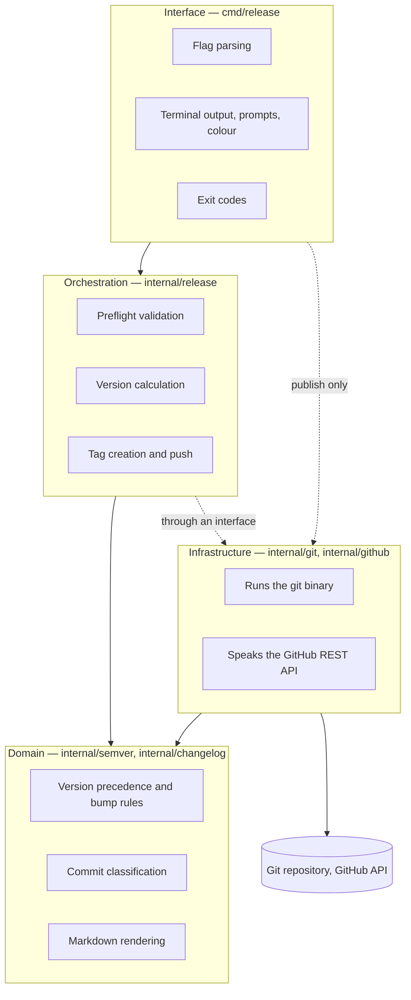

# Architecture

The system is six packages behind one binary. This document states what each one
owns, the rule that keeps them apart, and where to add code.

## The dependency rule

Dependencies point inwards, towards code that does nothing but compute.

Three properties follow, and they are what make the system testable:

- **The domain has no I/O.** `internal/semver` and `internal/changelog` import
  nothing from `os`, `os/exec`, or `net/http`. They can be reasoned about, and
  tested, in isolation.
- **The orchestrator depends on an interface, not on Git.** `release.Git` is
  declared where it is *used*, not where it is implemented. `*git.Repo`
  satisfies it; so does an in-memory fake, which is how `release_test.go`
  exercises the entire validate-plan-apply flow without a repository on disk.
- **Infrastructure carries no policy.** `internal/git` does not know what a
  version is. `internal/github` does not know that re-running a workflow should
  replace an asset — that decision lives in the CLI.

## Package responsibilities

```mermaid
flowchart LR
    subgraph sv["internal/semver"]
        sv1["Parse and validate"]
        sv2["Compare by precedence"]
        sv3["Bump: major, minor, patch"]
        sv4["Pre-release series"]
    end

    subgraph cl["internal/changelog"]
        cl1["Parse Conventional Commits"]
        cl2["Detect breaking changes"]
        cl3["Group into categories"]
        cl4["Count release statistics"]
        cl5["Render through text/template"]
        cl6["Insert into CHANGELOG.md"]
    end

    subgraph gt["internal/git"]
        gt1["Repository, branch, status"]
        gt2["List and create tags"]
        gt3["Read the commit range"]
        gt4["Push, parse the remote URL"]
    end

    subgraph gh["internal/github"]
        gh1["Get, create, update a release"]
        gh2["List, delete, upload assets"]
    end

    subgraph rl["internal/release"]
        rl1["Check: repo, branch, clean tree"]
        rl2["Plan: previous tag to next version"]
        rl3["Apply: tag, then push"]
        rl4["Snapshot: describe an existing tag"]
    end

    subgraph cm["cmd/release"]
        cm1["major, minor, patch, check"]
        cm2["notes, changelog, publish"]
    end

    cm1 --> rl
    cm2 --> rl
    cm2 --> gh
    rl --> sv
    rl --> cl
    rl --> gt
    cl --> sv
```

| Package | Owns | Must never |
| --- | --- | --- |
| `internal/semver` | The Semantic Versioning 2.0.0 grammar, precedence, and increment rules | Know about Git, tags, or files |
| `internal/changelog` | Conventional Commits parsing, categories, statistics, contributors, the summary, Markdown rendering | Shell out, or read files other than a template |
| `internal/git` | Every invocation of the `git` binary | Know what a version is |
| `internal/github` | The GitHub REST calls a release needs | Decide when to create versus update |
| `internal/release` | Release policy: what is valid, which version is next, what a failure means | Format terminal output, or choose a glyph |
| `cmd/release` | Flags, prompts, glyphs, tables, wrapping, exit codes | Contain version arithmetic |

Within `cmd/release` the same split holds once more: `report.go` knows how the
release *looks*, and `cut.go` knows what a release *does*. Every print function
takes data already computed by `internal/release` or `internal/changelog`, which
is why the whole report can be exercised against golden files without a
repository, a terminal, or a clock.

## Key design decisions

**One binary, both halves.** The developer's terminal and the CI runner run the
same code. A version rule cannot drift between the thing that tags and the thing
that documents, because there is only one implementation.

**Numeric identifiers compare by length, then lexically.** Pre-release
identifiers may exceed `uint64`. Because leading zeros are rejected at parse
time, a longer digit string is always the larger number, so comparison cannot
overflow.

**`git tag` runs with `--cleanup=verbatim`.** Release notes are Markdown, and
Git's default cleanup mode deletes any line beginning with `#`, which would
silently strip every heading from the annotated tag's message.

**Unparseable tags are ignored, not fatal.** Repositories accumulate unrelated
tags. One of them should not block every future release, so
`taggedVersions` skips what it cannot parse.

**The previous tag is found by precedence, not creation time.** Tags are
routinely created out of order — a patch on an old branch, a candidate before a
release. `predecessorOf` sorts by rank, so the commit range is always correct.

**Repository links degrade rather than fail.** A repository with no usable
remote still gets a changelog, just without hyperlinks. Rendering never blocks a
release.

**Errors explain themselves, without giving up classification.**
`release.Error` carries what happened, why, and how to fix it, and formats
itself across several lines. It wraps a sentinel and implements `Unwrap`, so
`errors.Is(err, ErrTagExists)` still works: the prose is for the person, the
sentinel is for the program.

**Statistics are derived from the same classification as the notes.** They read
the same `Groups`, so the numbers cannot disagree with the sections above them.
`TestStatisticsMatchesGroups` pins that.

**The health report describes; it does not decide.** `Service.Health` returns a
`[]Check` and never an error for a condition it can name, so the CLI shows every
problem at once instead of stopping at the first. `Plan` still refuses to
release from a dirty tree — `Health` is the report that explains why, before it
happens. A `Check` carries a `Level`, not a glyph: the CLI chooses how to draw
it.

**Confidence is derived, timing is measured, and the summary is counted.** None
of the three is invented. Five stars means every check passed; each warning
costs one. The timing section reports elapsed time, never an estimate, because a
confidently wrong prediction is worse than no number. And `changelog.Summary`
reads only the commit counts — no commit text reaches it, so it cannot describe
a release inaccurately.

**Terminal width comes from an `ioctl`, behind a build tag.** It is the one
place the tool reaches past the portable standard library. The alternative,
`golang.org/x/term`, would be the project's only third-party dependency, for
twenty lines of code. Platforms without the syscall fall back to `COLUMNS`, and
then to eighty columns.

## Extending the system

**A new changelog category, or an existing one hidden.** `DefaultCategories()`
in `internal/changelog` is data. Reorder it, add a `Category`, or set `Hidden`.
Commit types claimed by no category fall through to the catch-all — the category
that declares the empty type — so a new type can never silently vanish. Nothing
else in the package needs to change: grouping, statistics, and rendering all
read the same list.

**A different release-notes layout.** `RenderNotes` executes a `text/template`
against `changelog.Data`. Pass `--template notes.tmpl` to override it per
invocation, or replace `DefaultNotesTemplate`. `Data` is the contract, and it is
documented field by field in `render.go`.

**A different tag scheme.** `--tag-prefix` already handles `release-1.2.3`.
Nothing else in the codebase assumes the `v`.

**A forge that is not GitHub.** `internal/github` is the only package that knows
the REST API, and `changelog.Repository` is the only place that builds URLs.
Implement the same three calls elsewhere and `publish` is the only command that
changes.

**A new validation.** Add it to `Service.Check`, define a sentinel error beside
`ErrDirtyWorkTree`, and add a method to the `Git` interface if it needs new
repository state. The fake in `release_test.go` will tell you immediately what
you broke.

**A different confirmation policy, or none.** Prompting lives in `cmd/release`
and is skipped when stdin is not a terminal. The orchestrator never asks
questions.
