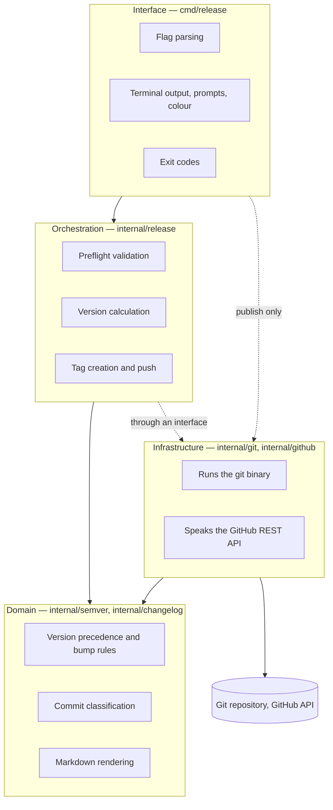

# Architecture

The system is six packages behind one binary. This document states what each one
owns, the rule that keeps them apart, and where to add code.

## The dependency rule

Dependencies point inwards, towards code that does nothing but compute.

Three properties follow, and they are what make the system testable:

- **The domain has no I/O.** `internal/semver` and `internal/changelog` import
  nothing from `os`, `os/exec`, or `net/http`. They can be reasoned about, and
  tested, in isolation.
- **The orchestrator depends on an interface, not on Git.** `release.Git` is
  declared where it is *used*, not where it is implemented. `*git.Repo`
  satisfies it; so does an in-memory fake, which is how `release_test.go`
  exercises the entire validate-plan-apply flow without a repository on disk.
- **Infrastructure carries no policy.** `internal/git` does not know what a
  version is. `internal/github` does not know that re-running a workflow should
  replace an asset — that decision lives in the CLI.

## Package responsibilities

```mermaid
flowchart LR
    subgraph sv["internal/semver"]
        sv1["Parse and validate"]
        sv2["Compare by precedence"]
        sv3["Bump: major, minor, patch"]
        sv4["Pre-release series"]
    end

    subgraph cl["internal/changelog"]
        cl1["Parse Conventional Commits"]
        cl2["Detect breaking changes"]
        cl3["Group into sections"]
        cl4["Render notes and entries"]
        cl5["Insert into CHANGELOG.md"]
    end

    subgraph gt["internal/git"]
        gt1["Repository, branch, status"]
        gt2["List and create tags"]
        gt3["Read the commit range"]
        gt4["Push, parse the remote URL"]
    end

    subgraph gh["internal/github"]
        gh1["Get, create, update a release"]
        gh2["List, delete, upload assets"]
    end

    subgraph rl["internal/release"]
        rl1["Check: repo, branch, clean tree"]
        rl2["Plan: previous tag to next version"]
        rl3["Apply: tag, then push"]
        rl4["Snapshot: describe an existing tag"]
    end

    subgraph cm["cmd/release"]
        cm1["major, minor, patch, check"]
        cm2["notes, changelog, publish"]
    end

    cm1 --> rl
    cm2 --> rl
    cm2 --> gh
    rl --> sv
    rl --> cl
    rl --> gt
    cl --> sv
```

| Package | Owns | Must never |
| --- | --- | --- |
| `internal/semver` | The Semantic Versioning 2.0.0 grammar, precedence, and increment rules | Know about Git, tags, or files |
| `internal/changelog` | Conventional Commits parsing, section grouping, Markdown rendering, file insertion | Read or write files, or shell out |
| `internal/git` | Every invocation of the `git` binary | Know what a version is |
| `internal/github` | The GitHub REST calls a release needs | Decide when to create versus update |
| `internal/release` | Release policy: what is valid, which version is next, what a tag says | Format terminal output |
| `cmd/release` | Flags, prompts, colour, exit codes | Contain version arithmetic |

## Key design decisions

**One binary, both halves.** The developer's terminal and the CI runner run the
same code. A version rule cannot drift between the thing that tags and the thing
that documents, because there is only one implementation.

**Numeric identifiers compare by length, then lexically.** Pre-release
identifiers may exceed `uint64`. Because leading zeros are rejected at parse
time, a longer digit string is always the larger number, so comparison cannot
overflow.

**`git tag` runs with `--cleanup=verbatim`.** Release notes are Markdown, and
Git's default cleanup mode deletes any line beginning with `#`, which would
silently strip every heading from the annotated tag's message.

**Unparseable tags are ignored, not fatal.** Repositories accumulate unrelated
tags. One of them should not block every future release, so
`taggedVersions` skips what it cannot parse.

**The previous tag is found by precedence, not creation time.** Tags are
routinely created out of order — a patch on an old branch, a candidate before a
release. `predecessorOf` sorts by rank, so the commit range is always correct.

**Repository links degrade rather than fail.** A repository with no usable
remote still gets a changelog, just without hyperlinks. Rendering never blocks a
release.

## Extending the system

**A new changelog section, or a hidden one shown.** `DefaultSections()` in
`internal/changelog` is data. Reorder it, add a `Section`, or flip `Hidden`.
Commit types claimed by no section fall through to the catch-all — the section
that declares the empty type.

**A different tag scheme.** `--tag-prefix` already handles `release-1.2.3`.
Nothing else in the codebase assumes the `v`.

**A forge that is not GitHub.** `internal/github` is the only package that knows
the REST API, and `changelog.Repository` is the only place that builds URLs.
Implement the same three calls elsewhere and `publish` is the only command that
changes.

**A new validation.** Add it to `Service.Check`, define a sentinel error beside
`ErrDirtyWorkTree`, and add a method to the `Git` interface if it needs new
repository state. The fake in `release_test.go` will tell you immediately what
you broke.

**A different confirmation policy, or none.** Prompting lives in `cmd/release`
and is skipped when stdin is not a terminal. The orchestrator never asks
questions.
