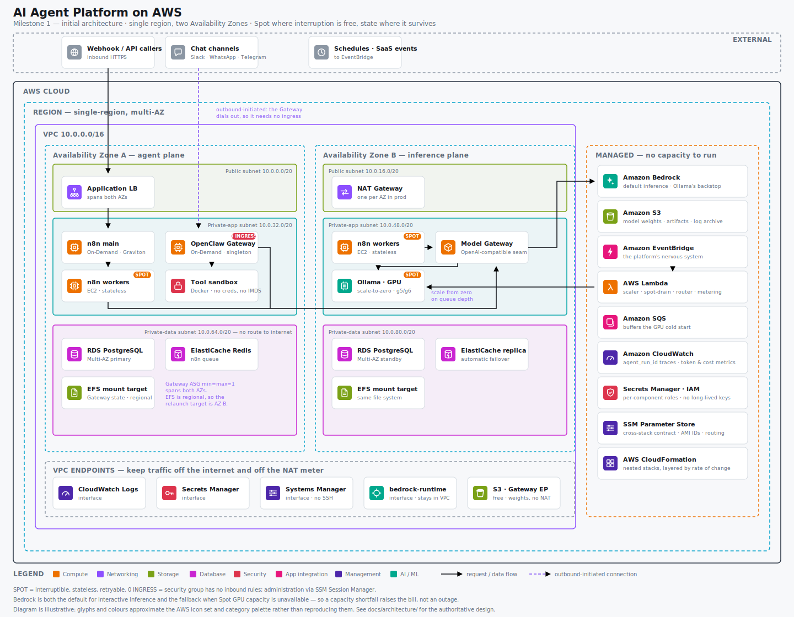
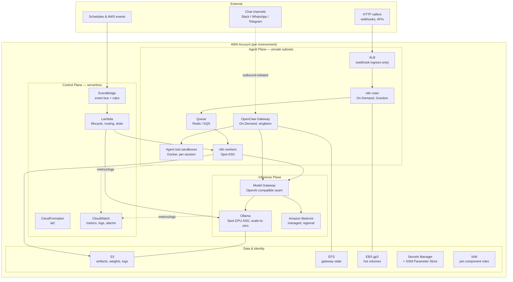

# 1. Architecture Overview

> Initial architecture. Design only; no application implementation.

## 1.1 What we are building

A production-ready platform on AWS for running **autonomous AI agents** and **event-driven AI workflows**, supporting both **managed** inference (Amazon Bedrock) and **self-hosted** inference (Ollama), orchestrated through **n8n** (deterministic workflow automation) and **OpenClaw** (conversational, long-running agent runtime).

The platform is the substrate. Individual agents and workflows are tenants of it, built on top of it later.

## 1.2 The central design problem

It is tempting to treat "an AI agent platform" as one workload and pick one compute model for it. That is the mistake this design exists to avoid.

The platform is **three workloads with opposing operational characteristics**. Almost every important decision in this document follows from separating them:

| | Control Plane | Agent Plane | Inference Plane |
|---|---|---|---|
| **State** | Stateless, config-driven | **Stateful singletons** — sessions, channel device-links, workflow history | Stateless, idempotent per request |
| **Interruption tolerance** | N/A (ephemeral) | **None** — losing state means re-pairing WhatsApp/Signal by hand | **High** — retry the request |
| **Scaling axis** | Event-driven, per-invocation | Vertical; horizontal only for stateless sub-components | Horizontal; **scale to zero** |
| **Latency profile** | Seconds, async | Human-conversational | Bimodal: interactive vs. bulk |
| **Right primitive** | Lambda + EventBridge | On-Demand EC2 + EFS + ASG(min=max=1) | **Spot** EC2 (Ollama) + Bedrock |

**Spot Instances belong where interruption is free. State belongs where it survives.** Once that line is drawn, cost optimisation and high availability stop fighting each other.

Three theses carry the rest of the design:

1. **Separate the planes.** Cheap, interruptible, horizontal compute (inference) is architecturally distinct from expensive, durable, singleton compute (agent runtime). Conflating them forces you to choose between losing sessions and overpaying for GPUs.

2. **The model provider is a seam, not a dependency.** Bedrock and Ollama sit behind a single OpenAI-compatible interface. Provider choice becomes a *routing policy* (cost / latency / data-residency) rather than an architectural commitment. This is also what makes Spot GPUs tolerable: **Bedrock is Ollama's availability backstop.**

3. **An autonomous agent is a confused deputy with a shell.** OpenClaw's own documentation states the security model plainly: *"the agent can do anything you can do."* Prompt injection is therefore not a content-moderation problem, it is a **privilege** problem. We design blast radius, not filters. See [08 — Security](08-security.md).

## 1.3 High-level architecture

### Infrastructure view

Services, subnets, and Availability Zones as deployed:



<sub>Source and regeneration notes: [`diagrams/`](diagrams/README.md). Where this diagram and this document disagree, the document wins.</sub>

### Logical view

The same system, arranged by plane rather than by subnet:



Two details in that diagram are load-bearing and easy to miss:

- **The chat-channel arrow points inward but is dashed.** Most OpenClaw channels (WhatsApp, Signal, Telegram polling, Slack Socket Mode) are **outbound-initiated** long-lived connections. The Gateway therefore needs **no inbound ingress at all** and lives in a private subnet with no security-group ingress rule. This is a significant, and somewhat unusual, security win — see [05 — Network & Boundaries](05-network-and-boundaries.md).
- **Nothing in the Agent Plane talks to Bedrock or Ollama directly.** Everything goes through the Model Gateway seam. See [ADR-0003](../adr/0003-model-gateway-seam.md).

## 1.4 The three planes

### Control Plane — *how the platform manages itself*
Serverless, always-on, near-zero idle cost. EventBridge is the platform's nervous system: schedules, AWS service events (Spot interruption warnings, ASG lifecycle hooks, S3 object-created), and internal domain events all land on a bus. Lambda functions react — scaling the inference fleet from zero, draining an interrupted Spot worker, rotating a credential, publishing a cost metric.

The control plane never sits on a request's critical path for inference. It manages, it does not serve.

### Agent Plane — *where agents think and act*
Two complementary runtimes, deliberately not merged:

- **n8n** — deterministic, inspectable, DAG-shaped automation. Good when the steps are known in advance and auditability matters. Runs in queue mode: a stateful `main` process plus stateless workers.
- **OpenClaw** — a long-running Gateway process that owns chat sessions, routing and channel connections, and drives an LLM agent that can execute shell commands, browse, and touch files. Good when the steps are *not* known in advance.

n8n is the platform's *conveyor belt*; OpenClaw is its *operator*. Workflows call agents; agents trigger workflows.

### Inference Plane — *where tokens are produced*
- **Bedrock** — default for interactive and production traffic. No cold start, no capacity management, IAM-native, pay per token.
- **Ollama on Spot GPUs** — for bulk/async, privacy-sensitive, or high-volume workloads where per-token cost at scale beats managed pricing. Scales to zero when idle.

The split is driven by latency tolerance, not ideology:

```
interactive / low-latency / spiky   ->  Bedrock       (no cold start, pay per token)
bulk / async / sustained / private  ->  Ollama on Spot (cheap at volume, scale to zero)
Ollama capacity unavailable         ->  fall back to Bedrock
```

## 1.5 Architecture principles and how they are honoured

| Principle (from the brief) | How this architecture delivers it |
|---|---|
| Modular and loosely coupled | Three planes with explicit contracts; EventBridge for async decoupling; Model Gateway seam isolates providers |
| Production-ready | Multi-AZ, IaC-only, least-privilege IAM, defined RTO/RPO, runbooks, SLOs |
| Favour Infrastructure as Code | CloudFormation nested stacks layered by rate of change ([ADR-0007](../adr/0007-cloudformation-stack-layering.md)) |
| Minimise operational cost | Spot for all interruptible compute, scale-to-zero inference, Graviton, S3 Gateway Endpoint to avoid NAT charges ([09 — Cost](09-cost.md)) |
| Minimise EC2 startup time | Golden AMIs with pre-baked container images and model weights; pre-staged EBS snapshots; warm pools **where Spot allows** ([ADR-0006](../adr/0006-startup-time-strategy.md)) |
| Support event-driven workloads | EventBridge as first-class bus; SQS-buffered work; Lambda reactors |
| Managed **and** self-hosted models | Bedrock + Ollama behind one interface ([ADR-0004](../adr/0004-inference-routing-policy.md)) |
| Support autonomous agents | OpenClaw Gateway with sandboxed tool execution and egress allowlists |
| Easy to monitor, secure, maintain | Agent-run-ID trace propagation, per-agent cost attribution, SSM Session Manager (no SSH, no bastion) |
| New providers with minimal change | Add an adapter behind the Model Gateway; callers unchanged ([11 — Extensibility](11-extensibility.md)) |

## 1.6 What this design deliberately does not do

- No workflows, agents, prompts, or business logic.
- No CloudFormation templates — the *stack decomposition* is specified ([06 — Deployment](06-deployment.md)); the templates come with implementation.
- The Model Gateway is **specified as an interface now, built later**. Defining the seam early costs nothing and prevents a painful rewiring once agents depend on providers directly. Callers can point at Bedrock via the same contract on day one.

## 1.7 Reading order

| Doc | Answers |
|---|---|
| [02 — Components](02-components.md) | What each piece is responsible for, what state it holds, how it fails |
| [03 — AWS Services](03-aws-services.md) | Which services, why, and what was rejected |
| [04 — Flows](04-flows.md) | How a request and an event actually move through the system |
| [05 — Network & Boundaries](05-network-and-boundaries.md) | VPC, subnets, trust boundaries, account strategy |
| [06 — Deployment](06-deployment.md) | IaC layering, AMI pipeline, promotion |
| [07 — Scalability & HA](07-scalability-and-ha.md) | Scaling axes, Spot strategy, RTO/RPO |
| [08 — Security](08-security.md) | IAM, secrets, and the agent-specific threat model |
| [09 — Cost](09-cost.md) | Cost model, levers, worked estimate, cost traps |
| [10 — Operations](10-operations.md) | Observability, runbooks, SLOs |
| [11 — Extensibility](11-extensibility.md) | Where to extend, and how the architecture evolves |
| [12 — Risks](12-risks-assumptions-constraints.md) | Assumptions, constraints, risk register |
| [ADRs](../adr/) | The decisions, their alternatives, and their consequences |
