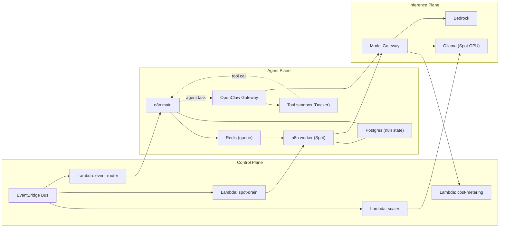

# 2. Component Responsibilities

Each component is specified by: **responsibility**, **state it owns**, **interfaces**, **failure mode**, and **why it runs where it runs**. The failure-mode column is the one that determines compute placement — see [07 — Scalability & HA](07-scalability-and-ha.md).

## 2.1 Component map

---

## 2.2 Agent Plane

### n8n `main`

| | |
|---|---|
| **Responsibility** | Owns workflow definitions, scheduling, webhook ingress, and enqueueing executions. The control point for deterministic automation. |
| **State owned** | Workflow definitions, credentials (encrypted), execution history — persisted in Postgres, **not** on the instance. Holds the n8n encryption key. |
| **Interfaces** | Inbound HTTPS via ALB (webhooks, editor UI). Outbound to Postgres, Redis, Model Gateway. |
| **Failure mode** | Webhook ingress stops; scheduled triggers stop; **in-flight worker executions continue**. Recovery is process restart, not data recovery — state is external. |
| **Placement** | On-Demand EC2, Graviton (`m7g`/`c7g`). Behind an ALB across two AZs. |
| **Why not Spot** | It is the ingress point. A 2-minute interruption notice cannot be absorbed by an inbound webhook that has already been accepted. |

n8n runs in **queue mode**, which separates the stateful `main` process from stateless execution workers. This is the single configuration choice that makes n8n Spot-compatible at all.

> **Verify at implementation:** queue mode's exact broker requirements (Redis/Bull) and whether dedicated *webhook processor* instances are warranted at our traffic volume. Confirm against current n8n docs in Milestone 2.

### n8n `worker`

| | |
|---|---|
| **Responsibility** | Executes workflow nodes pulled from the queue. Pure compute. |
| **State owned** | **None.** Everything durable lives in Postgres or S3. |
| **Interfaces** | Redis (pull), Postgres (write results), Model Gateway, S3, AWS APIs via IAM role. |
| **Failure mode** | Interrupted execution is retried by another worker. Requires workflow steps to be **idempotent or compensating** — a platform constraint, documented in [12 — Constraints](12-risks-assumptions-constraints.md). |
| **Placement** | **Spot** ASG, mixed instance types, multiple AZs, `capacity-optimized-prioritized` allocation. Scales on queue depth. |

### OpenClaw Gateway

The most operationally awkward component in the platform, and the one that most constrains the design.

| | |
|---|---|
| **Responsibility** | Long-running Node.js process. Single source of truth for chat **sessions**, message **routing**, and **channel connections**. Drives the agent loop and dispatches tool calls. |
| **State owned** | `~/.openclaw/openclaw.json` (config), workspace directory, session history, and — critically — **channel device-links**. A WhatsApp or Signal pairing is a device registration, not a token. |
| **Interfaces** | **Outbound** to chat platforms. Control UI binds to `127.0.0.1:18789` (loopback — never exposed). Outbound to Model Gateway. Spawns sandbox containers via the local Docker socket. |
| **Failure mode** | Total conversational outage. If the state volume is lost, channels must be **re-paired by a human**, by scanning QR codes. This is unrecoverable by automation. |
| **Placement** | On-Demand EC2, ASG `min=max=1`. State on **EFS**, not EBS. |

Three consequences fall directly out of that table:

1. **It is a singleton.** Channel device-links cannot be trivially made active-active; two Gateways sharing one WhatsApp pairing is undefined behaviour. HA is therefore **fast recovery**, not active-active. See [ADR-0009](../adr/0009-openclaw-gateway-singleton.md).
2. **Its state must survive an AZ.** EBS volumes are AZ-bound; if the AZ fails, an EBS-backed Gateway cannot be relaunched elsewhere without a snapshot restore (minutes, and lossy). EFS is regional and mounts from any AZ. We pay EFS's latency and cost to buy cross-AZ recovery of unrecoverable-by-automation state. That is a good trade.
3. **No inbound ingress is required.** Because channels are outbound-initiated and the Control UI is loopback-bound, the Gateway's security group has **zero ingress rules**. Administration is via SSM Session Manager and an SSM port-forward to `18789`.

### Agent tool sandbox

| | |
|---|---|
| **Responsibility** | Executes agent-issued shell commands, file operations, and browsing — **isolated from the Gateway host**. |
| **State owned** | Ephemeral `/workspace` per scope (per-agent, per-session, or shared). |
| **Interfaces** | Spawned by the Gateway as sibling Docker containers via the host Docker socket. Network egress via a deny-by-default allowlist. |
| **Failure mode** | Contained. A compromised sandbox should not reach the Gateway, the instance credentials, or the VPC data tier. |
| **Placement** | Same instance as the Gateway (sibling containers), with resource limits and no instance-profile credential access (IMDS blocked). |

This is the primary containment boundary for prompt injection. It is elaborated in [08 — Security](08-security.md) and is not optional.

### Postgres (n8n) and Redis (queue)

Neither is in the brief's technology list. Both are required by n8n's queue mode, and hand-rolling them on EC2 would add stateful, backup-bearing components with no upside.

**Recommendation: Amazon RDS for PostgreSQL (Multi-AZ)** and **ElastiCache for Redis**, or **Aurora Serverless v2** where the workload is spiky. Rationale and the alternative of self-hosting are recorded in [ADR-0008](../adr/0008-n8n-queue-mode-managed-datastores.md). This is a deliberate, flagged extension beyond the listed scope; the brief invites incorporating listed technologies "where appropriate," not restricting the design to them.

For non-production environments, a single container-hosted Postgres on the `main` instance is acceptable and materially cheaper.

---

## 2.3 Inference Plane

### Model Gateway *(interface now, implementation later)*

| | |
|---|---|
| **Responsibility** | One OpenAI-compatible endpoint (`POST /v1/chat/completions`) fronting every model provider. Applies routing policy, per-agent budget enforcement, fallback, and token metering. |
| **State owned** | None on the request path. Emits metrics; reads policy from SSM Parameter Store. |
| **Interfaces** | Inbound from n8n workers and OpenClaw. Outbound to Bedrock (`bedrock-runtime` VPC endpoint) and to Ollama's ALB. |
| **Failure mode** | **This is a new single point of failure on the hot path** — an honest cost of the abstraction. Mitigated by running it stateless and horizontally scaled, and by allowing callers to fall back to Bedrock directly via the identical contract. |
| **Placement** | Stateless; ECS Fargate or a small On-Demand ASG behind an internal ALB. |

Why it earns its place, despite the added hop:

- **Provider extensibility.** Adding Anthropic direct, OpenAI, or a new Bedrock model is an adapter change, not a change to every workflow and agent. This is the explicit "add future AI providers with minimal architectural changes" requirement.
- **Availability.** It is what allows Ollama to run on Spot GPUs: when Spot capacity is unavailable, the Gateway routes to Bedrock. **Bedrock is the backstop that makes the cheap path safe.**
- **Cost control.** An autonomous agent in a retry loop is a financial incident. Central token metering and per-agent budget circuit-breakers live here and nowhere else.

What it costs: one extra network hop (single-digit ms, internal), one more component to operate, and a hot-path dependency.

The seam is defined in Milestone 1; the router is built once a second provider or a budget breach justifies it ([ADR-0003](../adr/0003-model-gateway-seam.md)). Until then, callers speak the same contract directly to Bedrock.

### Ollama (self-hosted inference)

| | |
|---|---|
| **Responsibility** | Serves open-weight models on GPU for bulk, async, sustained, or data-residency-constrained inference. |
| **State owned** | None. Model weights are **read-only artifacts**, not state. |
| **Interfaces** | HTTP behind an internal ALB. Weights pulled from **S3**, never from the public internet. |
| **Failure mode** | Request fails or Spot capacity is unavailable → Model Gateway routes to Bedrock. Degradation is a **cost** event, not an outage. |
| **Placement** | **Spot** GPU ASG (`g5`/`g6` families), diversified across instance types and AZs, **scaling to zero** when the queue is empty. |

The design problem here is cold start: a GPU instance that must download tens of gigabytes of weights at boot takes minutes. The strategy is layered — golden AMI with weights baked in, plus a pre-staged EBS snapshot for larger models, plus S3 (via Gateway Endpoint) rather than internet pulls. **Warm pools are not available**, because ASG warm pools do not support Spot Instances. That constraint is real and shapes [ADR-0006](../adr/0006-startup-time-strategy.md).

### Amazon Bedrock (managed inference)

| | |
|---|---|
| **Responsibility** | Default inference for interactive and production traffic. Also the fallback target for the entire self-hosted path. |
| **State owned** | None. |
| **Interfaces** | `bedrock-runtime` **interface VPC endpoint** — inference traffic never traverses the internet or the NAT Gateway. |
| **Failure mode** | Regional service; throttling is the realistic failure. Handle with retries, cross-region inference profiles, and backpressure. |
| **Placement** | Managed. No capacity to run, no cold start, no patching. |

Bedrock Guardrails apply on this path and are the appropriate place for content-safety controls — as distinct from the *privilege* controls that contain prompt injection.

---

## 2.4 Control Plane

| Component | Responsibility | Triggered by |
|---|---|---|
| **EventBridge bus** | The platform's nervous system. Carries AWS service events, schedules, and internal domain events (`agent.run.started`, `agent.budget.exceeded`). | — |
| **Lambda: `scaler`** | Scales the Ollama ASG from zero on queue depth; scales back to zero after an idle period. | SQS depth alarm, schedule |
| **Lambda: `spot-drain`** | On a Spot interruption warning, deregisters the instance from its target group, signals the n8n worker to stop pulling, and requeues in-flight work. | `EC2 Spot Instance Interruption Warning` |
| **Lambda: `event-router`** | Translates external and AWS events into n8n executions or OpenClaw agent tasks. | EventBridge rules |
| **Lambda: `cost-metering`** | Aggregates token usage per agent-run into CloudWatch, drives budget alarms and circuit-breakers. | Model Gateway emissions |
| **CloudFormation** | The only mechanism by which infrastructure changes. | CI/CD |
| **CloudWatch** | Metrics, logs, alarms, dashboards, and the agent-run trace index. | — |

The control plane has near-zero idle cost, which matters: the platform must be cheap to *own*, not just cheap to *run under load*.

---

## 2.5 Statefulness summary

This table is the compressed form of the entire compute-placement argument.

| Component | Durable state | Interruptible? | Compute |
|---|---|---|---|
| n8n `main` | External (Postgres) | No — ingress point | On-Demand, Graviton |
| n8n `worker` | None | **Yes** | **Spot** |
| OpenClaw Gateway | **Yes — unrecoverable by automation** | **No** | On-Demand, singleton, EFS |
| Tool sandbox | Ephemeral | Yes | Co-located, containerised |
| Model Gateway | None | Yes (stateless, replaceable) | Fargate / On-Demand |
| Ollama | None (weights are artifacts) | **Yes** | **Spot GPU, scale-to-zero** |
| Bedrock | N/A | N/A | Managed |
| Lambda / EventBridge | None | N/A | Serverless |
| Postgres / Redis | **Yes** | No | Managed (RDS / ElastiCache) |

Read the "unrecoverable by automation" cell as the reason OpenClaw is the most expensive box on the diagram. Everything else can be thrown away and rebuilt.
