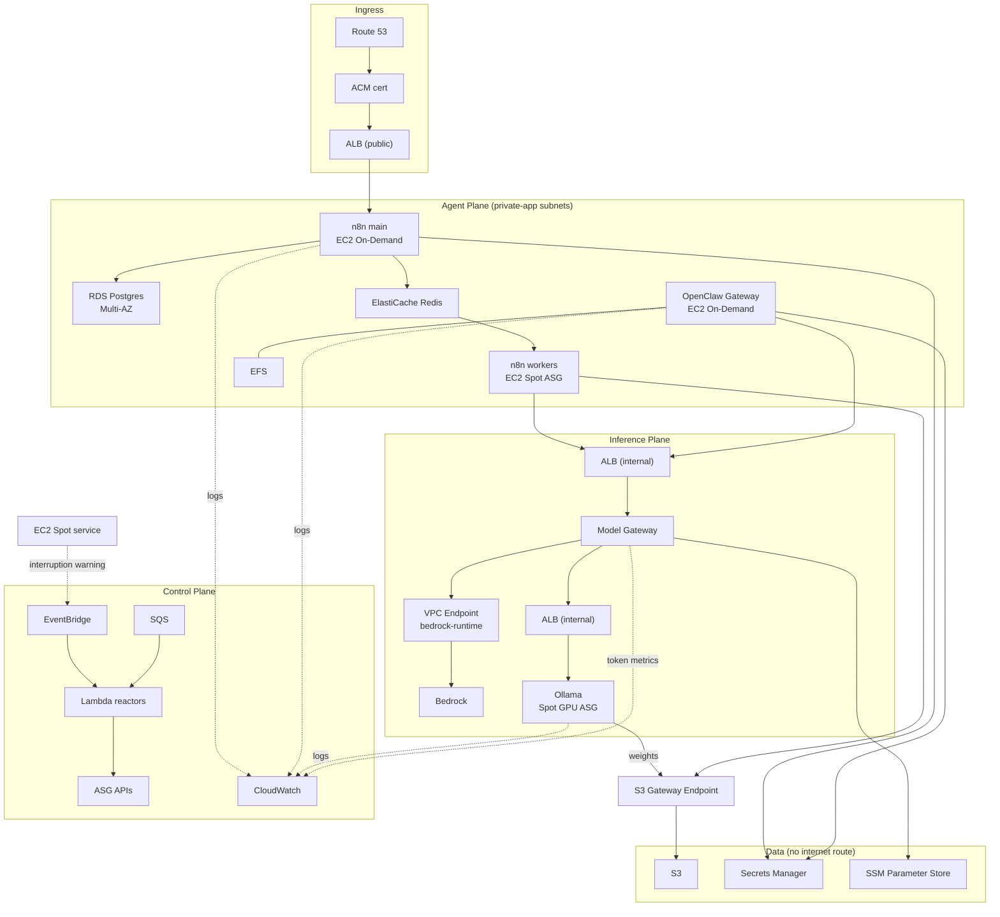

# 3. AWS Services: Selection and Interaction

For each service: what it does here, **why it was chosen**, and **what was rejected**. Services outside the brief's list are marked ⚠ and justified.

## 3.1 Service selection

### Compute

| Service | Role | Why | Rejected alternative |
|---|---|---|---|
| **EC2 Spot** | n8n workers; Ollama GPU inference | 60–90% discount on the only workloads that tolerate interruption. Both are stateless and retryable. | *On-Demand for workers*: 3–5× cost for no benefit — the work is idempotent and requeueable. |
| **EC2 On-Demand** | n8n `main`, OpenClaw Gateway, Model Gateway | Interruption is not absorbable: one is an HTTP ingress point, one holds unrecoverable session state. | *Spot for the Gateway*: a 2-minute notice cannot cover EFS-backed state handover, and repeated interruptions would repeatedly break channel sessions. |
| **AWS Lambda** | Control-plane reactors: scaling, Spot drain, event routing, cost metering | Event-shaped, bursty, near-zero idle cost. Nothing here is long-running. | *Running control logic on the EC2 fleet*: couples the platform's ability to heal to the health of the thing being healed. |
| ⚠ **ECS Fargate** | Model Gateway (optional) | Stateless HTTP service; no host to patch. | *EC2 ASG*: also fine. Fargate chosen for lower operational surface; the decision is reversible. |

**Why EC2 rather than EKS for the agent plane.** Kubernetes would give scheduling and bin-packing, and a real answer for the sandbox problem. It would also add a control plane to run, a networking model to secure, and a body of expertise to maintain — for a platform whose agent plane is *two long-lived processes and one autoscaling worker pool*. EC2 + ASG + golden AMIs is the smaller total system. Revisit when the agent plane exceeds roughly a dozen distinct services ([11 — Extensibility](11-extensibility.md)).

**Why not Lambda for inference or agents.** The 15-minute execution ceiling and absence of GPU support rule out both Ollama and long-running agent loops. Lambda is control plane here, not data plane.

### Networking

| Service | Role | Why |
|---|---|---|
| **Amazon VPC** | Three-tier private network across 2+ AZs | Isolation boundary. Agent workloads execute untrusted-influenced code; they do not belong on a public subnet. |
| **ALB** | Webhook/editor ingress (public); Ollama and Model Gateway (internal) | TLS termination, health checks, target-group draining that integrates with Spot interruption handling. |
| **NAT Gateway** | Egress for private subnets | Required for chat-platform outbound connections and OS/package pulls. **A significant cost line** — see below. |
| **VPC Endpoints** | S3 (Gateway), plus interface endpoints for `bedrock-runtime`, SSM, Secrets Manager, CloudWatch Logs, ECR | Keeps inference and control traffic off the internet *and* off the NAT Gateway's per-GB meter. |

The **S3 Gateway Endpoint is free** and removes model-weight pulls and artifact writes from NAT data-processing charges. Given that Ollama nodes pull tens of gigabytes of weights, routing that through NAT would be a self-inflicted cost wound. This is the single highest-leverage networking decision in the design.

Interface endpoints are *not* free (hourly + per-GB). We add them where they pay for themselves — `bedrock-runtime` above all, since every token of inference traffic would otherwise cross the NAT.

### Storage

| Service | Role | Why | Rejected |
|---|---|---|---|
| **S3** | Model weights, agent artifacts, workflow exports, log archive, backups, CloudTrail | Durable, cheap, endpoint-accessible. Weights are read-only artifacts, and S3 is the correct home for artifacts. | *Pulling weights from the internet at boot*: slow, unmetered, and a supply-chain exposure. |
| **EBS gp3** | Root volumes; n8n `main` hot volume; pre-staged Ollama weight volumes | Baseline 3,000 IOPS / 125 MB/s decoupled from size — `gp2` charges you capacity to buy IOPS. | *gp2*: strictly worse economics. |
| ⚠ **EFS** | OpenClaw Gateway config, workspace, session state | **Regional, not AZ-bound.** This is the whole reason it is here: it lets the singleton Gateway relaunch in a surviving AZ without a snapshot restore. | *EBS*: AZ-bound. An AZ failure would force a lossy snapshot restore of state that cannot be re-derived. |
| **EBS Snapshots + DLM** | Backup of `main` and pre-staged weight volumes | Automated lifecycle, cross-region copy for DR. | — |

**On EFS's cost.** EFS is more expensive per GB and slower per operation than EBS. The Gateway's state is small (config, sessions, workspace) and not IOPS-hungry; hot scratch stays on instance storage. We are buying cross-AZ recoverability for state whose loss requires a human with a phone to re-scan QR codes. Worth it.

### Identity, config, secrets

| Service | Role |
|---|---|
| **IAM** | Per-component roles; instance profiles; no long-lived access keys anywhere. Bedrock access scoped to **specific model ARNs**, not `bedrock:*`. |
| ⚠ **Secrets Manager** | n8n encryption key, channel tokens, provider API keys. Rotation supported. |
| ⚠ **SSM Parameter Store** | Non-secret config, golden AMI IDs, cross-stack outputs, Model Gateway routing policy |
| ⚠ **SSM Session Manager** | Administrative access. **No SSH, no bastion, no port 22 anywhere.** |

Using SSM Parameter Store as the cross-stack contract — instead of CloudFormation Exports — is a deliberate decoupling decision with real consequences for how the stacks can be updated. See [ADR-0007](../adr/0007-cloudformation-stack-layering.md).

### Events, orchestration, observability

| Service | Role |
|---|---|
| **EventBridge** | Central bus. AWS service events (Spot interruption, ASG lifecycle, S3 object-created), schedules, and internal domain events. |
| ⚠ **SQS** | Durable work buffer in front of the scale-to-zero inference fleet, and the requeue target for drained Spot workers. |
| **CloudWatch** | Metrics, Logs, Alarms, Dashboards. Embedded Metric Format for per-agent token and cost metrics. |
| ⚠ **CloudTrail** | Audit. Non-negotiable given agents hold IAM credentials. |
| ⚠ **EC2 Image Builder** | Golden AMI pipeline: build → test → distribute → publish AMI ID to SSM. |

**Why SQS in addition to EventBridge.** EventBridge routes and fans out; it does not hold a backlog you can measure. Scale-to-zero needs a **queue depth** to scale on and a durable buffer to absorb requests during the ~2–4 minute GPU cold start. EventBridge delivers the event; SQS holds the work. They are not substitutes.

### Infrastructure as Code

**CloudFormation**, per the brief. Nested stacks, layered by rate of change.

The honest trade-off: CDK or Terraform offer better ergonomics — loops, types, composition — and CloudFormation's error messages and drift behaviour are weak. CloudFormation wins here on **zero additional state management** (no Terraform state backend to secure and lock), native drift detection, and native change sets. For a platform whose whole thesis is minimising operational surface, that matters. CDK remains available later as a *generator* of CloudFormation without invalidating this decision.

---

## 3.2 Service interaction map

How the services actually wire together, by concern:

## 3.3 Explicit non-selections

| Not used | Why not |
|---|---|
| **EKS / ECS for the whole platform** | Control-plane overhead exceeds the benefit at this component count. Fargate used only for the stateless Model Gateway. |
| **SageMaker endpoints** | Overlaps Bedrock (managed) and Ollama (self-hosted) without displacing either; adds a third inference operating model. Reconsider for custom fine-tuned models ([11 — Extensibility](11-extensibility.md)). |
| **Step Functions** | n8n *is* the workflow orchestrator. Two orchestrators is one too many. Step Functions is a reasonable choice for *control-plane* sagas if Lambda reactors grow stateful. |
| **API Gateway** | ALB already fronts n8n and supports the required paths. API Gateway earns its place when we need per-consumer throttling, API keys, and usage plans — a later concern. |
| **AWS Batch** | Overlaps the SQS + Spot ASG pattern already needed for scale-to-zero inference. |
| **Bedrock Agents / Knowledge Bases** | Would duplicate OpenClaw's agent loop and n8n's orchestration. Deliberately kept as an *option behind the Model Gateway seam*, not a foundation. |

## 3.4 Facts to re-verify at implementation

Constraints below are load-bearing and were confirmed during design. Cloud pricing and limits move; re-check before implementation.

- **ASG warm pools do not support Spot Instances.** They now support mixed-instances policies for *On-Demand* types only (Nov 2025). This eliminates warm pools as a cold-start strategy for the Ollama Spot fleet and is the reason [ADR-0006](../adr/0006-startup-time-strategy.md) leans on baked AMIs and pre-staged snapshots instead.
- **EBS Fast Snapshot Restore is billed per snapshot, per AZ, per hour** (≈ $0.75/DSU-hour, ≈ $540/month per snapshot per AZ). It is a cold-start accelerator with a standing cost, not a free optimisation. Enable selectively; see [09 — Cost](09-cost.md).
- **Bedrock batch inference pricing and prompt-caching discounts** — assumed materially cheaper than on-demand token pricing for bulk workloads. *Not independently re-verified during design.* Confirm current rates before relying on the bulk-routing economics in [09 — Cost](09-cost.md).
- **n8n queue-mode broker requirements** — assumed Redis-backed with stateless workers. Confirm against current n8n documentation before finalising the worker ASG design.
