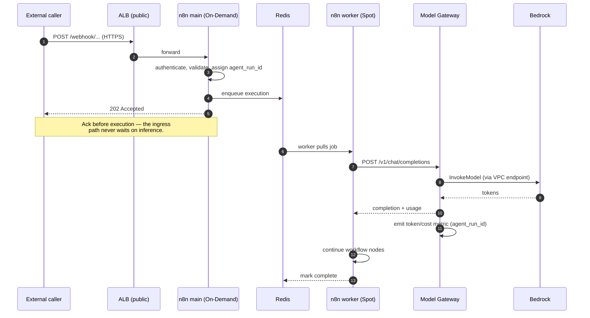
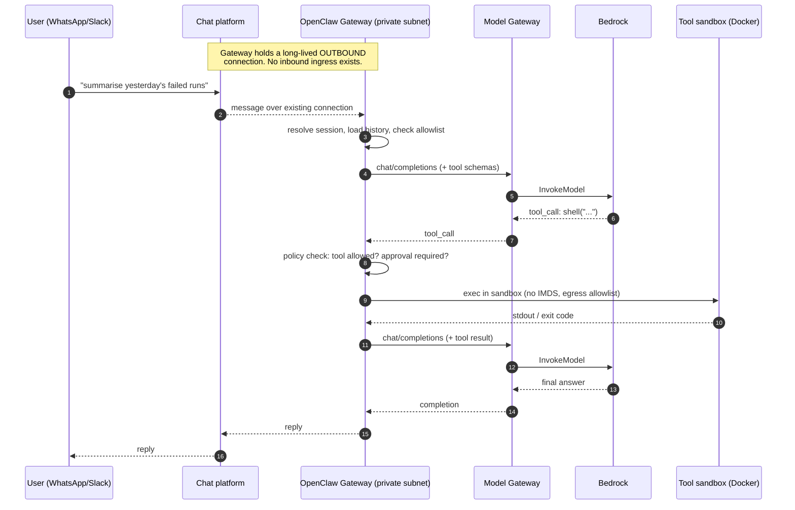
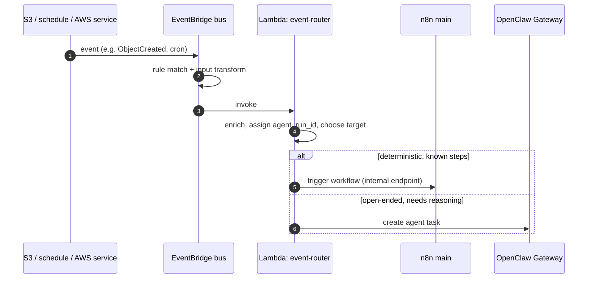
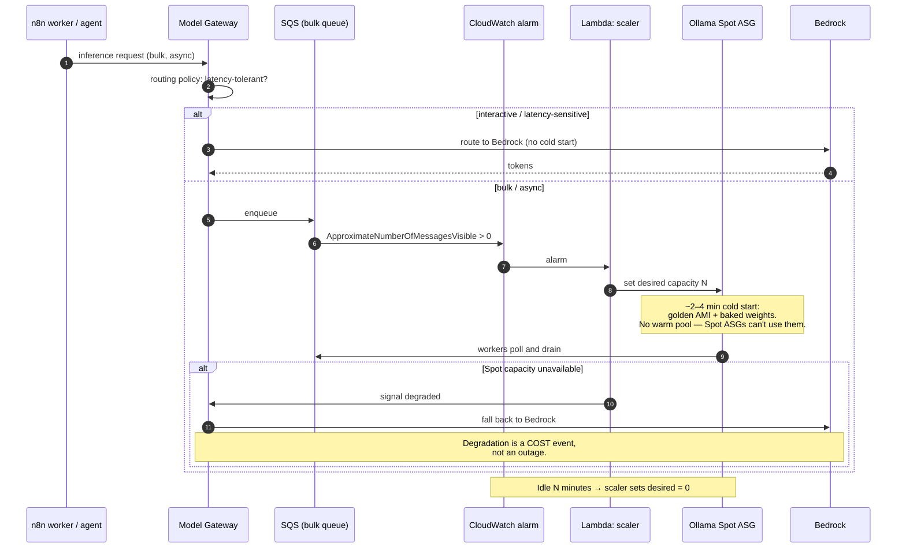
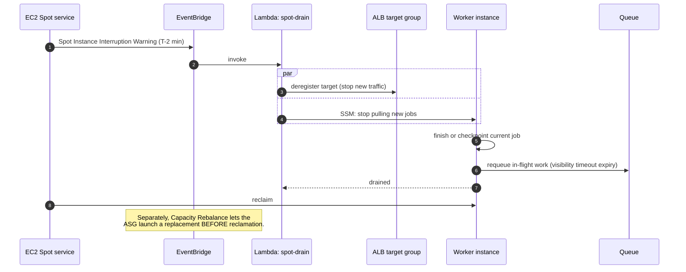

# 4. Request and Event Flows

Five flows define the platform's runtime behaviour. Flows 4.4 and 4.5 are the ones that make the cost model safe; they deserve as much attention as the happy paths.

## 4.1 Inbound webhook → deterministic workflow

The classic n8n path. Synchronous acknowledgement, asynchronous execution.



**Why acknowledge at step 5, before any inference happens.** Inference latency is unbounded and Spot workers are interruptible. Coupling an HTTP caller's connection to either would make the platform's availability a function of GPU spot capacity. The 202 decouples them. Callers that need a result poll or receive a callback.

**Where it can fail.** If the worker is interrupted mid-execution, the job returns to the queue and another worker retries it. This only works if workflow steps are **idempotent or compensating** — a constraint the platform imposes on its tenants, not a property it provides ([12 — Constraints](12-risks-assumptions-constraints.md)).

## 4.2 Chat message → autonomous agent → tool execution

The OpenClaw path. Note there is no ingress: the Gateway dialled out.



**Step 6 is the security boundary of the entire platform.** The model has just been asked, by text that may have originated from an untrusted source, to run a shell command. Everything in [08 — Security](08-security.md) exists to constrain what happens between steps 6 and 8. The sandbox has no instance-profile credentials (IMDS blocked), a deny-by-default egress allowlist, and resource limits.

**Step 4 is the second boundary.** The channel allowlist decides whose messages become agent turns at all. An open Gateway is an open shell.

## 4.3 AWS or scheduled event → workflow or agent



The router's `alt` branch is the platform's core routing question: **are the steps known in advance?** If yes it is a workflow, and n8n gives inspectability and audit. If no it is an agent, and OpenClaw gives adaptability at the cost of determinism. Sending open-ended work to n8n produces brittle DAGs; sending known procedures to an agent burns tokens and introduces nondeterminism where none was needed.

## 4.4 Scale-to-zero inference (the cost mechanism)

This flow is why the GPU fleet costs nothing overnight.



Three things are doing the work here:

1. **SQS holds the backlog** so the ~2–4 minute cold start is absorbed rather than experienced by a caller. EventBridge could not do this — it routes, it does not buffer a measurable depth.
2. **The routing policy is latency-based**, not preference-based. Interactive traffic goes to Bedrock because Bedrock has no cold start. Bulk traffic goes to Spot GPUs because at volume the per-token economics invert.
3. **Bedrock is the backstop.** Without it, running inference on Spot would trade cost for availability. With it, a Spot capacity shortfall degrades the *bill*, not the *service*. This is the payoff for the Model Gateway seam.

## 4.5 Spot interruption (the availability mechanism)

Two minutes is enough, but only if nothing in the path needs a human.



**Capacity Rebalance is the more important half** and is easy to overlook. The interruption warning is reactive with a hard 2-minute budget; the rebalance recommendation arrives *earlier*, on a signal that the instance is at elevated risk, and lets the ASG launch a replacement proactively. Enable both. Rely on rebalance; treat the 2-minute drain as the fallback.

For **long inference requests** that cannot complete in two minutes, checkpointing is impractical — the request is simply retried elsewhere, or routed to Bedrock. This is acceptable precisely because inference is stateless and idempotent. It is *not* acceptable for the OpenClaw Gateway, which is exactly why the Gateway is not on Spot.

## 4.6 Trace propagation

One identifier, `agent_run_id`, is minted at the entry point of every flow above (n8n `main`, the event router, or the Gateway on a new turn) and propagated through every hop, including into Model Gateway token metrics.

```
agent_run_id ─┬─> n8n execution record
              ├─> OpenClaw session turn
              ├─> sandbox container label
              ├─> CloudWatch log field (structured)
              └─> token + cost metric dimension
```

This makes the platform's most important operational question answerable: *what did this agent run do, how long did it take, what did it cost, and what did it touch?* Without it, per-agent cost attribution and incident forensics are guesswork. See [10 — Operations](10-operations.md).
