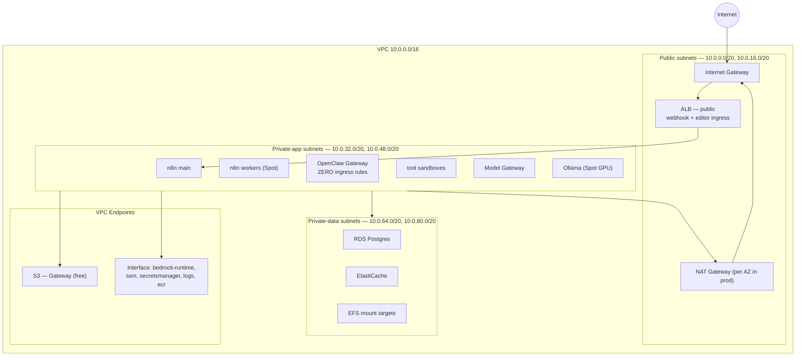
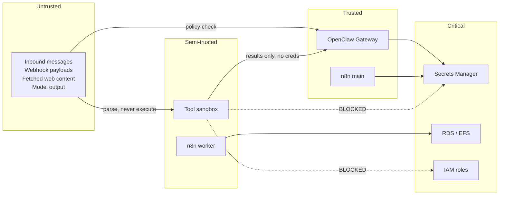

# 5. Network and Infrastructure Boundaries

Boundaries exist to bound blast radius. In a platform where a language model can be persuaded to run shell commands, that is the whole game.

## 5.1 Boundary hierarchy

From strongest to weakest:

| # | Boundary | Enforced by | Contains |
|---|---|---|---|
| 1 | **AWS account** | Organisations, SCPs | An environment. A compromised prod agent cannot reach dev, and vice versa. |
| 2 | **VPC** | Routing | The platform's network. |
| 3 | **Subnet tier** | Route tables, NACLs | Public / private-app / private-data. |
| 4 | **Security group** | Stateful firewall | Component-to-component reachability. |
| 5 | **IAM role** | Policy | What a component may *do*, independent of what it can *reach*. |
| 6 | **Container sandbox** | Docker, IMDS block, egress allowlist | **What an agent's tool calls may do.** |

Boundary 6 is the newest and least standardised, and it is the one that matters most here. Boundaries 1–5 are well-trodden AWS practice. Boundary 6 is where this platform's specific risk lives.

## 5.2 Account strategy

**One AWS account per environment**, under an Organisation.

```
Organisation
├── management            (billing, SCPs, no workloads)
├── security              (CloudTrail sink, GuardDuty admin, log archive)
├── platform-dev          (full platform, permissive, real Spot, real Bedrock)
└── platform-prod         (full platform, restrictive SCPs)
```

Environment separation by IAM alone is the tempting shortcut and the wrong one here. The agent plane executes model-directed code with an instance profile attached. The realistic failure is not "someone misconfigured a policy," it is "an agent was persuaded to use the credentials it legitimately holds." The account boundary is the only one that holds when the identity itself is the vector.

Baseline SCPs on `platform-prod`: deny IAM user creation, deny CloudTrail disablement, deny leaving the Organisation, deny non-approved regions, deny disabling EBS default encryption.

## 5.3 VPC layout

Two AZs minimum, three where GPU Spot capacity diversification justifies the third NAT Gateway.



**The private-data tier has no route to a NAT Gateway.** It cannot reach the internet in either direction. RDS, ElastiCache and EFS have no business egressing.

**Ollama and the Model Gateway sit in private-app, not private-data**, despite being "backend." They need S3 (weights) and Bedrock (fallback) reachability. Both go via endpoints, not NAT.

## 5.4 The zero-ingress agent runtime

The most consequential boundary decision, and it comes free from how OpenClaw works.

Most OpenClaw channels are **outbound-initiated**: WhatsApp, Signal and Telegram maintain long-lived client connections; Slack can run in Socket Mode. The Control UI binds to `127.0.0.1:18789` — loopback only.

Therefore:

```
OpenClaw Gateway security group:
  Ingress: (none)
  Egress:  443 -> chat platform endpoints (allowlist)
           443 -> Model Gateway (internal ALB SG)
           2049 -> EFS SG
           443 -> VPC endpoints (SSM, Secrets Manager, Logs)
```

No inbound rule. No SSH. No bastion. No public IP. Administration is `aws ssm start-session`, and reaching the Control UI is an SSM port-forward to `18789` over the SSM channel.

This means **the agent runtime has no network attack surface reachable from the internet**. The remaining attack surface is entirely semantic: what the model is persuaded to do with the reach it legitimately has. That reframing is the point — and it is why [08 — Security](08-security.md) is about privilege, not perimeter.

*Caveat:* channels that require inbound webhooks (some Slack/Teams configurations, Twilio-style bridges) would break this property. If such a channel is required, terminate it at the **ALB → n8n**, and have n8n hand the message to the Gateway over the internal network. Do not open an ingress path to the Gateway. This is a hard architectural rule.

## 5.5 Egress control

Deny-by-default outbound is unusual, operationally annoying, and correct here.

| Component | Egress posture |
|---|---|
| **Tool sandbox** | **Deny-by-default allowlist.** Explicitly no IMDS (`169.254.169.254` blocked), no VPC CIDR, no metadata. Only what the agent's declared tools require. |
| **OpenClaw Gateway** | Allowlist: chat platform domains, Model Gateway, VPC endpoints. |
| **n8n workers** | Broad HTTPS egress via NAT (workflows integrate with arbitrary third-party APIs — this is n8n's purpose). Compensated by the sandbox boundary not applying and by IAM scoping. |
| **Ollama** | S3 endpoint + CloudWatch only. **No NAT route.** Weights come from S3. |
| **Private-data tier** | No egress. |

**Blocking IMDS from the sandbox is the single highest-value egress rule in the platform.** Without it, an injected prompt that runs `curl 169.254.169.254/latest/meta-data/iam/security-credentials/` retrieves the Gateway instance's IAM credentials, and the container boundary has bought nothing. Enforce with `--add-host`/network policy at the container level *and* IMDSv2 with hop limit 1 at the instance level, so a container cannot reach it even if the network rule is missed.

n8n workers are the acknowledged soft spot: arbitrary outbound HTTPS is inherent to a workflow-integration tool. They compensate with narrow IAM roles and no sandbox-escaping capabilities, and they never hold the Gateway's credentials.

## 5.6 Trust zones



**Model output belongs in the Untrusted zone.** This is the one classification engineers get wrong. A tool call emitted by the model is an instruction from an untrusted source, because the model's context contained untrusted input. It is checked against policy before execution, exactly as a user-supplied command would be — never because the model "decided" it.

## 5.7 Boundary summary

| Threat | Bounded by |
|---|---|
| Compromised agent reaches production data from dev | Account boundary (1) |
| Compromised sandbox reaches the database | Subnet tier + SG (3, 4) |
| Compromised sandbox steals instance credentials | **IMDS block + IMDSv2 hop limit (6)** |
| Compromised sandbox exfiltrates to attacker host | **Egress allowlist (6)** |
| Prompt injection triggers a destructive AWS API call | IAM least privilege (5) + tool policy + human approval |
| Internet-based attack on the agent runtime | **Zero ingress (4)** — no reachable surface |
| Credential leak through logs | Log scrubbing + no secrets in env vars ([08](08-security.md)) |
