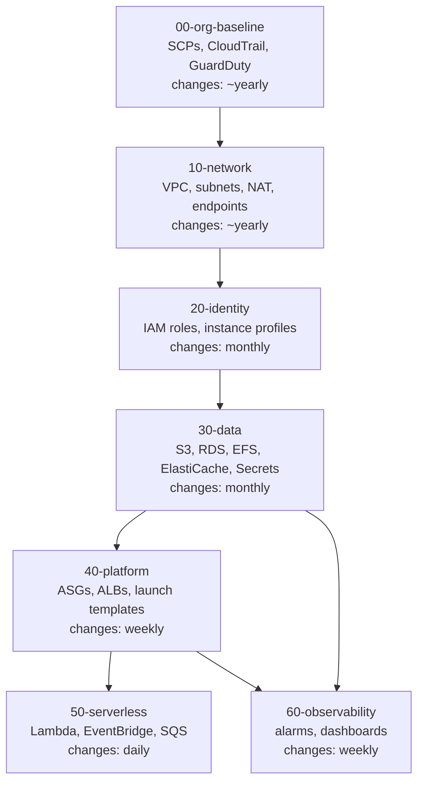
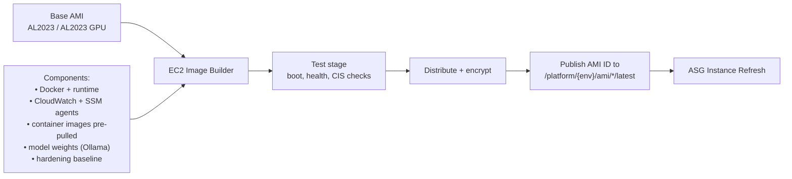
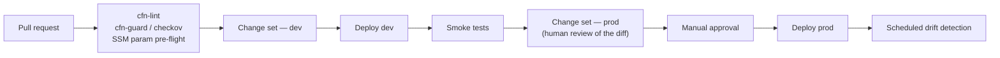

# 6. Deployment Strategy

Everything is CloudFormation. Nothing is created by hand, including in dev — a console-created resource is a resource nobody can rebuild after an incident.

## 6.1 Stack decomposition — layer by rate of change

Nested stacks, layered so that **things that change together deploy together, and things that change at different rates never block each other.**



The layering rule: **a stack may depend on layers below it, never above.** The `50-serverless` layer changes daily and must never require touching `10-network`.

**Blast radius is the second criterion.** A bad change to `50-serverless` costs an event handler. A bad change to `10-network` costs the platform. They belong in different stacks with different review requirements and different deployment cadences — regardless of how convenient it would be to co-locate them.

## 6.2 Cross-stack contract: SSM Parameter Store, not Exports

Lower layers publish outputs to **SSM Parameter Store**; upper layers read them.

```
/platform/{env}/network/vpc-id
/platform/{env}/network/private-app-subnet-ids
/platform/{env}/identity/n8n-worker-role-arn
/platform/{env}/data/artifacts-bucket-name
/platform/{env}/ami/n8n-worker/latest
/platform/{env}/ami/ollama-gpu/latest
/platform/{env}/inference/routing-policy
```

**Why not `Fn::ImportValue` and CloudFormation Exports.** An exported value cannot be changed or deleted while any stack imports it. Export the VPC ID and you have welded the network stack to every stack above it: replacing a subnet becomes a coordinated multi-stack teardown. This is the most common way CloudFormation estates become un-evolvable, and it shows up eighteen months in, precisely when you most need to change the network.

SSM parameters are read at deploy time, creating a **temporal** rather than **structural** coupling. The cost is that CloudFormation no longer enforces the dependency — you can delete a parameter an upper stack needs, and nothing stops you until deployment. We accept that and mitigate with a CI pre-flight check that every referenced parameter resolves. Full reasoning in [ADR-0007](../adr/0007-cloudformation-stack-layering.md).

## 6.3 Golden AMI pipeline

The startup-time strategy depends entirely on what is already on the disk when the instance boots.



Three AMI variants, deliberately not one:

| AMI | Contents | Rebuild cadence |
|---|---|---|
| `n8n-worker` | Docker, n8n image pre-pulled, agents | Weekly + on n8n release |
| `ollama-gpu` | NVIDIA driver, CUDA, Ollama, **common model weights baked in** | Monthly (weights are large; rebuilds are slow) |
| `agent-gateway` | Docker, OpenClaw image, sandbox base image | Weekly |

A single fat AMI would force the 40 GB GPU image onto every n8n worker. Three narrow AMIs cost three pipelines and save minutes per launch on the workers.

**Never bake secrets or environment-specific config into an AMI.** Config comes from SSM Parameter Store and Secrets Manager at boot. An AMI is a public-ish artifact shared across accounts; a secret in one is a secret in all of them, forever, in every snapshot.

## 6.4 Minimising EC2 startup time

The brief asks explicitly for this. The strategy is layered because no single technique is sufficient, and one obvious technique is unavailable.

| Layer | Technique | Saves | Applies to |
|---|---|---|---|
| 1 | **Golden AMI** — OS packages, Docker, container images pre-pulled | 60–120 s | all |
| 2 | **Model weights baked into the AMI** | minutes | `ollama-gpu` |
| 3 | **Pre-staged EBS snapshot** for large/less-common weights, attached at boot | minutes | `ollama-gpu` |
| 4 | **EBS Fast Snapshot Restore** on that snapshot — removes first-access lazy-load penalty | tens of seconds to minutes | `ollama-gpu`, selectively |
| 5 | **Minimal user-data** — fetch config from SSM, start containers. No installs. | 30–60 s | all |
| 6 | **S3 Gateway Endpoint** for any remaining artifact pulls | seconds + NAT cost | all |
| 7 | **ASG warm pools** — pre-initialised stopped instances | 1–3 min | **On-Demand fleets only** |

⚠ **Warm pools do not support Spot Instances.** As of November 2025 they support mixed-instances policies for *On-Demand* instance types only. This is the load-bearing constraint of the entire cold-start design: **the Ollama Spot GPU fleet — the fleet with the worst cold start — is the one fleet that cannot use warm pools.**

Consequences, spelled out because this is where a naive design fails:

- Ollama's cold start must be attacked at layers 1–4 (bake and pre-stage), not layer 7.
- Residual cold start is ~2–4 minutes, which is why [flow 4.4](04-flows.md) puts **SQS in front of the fleet** to absorb it and routes interactive traffic to Bedrock instead.
- Warm pools remain useful for an **On-Demand baseline** of inference capacity if we later decide the Spot-only fleet has too much scale-up latency. That is a cost/latency dial, not a redesign.

⚠ **Fast Snapshot Restore is not free.** It bills ≈ $0.75 per DSU-hour, **per snapshot, per AZ**, continuously while enabled — roughly $540/month per snapshot per AZ. Enabling it on three snapshots across three AZs costs more than the GPU instances it accelerates. Use it on **one** hot snapshot in the AZs you actually launch into, and measure. See [09 — Cost](09-cost.md).

## 6.5 Deployment pipeline



**Change sets are reviewed, not just generated.** The reviewable artifact is the *diff CloudFormation intends to apply*, particularly which resources will be **replaced**. A resource replacement on `30-data` is a data-loss event that looks, in a template diff, like a one-line property change.

**Instance refresh, not stack replacement,** for AMI rollouts. New AMI ID lands in SSM → `40-platform` update → ASG instance refresh with a healthy-percentage floor → automatic rollback on alarm.

**Deployment order for the agent plane** respects the singleton:

1. n8n workers (Spot) — rolling, no impact, they are fungible.
2. n8n `main` — brief ingress interruption; ALB drains connections.
3. **OpenClaw Gateway — stop, replace, start.** There is no rolling update of a singleton. Conversational downtime of a few minutes is unavoidable. Deploy it in a maintenance window and **verify the EFS mount before terminating the old instance**, because getting this wrong means re-pairing channels by hand.

## 6.6 Environments

| | dev | prod |
|---|---|---|
| Account | `platform-dev` | `platform-prod` |
| AZs | 1 | 2–3 |
| NAT | single (shared) | one per AZ |
| Postgres | container on `main` | RDS Multi-AZ |
| Redis | container | ElastiCache |
| n8n workers | Spot, min 0 | Spot, min 1 |
| Ollama | Spot, min 0, aggressive scale-down | Spot, min 0, Bedrock fallback |
| Gateway | Spot acceptable (state loss tolerable) | On-Demand + EFS |
| FSR | off | one snapshot, launch AZs only |

Dev deliberately breaks the production rules where the consequence is cheap: a single NAT is a single point of failure, and a Spot Gateway will lose its channel pairings. In dev, both are acceptable and both save real money. Making dev a faithful replica of prod is a common instinct and usually a waste — what must be faithful is the *template*, parameterised by environment.

## 6.7 Rollback

| Failure | Response |
|---|---|
| Stack update fails | CloudFormation automatic rollback |
| AMI bad, detected by alarm | Instance refresh auto-rollback to previous AMI ID in SSM |
| AMI bad, detected later | Repoint SSM param to previous AMI, trigger refresh |
| Data-layer change destructive | **No rollback exists.** `DeletionPolicy: Retain` + `UpdateReplacePolicy: Retain` on RDS, EFS, S3. Prevention only. |

The last row is why `30-data` has its own stack, its own review gate, and its own retention policies. Rollback is a strategy for stateless things. For stateful things, the strategy is not breaking them.
