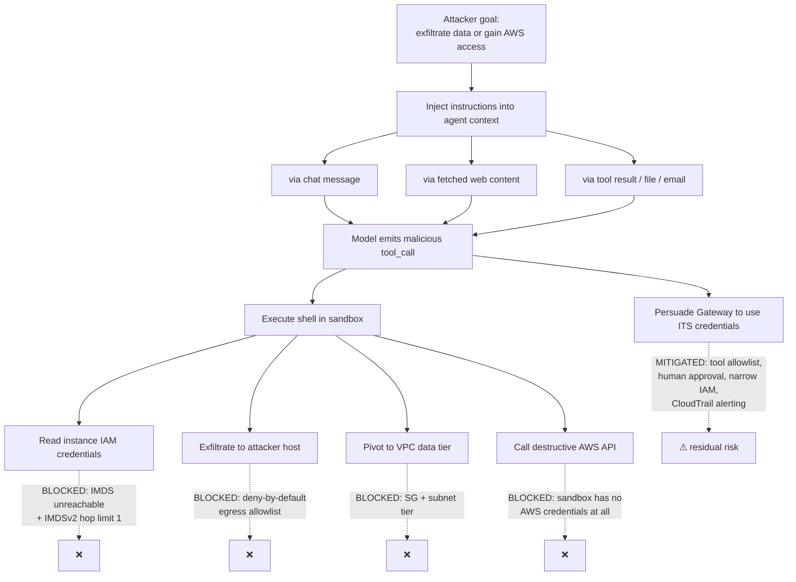

# 8. Security

Standard AWS security practice applies and is covered in §8.4–8.7. It is not the interesting part. The interesting part is that this platform runs a system which **takes instructions from untrusted text and executes shell commands** — and that changes what "secure" means.

## 8.1 The agent threat model

OpenClaw's own documentation states the security model without euphemism: *"the agent can do anything you can do."* Its guidance is to run it on a dedicated machine containing no sensitive data or credentials.

That is the correct instinct, and it is not sufficient for a platform that must hold credentials to be useful.

### Why prompt injection is not a content problem

The tempting mental model is that prompt injection is a filtering problem: detect the bad input, block it, move on. That model fails, because:

- The untrusted text need not come from the user. It arrives in a fetched web page, an email body, a GitHub issue, a PDF, a tool result. **Every one of those enters the model's context.**
- The model cannot reliably distinguish "content to reason about" from "instructions to follow." That is not a bug that a better model fixes; it is what an instruction-following model *is*.
- Detection is adversarial and unbounded. Filters have false-negative rates. Shells do not have partial-credit failure modes.

So: **injection is a privilege-escalation problem wearing a natural-language costume.** The agent is a *confused deputy* — it holds real authority (an IAM role, a shell, network reach) and it accepts instructions from parties who should not command that authority.

The design response is not to make the agent harder to persuade. It is to **ensure that a fully persuaded agent cannot do much damage.** Assume the model *will* be convinced to run the attacker's command, and ask what happens next.

### Attack tree

Note the asymmetry. The sandbox paths are **blocked** by architecture — the sandbox holds no credentials and can reach nothing. The Gateway path is only **mitigated**, because the Gateway must hold *some* authority to be useful. That residual risk is the honest bottom of this design, and §8.3 is about shrinking it.

## 8.2 Containment: the sandbox boundary

Agent tool execution runs in Docker containers, spawned by the Gateway as siblings via the host Docker socket, isolated per agent or per session.

Non-negotiable controls:

| Control | Why |
|---|---|
| **IMDS unreachable from the container** (`169.254.169.254` blocked) **and** IMDSv2 with **hop limit = 1** | The single highest-value control. Without it, one `curl` retrieves the Gateway's IAM credentials and every other boundary is theatre. Two independent enforcement points because one will eventually be misconfigured. |
| **No AWS credentials in the sandbox.** Ever. Not env vars, not mounted files. | If the agent needs an AWS action, it calls a *narrow, audited tool* on the Gateway — never `aws` in a shell. |
| **Deny-by-default egress allowlist** | Prevents exfiltration and C2. Data that cannot leave has not leaked. |
| **No VPC CIDR reachability** | Blocks lateral movement to RDS, EFS, ElastiCache. |
| **Read-only root filesystem**, writable `/workspace` only | Limits persistence. |
| **`no-new-privileges`, dropped capabilities, non-root user, seccomp** | Standard container hardening; raises the cost of a container escape. |
| **CPU / memory / PID limits, wall-clock timeout** | An agent loop is a resource-exhaustion vector, accidental or not. |
| **Ephemeral — destroyed after session** | No cross-session contamination. |

Docker's sibling-container model (Docker-out-of-Docker via the host socket) is what OpenClaw supports, and it has a real weakness worth naming: **access to the host Docker socket is equivalent to root on the host.** The Gateway process holds that access. Therefore the Gateway process itself, not merely the sandbox, is the trust boundary — and the Gateway must never pass model-controlled strings to the Docker API. If sandbox escape becomes a live concern, the escalation is Firecracker/microVM isolation or moving sandboxes to dedicated instances with no shared kernel. Recorded in [12 — Risks](12-risks-assumptions-constraints.md).

## 8.3 Constraining the Gateway's own authority

The Gateway holds credentials. Shrink what they are worth:

**1. Tools are an allowlist with a risk classification, not a capability grab.**

| Tier | Examples | Control |
|---|---|---|
| Read-only | read file, HTTP GET allowlisted, query metrics | Auto-approved |
| Write, reversible | write to `/workspace`, post to a dev channel | Auto-approved, logged |
| Write, irreversible or outward-facing | send email, post publicly, create PR, write to S3 | **Human approval** |
| Privileged | any AWS mutating API, credential access, spend | **Human approval + separate audited tool + CloudTrail alarm** |

Human-in-the-loop is not a UX preference. It is the control that survives a fully-persuaded model.

**2. IAM scoped to specific resources.** `bedrock:InvokeModel` on **specific model ARNs**, never `bedrock:*`. S3 on one prefix. No `iam:*`, no `ec2:*`, no wildcards on mutating actions. The Gateway's role should be boring enough that stealing it is disappointing.

**3. Per-agent budget circuit-breaker** at the Model Gateway. An agent in a reasoning loop is a financial DoS on yourself — and, once budgets are tied to identity, also the earliest reliable signal of a compromised agent. Cost anomaly and security anomaly are the same alarm here, which is a genuinely useful property.

**4. Channel allowlist.** `channels.*.allowFrom` and mention-requirements in group chats. An unrestricted Gateway is an internet-reachable shell that happens to speak English.

**5. Everything the agent does is attributable.** `agent_run_id` on every log line, tool call, sandbox container, and token metric ([04 — Flows](04-flows.md)). Post-incident, "what did it touch" must be answerable in minutes.

## 8.4 Identity and access

- **No IAM users. No long-lived access keys.** Instance profiles for EC2, execution roles for Lambda, IRSA-equivalent per-component roles throughout. Humans authenticate via IAM Identity Center with MFA.
- **One role per component**, least privilege, no shared roles. The n8n worker role and the Gateway role are different because their blast radii are different.
- **SSM Session Manager for all administrative access.** No SSH keys, no bastion, no port 22 in any security group. Sessions are logged to CloudTrail and S3.
- **Permission boundaries** on any role the platform can create.
- **SCPs** on `platform-prod`: deny CloudTrail disablement, deny leaving the Organisation, deny non-approved regions, deny disabling EBS encryption, deny `elasticfilesystem:DeleteFileSystem`.

## 8.5 Secrets

| Secret | Store | Notes |
|---|---|---|
| n8n encryption key | Secrets Manager | Loss makes stored credentials unrecoverable. Back it up out-of-band. |
| Channel tokens / device links | Secrets Manager + EFS state | The EFS state is itself secret material. Encrypt at rest, restrict the mount. |
| Model provider API keys | Secrets Manager | Rotated. Never in an AMI, never in user-data. |
| Bedrock access | **No secret** — IAM role | Why Bedrock is the default provider: nothing to leak. |
| Platform config | SSM Parameter Store | Non-secret only. |

Rules: **fetched at runtime, never baked into an AMI, never in user-data, never in environment variables visible to a sandbox.** Encrypted with customer-managed KMS keys with key policies restricting decrypt to the owning role. Log scrubbing on the agent output path — an agent that reads a secret and prints it has exfiltrated it to CloudWatch.

That Bedrock requires no API key at all, only an IAM role, is a real and underrated security advantage over self-hosted or third-party providers. It removes an entire class of credential-leak incidents.

## 8.6 Data protection

- **At rest:** EBS, EFS, S3, RDS, ElastiCache, Secrets Manager — all encrypted with customer-managed KMS keys. EBS encryption-by-default enforced by SCP.
- **In transit:** TLS everywhere. ALB terminates with ACM certificates; internal hops use TLS. Bedrock traffic goes over the `bedrock-runtime` **interface VPC endpoint** and never touches the internet.
- **S3:** Block Public Access at the account level, bucket policies denying non-TLS, versioning on artifact buckets, lifecycle to Glacier for logs.
- **Data residency:** the Ollama path exists partly so that data which must not leave the account has a compliant inference option. Route by policy at the Model Gateway.

## 8.7 Detection

| Signal | Source | Alarm on |
|---|---|---|
| Unusual AWS API calls by an agent role | CloudTrail + GuardDuty | Any mutating call outside baseline |
| Credential exfiltration attempt | GuardDuty `InstanceCredentialExfiltration` | Immediate page |
| Sandbox egress to non-allowlisted host | VPC Flow Logs / DNS logs | Investigate |
| Token spend anomaly per agent | Model Gateway metrics | **Circuit-break, then investigate** |
| Tool-call rate anomaly | Gateway logs | Possible injection or runaway loop |
| Config drift | CloudFormation drift detection | Investigate |

GuardDuty, CloudTrail (org-wide, to the `security` account), VPC Flow Logs, and AWS Config are baseline. The rows that matter uniquely here are the last three: they detect a *misbehaving agent*, not a misbehaving human, and no standard AWS security tooling is looking for that.

## 8.8 What remains unsolved

Stated plainly, because a security section that claims completeness is not one:

1. **Prompt injection is not solved.** It is contained. A fully-persuaded agent can still do anything its allowlisted, human-unapproved tools permit. The mitigation is to keep that set small and boring.
2. **Docker socket access ≈ host root.** The Gateway holds it. Container escape from a sandbox to the Gateway is a shared-kernel problem that Docker does not fully solve. Firecracker is the answer if the threat model tightens.
3. **The human approver is a rate-limited resource.** Approval fatigue converts a control into a rubber stamp. Keep the privileged-tier tool set small enough that approvals stay rare and therefore stay real.
4. **Model output in logs is untrusted data.** Anything rendering agent output — dashboards, chat, tickets — must treat it as such. Log-injection and downstream XSS are live.
5. **Supply chain.** OpenClaw is a fast-moving open-source project that had three names in a fortnight and attracted cryptocurrency scammers impersonating it during the rename. Pin versions, verify provenance, review dependency updates, and never `curl | bash` into an AMI build.
