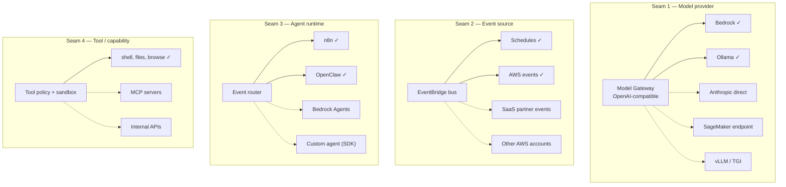

# 11. Future Extensibility

The brief requires that "future AI providers and platform components can be added with minimal architectural changes." That requirement is met by **seams** — places where a new implementation can be inserted without any caller changing.

A seam is not a plugin system, and this is the distinction that matters. A plugin system is code you write in advance for extensions you have not yet imagined, and it is usually wrong. A seam is an *interface that already had to exist*, positioned so that adding an implementation is the whole change. Seams cost nothing when unused.

## 11.1 The four seams



### Seam 1 — Model provider *(the one the brief asks for by name)*

**Contract:** OpenAI-compatible `POST /v1/chat/completions`.

Adding a provider is: write an adapter, register it in the routing policy in SSM Parameter Store, deploy the Model Gateway. **No workflow, agent, or prompt changes.**

Why this specific contract: Ollama already speaks it natively, Bedrock can be fronted by it, and essentially every LLM tool and SDK targets it. Choosing a *de facto* standard over a bespoke interface is what makes the seam free.

The routing policy is data, not code:

```yaml
# /platform/{env}/inference/routing-policy
rules:
  - match: { latency_class: interactive }
    provider: bedrock
    model: <frontier-model-id>
  - match: { latency_class: bulk, data_residency: any }
    provider: ollama
    model: <open-weight-model>
    fallback: { provider: bedrock, model: <equivalent> }
  - match: { data_residency: in-account }
    provider: ollama            # no fallback: policy forbids it
  - match: { task: classification }
    provider: bedrock
    model: <small-fast-model>   # the single largest cost lever
```

Provider choice becomes an operational decision — changed by editing a parameter — rather than an architectural commitment changed by editing forty workflows. Adding a provider is a config change plus an adapter; removing one is a config change.

### Seam 2 — Event source

**Contract:** EventBridge event with a defined `detail-type` and schema (registered in EventBridge Schema Registry).

New sources — a SaaS partner event bus, another AWS account, an internal service — attach by adding a rule. Existing consumers are untouched. Fan-out is free.

### Seam 3 — Agent runtime

**Contract:** the event router (`Lambda: event-router`) decides which runtime handles a task. Today it chooses between n8n and OpenClaw on one question: *are the steps known in advance?*

Adding a third runtime — Bedrock Agents, a custom loop on the Agent SDK, a specialised planner — means adding a branch to the router and a target. Nothing else moves. Crucially, a new runtime inherits the Model Gateway, the sandbox policy, the `agent_run_id` contract, and the budget circuit-breaker **for free**, because those are platform concerns, not runtime concerns.

This is why the platform deliberately did *not* build agent orchestration into n8n or couple the budget logic to OpenClaw.

### Seam 4 — Tool / capability

**Contract:** a tool is a named, risk-classified, schema-described capability executed inside the sandbox ([08 — Security §8.3](08-security.md)).

The obvious near-term extension is **MCP (Model Context Protocol) servers** as a tool source: a standard way to expose internal APIs to agents. It slots in behind the existing tool policy and sandbox, inheriting the risk tiers, approval requirements, and egress allowlist. **A new tool must never bypass the tool policy** — that would relocate the platform's primary security boundary, which is the one thing extensibility must not do.

## 11.2 Anticipated evolution

| Horizon | Change | Architectural impact |
|---|---|---|
| **Near** | Build the Model Gateway (currently interface-only) | None — the contract already exists; callers unchanged |
| Near | Add memory / RAG (vector store: OpenSearch Serverless, pgvector on the existing RDS) | New data component. **pgvector reuses RDS** — prefer it until scale demands otherwise |
| Near | Approval workflow UI for privileged tools | New surface; the tool-tier model already exists |
| **Mid** | **Shard the OpenClaw Gateway by tenant/channel** | The known scaling ceiling ([07 §7.3](07-scalability-and-ha.md)). Designed for; needs a routing layer + per-shard EFS access points |
| Mid | Multi-tenancy (agents per customer) | Per-tenant IAM roles, per-tenant budgets, per-tenant sandboxes. **The account boundary may need to become per-tenant** — the expensive version |
| Mid | Fine-tuned models | SageMaker endpoint behind Seam 1, *or* custom weights served by Ollama. Seam 1 makes this a routing change |
| Mid | On-Demand GPU baseline | If Spot scale-up latency proves unacceptable. A cost/latency dial, not a redesign |
| **Long** | Cross-region DR | Meaningful work. AMIs, backups, and IaC are already positioned for it; RTO would be hours ([07 §7.5](07-scalability-and-ha.md)) |
| Long | Migrate agent plane to EKS | Only if the component count grows past ~a dozen services, or sandbox isolation demands stronger primitives |
| Long | Stateless agent loop (externalised session state) | Removes the singleton constraint entirely. Substantial. Justified only at scale |

## 11.3 Where the architecture will resist change

An honest extensibility section names the parts that are *not* easy to change. Every architecture trades flexibility somewhere.

| Rigid point | Why | Cost to change |
|---|---|---|
| **OpenClaw as the conversational runtime** | Its state model (device-linked channels) is baked into the HA design, the EFS choice, and the singleton constraint | High. Replacing it re-opens [ADR-0009](../adr/0009-openclaw-gateway-singleton.md) and the whole agent-plane HA story |
| **Single region** | Multi-AZ only. No cross-region data strategy exists | High. Deliberately deferred |
| **n8n as workflow engine** | Workflows are n8n-native artifacts; there is no portable workflow format | High — but contained, because workflows are tenants, not platform |
| **CloudFormation** | Templates are not portable to Terraform | Medium. CDK can generate CloudFormation without invalidating this |
| **Docker sandbox (shared kernel)** | Isolation ceiling. Firecracker would be stronger | Medium. Swappable behind the tool-execution interface |

The first row is the important one. **OpenClaw is the platform's deepest coupling**, and it is coupled precisely because of the property that made it worth choosing: it owns durable, human-recoverable-only conversational state. Nothing in the design pretends otherwise, and [12 — Risks](12-risks-assumptions-constraints.md) tracks it.

## 11.4 The extensibility test

Before adding a component, ask:

1. **Does it fit an existing seam?** If yes, it is a config or adapter change. Proceed.
2. **If not, does it need a new seam, or is it a special case of an existing one?** New seams are expensive and should be rare. Four is a reasonable number for this platform's lifetime.
3. **Does it hold durable state?** If yes, it inherits every constraint in [02 §2.5](02-components.md) — placement, backup, HA, and it probably cannot run on Spot. Be sure the state is necessary.
4. **Does it bypass the tool policy or the budget circuit-breaker?** If yes, **stop.** Those are the two controls standing between this platform and its two most likely incidents: a compromised agent, and an expensive one.
