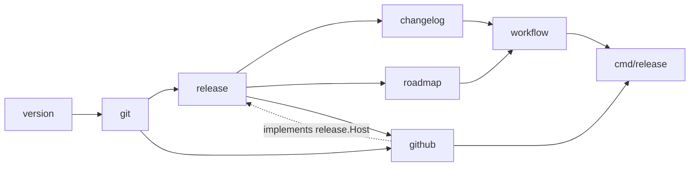
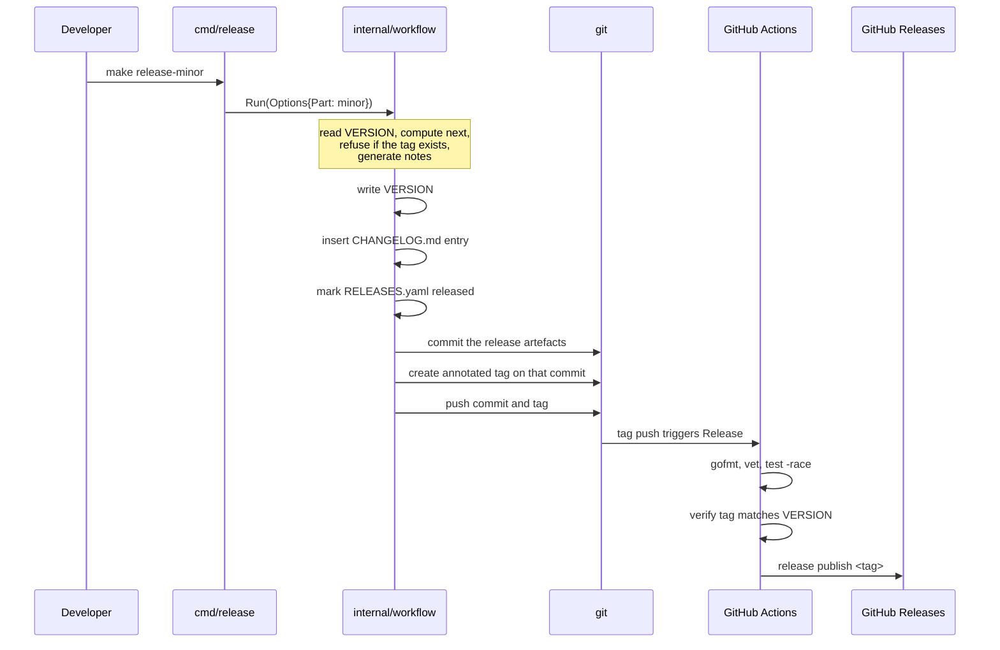

# 13 — Release Management

> **Milestone 2.** Repository tooling. It delivers no architectural milestone of the platform itself — versions and milestones are two sequences, not one ([§13.7](#137-versions-and-milestones-are-two-sequences)).

A Go module that cuts releases: it computes the next version, generates release notes from commit history, writes the changelog, creates an annotated tag, and publishes the GitHub release.

It exists because the three things that must agree about a release — the `VERSION` file, the git tag, and the published notes — drift apart the moment any of them is maintained by hand.

**This chapter is about the code.** For the Semantic Versioning strategy, the release lifecycle, the responsibilities of each actor, and how to actually cut a release, see **[RELEASE_MANAGEMENT.md](../../RELEASE_MANAGEMENT.md)** — the definitive guide. Contributors should start at [CONTRIBUTING.md](../../CONTRIBUTING.md).

---

## 13.1 The shape of it

```text
cmd/release/            CLI: patch | minor | major | publish | notes | current
internal/
    version/            SemVer 2.0.0 value type: parse, bump, precedence
    git/                Commit, Tag, Comparison; Repository port + exec adapter
    github/             REST client (Transport seam) + Releases adapter
    release/            Release aggregate, Notes, commit classifier, ports, Clock
    changelog/          Keep a Changelog rendering; CHANGELOG.md upsert
    releasenotes/       The GitHub Release body: sections, contributors, stats
    roadmap/            RELEASES.yaml registry
    workflow/           Orchestration: bump -> notes -> changelog -> tag -> publish
```

**`changelog` and `releasenotes` render different documents from the same range.**
`CHANGELOG.md` is a ledger — terse, chronological, grouped by Keep a Changelog's
six categories, and committed *inside* the tag. A GitHub Release is an
announcement: it leads with highlights, groups by what a reader cares about,
credits contributors, and folds the commit hashes away. One renderer for both
would have made each worse.

There is no `pkg/`. Nothing here is intended for reuse outside this repository, and `internal/` says so to the compiler rather than to a reader.

Dependencies run in one direction:



**`Comparison` lives in `git`, not in `release`.** A diff between two refs is a version-control concept, and putting it there is what keeps the graph acyclic: `git` imports only `version`, while both `release` and `github` import `git`. Had `Comparison` lived in `release`, the `git` adapter would have had to import `release` to return one, and `release` already imports `git` for `Commit` and `Tag`.

## 13.2 The two seams

Everything testable about this module follows from two interfaces, declared in `internal/release/ports.go` and satisfied *structurally* — no adapter imports them, and no adapter inherits from anything.

```go
type Repository interface {  // the local repository: tags, commits, diffs
    ListTags() ([]git.Tag, error)
    PreviousTag(target *version.Version) (*git.Tag, error)
    CreateTag(name, message, ref string) (git.Tag, error)
    Compare(base, head string, headVersion *version.Version) (git.Comparison, error)
    // …
}

type Host interface {        // the forge: published releases, server-side compare
    CreateRelease(options CreateOptions) (Release, error)
    Compare(base, head string) (git.Comparison, error)
    // …
}
```

A test fake is a plain struct with the right methods. `github.Releases` and a map-backed fake are interchangeable to the notes builder, which is what lets note generation be tested without a network.

`Host.Compare` exists alongside `Repository.Compare` deliberately. GitHub's Compare API performs rename detection server-side and works from a shallow clone — which is what `actions/checkout` gives you unless you remember `fetch-depth: 0`. **Local git is the fallback, and the only option offline.**

The fallback is never silent. A comparison assembled from a shallow clone can be missing commits, and a release note that quietly omits half a release is worse than one that fails. The host is consulted only when it *could* answer — both refs must be pushed release tags — so generating notes against an unpushed `HEAD` goes straight to local git rather than spending a request to earn a warning.

`Clock` is the third seam, and the smallest. A service that calls `time.Now` directly cannot be tested for the date it writes, and a changelog is a document about dates.

## 13.3 Design decisions

Two decisions are recorded as ADRs because both were live choices with real trade-offs:

- **[ADR-0013](../adr/0013-hand-written-github-rest-client.md)** — a hand-written GitHub REST client over `net/http`, not `go-github`. Seven endpoints; the SDK reached v75 in a year and each major is a new import path.
- **[ADR-0014](../adr/0014-exec-git-rather-than-go-git.md)** — delegate to the `git` binary, not `go-git`. The comparison layer's job is to agree with GitHub's Compare API, which means git's merge-base `...` semantics, `-M` rename detection, and `-z` framing — not a second implementation of them.

The module has **one** third-party dependency: `goccy/go-yaml`, for the hand-editable roadmap.

The CLI is built on the standard library's `flag` package. Cobra would add a dependency, a hundred lines of registration, and shell completion nobody asked for, to a tool with six verbs.

## 13.4 Classifying commits without a model

Release notes are grouped into [Keep a Changelog](https://keepachangelog.com/) categories. Two strategies, tried in order:

**Conventional Commits.** `feat:` → Added, `fix:` → Fixed. Exact, when a project uses it.

**Imperative mood.** This repository does not use Conventional Commits. Its history reads *Restore milestone framing*, *Draw service glyphs in the architecture SVG*, *Stop the VPC border striking an annotation*. Those are ordinary English imperatives, and the leading verb carries the category reliably enough to be useful: *Draw* and *Add* introduce things, *Stop* and *Fix* repair them, *Remove* removes them.

The heuristic is honest about its limits:

- An unrecognised verb yields **Changed** — the category that asserts least — rather than a guess.
- A subject with a colon that is *not* a Conventional Commit type (`Milestone 1: initial architecture`) falls through to the verb heuristic rather than being read as a commit of type `Milestone`.
- Words such as `CVE-`, `vulnerabilit`, `injection`, and `RCE` promote a commit to **Security** regardless of its verb, because a security fix filed under *Fixed* is a security fix nobody notices.
- Merge commits and housekeeping (`chore`, `ci`, `build`, `test`, `style`, `Bump version`) are dropped. They are true statements about the repository that no reader of a release note wants.

**Nothing here infers intent from the diff, and nothing calls a language model.** A wrong guess in a changelog is worse than a vague one, because a changelog is read as a record.

### Sections, for the release body

The release body groups by a second taxonomy — Breaking Changes, Security, New Features, Improvements, Bug Fixes, Documentation, Internal — chosen because they are the divisions a reader of a *release* cares about, not the divisions a changelog needs. `internal/releasenotes` picks one, from the most reliable signal available:

| | Signal | Why it ranks there |
|---|---|---|
| 1 | A breaking-change marker | Explicit, and it can ruin somebody's afternoon |
| 2 | A pull request label | Somebody chose it, from a list the project curates |
| 3 | A Conventional Commit type | Somebody typed it, in a defined vocabulary |
| 4 | The files touched | Not intent, but evidence: a change confined to `docs/` is documentation whatever its verb claims |
| 5 | The leading imperative verb | The changelog classifier, reused so the two documents cannot disagree |

Unrecognised changes land in **Improvements**, the section that asserts least.

Labels are the only signal that needs the network, and their absence is not a failure: without `GITHUB_TOKEN` the chain simply starts at step 3. **Security is its own section** rather than a line in Bug Fixes, for the reason above: a security fix filed under "fixed" is a security fix nobody notices.

### Pull requests, without the API

A merged pull request leaves a commit that carries both its number and its human-written title — in the subject for a squash merge, in the body for a merge commit. `releasenotes` reads them from git, so titles work with no token at all.

Two consequences worth knowing. The commits a pull request brought in are **absorbed**: `git rev-list p1..p2` on the merge names them, and they are represented by the pull request rather than listed beneath it. A *plain* merge — a local `Merge branch` — is dropped instead, because it has no title worth showing; its commits are not absorbed, so nothing is lost.

Classification reads the pull request's title, never the merge commit's subject. `Merge pull request #6 from teddynted/release-management` says nothing about what changed.

## 13.5 The order of operations

> The developer-facing procedure — which command to run, who is responsible for what, and how to choose a version number — lives in **[RELEASE_MANAGEMENT.md](../../RELEASE_MANAGEMENT.md)**. This section covers only *why the steps are in the order they are*.

Local, then CI. The tag is the handoff.



**Nothing is written until everything that can be checked has been checked.** Read `VERSION`, compute the next version, refuse an existing tag, generate the notes — all of it fails harmlessly. Only then does the working tree change.

**The commit precedes the tag.** The tag must point at a tree whose `CHANGELOG.md` already describes it; otherwise checking out `v0.2.0` shows a changelog that has never heard of `v0.2.0`, and the CI check comparing the tag against `VERSION` reads a stale number. This is the one ordering constraint the whole design turns on.

**The push is last**, because it is the first irreversible step. Publishing is deliberately not part of the local flow: a release published from a developer's machine announces a release whose tag nobody else can see yet.

**Publication is idempotent.** `UpsertRelease` updates a release that already exists, so a retried workflow does not fail on its own first attempt. A release pipeline is retried more often than anyone plans for.

The tag is refused if it already exists — a half-finished release or a mistaken bump, both of which want a human, and neither of which wants `VERSION` rewritten first. `VERSION` itself refuses to move backwards unless forced.

`Runner.Run` refuses a detached HEAD before it writes anything, for the same reason it refuses an existing tag: a failure discovered after the release is committed and tagged is a failure a human has to unpick.

## 13.6 CLI surface

The full command, flag, and environment reference is in [RELEASE_MANAGEMENT.md §5](../../RELEASE_MANAGEMENT.md#5-release-commands). Two properties of the surface are architectural rather than procedural:

**The `Makefile` holds no release logic.** Every target expands to a `go run ./cmd/release` invocation. The release logic lives in the Go application, and only there — a Makefile that grows conditionals is a second implementation nobody tests.

**The host is optional.** Without `GITHUB_TOKEN`, the CLI constructs no `release.Host` at all, and every read falls to local git. That is what makes `release notes` and `--dry-run` work on a laptop with no credentials, and it is why `Host` is an interface the workflow accepts as `nil` rather than a struct it always builds.

The CLI is dispatched by hand over the standard library's `flag` package. Cobra would add a dependency, a hundred lines of registration, and shell completion nobody asked for, to a tool with six verbs.

## 13.7 Versions and milestones are two sequences

`RELEASES.yaml` is the roadmap: planned, in-progress, and shipped releases in one hand-editable file. Git tags answer *what shipped*; they do not answer *what is next*, and a roadmap that lives only in prose drifts from the versions that implement it.

It is also the only source of the Highlights prose in a GitHub Release. A version cut without a `summary` still publishes — leading with commit counts rather than a narrative, because a sentence of measurements is honest and an invented one is not. That fallback is never silent either: the builder warns, so the summary can be written before anyone reads the tag.

```yaml
releases:
  - version: 0.1.0
    title: Initial architecture
    status: released
    date: 2026-07-09
    milestone: 1
  - version: 0.2.0
    title: Release management
    status: planned
```

`milestone` is **optional**. Release management is repository tooling: it delivers no architectural milestone. Conflating the two sequences would force every milestone reference in `docs/` to be renumbered whenever a tooling release lands.

A version cut without a roadmap entry is *added* rather than rejected. A release cut without bookkeeping is a real thing that happens, and failing the pipeline over it would be worse than recording it.

## 13.8 GitHub Actions

[`.github/workflows/release.yml`](../../.github/workflows/release.yml) runs on a version tag push. Its responsibilities are enumerated in [RELEASE_MANAGEMENT.md §4.3](../../RELEASE_MANAGEMENT.md#43-github-actions); three details are worth knowing here because each one is a trap:

- **`fetch-depth: 0` is load-bearing.** `actions/checkout` fetches a single commit by default; the notes are a diff against the previous tag, and neither the tag nor the range exists in a shallow clone. The symptom is not a crash — it is a silent fallback to local git, and a release note missing half a release.
- **`contents: write` is scoped to the publish job**, not the workflow, so the test job cannot touch the repository.
- **The tag is checked against `VERSION` in the tagged tree** before publishing. If they disagree, the notes would describe the wrong version, so the job fails. This check is what makes the commit-before-tag ordering in [§13.5](#135-the-order-of-operations) mandatory rather than merely tidy.

## 13.9 Development and testing

```bash
make check     # fmt, vet, test
make test      # go test ./...
make race      # go test -race ./...
make cover     # per-package coverage
```

Every external system is behind an interface, so **the entire suite runs with no network and no repository on disk**:

- `git.Runner` is faked with a table of canned command output. The tests assert on the *exact arguments issued*, because the difference between `base..head` and `base...head` is the difference between a correct release note and a wrong one — a bug no output-shape test would catch.
- `github.Transport` is faked with canned HTTP responses, exercising auth headers, pagination, and the distinction between a rate-limited `403` and a genuine one.
- `release.Clock` is fixed, so generated dates are assertable.

Tests are table-driven where the cases are data — SemVer precedence walks the specification's own ordering, and the `-z` parsers are tested against the exact byte framing git emits, including paths containing newlines.

The repository's own `RELEASES.yaml` is parsed by a test. A typo there would otherwise surface during a release, which is the worst possible moment to find it.
