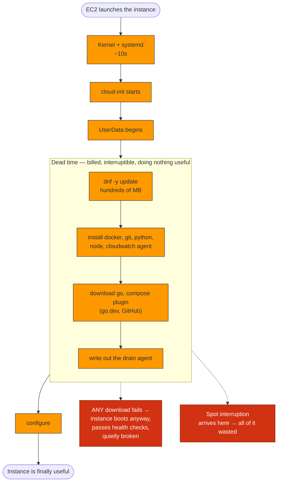
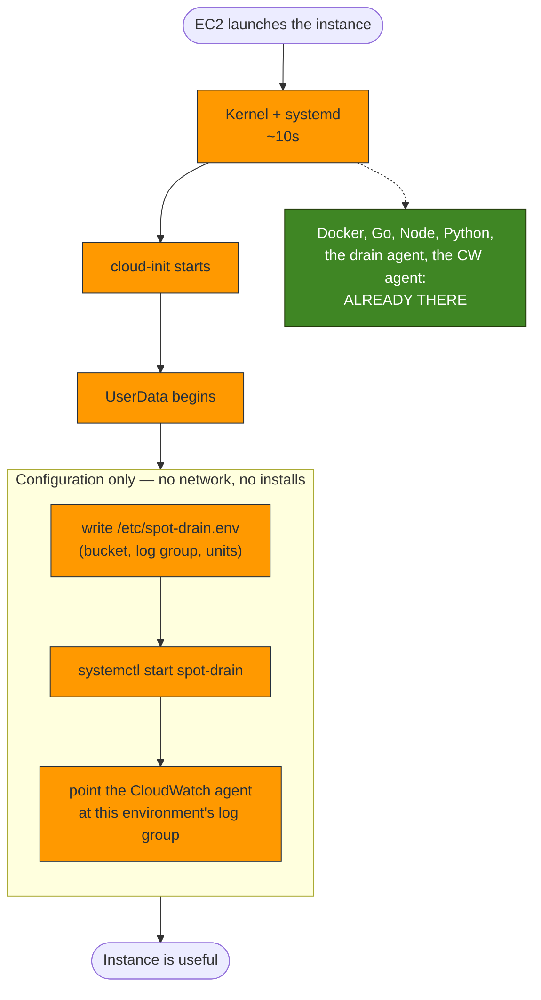
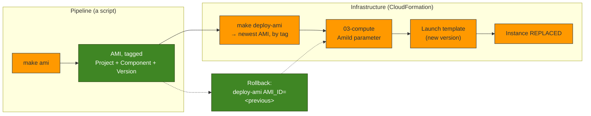
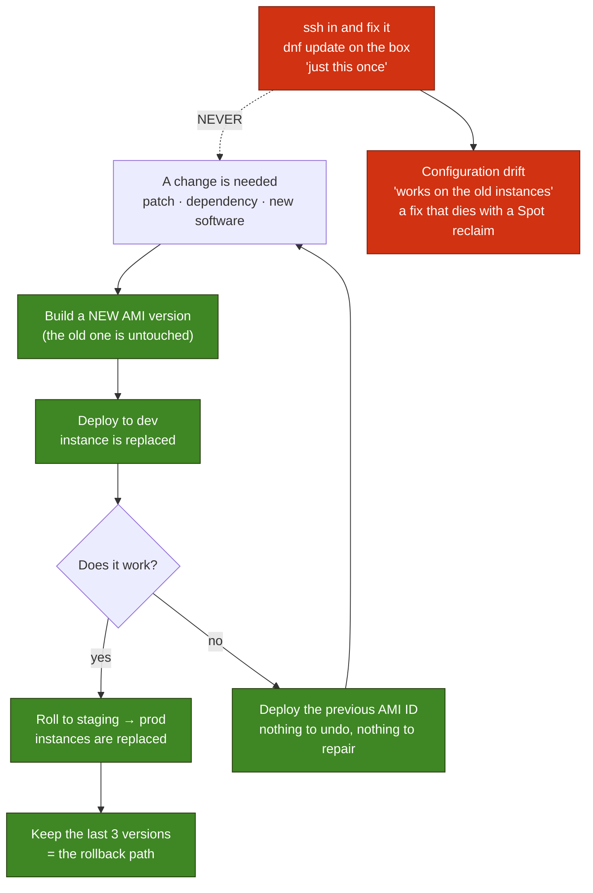

# Custom AMI Diagrams — Milestone 4

> **Milestone 4 — Custom AMIs.**
> These diagrams describe the image pipeline in
> [`infra/scripts/build-ami.sh`](../../infra/scripts/build-ami.sh) and the
> `AmiId` boot path in
> [`03-compute.yaml`](../../infra/cloudformation/03-compute.yaml). They accompany
> the blog post,
> [Optimizing EC2 Spot Instance Startup with Custom AMIs](../blog/optimizing-ec2-spot-instance-startup-with-custom-amis.md),
> and the operational reference, [AMI.md](../../infra/AMI.md).

> **This is a snapshot of Milestone 4.** It is kept as it was written — the record of a
> decision at a point in time. For what is deployed **today**, see
> **[The Platform As Built](current-architecture.md)**, the living diagram.

Five diagrams, sharing the colour key of the
[Milestone 2](infrastructure-diagrams.md) and [Milestone 3](spot-diagrams.md)
sets (compute = orange, storage = green, failure = red).

## 1. Traditional EC2 launch flow

Every launch repeats the same work, and every step is a step that can fail — on an
instance AWS may reclaim before it ever finishes.

The red band is the part that matters: for its first several minutes the instance
exists, is billed, and is **useless**. On Spot, an interruption arriving in that
band means the instance did no work at all. It downloaded packages and died.



## 2. Custom AMI launch flow

The same instance, the same software — but the work already happened, once, at
build time, on a machine nobody was waiting for.

There is no dead band, and nothing to download. UserData does not *install*
anything, so there is no install that can fail.



## 3. AMI creation workflow

Two phases, and they *must* be two phases.

Cleanup destroys the two things provisioning stands on: cloud-init's copy of the
running script (which `cloud-init clean` deletes out from under bash), and the SSM
agent (which is the only channel that can report whether the build worked). So
phase 1 is *confirmed complete* before phase 2 begins.

```mermaid
sequenceDiagram
    autonumber
    participant Dev as make ami
    participant S3
    participant B as Builder (ON-DEMAND)
    participant SSM
    participant EC2

    Dev->>Dev: resolve next version (1.0.0 → 1.0.1)
    Dev->>Dev: refuse if that version already exists
    Dev->>S3: upload provision.sh, cleanup.sh, drain agent
    Dev->>EC2: run-instances (stock AL2023)

    Note over B: PHASE 1 — provision
    B->>S3: fetch the scripts
    B->>B: dnf update; docker, go, node, python, CW agent
    B->>B: install the drain agent (code, not config)
    B->>B: write /etc/ami-manifest.json
    B->>B: touch ami-build.done

    loop poll
        Dev->>SSM: done? failed? where are you?
        SSM-->>Dev: last line of the build log
    end

    Note over Dev,B: PHASE 2 — only now is cleanup safe
    Dev->>SSM: run cleanup.sh
    B->>B: strip credentials, SSH keys, machine-id, SSM registration
    B->>B: cloud-init clean  ← or UserData never runs again
    B->>B: shutdown -h now

    Note over Dev: the SSM command never replies —<br/>cleanup killed the agent. Expected.
    Dev->>EC2: wait instance-stopped ← the real success signal
    Dev->>EC2: create-image (quiesced filesystem)
    Dev->>EC2: tag AMI + snapshot (Project, Component, Version)
    Dev->>EC2: terminate the builder (on every exit path)
```

## 4. Deployment workflow

The AMI ID is the **interface** between the pipeline that builds images and the
infrastructure that consumes them. CloudFormation never learns how the image was
made; the build never learns where the image is used.

Note that the ID is *resolved from tags*, never pasted into a command. An AMI ID
typed into a runbook is an ID that is wrong within a month.



## 5. Immutable infrastructure lifecycle

The loop has no edge that leads back into a *running* instance. That absence is
the entire idea.



Why the red path is genuinely forbidden here, and not merely frowned upon: this
platform runs on **Spot**. An instance you hand-fixed can be reclaimed two minutes
later, taking the fix with it — and the replacement comes up from the image,
without it. A hotfix on ephemeral compute is not a shortcut, it is a fix with a
random expiry date, and nothing records that it ever existed.

The image *is* the environment. Change the image, or change nothing.
