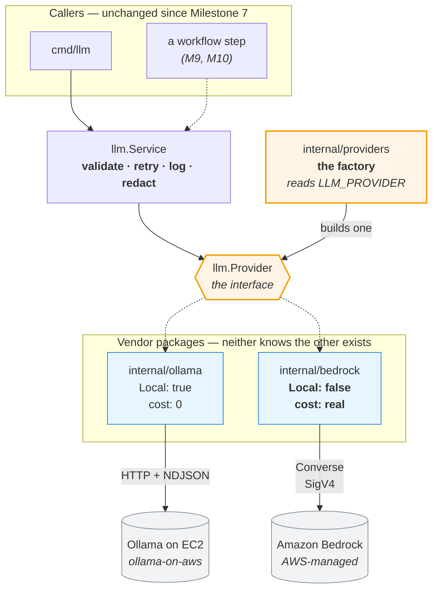
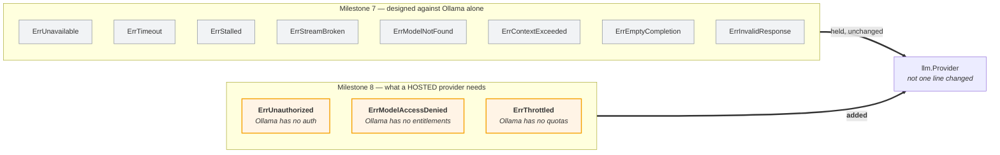
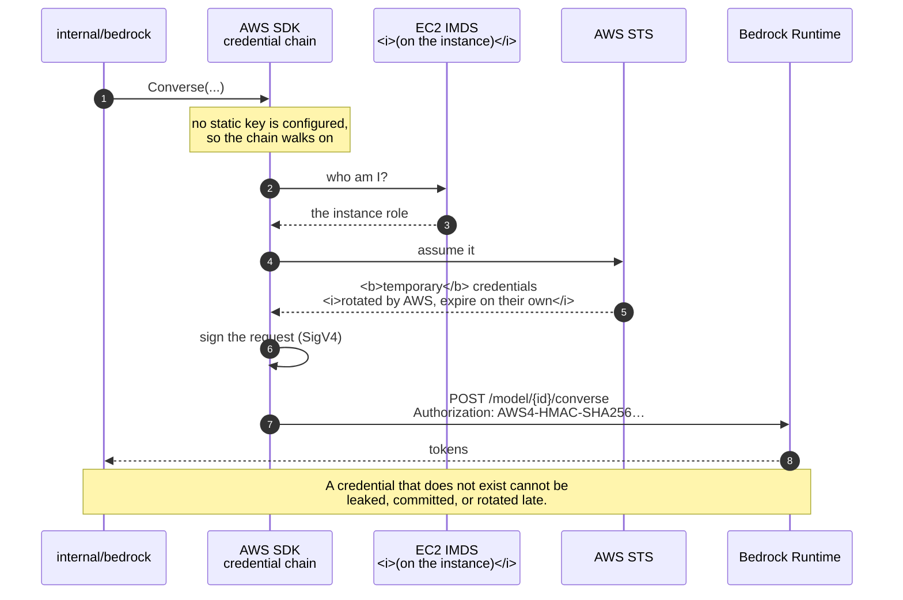
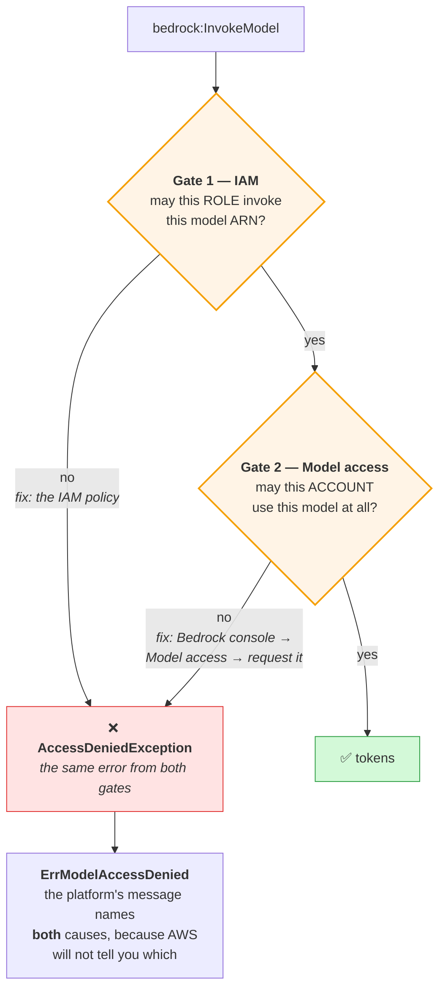
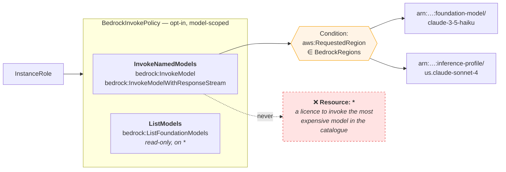
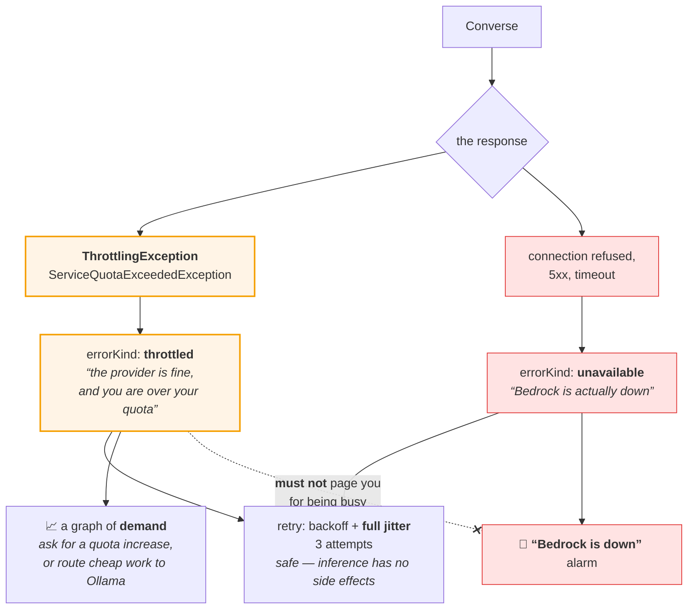
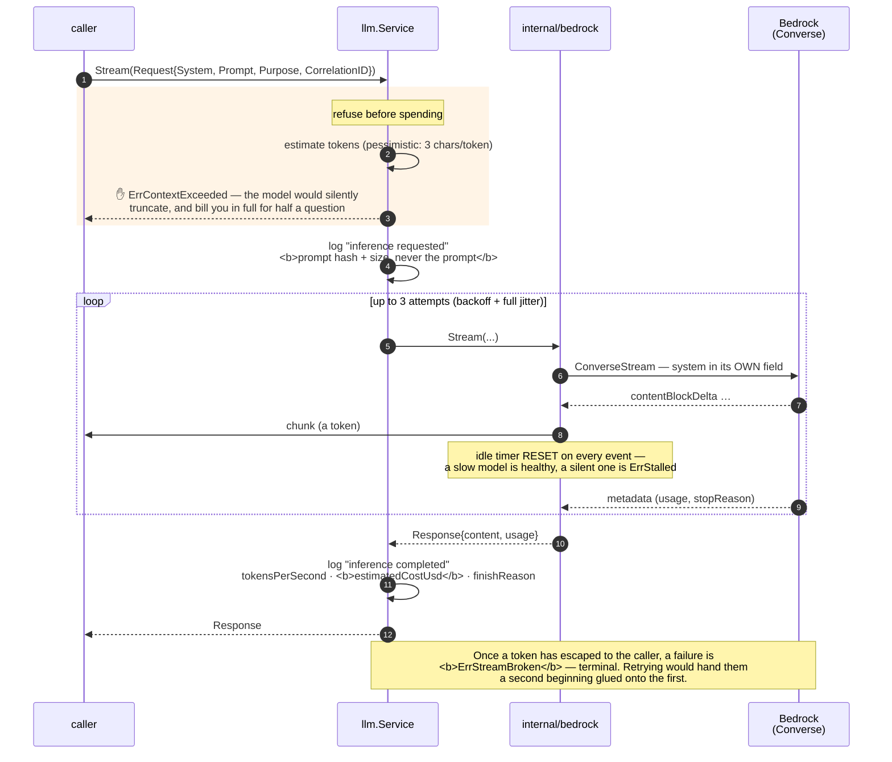
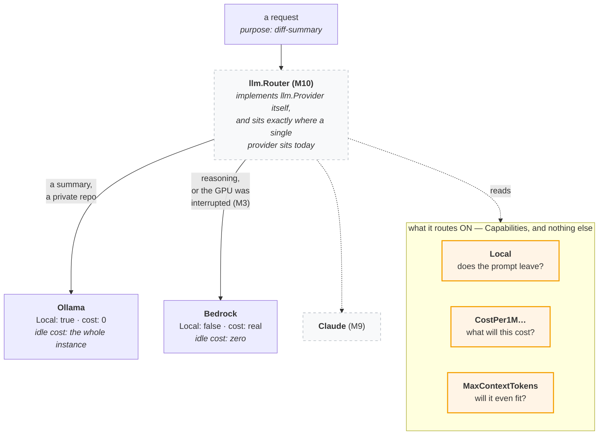

# Bedrock Diagrams — Milestone 8

> **Milestone 8 — Amazon Bedrock Integration.**
> These diagrams describe [`internal/bedrock`](../../internal/bedrock) (the second
> provider) and [`internal/providers`](../../internal/providers) (the factory that
> chooses one). They accompany the blog post,
> [Adding Amazon Bedrock to an AI Agent Platform](../blog/adding-amazon-bedrock-to-an-ai-agent-platform.md),
> and the reference, [INFERENCE.md](../../INFERENCE.md).
>
> **Bedrock is not deployed here** — it is an API, and there is nothing to deploy. What
> this repository owns is the provider that calls it, the IAM policy that permits it, and
> the error vocabulary that explains it when it says no.
>
> The interface these diagrams sit behind is [Milestone 7's](ollama-diagrams.md), and it
> did not change.

## Contents

- [1. Switching providers by configuration](#1-switching-providers-by-configuration)
- [2. What the second provider changed](#2-what-the-second-provider-changed)
- [3. Authentication: there is no credential](#3-authentication-there-is-no-credential)
- [4. The two permissions Bedrock needs](#4-the-two-permissions-bedrock-needs)
- [5. Throttling is not an outage](#5-throttling-is-not-an-outage)
- [6. One request, end to end](#6-one-request-end-to-end)
- [7. Where the router will go](#7-where-the-router-will-go)

## 1. Switching providers by configuration

The claim of the milestone, and the reason `internal/providers` exists as a separate
package: **one environment variable, two entirely different inference backends, and not a
single caller that knows which one it got.**

`internal/llm` does not import either vendor. `internal/ollama` and `internal/bedrock`
do not import each other. **`internal/providers` is the only package permitted to import
both**, and it is a leaf that nothing else depends on — which is what makes the list of
providers a thing you change in one place.

That is not a convention. `internal/architecture_test.go` walks the import graph with
`go/build` and **fails the build** if any of it stops being true.

## 2. What the second provider changed

The interface held. The **vocabulary** did not — and it could not have, because Milestone
7 designed it against a provider that has no authentication, no quotas and no
entitlements.

**You cannot design an abstraction from a sample of one.** None of the three additions is
a Bedrock quirk — *every* hosted provider can reject your credentials, refuse you a model,
and throttle you. M7's interface was right; M7's vocabulary was a description of Ollama
wearing an interface's clothes, and the second implementation is the first honest test of
the first one.

Note equally what was **not** added: no `ErrRegionUnsupported`, no
`ErrInferenceProfileRequired`. Those are real Bedrock failures, and they map onto the
existing nouns with a message that names the AWS-specific fix. The vocabulary grew by
what is true of *hosted providers*, not by what is true of *Bedrock*.

## 3. Authentication: there is no credential

The best thing about integrating an AWS service rather than a SaaS one. There is no API
key in the config, in CloudFormation, in Secrets Manager, or in the environment — because
there is no API key.

Locally, `aws sso login` produces the same kind of temporary credential and the code path
is **identical**. There is no development mode that authenticates differently — because a
development mode that authenticates differently is a production incident waiting for its
moment.

## 4. The two permissions Bedrock needs

The most common Bedrock failure has nothing to do with your code. There are **two gates**,
they are configured in completely different places, and they **throw the same exception**.

Which is why the platform's error says both things at once, rather than "access denied"
and leaving you to re-read an IAM policy that was correct all along.

The IAM policy itself is **empty by default** — `BedrockModelArns` grants nothing until
you name something:

Bedrock is an API that turns permission into money. A wildcard here is the one AWS
wildcard that **bills you** for being wrong, and an instance permitted to call any model
is an instance whose compromise is measured in dollars per minute.

*(An inference profile is a **different resource** from the model it fronts. Newer models
are on-demand only through a `us.`-prefixed profile, and invoking one needs **both** ARNs
— grant only the model and the call fails with a validation error that never mentions
permissions.)*

## 5. Throttling is not an outage

The defining failure of a hosted provider, and the reason it earns its own error kind
instead of being folded into "unavailable".

If throttling were reported as `ErrUnavailable`, a "Bedrock is down" alarm would fire
every time the platform got **busy** — which is precisely when you least want to be woken
up to look at a service that is working perfectly.

**And the AWS SDK's own retries are switched off** (`WithRetryMaxAttempts(1)`). The SDK
retries throttling by default; so does this integration. Three attempts of three is nine
calls, an `attempts: 3` log line that is a lie, and a duration containing backoff nobody
accounted for. **Two retry layers do not add, they multiply — and they hide each other.**

## 6. One request, end to end

## 7. Where the router will go

Milestone 8 did not build a router. It built **the thing a router needs**: two providers
that answer `Capabilities()` differently, behind one interface.

Both fields are true today because M8 forced them to be: `Local` was a lonely `true`
until a provider existed for which it was `false`, and cost was `0` until a provider
existed that charges. **A router built on a `Capabilities` that only one provider had ever
filled in would be routing on fiction.**

The fallback case is the one M3 built for: the Spot GPU vanishes with two minutes'
notice, the local model goes with it, and the platform keeps answering — more expensively,
and without anybody being paged.
