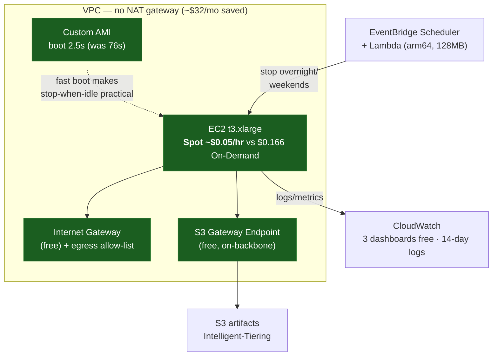
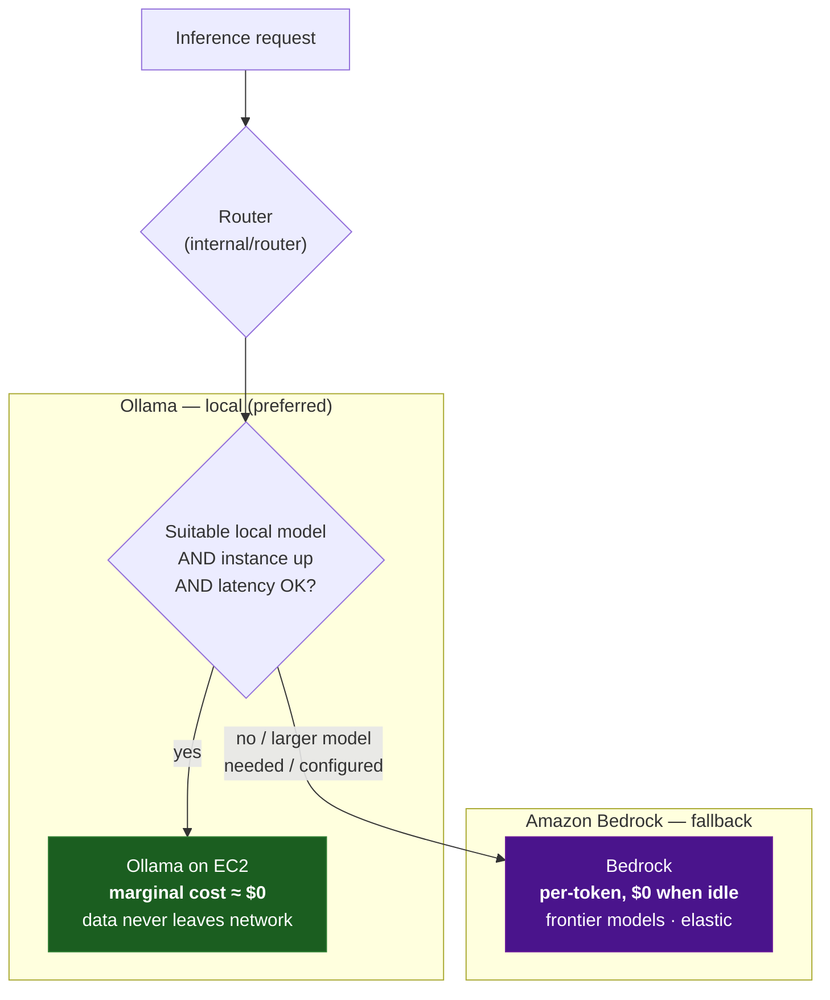
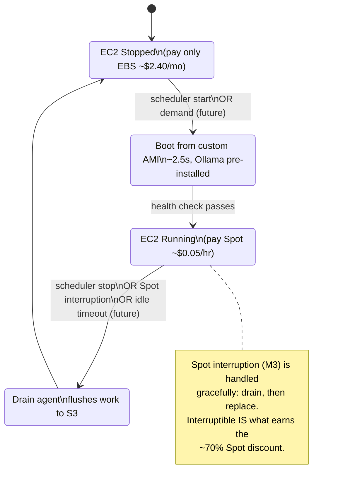
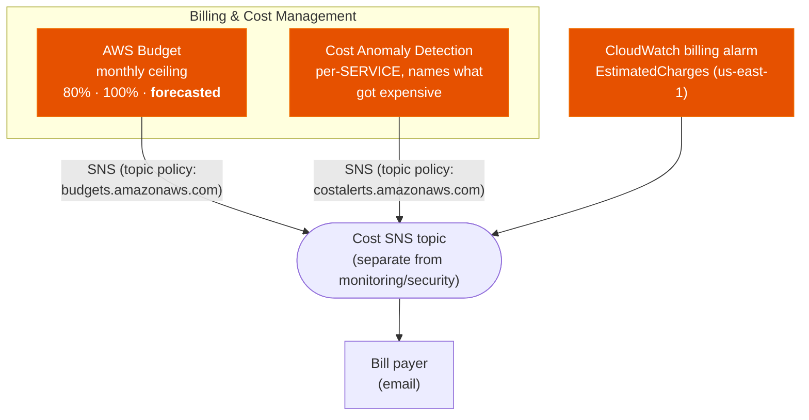

# Cost Optimization Diagrams — Milestone 15

> **Milestone 15 — Cost Optimization.**
> These diagrams show where the platform's architecture reduces operational cost,
> and the guardrails in
> [`infra/cloudformation/12-cost.yaml`](../../infra/cloudformation/12-cost.yaml)
> that keep it that way. They accompany the blog post,
> [Cost Optimization Strategies for AI Platforms on AWS](../blog/cost-optimization-strategies-for-ai-platforms-on-aws.md),
> and the reference, [COST.md](../../COST.md).
>
> **The one idea.** The cheapest resource is switched off; the cheapest inference is
> the token never sent to a paid API. Every arrow below serves one of those two.

## Contents

- [1. Cost-optimized infrastructure](#1-cost-optimized-infrastructure)
- [2. AI routing as a cost decision](#2-ai-routing-as-a-cost-decision)
- [3. Instance lifecycle: paying for hours, not months](#3-instance-lifecycle-paying-for-hours-not-months)
- [4. Cost guardrails](#4-cost-guardrails)

## 1. Cost-optimized infrastructure

Each labelled edge is a place the design chooses the cheaper option. The largest
one is invisible: there is **no NAT gateway** — the internet gateway, egress
allow-list, and S3 gateway endpoint replace it for ~\$32/month saved.

## 2. AI routing as a cost decision

The router (Milestone 10) already chooses a provider per request. Seen as cost, it
is choosing between a **fixed** cost structure (the EC2 hour already paid for) and a
**variable** one (per Bedrock token). Local is preferred; the paid path is a
deliberate, bounded exception.

## 3. Instance lifecycle: paying for hours, not months

The most expensive line on the bill is EC2 instance-hours, and the whole strategy is
to minimise them without hurting availability. The custom AMI's 2.5-second boot is
what makes the "stopped" state cheap to leave — a 76-second boot would make
always-on the rational choice.

## 4. Cost guardrails

The stack this milestone adds. It optimises nothing itself — it is the smoke
detector that tells you an optimisation has silently regressed (an instance that
did not stop, a loop that will not stop calling Bedrock). Three signals, one topic,
one human.

