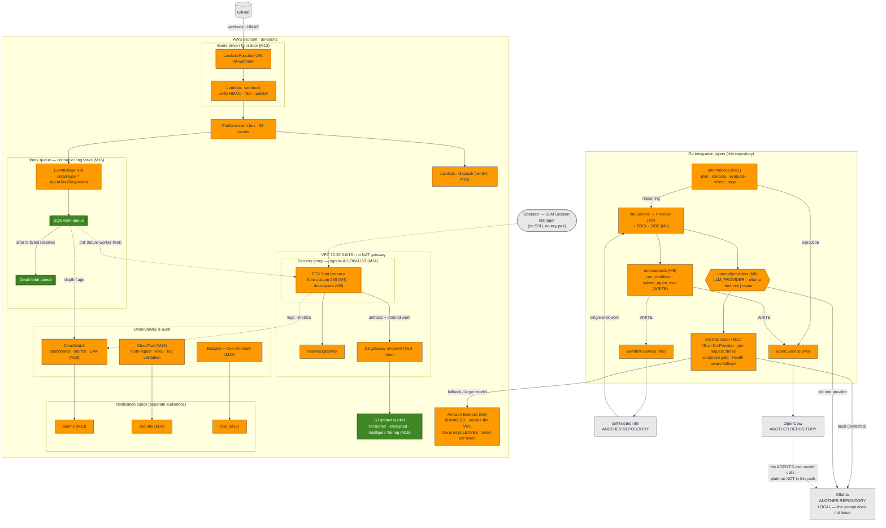
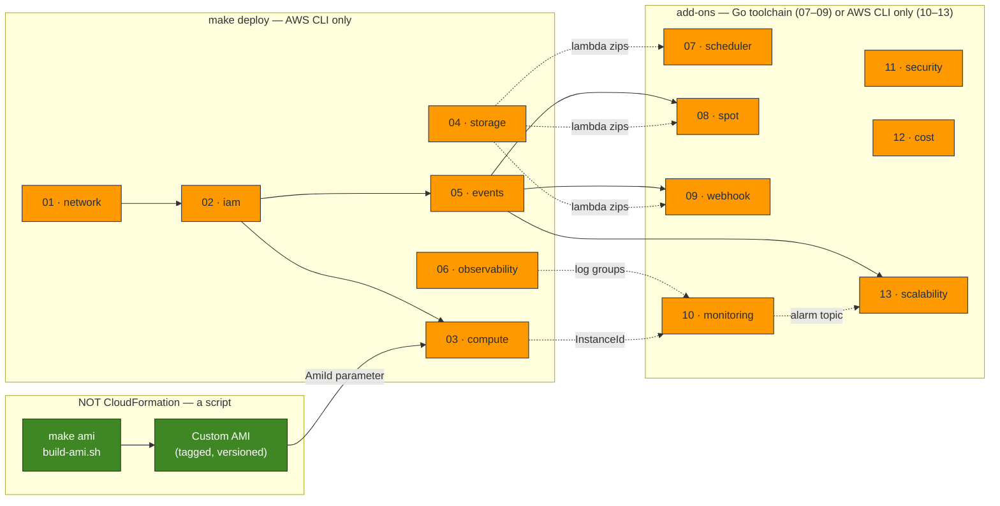
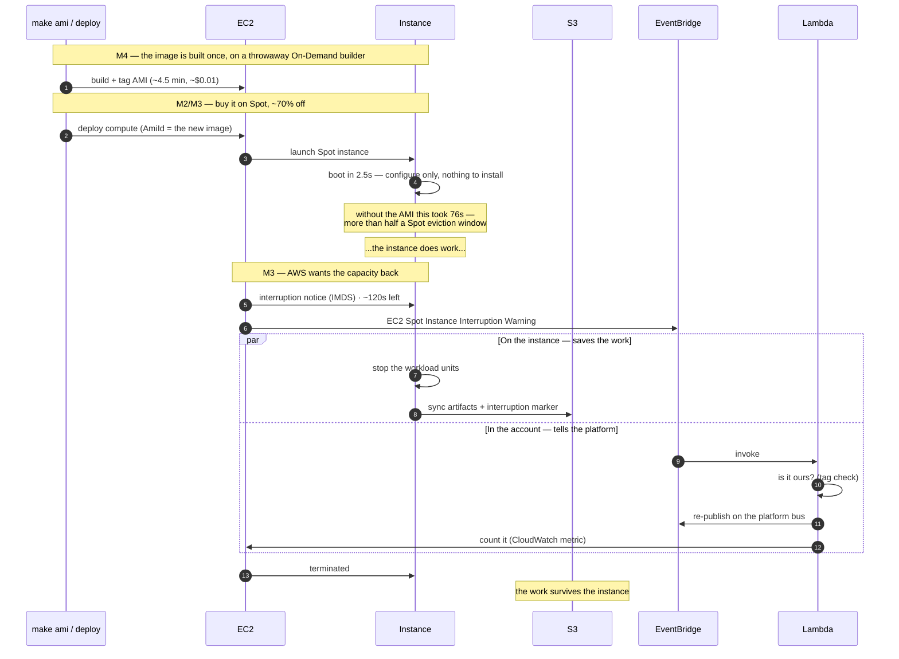

# The Platform As Built

> **This is the living diagram.** It shows what is **actually deployed**, not what
> is planned. Every milestone updates this file; if it disagrees with the code, the
> file is wrong.
>
> **Last updated:** Milestone 17 — Future Extensions.
> **Deployed:** thirteen CloudFormation stacks + an image pipeline, in `dev`, plus the
> Go integration layers — workflow orchestration (n8n), agent execution (OpenClaw), and
> inference behind **one** provider abstraction with **two** implementations, Ollama
> (local) and Amazon Bedrock (managed), and a **router** (M10) that is itself an
> `llm.Provider` and chooses between them per request. On top of that: an autonomous
> **loop controller** (M11), an **event-driven webhook front door** (M12), full
> **CloudWatch observability** (M13), **CloudTrail + egress hardening** (M14), **FinOps
> guardrails** (M15), a **work queue** that decouples long-running tasks from
> orchestration (M16), and a documented, test-enforced **extension model** (M17).
> **Not deployed by this repository:** n8n, OpenClaw and Ollama themselves (they live in
> [their own repositories](../../README.md#related-repositories)); Bedrock is AWS's to
> run. See [What is not built](#what-is-not-built).

The other diagram sets are *snapshots* — each one froze at the milestone that wrote
it, and they are kept that way on purpose, as the record of a decision:

| | Scope |
| --- | --- |
| [diagrams.md](diagrams.md) | **M1** — the target architecture. Aspirational; now largely built, with the deltas noted below. |
| [infrastructure-diagrams.md](infrastructure-diagrams.md) | **M2** — the CloudFormation foundation. |
| [spot-diagrams.md](spot-diagrams.md) | **M3** — Spot interruption handling. |
| [ami-diagrams.md](ami-diagrams.md) | **M4** — the custom AMI pipeline. |
| [n8n-diagrams.md](n8n-diagrams.md) | **M5** — the workflow-orchestration integration. |
| [openclaw-diagrams.md](openclaw-diagrams.md) | **M6** — the agent-execution integration. |
| [ollama-diagrams.md](ollama-diagrams.md) | **M7** — inference and the provider abstraction. |
| [bedrock-diagrams.md](bedrock-diagrams.md) | **M8** — managed inference, and what a second provider did to the abstraction. |
| [claude-diagrams.md](claude-diagrams.md) | **M9** — a model that can act: tool use, structured output, and the retry rule it broke. |
| [router-diagrams.md](router-diagrams.md) | **M10** — hybrid routing: the router as a provider, the constraint gate, fallback, and the three retries it refuses. |
| [loop-diagrams.md](loop-diagrams.md) | **M11** — loop engineering: the agent lifecycle, the reducer, state transitions, retry, reflection, and recovery. |
| [webhook-diagrams.md](webhook-diagrams.md) | **M12** — GitHub webhooks: the entry point, the verify/filter sequence, event routing, the lifecycle, and the retry contract. |
| [observability-diagrams.md](observability-diagrams.md) | **M13** — monitoring: the logging standard, EMF metrics, dashboards, alarms, and the health probes. |
| [SECURITY.md](../../SECURITY.md) | **M14** — security & auditing: the egress allow-list, CloudTrail with log-file validation, and the CIS-style alarm set (no separate diagram file). |
| [cost-optimization-diagrams.md](cost-optimization-diagrams.md) | **M15** — cost: the levers, routing as a cost decision, the instance lifecycle, and the guardrails. |
| [scalability-diagrams.md](scalability-diagrams.md) | **M16** — scalability: the work-queue seam, the component interaction chain, and queue depth as the scaling signal. |
| [extensibility-diagrams.md](extensibility-diagrams.md) | **M17** — extensibility: the arrow-points-inward model, adding a provider, MCP, and the extension map. |
| **this file** | **Everything, as it exists today.** |

## 1. Runtime architecture

The AWS service view. The hand-authored SVG ([platform-as-built.svg](platform-as-built.svg))
is a **historical snapshot frozen at Milestone 7** — an internet gateway, a Spot
instance from a custom AMI, the Spot event Lambdas, and the three integration
repositories drawn outside the account. It is kept as the record of that stage. For the
**current** topology — the webhook front door, the router, the work queue, and the
monitoring, security, and cost planes — the authoritative view is the Mermaid diagram
below and this file as a whole.

**The facts this diagram is really carrying:**

1. **There is now a front door, and it never blocks (M12).** A GitHub webhook hits a
   Lambda Function URL that verifies the HMAC signature (constant-time, over the raw
   body, before parsing), filters the event, and publishes a curated event to the
   platform bus — it never calls n8n or a model directly, so GitHub's ten-second
   webhook timeout can't be turned into a double execution.
2. **Long-running work is decoupled from orchestration (M16).** An EventBridge rule
   routes agent-task events to an SQS work queue; a burst is absorbed as queue depth
   rather than dropped or throttled, a poison task lands in the dead-letter queue, and
   queue depth is the exact signal a future worker fleet (or an Auto Scaling group)
   scales on. The consumer of the queue is deliberately future work.
3. **The provider abstraction became a router without anything above noticing (M10).**
   `LLM_PROVIDER=router` builds Ollama *and* Bedrock behind `internal/router`, which
   **is** an `llm.Provider` and chooses per request by cost, capability, and whether the
   prompt may leave the network. A `RequireLocal` request is served locally or refused —
   there is no third outcome, and no fallback may trade that constraint away.
4. **The model can act, and the loop keeps it honest (M9, M11).** Through the tool loop,
   an inference can `run_workflow` and `submit_agent_task` — so an inference can start an
   n8n run and open a pull request. The graph has a cycle, and the cycle spends money,
   which is why a conversation in which a `Write` tool has run is [never retried or
   failed over](../../INFERENCE.md#a-retry-was-safe-here--milestone-9-withdrew-that). The
   `internal/loop` reducer (M11) drives a goal through plan → execute → evaluate →
   reflect → stop, delegating reasoning to the inference plane and execution to the agent
   runtime, importing neither.
5. **The box is hardened around software that does what it is told (M14).** The security
   group's egress is an **allow-list**, not open; S3 is reached over a free gateway
   endpoint; there is no NAT gateway. A multi-region CloudTrail with its own KMS key and
   log-file validation records the account, and CIS-style alarms page a **separate**
   security topic.
6. **Three planes of signals, three audiences (M13–M15).** CloudWatch dashboards and
   alarms go to the on-call topic; CloudTrail alarms to the security topic; Budgets and
   Cost Anomaly Detection to the bill-payer's cost topic. "The platform is down", "someone
   used root", and "you are about to overspend" are three different conversations, kept on
   three different topics on purpose.
7. **Bedrock is still the one arrow where the prompt leaves the network**, inside the
   region but outside the VPC, billed per token — which is why the router prefers Ollama
   and why `Capabilities.Local` is a first-class routing fact.

## 2. The stacks, and the one thing that is not a stack

The six **core** stacks (01–06) deploy with nothing but the AWS CLI. The **add-ons**
layer on top: 07–09 need the Go toolchain to build their Lambdas; 10–13 are pure
CloudFormation. `11-security`, `12-cost`, and `13-scalability` are independent of the
compute instance — they audit, guard, and buffer the account and the bus, not one box.

**Why the AMI is not a stack.** CloudFormation has no resource type that *builds* an
image. It **consumes** one — that is the compute stack's `AmiId` parameter. Building is a
pipeline concern, consuming is an infrastructure concern, and **the AMI ID is the
interface between them.**

**And why n8n, OpenClaw and Ollama are not on this map at all.** None of them is a stack
or a script here — each is *another repository's deployment*. Milestones 5, 6 and 7 added
integrations and, between them, **zero AWS resources**:

| Milestone | The integration (here) | The deployment (not here) |
| --- | --- | --- |
| M5 | [`internal/workflow`](../../internal/workflow) + [`internal/n8n`](../../internal/n8n) | `self-hosted-n8n-on-aws` |
| M6 | [`internal/agent`](../../internal/agent) + [`internal/openclaw`](../../internal/openclaw) | `openclaw-on-aws` |
| M7 | [`internal/llm`](../../internal/llm) + [`internal/ollama`](../../internal/ollama) | `ollama-on-aws` |

If an n8n, OpenClaw or Ollama stack ever appears in `infra/cloudformation`, the boundary
this repository committed to has failed:

> *If a change affects more than one component, it belongs in the platform. If it
> affects exactly one, it belongs in that component's repository.*

Each integration is the same shape on purpose — a `Service` that validates, correlates,
times and logs, over an interface (`Engine`, `Runtime`, `Provider`) with one or more
implementations. None of the core packages imports its own client:
`workflow`↛`n8n`, `agent`↛`openclaw`, `llm`↛`ollama`, and — since M10 —
`router`↛`ollama`/`bedrock`. That is the mechanical test (M17's
[`internal/architecture_test.go`](../../internal/architecture_test.go)) that the seams
are real rather than decorative, and it is checked, not asserted.

## 3. The life of one instance

This is the diagram that ties the milestones together. Read it as one continuous
story: an instance is *built* (M4), *bought cheaply* (M3), *used*, *taken away*
(M3), and *replaced* — and no step requires a human.

## 4. What each milestone added

```mermaid
flowchart TB
    m1["M1 · Architecture (design only)"] --> m2
    m2["M2 · CloudFormation — the instance is disposable"] --> m3
    m3["M3 · EC2 Spot + interruption — disposability is SAFE"] --> m4
    m4["M4 · Custom AMIs — disposability is CHEAP"] --> m5
    m5["M5 · n8n — the platform can ORCHESTRATE"] --> m6
    m6["M6 · OpenClaw — the platform can DELEGATE WORK"] --> m7
    m7["M7 · Ollama + provider abstraction — it can THINK, locally"] --> m8
    m8["M8 · Bedrock — it can CHOOSE ITS BRAIN"] --> m9
    m9["M9 · Claude — the model can ACT (retry-is-safe WITHDRAWN)"] --> m10
    m10["M10 · Hybrid routing — choose a provider PER REQUEST"] --> m11
    m11["M11 · Loop engineering — pursue a GOAL, bounded + recoverable"] --> m12
    m12["M12 · GitHub webhooks — an event-driven FRONT DOOR"] --> m13
    m13["M13 · Observability — it is now VISIBLE"] --> m14
    m14["M14 · Security — egress allow-list, CloudTrail, CIS alarms"] --> m15
    m15["M15 · Cost — cheap to leave running, guarded against regression"] --> m16
    m16["M16 · Scalability — a work queue; SHAPED to scale horizontally"] --> m17
    m17["M17 · Future Extensions — a test-enforced EXTENSION MODEL"] --> mcp

    mcp["MCP Integration — next"]:::next

    classDef done fill:#3F8624,stroke:#243B0B,color:#FFFFFF
    classDef next fill:#E8E8E8,stroke:#666,color:#232F3E,stroke-dasharray: 5 5
    class m1,m2,m3,m4,m5,m6,m7,m8,m9,m10,m11,m12,m13,m14,m15,m16,m17 done
```

The dependency between them is not arbitrary, and it is the argument of the whole
series:

- **Disposability took three milestones.** M2 *declared* the instance disposable; M3
  made it **safe** (a reclaimed instance no longer loses its work); M4 made it **cheap**
  (a replacement boots in 2.5s). Any one alone is a slogan.
- **The inference plane repeats the shape.** M7 declared the provider abstraction with
  one implementation; M8 tested the claim with a second and the *error vocabulary* grew
  while the *interface* held; M9 added a *capability* (the model can act) that changed the
  interface a whole extra provider had not; M10 collected the payoff — the router **is** an
  `llm.Provider` and nothing above it noticed.
- **The production milestones make it operable.** M11 gives it a goal to pursue, M12 a
  front door, M13 eyes, M14 a hardened boundary, M15 a budget it cannot silently blow,
  M16 the seam to scale, and M17 the model for extending it — each a precondition for the
  agent workloads that come after.

## What is not built

Being explicit, because the [M1 target architecture](diagrams.md) and the roadmap
describe more than exists today:

| | Status |
| --- | --- |
| n8n and OpenClaw **deployments** | ➡️ Not ours. Owned by [their own repositories](../../README.md#related-repositories). This one owns the **integrations** — the contracts, not the instances. |
| The webhook front door | ✅ **Built (M12).** A Lambda Function URL that verifies the HMAC, filters, and publishes to EventBridge — never blocking on the work. |
| **Hybrid routing** | ✅ **Built (M10).** `internal/router` is an `llm.Provider`, choosing Ollama or Bedrock per request, capability-aware, with a constraint gate and health-aware fallback. |
| Autonomous goal-pursuit | ✅ **Built (M11).** A bounded, recoverable loop controller — plan, execute, evaluate, reflect, stop — with stopping conditions enforced in code. |
| Monitoring, alarms, dashboards | ✅ **Built (M13).** Three dashboards, EMF metrics, alarms on an SNS path, health probes. See [OBSERVABILITY.md](../../OBSERVABILITY.md). |
| Security & auditing | ✅ **Built (M14).** Egress allow-list, S3 gateway endpoint, multi-region CloudTrail (KMS, log validation), CIS-style alarms. See [SECURITY.md](../../SECURITY.md). |
| Cost guardrails | ✅ **Built (M15).** AWS Budget with a forecasted-breach alert, per-service Cost Anomaly Detection, a billing alarm. See [COST.md](../../COST.md). |
| A work queue to decouple long tasks | ✅ **Built (M16).** SQS work queue + DLQ, an event rule that load-levels agent-task events, and queue-depth alarms. See [SCALABILITY.md](../../SCALABILITY.md). |
| A **consumer** for the work queue (worker fleet) | ❌ Not built. The queue and its scaling signal exist; the workers that drain it are a future milestone. |
| **Failover** — a running `Write`-tool conversation → another provider | ❌ Not possible by design, and correctly so. Routing and health-aware fallback are built (M10), but a conversation that has already run a `Write` tool cannot be replayed elsewhere — replaying it would run the workflow again. |
| Prompt versioning | ✅ **Built.** `internal/prompt` carries `PromptName`/`Category`/`Version` on every request. |
| RAG / vector store | 📐 **Designed, not built (M17).** A `memory.Store` interface is specified in [EXTENSIBILITY.md](../../EXTENSIBILITY.md); no implementation ships. |
| MCP (client and server) | 📐 **Designed, not built (M17).** It lands on the existing `llm.ToolRunner` seam; it is the next milestone. |
| Any model inference **on our own hardware** | ❌ None. No GPU instance runs (cost + quota). Bedrock needs none — which is exactly its appeal, and exactly its bill. |
| Auto Scaling group | ❌ Still **one** instance. The launch template (M3) and the work queue + scaling signal (M16) make it a drop-in; the fleet itself is a later milestone. |
| Private subnets / NAT | ❌ Public subnet only, deliberately (no $32/mo NAT), with egress hardened to an allow-list (M14). |
| Multi-tenancy | ❌ Not built. The extension model (M17) is a precondition for it, not the thing itself. |
| Scheduled AMI rebuilds | ❌ Manual. A baked image gets staler every day. |

The honest summary: **the platform can now take an event at a non-blocking front door,
orchestrate work, delegate it to an agent, think for itself — on a model it runs or a
model AWS runs, chosen per request — pursue a goal within bounds it cannot exceed, and do
it observably, securely, cheaply, and in a shape ready to scale.** What it still does not
have is the *workloads*: the compute is provisioned and empty, no agent runs on it yet,
and the integrations (MCP, a vector store, a worker fleet) that the last milestones
*designed* are the next ones to *build*.

## Keeping this file current

This file is the one that goes stale fastest, and a stale architecture diagram is
worse than none — it is a confident lie. When a milestone changes what is deployed:

1. Update the **runtime** diagram (§1) — resources that actually exist.
2. Update the **stack map** (§2) if a stack or pipeline is added.
3. Add a node to **what each milestone added** (§4).
4. Move a row out of **What is not built** (§5) when it becomes true.
5. Update the header: *Last updated*, *Deployed*, *Not deployed*.

Leave the per-milestone diagram files alone. They are snapshots of a decision at a
point in time, and rewriting them to match the present would destroy the only record
of why the decision was made. The hand-authored SVGs are snapshots too — the M1
[target](aws-architecture.svg) and the M7 [as-built](platform-as-built.svg) — and this
Mermaid view, not the SVG, is the one kept current.
