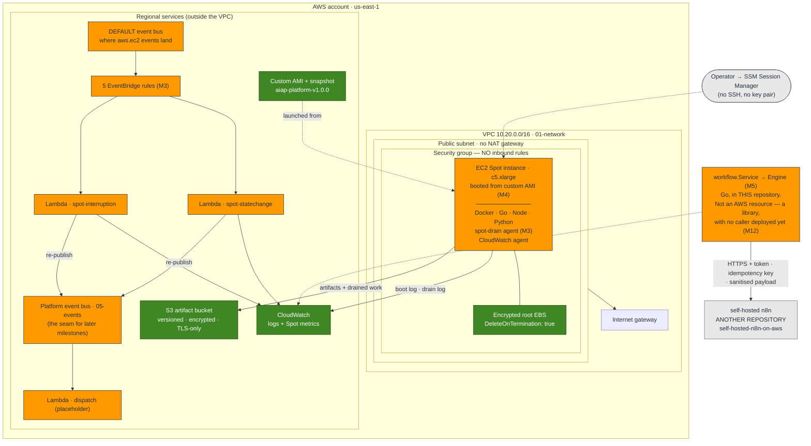
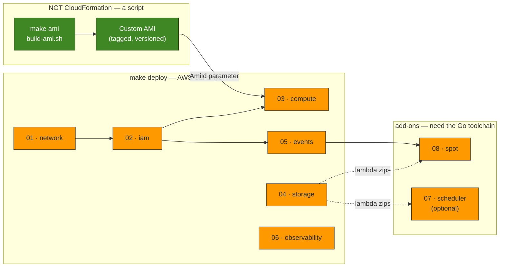
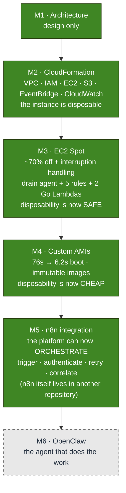

# The Platform As Built

> **This is the living diagram.** It shows what is **actually deployed**, not what
> is planned. Every milestone updates this file; if it disagrees with the code, the
> file is wrong.
>
> **Last updated:** Milestone 5 — Self-hosted n8n Integration.
> **Deployed:** eight CloudFormation stacks + an image pipeline, in `dev`, plus the
> workflow-orchestration integration layer.
> **Not deployed by this repository:** n8n itself (it lives in
> [`self-hosted-n8n-on-aws`](../../README.md#related-repositories)), and any AI
> workload. See [What is not built](#what-is-not-built).

The other diagram sets are *snapshots* — each one froze at the milestone that wrote
it, and they are kept that way on purpose, as the record of a decision:

| | Scope |
| --- | --- |
| [diagrams.md](diagrams.md) | **M1** — the target architecture. Aspirational, and still mostly unbuilt. |
| [infrastructure-diagrams.md](infrastructure-diagrams.md) | **M2** — the CloudFormation foundation. |
| [spot-diagrams.md](spot-diagrams.md) | **M3** — Spot interruption handling. |
| [ami-diagrams.md](ami-diagrams.md) | **M4** — the custom AMI pipeline. |
| [n8n-diagrams.md](n8n-diagrams.md) | **M5** — the workflow-orchestration integration. |
| **this file** | **Everything, as it exists today.** |

## 1. Runtime architecture

The AWS service view — the same hand-authored, version-controlled SVG approach as
the [Milestone 1](aws-architecture.svg) and [Milestone 2](infrastructure-overview.svg)
diagrams, with the same nesting (Cloud → Region → VPC → subnet → security group) and
the same colour key.

Note how little of it is an "AI platform" yet. This is a foundation with no workload
on it, and the legend says so out loud rather than leaving you to infer it.

![The platform as built after Milestone 5: an internet gateway fronts a VPC public subnet whose default-deny security group contains an EC2 Spot instance launched from a custom AMI, with an encrypted root volume deleted on termination; the instance saves artifacts and drained work to S3 and ships its boot and drain logs to CloudWatch; EC2 lifecycle events land on the account default event bus where five EventBridge rules invoke two Go Lambdas that count them and re-publish onto the platform event bus; operators reach the instance only through SSM Session Manager and there is no inbound access; beneath the AWS account, drawn outside it, sits self-hosted n8n, deployed by a separate repository, which the platform triggers over HTTPS with a token, an idempotency key and a sanitised payload; no AI workload is deployed.](platform-as-built.svg)

The same thing as a flow view — useful for seeing the two independent paths out of
an interruption (the instance saves its own work; the account merely watches):

**The three facts this diagram is really carrying:**

1. **Nothing durable lives on the instance.** The root volume is deleted on
   termination, so anything that must survive goes to S3 — which is why the drain
   agent (M3) exists at all.
2. **The instance is reachable by nobody.** No inbound rules, no SSH key. Operators
   arrive through SSM Session Manager.
3. **n8n is drawn outside the account on purpose.** Milestone 5 added an
   *integration*, not infrastructure — it creates **no AWS resources**. The engine is
   deployed, versioned and backed up by
   [`self-hosted-n8n-on-aws`](../../README.md#related-repositories); this repository
   owns only the contract with it. And that integration has **no caller deployed yet**:
   the webhook handler is Milestone 12, so today it is exercised by
   [`cmd/workflow`](../../cmd/workflow) and its tests.

## 2. The stacks, and the one thing that is not a stack

**Why the AMI is not a stack.** CloudFormation has no resource type that *builds* an
image. It **consumes** one — that is the compute stack's `AmiId` parameter. Building
is a pipeline concern, consuming is an infrastructure concern, and **the AMI ID is
the interface between them.** Keeping that seam clean is why `03-compute` neither
knows nor cares how its image was made.

**And why n8n is not on this map at all.** It is neither a stack nor a script here —
it is *another repository's deployment*. Milestone 5 added the integration
([`internal/workflow`](../../internal/workflow), [`internal/n8n`](../../internal/n8n))
and **zero AWS resources**. If an n8n stack ever appears in `infra/cloudformation`,
the boundary this repository committed to has failed:

> *If a change affects more than one component, it belongs in the platform. If it
> affects exactly one, it belongs in that component's repository.*

An n8n version bump affects n8n. The shape of the JSON we send it affects everything
that sends it — so the payload, the auth header, the retry policy and the idempotency
key live here, and the servers do not.

## 3. The life of one instance

This is the diagram that ties the milestones together. Read it as one continuous
story: an instance is *built* (M4), *bought cheaply* (M3), *used*, *taken away*
(M3), and *replaced* — and no step requires a human.

## 4. What each milestone added

The dependency between them is not arbitrary, and it is the argument of the whole
series so far:

- **M2 declared the instance disposable** (`DeleteOnTermination: true`). That was a
  claim, not yet a capability.
- **M3 made disposability safe** — a reclaimed instance no longer loses its work.
- **M4 made disposability cheap** — a replacement boots in seconds, so *replacing*
  becomes a viable strategy rather than a last resort.

Immutable infrastructure needs all three. Any one of them alone is a slogan.

## What is not built

Being explicit, because the [M1 target architecture](diagrams.md) shows a great deal
more than this:

| | Status |
| --- | --- |
| n8n **deployment** | ➡️ Not ours. Owned by [`self-hosted-n8n-on-aws`](../../README.md#related-repositories). This repository owns the **integration** — the contract, not the instance. |
| The webhook handler that calls the integration | ❌ Not built (M12). `cmd/workflow` is the reference caller in the meantime. |
| OpenClaw, Ollama | ❌ Not installed. The compute is still empty. |
| Any model inference | ❌ None. No GPU instance runs (cost + quota). |
| Bedrock / Claude routing | ❌ Not built. |
| Auto Scaling group | ❌ Still **one** instance. The launch template is ready for it (M19). |
| Private subnets / NAT | ❌ Public subnet only, deliberately (no $32/mo NAT). |
| Alarms + dashboards | ❌ Metrics and logs exist; nothing alerts on them (M15). |
| Scheduled AMI rebuilds | ❌ Manual. A baked image gets staler every day. |

The honest summary: **this is a well-built platform that can now ask for work to be
done, but has nothing yet to do it with.** Milestone 5 gave it an orchestrator to
delegate to; Milestone 6 gives it an agent that can actually act.

## Keeping this file current

This file is the one that goes stale fastest, and a stale architecture diagram is
worse than none — it is a confident lie. When a milestone changes what is deployed:

1. Update the **runtime** diagram (§1) — resources that actually exist.
2. Update the **stack map** (§2) if a stack or pipeline is added.
3. Add a node to **what each milestone added** (§4).
4. Move a row out of **What is not built** (§5) when it becomes true.
5. Update the header: *Last updated*, *Deployed*, *Not deployed*.

Leave the per-milestone diagram files alone. They are snapshots of a decision at a
point in time, and rewriting them to match the present would destroy the only record
of why the decision was made.
