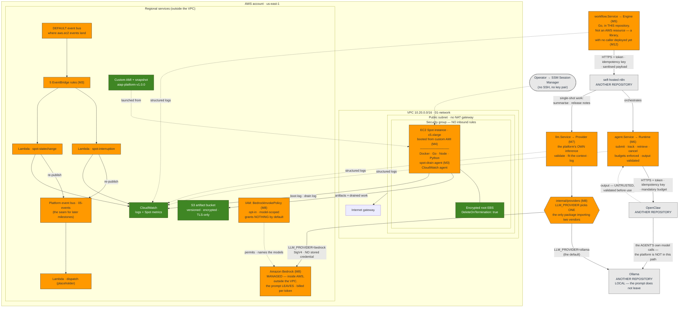
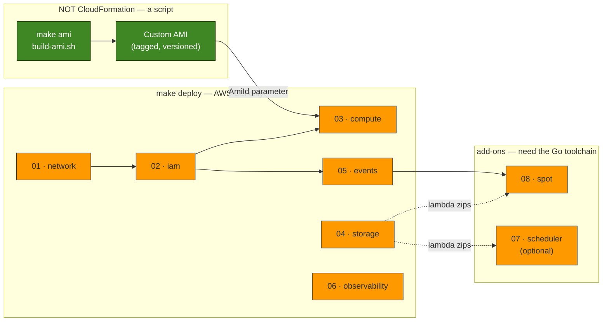
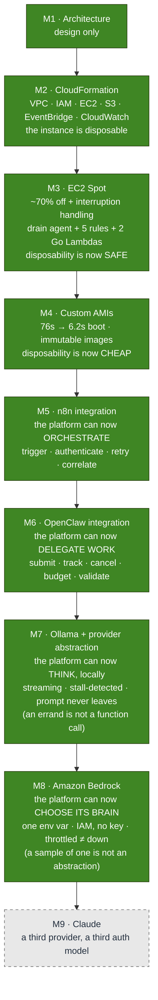

# The Platform As Built

> **This is the living diagram.** It shows what is **actually deployed**, not what
> is planned. Every milestone updates this file; if it disagrees with the code, the
> file is wrong.
>
> **Last updated:** Milestone 8 — Amazon Bedrock Integration.
> **Deployed:** eight CloudFormation stacks + an image pipeline, in `dev`, plus four
> integration layers — workflow orchestration (n8n), agent execution (OpenClaw), and
> inference behind **one** provider abstraction with **two** implementations: Ollama
> (local) and Amazon Bedrock (managed), switched by `LLM_PROVIDER`.
> **New AWS resource:** an **opt-in, model-scoped IAM policy** for Bedrock — the first
> AWS resource an integration milestone has added, and it grants **nothing** by default.
> **Not deployed by this repository:** n8n, OpenClaw and Ollama themselves (they live in
> [their own repositories](../../README.md#related-repositories)); Bedrock is AWS's to
> run. See [What is not built](#what-is-not-built).

The other diagram sets are *snapshots* — each one froze at the milestone that wrote
it, and they are kept that way on purpose, as the record of a decision:

| | Scope |
| --- | --- |
| [diagrams.md](diagrams.md) | **M1** — the target architecture. Aspirational, and still mostly unbuilt. |
| [infrastructure-diagrams.md](infrastructure-diagrams.md) | **M2** — the CloudFormation foundation. |
| [spot-diagrams.md](spot-diagrams.md) | **M3** — Spot interruption handling. |
| [ami-diagrams.md](ami-diagrams.md) | **M4** — the custom AMI pipeline. |
| [n8n-diagrams.md](n8n-diagrams.md) | **M5** — the workflow-orchestration integration. |
| [openclaw-diagrams.md](openclaw-diagrams.md) | **M6** — the agent-execution integration. |
| [ollama-diagrams.md](ollama-diagrams.md) | **M7** — inference and the provider abstraction. |
| [bedrock-diagrams.md](bedrock-diagrams.md) | **M8** — managed inference, and what a second provider did to the abstraction. |
| **this file** | **Everything, as it exists today.** |

## 1. Runtime architecture

The AWS service view — the same hand-authored, version-controlled SVG approach as
the [Milestone 1](aws-architecture.svg) and [Milestone 2](infrastructure-overview.svg)
diagrams, with the same nesting (Cloud → Region → VPC → subnet → security group) and
the same colour key.

Note how little of it is an "AI platform" yet. This is a foundation with no workload
on it, and the legend says so out loud rather than leaving you to infer it.

![The platform as built after Milestone 7: an internet gateway fronts a VPC public subnet whose default-deny security group contains an EC2 Spot instance launched from a custom AMI, with an encrypted root volume deleted on termination; the instance saves artifacts and drained work to S3 and ships its boot and drain logs to CloudWatch; EC2 lifecycle events land on the account default event bus where five EventBridge rules invoke two Go Lambdas that count them and re-publish onto the platform event bus; operators reach the instance only through SSM Session Manager and there is no inbound access; beneath the AWS account, drawn outside it, sit three component repositories the platform integrates with but does not deploy — self-hosted n8n for orchestration, OpenClaw for agentic execution (which calls its own model and whose output is untrusted), and Ollama for local inference, where the prompt never leaves the network; a fourth integration, Amazon Bedrock, is drawn inside the AWS region but outside the VPC, reached over SigV4-signed HTTPS with no stored credential and permitted by an opt-in IAM policy that names the models it may invoke, and it is the one path where the prompt does leave the network and is billed per token; choosing between the two providers per request is not built yet.](platform-as-built.svg)

The same thing as a flow view — useful for seeing the two independent paths out of
an interruption (the instance saves its own work; the account merely watches):

**The five facts this diagram is really carrying:**

1. **Nothing durable lives on the instance.** The root volume is deleted on
   termination, so anything that must survive goes to S3 — which is why the drain
   agent (M3) exists at all.
2. **The instance is reachable by nobody.** No inbound rules, no SSH key. Operators
   arrive through SSM Session Manager.
3. **n8n and OpenClaw are drawn outside the account on purpose.** Milestones 5 and 6
   added *integrations*, not infrastructure — between them they create **no AWS
   resources**. (Milestone 8 is the first integration that creates one: an IAM managed
   policy. It is opt-in, model-scoped, and grants nothing until you name a model.) Both engines are deployed, versioned and backed up by
   [their own repositories](../../README.md#related-repositories); this one owns only
   the contracts. Neither integration has a **caller deployed yet**: the webhook handler
   is Milestone 12, so today they are exercised by
   [`cmd/workflow`](../../cmd/workflow), [`cmd/agent`](../../cmd/agent), and their tests.
4. **There are now TWO consumers of inference, and they are different.** The *agent*
   calls its own model, behind its own boundary — the platform is not in that path, and
   swapping the agent's model remains a change in `openclaw-on-aws` that this repository
   does not notice. Separately, the *platform* now runs its own **single-shot** inference
   (M7): summarise a diff, write release notes — one prompt, one completion, no agent
   needed. That is the inference plane, and it is
   [a correction to what Milestone 6 said](../../INFERENCE.md#wait--milestone-6-said-the-platform-calls-no-model),
   not a contradiction of it.
5. **Bedrock is inside the region and outside the VPC, and that is the whole point of
   drawing it there.** It is the one arrow on this diagram where **the prompt leaves the
   network** — into AWS, in your account's region, but *out*. That is the deal, it should
   be a decision rather than a default, and it is why `LLM_PROVIDER` defaults to `ollama`
   and why `Capabilities.Local` is a first-class field. It is also the only arrow that is
   **billed per token**: everything else on this diagram costs the same whether it runs
   once or a thousand times.

## 2. The stacks, and the one thing that is not a stack

**Why the AMI is not a stack.** CloudFormation has no resource type that *builds* an
image. It **consumes** one — that is the compute stack's `AmiId` parameter. Building
is a pipeline concern, consuming is an infrastructure concern, and **the AMI ID is
the interface between them.** Keeping that seam clean is why `03-compute` neither
knows nor cares how its image was made.

**And why n8n, OpenClaw and Ollama are not on this map at all.** None of them is a
stack or a script here — each is *another repository's deployment*. Milestones 5, 6 and
7 added integrations and, between them, **zero AWS resources**:

| Milestone | The integration (here) | The deployment (not here) |
| --- | --- | --- |
| M5 | [`internal/workflow`](../../internal/workflow) + [`internal/n8n`](../../internal/n8n) | `self-hosted-n8n-on-aws` |
| M6 | [`internal/agent`](../../internal/agent) + [`internal/openclaw`](../../internal/openclaw) | `openclaw-on-aws` |
| M7 | [`internal/llm`](../../internal/llm) + [`internal/ollama`](../../internal/ollama) | `ollama-on-aws` |

If an n8n, OpenClaw or Ollama stack ever appears in `infra/cloudformation`, the boundary
this repository committed to has failed:

> *If a change affects more than one component, it belongs in the platform. If it
> affects exactly one, it belongs in that component's repository.*

An n8n version bump affects n8n; a GPU driver on the Ollama host affects that host. But
the shape of the JSON we send them, the auth, the retry policy, the idempotency key and
the provider abstraction affect **everything that calls them** — so those live here, and
the servers do not.

Each integration is the same shape on purpose — a `Service` that validates, correlates,
times and logs, over an interface (`Engine`, `Runtime`, `Provider`) with one
implementation. None of the three core packages imports its own client:
`workflow`↛`n8n`, `agent`↛`openclaw`, `llm`↛`ollama`. That is the mechanical test that
the seams are real rather than decorative, and it is checked, not asserted.

## 3. The life of one instance

This is the diagram that ties the milestones together. Read it as one continuous
story: an instance is *built* (M4), *bought cheaply* (M3), *used*, *taken away*
(M3), and *replaced* — and no step requires a human.

## 4. What each milestone added

The dependency between them is not arbitrary, and it is the argument of the whole
series so far:

- **M2 declared the instance disposable** (`DeleteOnTermination: true`). That was a
  claim, not yet a capability.
- **M3 made disposability safe** — a reclaimed instance no longer loses its work.
- **M4 made disposability cheap** — a replacement boots in seconds, so *replacing*
  becomes a viable strategy rather than a last resort.

Immutable infrastructure needs all three. Any one of them alone is a slogan.

The same shape repeats in the inference plane, one milestone later:

- **M7 declared the provider abstraction** — an interface with one implementation. That
  was a claim, not yet an abstraction.
- **M8 tested the claim** by writing the second implementation. The *interface* survived
  untouched; the *error vocabulary* did not, because it had been designed against a
  provider with no auth, no quotas and no entitlements.

**You cannot design an abstraction from a sample of one** — you can only describe that
one. Which is why the second provider comes before the router, and not after it.

## What is not built

Being explicit, because the [M1 target architecture](diagrams.md) shows a great deal
more than this:

| | Status |
| --- | --- |
| n8n and OpenClaw **deployments** | ➡️ Not ours. Owned by [their own repositories](../../README.md#related-repositories). This one owns the **integrations** — the contracts, not the instances. |
| The webhook handler that calls them | ❌ Not built (M12). `cmd/workflow` and `cmd/agent` are the reference callers in the meantime. |
| Managed inference (Bedrock) | ✅ **Built (M8).** A second `llm.Provider`, switched by `LLM_PROVIDER`. Its IAM policy is opt-in and grants nothing by default. |
| Hosted inference (Claude) | ❌ Not built (M9). The `llm.Provider` interface exists for it — and now has two implementations rather than one. |
| **Hybrid routing** | ❌ Not built (M10). `Capabilities{Local, cost, context}` exists so a router has facts to route on — and, since M8, **two providers that answer it differently**. Today the choice is made once, at start-up, by an environment variable. |
| **Failover** — Spot GPU interrupted → Bedrock | ❌ Not built (M10). Both halves now exist ([the interruption](../../infra/SPOT.md), and a managed provider); nothing yet *switches* between them mid-flight. |
| RAG, vector store, prompt versioning | ❌ Not built. |
| Any model inference **on our own hardware** | ❌ None. No GPU instance runs (cost + quota). Bedrock needs none — which is exactly its appeal, and exactly its bill. |
| Auto Scaling group | ❌ Still **one** instance. The launch template is ready for it (M19). |
| Private subnets / NAT | ❌ Public subnet only, deliberately (no $32/mo NAT). |
| Alarms + dashboards | ❌ Metrics and logs exist; nothing alerts on them (M15). |
| Scheduled AMI rebuilds | ❌ Manual. A baked image gets staler every day. |

The honest summary: **the platform can now orchestrate work, delegate it to an agent, and
think for itself — on a model it runs, or a model AWS runs, switched by one environment
variable.** What it still cannot do is *choose per request*: every inference in a given
deployment goes to whichever provider was configured at start-up, whether or not that is
the right one for **this** job. A 3B local model is excellent at summarising a diff and
confidently wrong about whether an architecture is sound; the point of having two
providers is to send each kind of work to the right one. **That decision is Milestone
10** — and it is only possible now that two providers exist and answer `Capabilities()`
differently.

## Keeping this file current

This file is the one that goes stale fastest, and a stale architecture diagram is
worse than none — it is a confident lie. When a milestone changes what is deployed:

1. Update the **runtime** diagram (§1) — resources that actually exist.
2. Update the **stack map** (§2) if a stack or pipeline is added.
3. Add a node to **what each milestone added** (§4).
4. Move a row out of **What is not built** (§5) when it becomes true.
5. Update the header: *Last updated*, *Deployed*, *Not deployed*.

Leave the per-milestone diagram files alone. They are snapshots of a decision at a
point in time, and rewriting them to match the present would destroy the only record
of why the decision was made.
