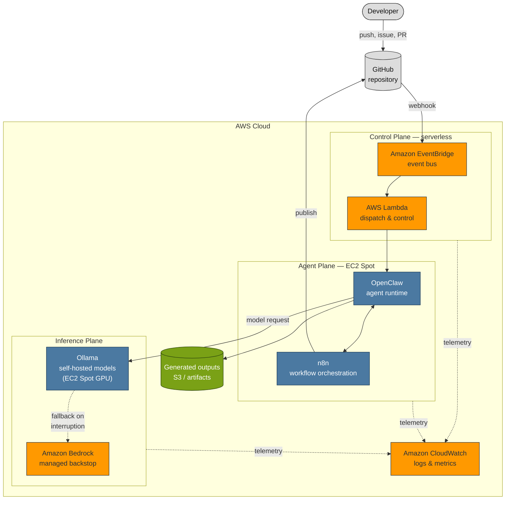
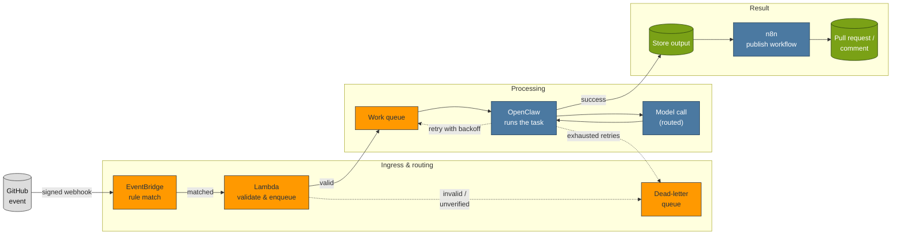
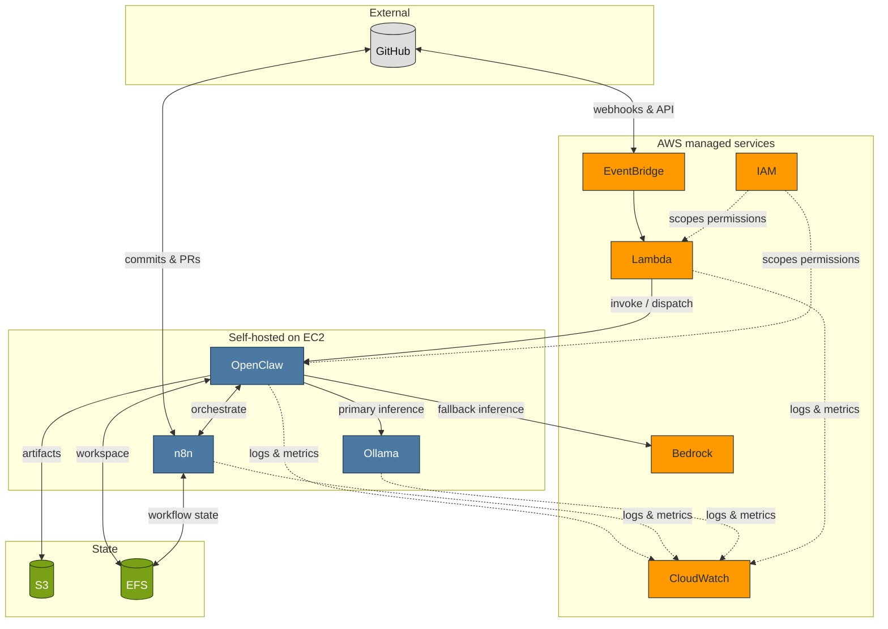
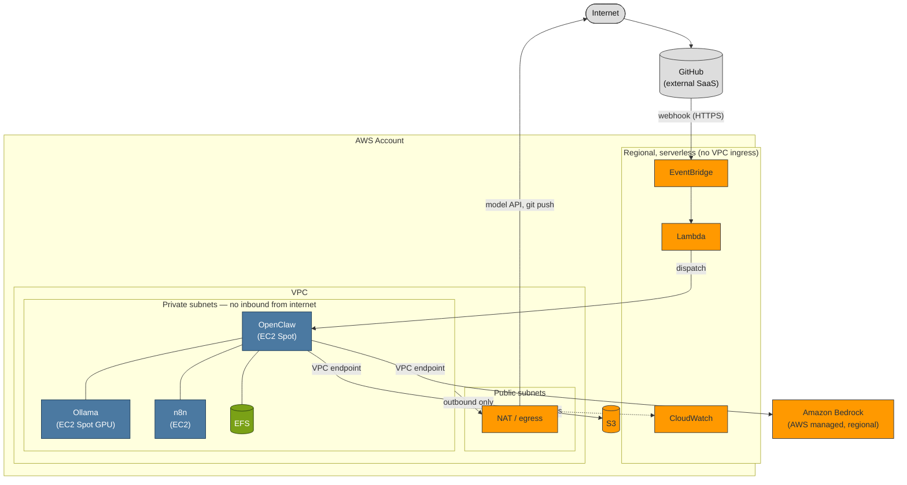

# Architecture Diagrams — Milestone 1

> **Milestone 1 — Initial Architecture. Planning only.**
> These diagrams describe a *proposed* architecture. Nothing here is deployed.
> They are the visual companion to
> [Designing an AI Agent Platform on AWS](../blog/designing-an-ai-agent-platform-on-aws.md).

One platform, one vocabulary, two complementary views:

- an **AWS service view** ([below](#aws-architecture-diagram)) — a hand-authored
  SVG in the AWS Architecture Center style, with nested Cloud / Region / VPC /
  subnet boundaries and category-coloured service tiles;
- four **flow views** (Diagrams 1–4) drawn in
  [GitHub-native Mermaid](https://docs.github.com/en/get-started/writing-on-github/working-with-advanced-formatting/creating-diagrams)
  — high-level, event flow, component interaction, and deployment boundaries.

Both are plain text (SVG and Mermaid), so they are version-controlled, diffable
in review, and render inline on GitHub without external binary assets. The SVG
uses AWS category *colours* and layout conventions rather than the trademarked
[AWS Architecture Icons](https://aws.amazon.com/architecture/icons/) themselves;
a pass exporting the official icons can follow if these documents are prepared
for external publication.

## AWS Architecture Diagram

The service view: how the platform maps onto AWS, arranged by trust boundary.
The developer and GitHub sit outside the account; everything inside the **AWS
Cloud → Region → VPC** nesting is the platform. The private subnet accepts no
inbound connection from the internet — the boundary that contains an agent with
a shell.

Its tiles are coloured by **AWS service category** (compute, storage, security,
and so on — see the legend inside the diagram), the convention AWS's own
diagrams use. That is a richer key than the AWS-versus-self-hosted split the
Mermaid flow views use below; each diagram carries the legend it needs.

> Rendering note: GitHub displays this SVG inline. It was validated as
> well-formed XML and visually proofed by rasterising it during authoring.

---

## Conventions

The four Mermaid flow views below share one key.

Every diagram uses the same four categories and the same colours, so a reader
who learns the key once can read all four.

| Colour | Category | Examples |
| --- | --- | --- |
| 🟧 Orange | AWS managed service | EventBridge, Lambda, Bedrock, CloudWatch |
| 🟦 Blue | Self-hosted / non-AWS component | n8n, OpenClaw, Ollama |
| 🟩 Green | Storage or durable state | S3, EFS, workflow state |
| ⬜ Grey | External actor or system | Developer, GitHub |

Arrows show the direction data or control flows. A **solid** arrow is a request
or a data hand-off on the happy path; a **dotted** arrow is a fallback, a
control signal, or telemetry.

---

## Diagram 1 — High-Level Platform Architecture

A bird's-eye view: a developer's action in GitHub becomes an event, the event is
orchestrated in the AWS control plane, an agent on Spot capacity does the work,
and the model call is routed to self-hosted inference first and a managed
backstop second.

**Legend.** Orange = AWS managed, blue = self-hosted, green = storage, grey =
external. The dotted arrow from Ollama to Bedrock is the seam that makes Spot
safe: if self-hosted GPU capacity is interrupted, the same request completes on
a managed model.

---

## Diagram 2 — Event Flow

The lifecycle of a single GitHub event, from webhook to published result,
including how failures are absorbed. This is the "what happens when it goes
wrong" view that the high-level diagram omits.

**Legend.** Solid arrows are the happy path. Dotted arrows are failure handling:
an unverified webhook is dead-lettered at ingress, a transient task failure is
retried with backoff, and a task that exhausts its retries is dead-lettered for
inspection. Nothing is lost silently.

---

## Diagram 3 — Component Interaction

How the parts relate, independent of any single request. This is the view for
answering "who talks to whom, and who depends on whom."

**Legend.** IAM (dotted) does not sit in the data path; it scopes what every
other component is permitted to do. CloudWatch (dotted) receives telemetry from
everything. Bedrock is reachable from OpenClaw as an alternative to Ollama, not
in series with it.

---

## Diagram 4 — Deployment Boundaries

The same components, arranged by trust boundary rather than by data flow. This
is the view for reasoning about the blast radius: what is reachable from the
internet, what is not, and where the agent's shell can and cannot go.

**Legend.** The private subnets accept **no inbound connections from the
internet**. The agent reaches out — to model APIs and to GitHub — through a NAT
gateway for egress, and to AWS services such as Bedrock and S3 through VPC
endpoints that keep that traffic off the public internet. This is the boundary
that turns "an agent with a shell" from a liability into a contained one; it is
developed fully in [Milestone 16 — Security](../blog/designing-an-ai-agent-platform-on-aws.md#security-considerations).

---

## Consistency note

These four diagrams, the [high-level diagram in the README](../../README.md#high-level-architecture-overview),
and the [blog post](../blog/designing-an-ai-agent-platform-on-aws.md) use one
vocabulary on purpose: **control plane** (serverless, stateless), **agent
plane** (stateful, interruption-intolerant), and **inference plane** (stateless,
interruption-tolerant). If a term changes in one place, it should change in all
of them.
