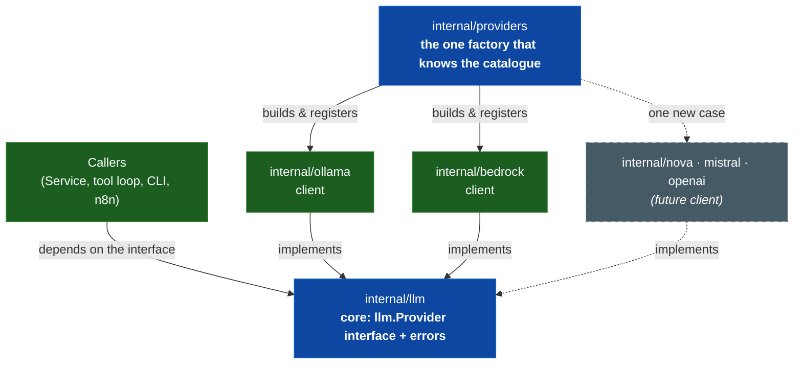
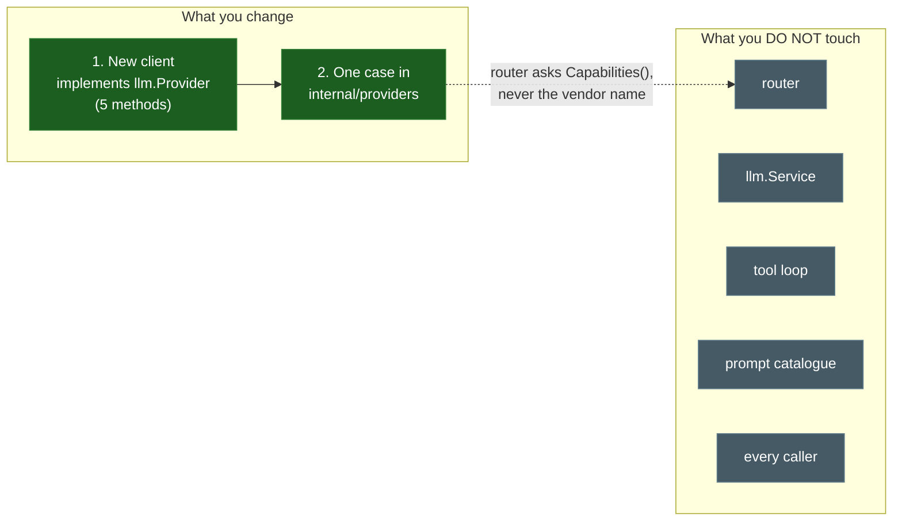
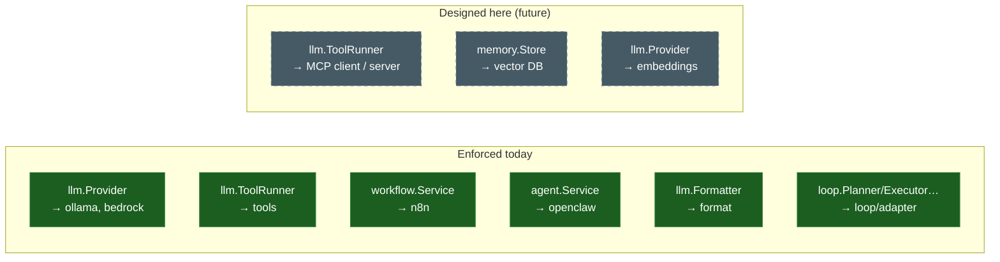

# Extensibility Diagrams — Milestone 17

> **Milestone 17 — Future Extensions.**
> These diagrams show the extension model the platform has enforced since Milestone 7,
> and how new AI providers, MCP servers, and vector databases plug into it. They
> accompany the blog post,
> [Extending an AI Agent Platform with New AI Providers and Services](../blog/extending-an-ai-agent-platform-with-new-ai-providers-and-services.md),
> and the reference, [EXTENSIBILITY.md](../../EXTENSIBILITY.md).
>
> **The one idea.** The platform is extensible because the arrow points *inward*: a
> core owns the interface, a client implements it, one factory knows the catalogue,
> and a test fails the build if that ever stops being true.

## Reading the diagrams

This is an **architecture-only** milestone. **Solid** nodes are the seams and clients
that **exist and are enforced today**. **Dashed** nodes labelled *(future)* are the
extensions this milestone designs but does **not** build — MCP, a vector store, a
third provider. The line between them is the whole point of the milestone.

## Contents

- [1. The extension model (arrow points inward)](#1-the-extension-model-arrow-points-inward)
- [2. Adding an LLM provider is one client + one factory line](#2-adding-an-llm-provider-is-one-client--one-factory-line)
- [3. MCP lands on an existing seam](#3-mcp-lands-on-an-existing-seam)
- [4. Vector databases and RAG compose from parts](#4-vector-databases-and-rag-compose-from-parts)
- [5. The extension map](#5-the-extension-map)

## 1. The extension model (arrow points inward)

Every integration is a **core** (the platform's side of a boundary — types, errors,
interface) and a **client** (one vendor's implementation). The client imports the
core; the core never imports the client. Exactly one leaf factory knows that more than
one client exists.



## 2. Adding an LLM provider is one client + one factory line

The router routes between a `map[string]llm.Provider` and never learns a vendor's
name — `TestTheRouterDoesNotKnowWhichProvidersExist` fails the build if it tries. So a
new provider changes exactly two things (green), and nothing else (grey).



## 3. MCP lands on an existing seam

The platform's tools already sit behind `llm.ToolRunner`, and the inference plane
knows only a tool's schema and whether it is a `Write` tool. MCP extends this seam
from both directions — consuming external MCP tools, and exposing the platform's own —
without a new parallel mechanism.

```mermaid
flowchart TB
    model["Model (via provider)"]
    runner["llm.ToolRunner<br/><b>existing seam</b>"]
    native["Native tools<br/>run_workflow · submit_agent_task"]

    mcpclient["internal/mcp client<br/><i>(future)</i><br/>adapts external MCP tools"]
    ext["External MCP servers"]

    mcpserver["Platform as MCP server<br/><i>(future)</i><br/>exposes its own tools"]
    outside["Outside agents"]

    model -- "calls tools (can't tell<br/>native from MCP)" --> runner
    runner --> native
    runner -. "adapts, preserving<br/>Write/read classification" .-> mcpclient -. .-> ext
    native -- "same registry" --> mcpserver -. "under existing budgets<br/>+ validation" .-> outside

    classDef now fill:#1b5e20,stroke:#2e7d32,color:#fff;
    classDef future fill:#455a64,stroke:#607d8b,color:#fff,stroke-dasharray:5 5;
    class runner,native,model now;
    class mcpclient,ext,mcpserver,outside future;
```

## 4. Vector databases and RAG compose from parts

A vector store is the same move as a provider: a `memory.Store` core with vendor
clients behind it. Crucially, **embedding is inference** (an `llm.Provider` job), so
"which model embeds" and "where vectors live" stay two independent extension points.
RAG is then a composition of parts the platform already has.

```mermaid
flowchart TB
    query["Query / agent memory read"]
    embed["Embeddings<br/>= llm.Provider capability<br/>(existing seam)"]
    store["memory.Store<br/><i>(proposed core interface)</i>"]

    pgvector["pgvector / RDS<br/><i>(future client)</i>"]
    s3v["Amazon S3 Vectors<br/><i>(future client)</i>"]
    opensearch["OpenSearch<br/><i>(future client)</i>"]

    context["Retrieved context"]
    inference["Inference plane + tool loop<br/>(existing)"]

    query --> embed --> store
    store -. "implemented by" .-> pgvector
    store -. .-> s3v
    store -. .-> opensearch
    store -- "top-k matches" --> context --> inference

    classDef now fill:#1b5e20,stroke:#2e7d32,color:#fff;
    classDef proposed fill:#4a148c,stroke:#6a1b9a,color:#fff,stroke-dasharray:5 5;
    classDef future fill:#455a64,stroke:#607d8b,color:#fff,stroke-dasharray:5 5;
    class embed,inference,query,context now;
    class store proposed;
    class pgvector,s3v,opensearch future;
```

## 5. The extension map

Every extension point, its stable interface, and whether it exists or is proposed. One
shape repeated: narrow interface → core owns it → client implements it → factory
registers it → test guards it.


