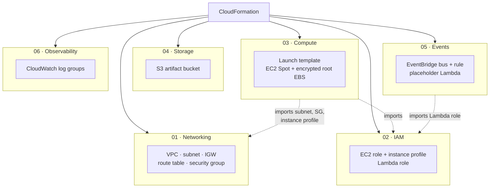
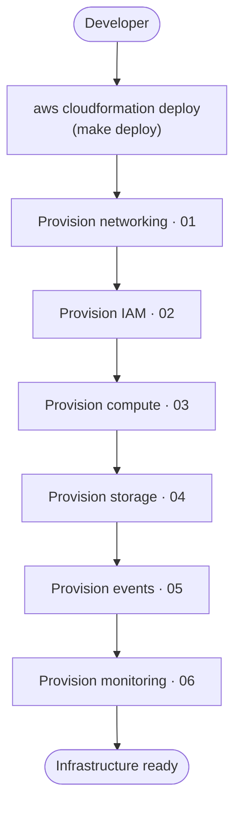

# Infrastructure Diagrams — Milestone 2

> **Milestone 2 — CloudFormation Infrastructure.**
> These diagrams describe infrastructure defined in
> [`infra/cloudformation`](../../infra/cloudformation) and validated with
> `cfn-lint`. It has **not been deployed** to a live account as part of this
> milestone. They accompany the blog post,
> [Provisioning an AI Agent Platform with CloudFormation](../blog/provisioning-an-ai-agent-platform-with-cloudformation.md).

Four diagrams: two AWS-style service views (hand-authored SVG, in the same
version-controlled approach as [Milestone 1](aws-architecture.svg)), and two
Mermaid flow views. All share one vocabulary and one colour key
(compute = orange, integration = pink, management = rose, storage = green,
networking = purple, external = grey).

## 1. Infrastructure Overview

Every resource this milestone provisions, and how it fits inside the AWS Cloud →
Region → VPC → subnet nesting. The EC2 Spot instance and its encrypted, disposable
root volume sit inside a default-deny security group; the regional services
(EventBridge, Lambda, CloudWatch, S3) sit outside the VPC.

## 2. Network Topology

The addressing, routing, and security boundary in detail: the VPC CIDR, the
public subnet CIDR, the public route table (with its default route to the
internet gateway), and the security group — no inbound, all outbound, managed
through SSM.

## 3. CloudFormation Resource Relationships

The six stacks, the order CloudFormation provisions them in, and the cross-stack
imports that link them. Networking and IAM come first because compute depends on
both; storage and observability are independent leaves.

**Legend.** Solid arrows: CloudFormation provisions the stack. Dotted arrows:
one stack imports an exported value from another, which also fixes the deploy
order. Storage and observability import nothing.

## 4. Infrastructure Deployment Flow

What happens when an operator runs the deploy. Each stack is applied in
dependency order; the run ends with a foundation that later milestones extend.

**Legend.** A single linear path: networking → IAM → compute → storage → events
→ monitoring. The order matters only where a stack imports another's exports
(compute and events); the rest could deploy in any order, but a fixed sequence
keeps the process predictable and re-runnable.

## Consistency note

These diagrams, the [templates](../../infra/cloudformation), and the
[blog post](../blog/provisioning-an-ai-agent-platform-with-cloudformation.md)
use the same stack numbering (01–06) and the same resource names. The Milestone 1
[platform diagrams](diagrams.md) show where this foundation sits in the larger
three-plane architecture.
