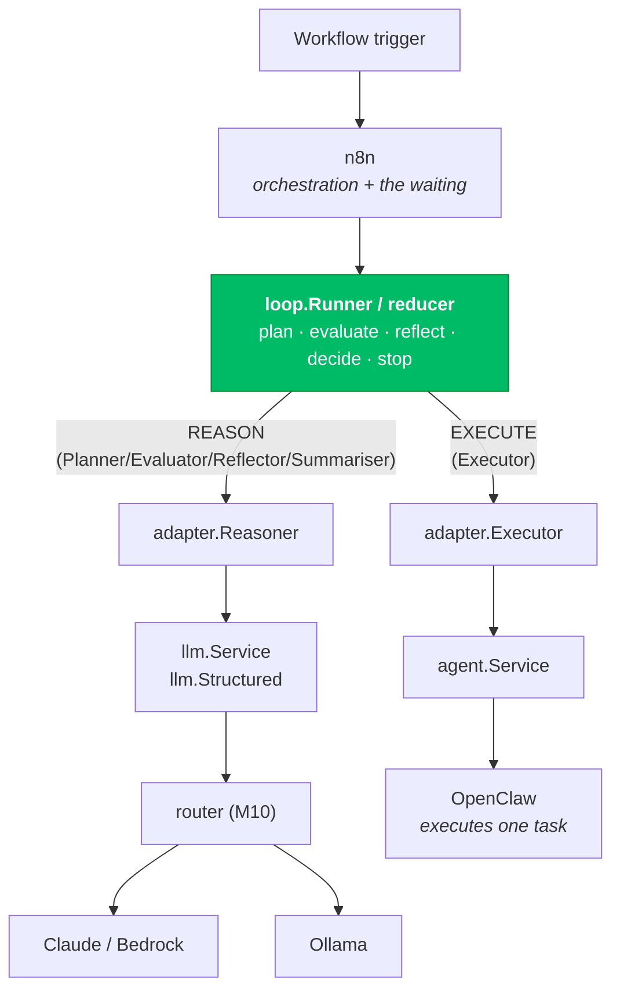
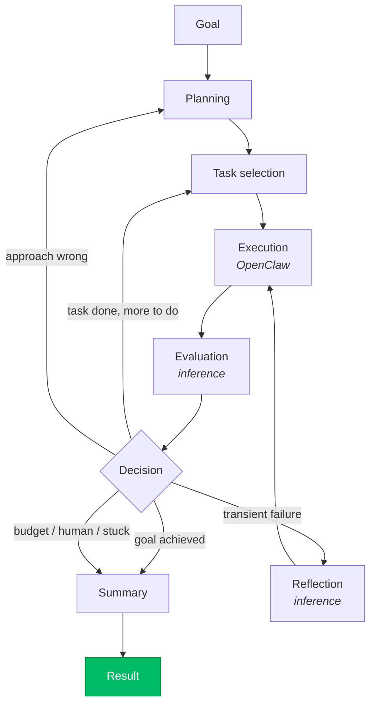
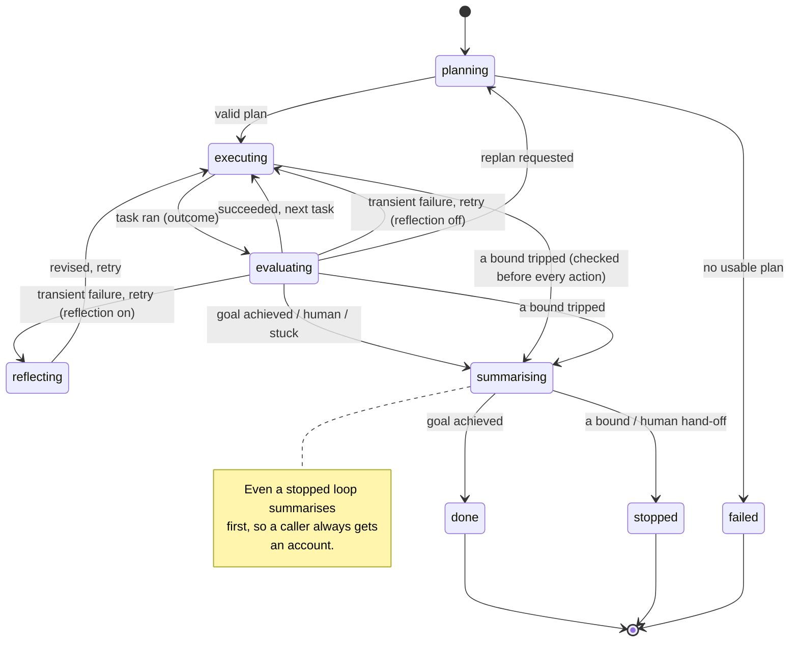
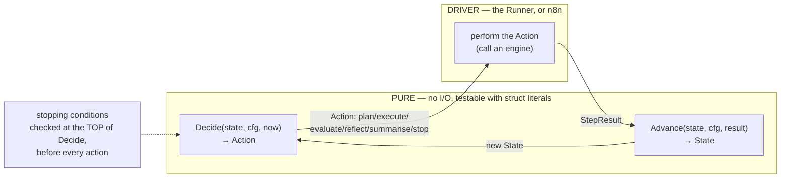
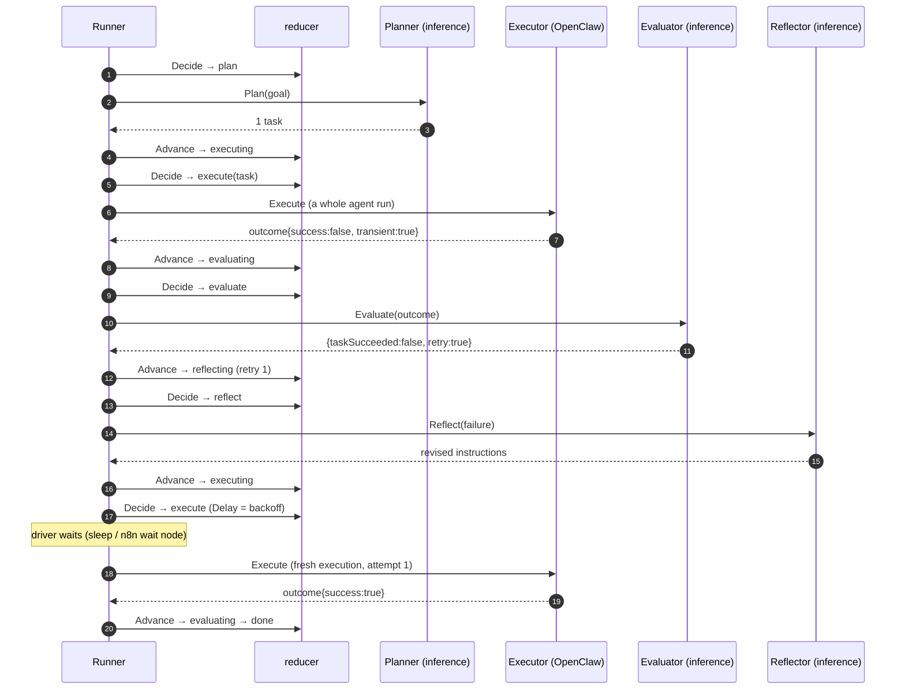
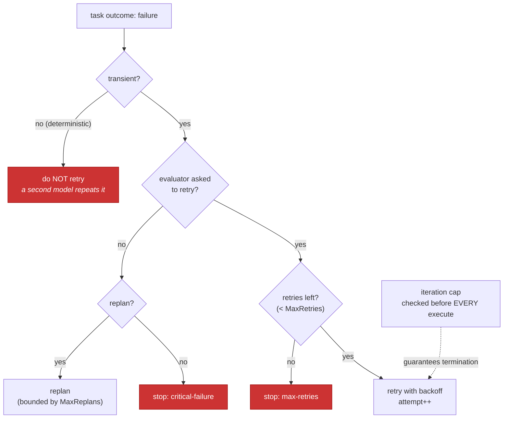
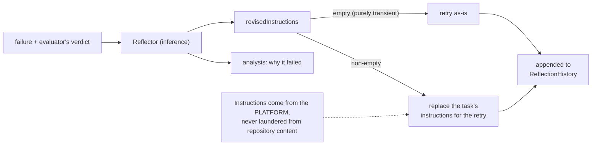
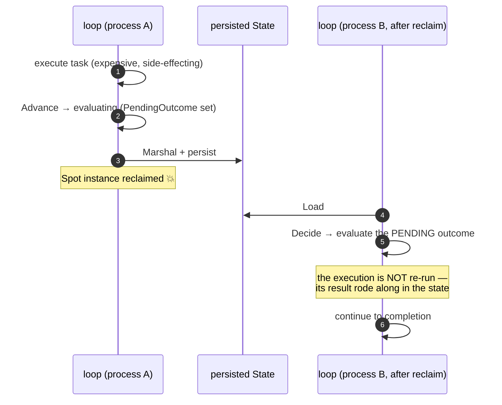
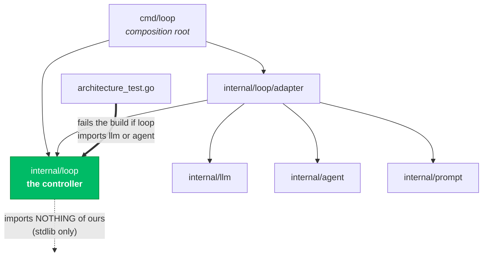

# Loop Diagrams — Milestone 11

> **Milestone 11 — Loop Engineering.**
> These diagrams describe [`internal/loop`](../../internal/loop) (the controller) and
> [`internal/loop/adapter`](../../internal/loop/adapter) (the edge that binds it to the
> reasoning and execution planes). They accompany the blog post,
> [Building Autonomous AI Agents with Loop Engineering](../blog/building-autonomous-ai-agents-with-loop-engineering.md),
> and the reference, [LOOP.md](../../LOOP.md).
>
> **No model and no agent are deployed here.** Reasoning is delegated to the inference plane
> (Milestone 7-10), execution to OpenClaw (Milestone 6). This repository owns the **loop
> controller** — which imports neither, and orchestrates both.

## Contents

- [1. High-level architecture](#1-high-level-architecture)
- [2. The agent lifecycle](#2-the-agent-lifecycle)
- [3. State transitions](#3-state-transitions)
- [4. The controller is a reducer](#4-the-controller-is-a-reducer)
- [5. Execution sequence](#5-execution-sequence)
- [6. The retry flow](#6-the-retry-flow)
- [7. The reflection flow](#7-the-reflection-flow)
- [8. Failure recovery](#8-failure-recovery)
- [9. Component interaction](#9-component-interaction)

## 1. High-level architecture

The loop sits above the two planes it orchestrates, and imports neither. Reasoning goes to the
inference plane (routed to Claude or Ollama by Milestone 10); execution goes to OpenClaw.

## 2. The agent lifecycle

The stages the milestone names, and the decisions that sequence them.

## 3. State transitions

The reducer's phases. Terminal phases (done, stopped, failed) are where a driver stops calling
`Decide`. A stop is a bound doing its job; a failure is a malfunction — the difference an alert
depends on.

## 4. The controller is a reducer

Two pure functions and a driver. The reducer does no I/O; the Runner (or n8n) performs the
actions and feeds results back. This is what makes stops always-enforced and state
recoverable.

## 5. Execution sequence

One interesting turn: a task fails transiently, is reflected on, and succeeds on retry with a
backoff the driver honours.

## 6. The retry flow

Only transient failures are retried, and only within budget. Above the per-task budget, the
iteration cap guarantees termination. There is no path that loops forever.

## 7. The reflection flow

Reflection changes the agent's behaviour without changing the platform's code: it rewrites the
task's instructions, on the platform's side of the boundary, for the next attempt.

## 8. Failure recovery

The state is a serialisable value, so a Spot reclaim mid-loop loses only the in-flight action.
The pending outcome survives, so a reload never re-runs the expensive execution.

## 9. Component interaction

Who imports whom. The loop core is a leaf on the reasoning/execution side — the adapter
depends on it and on both planes; the loop depends on neither. The architecture test enforces
the arrows.

