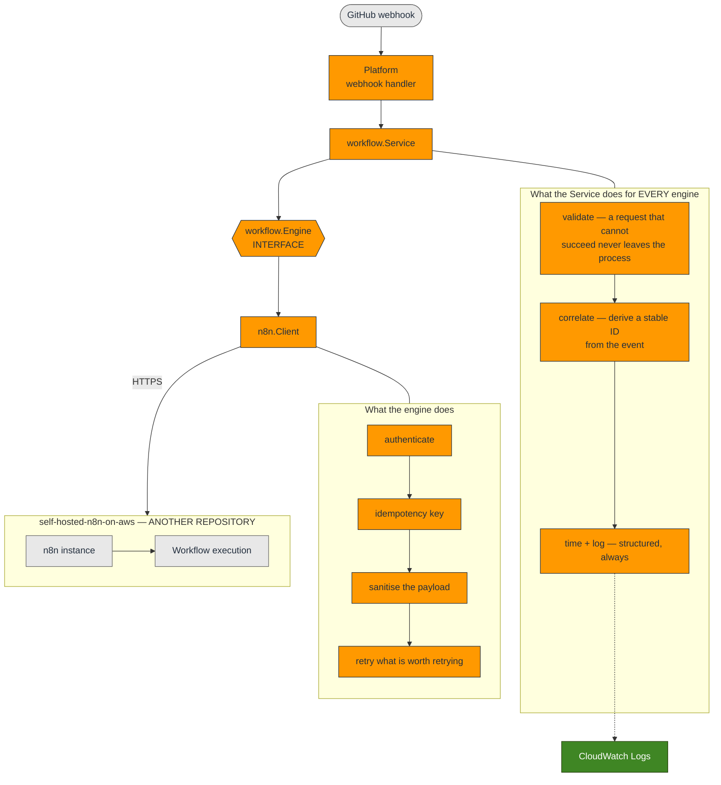
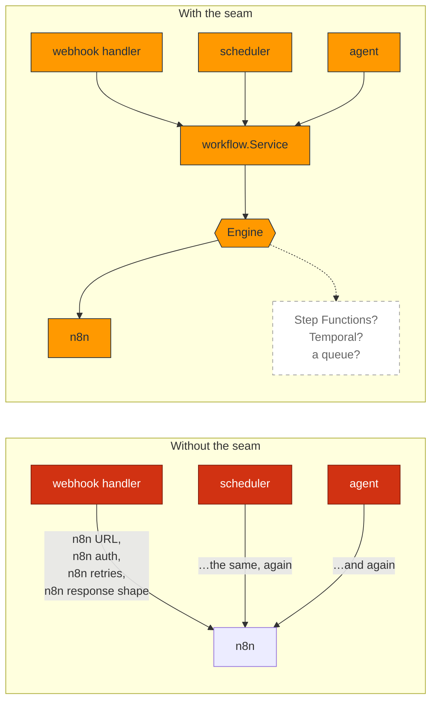
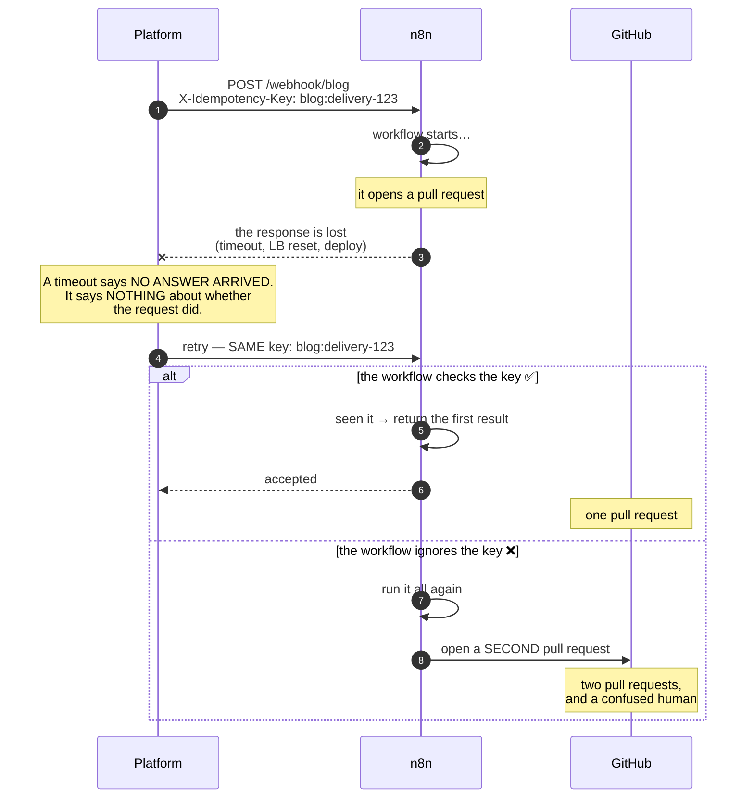
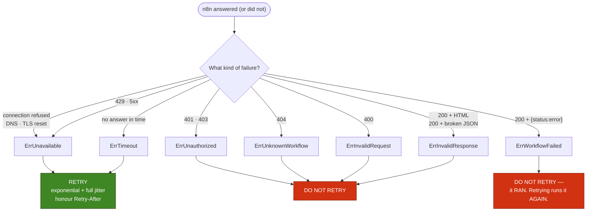
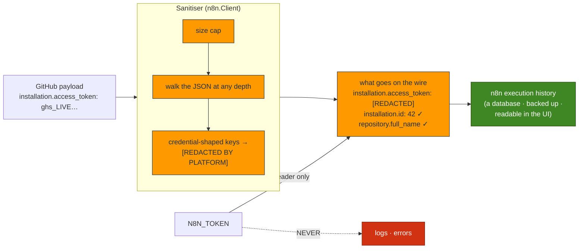

# Workflow Orchestration Diagrams — Milestone 5

> **Milestone 5 — Self-hosted n8n Integration.**
> These diagrams describe the integration in
> [`internal/workflow`](../../internal/workflow) and
> [`internal/n8n`](../../internal/n8n). They accompany the blog post,
> [Using n8n as the Workflow Engine for AI Automation](../blog/using-n8n-as-the-workflow-engine-for-ai-automation.md),
> and the integration reference, [WORKFLOWS.md](../../WORKFLOWS.md).
>
> **n8n itself is not deployed here.** Its infrastructure lives in the
> `self-hosted-n8n-on-aws` repository. These diagrams stop at the boundary, and
> the boundary is the point.

> **This is a snapshot of Milestone 5.** It is kept as it was written — the record of a
> decision at a point in time. For what is deployed **today**, see
> **[The Platform As Built](current-architecture.md)**, the living diagram.

Five diagrams, sharing the colour key of the earlier sets (compute = orange,
storage = green, external = grey, failure = red).

## 1. The request flow

The chain the brief asks for, with the two things that make it more than a
function call: the **interface** in the middle, and the **boundary** at the end.

The division is deliberate. **The Service does what must be identical for every
engine** — if each engine logged in its own shape, no dashboard could span them,
and if each invented its own correlation, a GitHub delivery could not be followed
across the platform. **The engine does what is specific and dirty** — speak HTTP,
survive a flaky network — and is free to be replaced without taking the
observability with it.

## 2. The seam

Why there is an interface at all, rather than an HTTP call from the handler.

On the left, replacing n8n — or running two engines during a migration — means
touching every caller, and every caller has its own subtly different retry policy.
On the right it is one implementation of one interface.

The test that the seam is real: **`internal/workflow` does not import
`internal/n8n`.** If that dependency ever points the other way, the abstraction is
a decoration.

## 3. Why a retry is not free

The hard problem of this milestone, and the reason for the idempotency key.

The key is **derived from the event ID**, never generated — so the same GitHub
delivery, retried by us or replayed by an operator next week, produces the same
key. A random key here would defeat the entire purpose.

**The transport is at-least-once. Only the workflow can make the execution
effectively-once**, and only if it actually checks. This repository cannot enforce
that, which is exactly why it is written down in bold in
[WORKFLOWS.md](../../WORKFLOWS.md#the-one-hard-problem-a-retry-is-not-free).

## 4. What is retried, and what is not

Retrying the wrong thing is worse than not retrying at all.

The two that catch people:

- **A `200` is not a success.** n8n answers `200` and puts the error *in the body*
  when a workflow throws and a "Respond to Webhook" node catches it. Trusting the
  status code is how a platform cheerfully reports that it triggered workflows into
  a void.
- **`ErrWorkflowFailed` is not retried.** The workflow *ran*. Retrying runs it
  again — and re-running a workflow with side effects is a decision for a human,
  not for an HTTP client.

## 5. Where the secrets are

The GitHub payload is the one thing in this flow the platform did not author.

"We are only passing it on" is exactly how secrets travel. A forwarded payload
lands in **n8n's execution history** — a database, which gets backed up, and which
anyone with UI access can read. The platform gains nothing by forwarding a
credential, and it is the platform's job not to widen the blast radius of someone
else's mistake.

The structure survives the redaction. A sanitiser that guts the payload is one
nobody keeps enabled.
