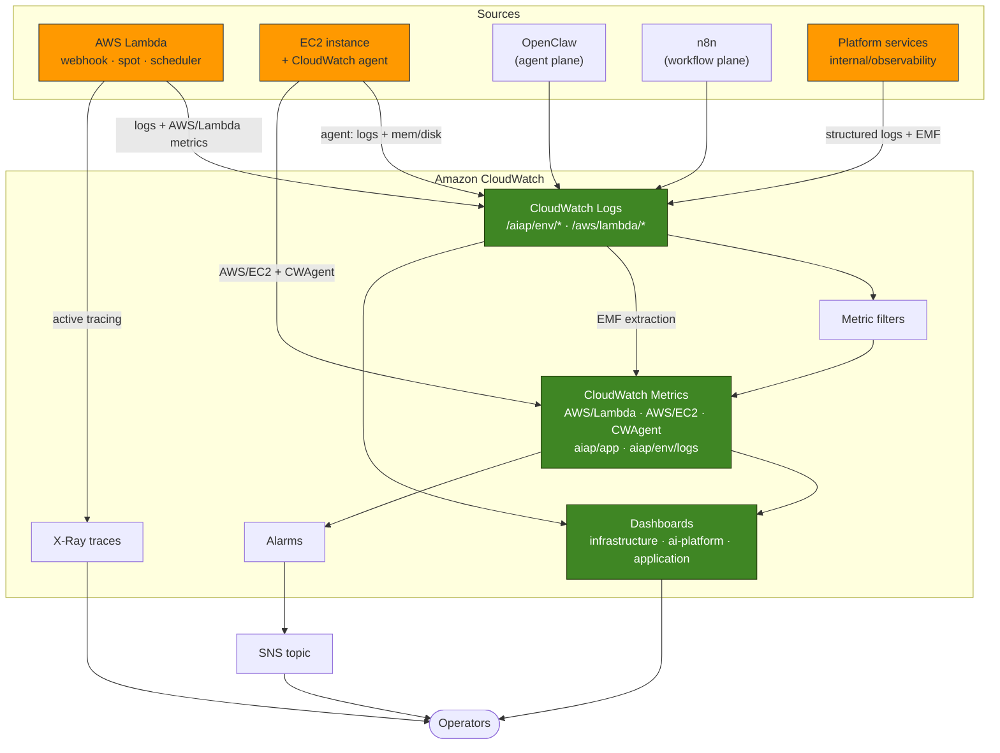
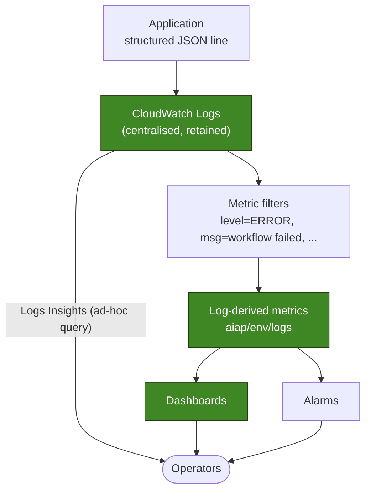
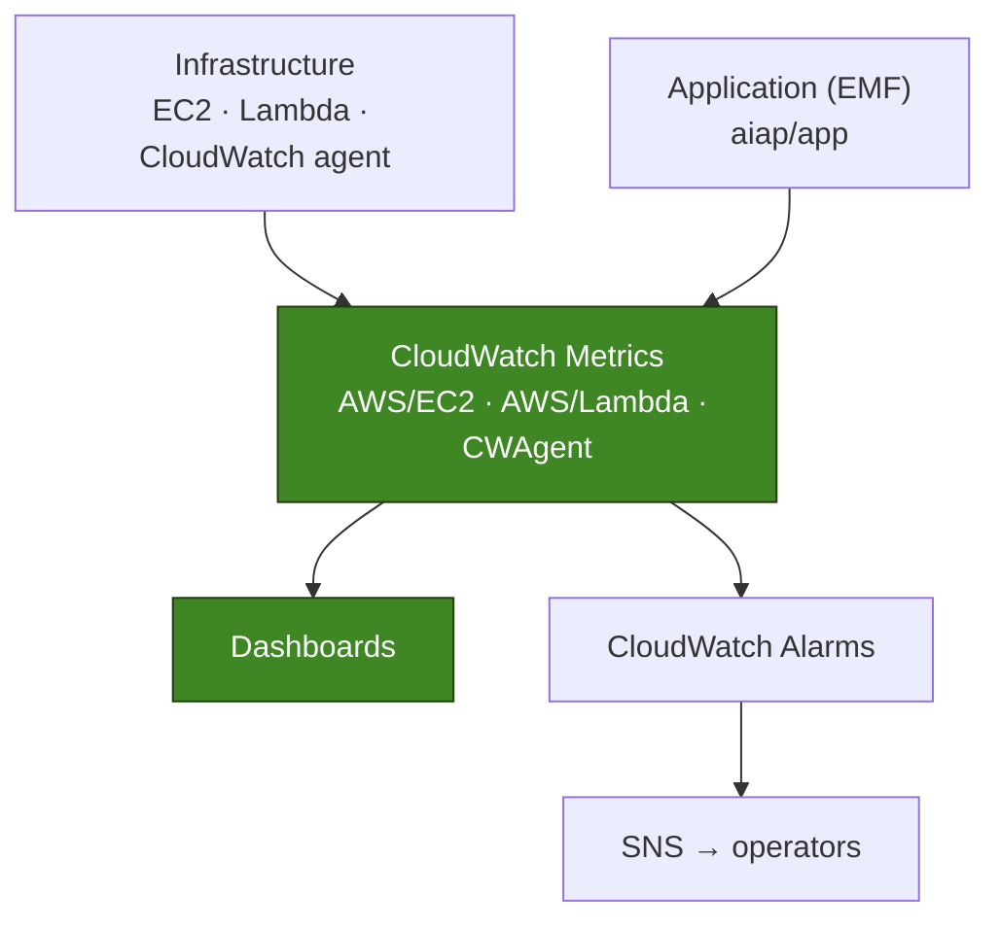
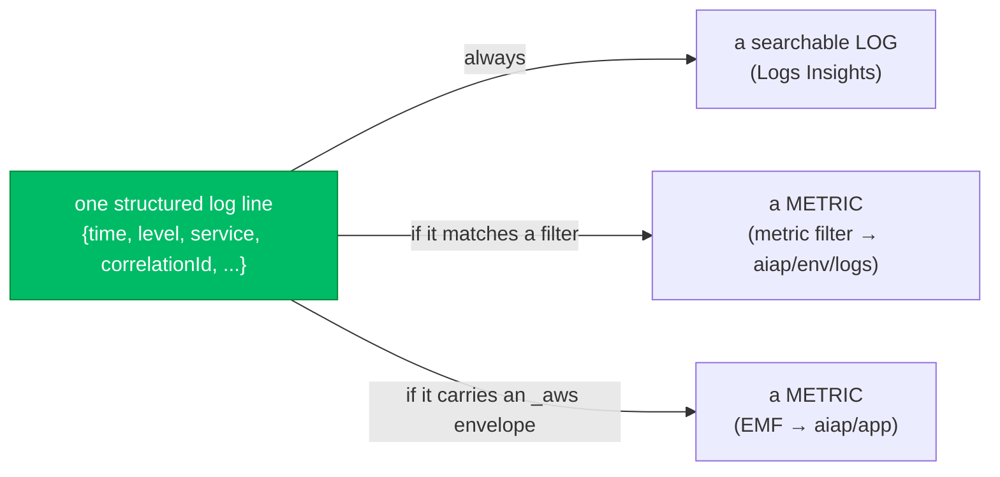
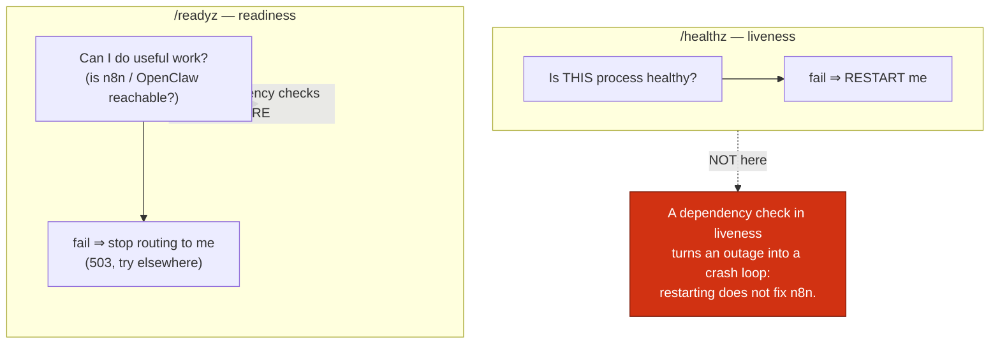
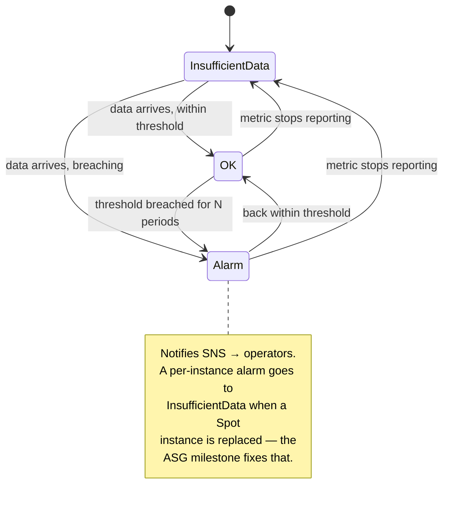
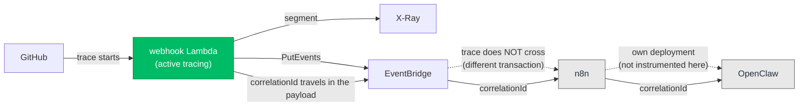

# Observability Diagrams — Milestone 13

> **Milestone 13 — Monitoring & Observability.**
> These diagrams describe [`internal/observability`](../../internal/observability)
> (the logging, metrics and health library) and
> [`infra/cloudformation/10-monitoring.yaml`](../../infra/cloudformation/10-monitoring.yaml)
> (the dashboards, alarms and metric filters). They accompany the blog post,
> [Monitoring an AI Agent Platform with CloudWatch](../blog/monitoring-an-ai-agent-platform-with-cloudwatch.md),
> and the reference, [OBSERVABILITY.md](../../OBSERVABILITY.md).
>
> **One line, two products.** The platform's structured log line is *also* — when it
> carries an EMF envelope — a metric. Nothing is emitted twice; CloudWatch reads the
> same bytes as a log (searchable) and as a metric (graphable, alarmable).

## Contents

- [1. Monitoring architecture](#1-monitoring-architecture)
- [2. Log flow](#2-log-flow)
- [3. Metrics flow](#3-metrics-flow)
- [4. The three signals of a single line](#4-the-three-signals-of-a-single-line)
- [5. Health: liveness vs readiness](#5-health-liveness-vs-readiness)
- [6. Alarm lifecycle](#6-alarm-lifecycle)
- [7. Where tracing reaches, and where it stops](#7-where-tracing-reaches-and-where-it-stops)

## 1. Monitoring architecture

CloudWatch collects logs and metrics from every component. The sources differ; the
destination is one place an operator looks.

## 2. Log flow

Application → CloudWatch Logs → Dashboards → Alarms → Operators. The metric filter
is the seam that lets a *log* raise an *alarm*.

## 3. Metrics flow

Infrastructure → CloudWatch Metrics → Dashboards → CloudWatch Alarms. Host and
Lambda metrics arrive as metrics already; nothing has to parse a log to graph them.

## 4. The three signals of a single line

The platform emits one structured line. Depending on its shape, CloudWatch derives
up to three things from it — with no duplicate emission and, for EMF, no extra IAM.

## 5. Health: liveness vs readiness

The same dependency check means different things depending on which probe it is
registered under — and getting the two backwards is a classic outage amplifier.

## 6. Alarm lifecycle

An alarm is a small state machine. The platform sends both the ALARM and the OK
transition to SNS, because "it recovered" is as operationally useful as "it broke".

## 7. Where tracing reaches, and where it stops

X-Ray traces the platform's own Lambda. It cannot trace into services this
repository does not deploy, and it does not survive the intentional EventBridge
decoupling. The correlation ID carries the story where the trace cannot.

