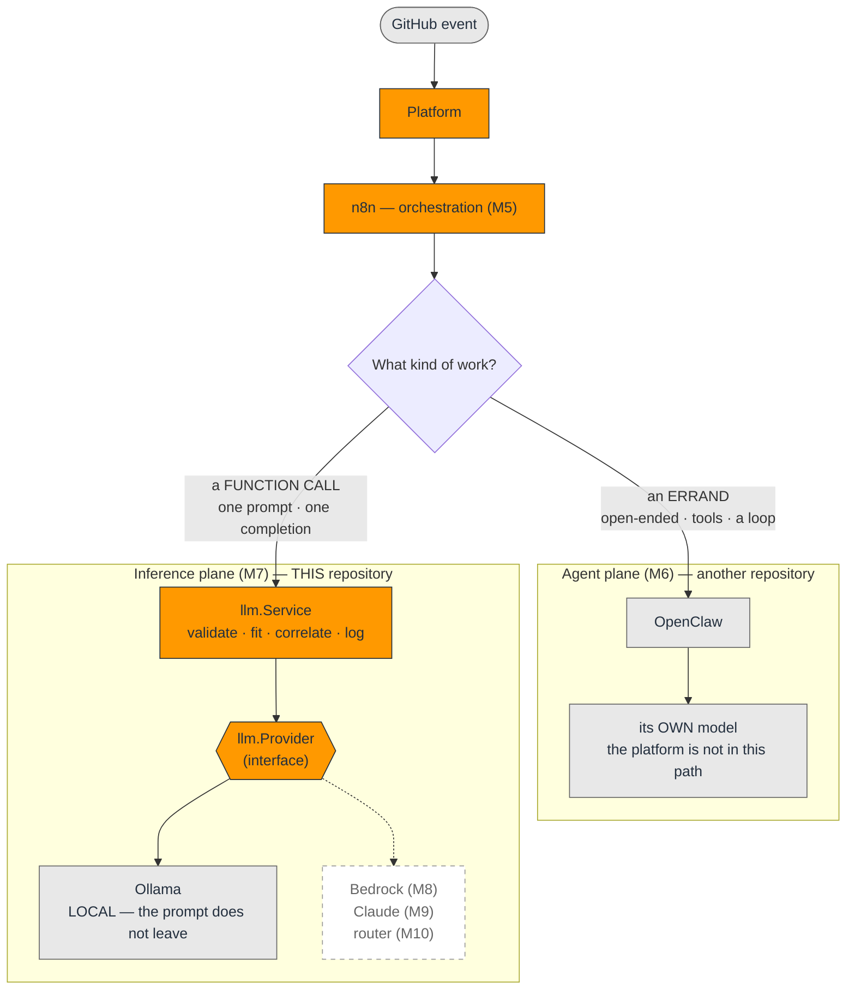
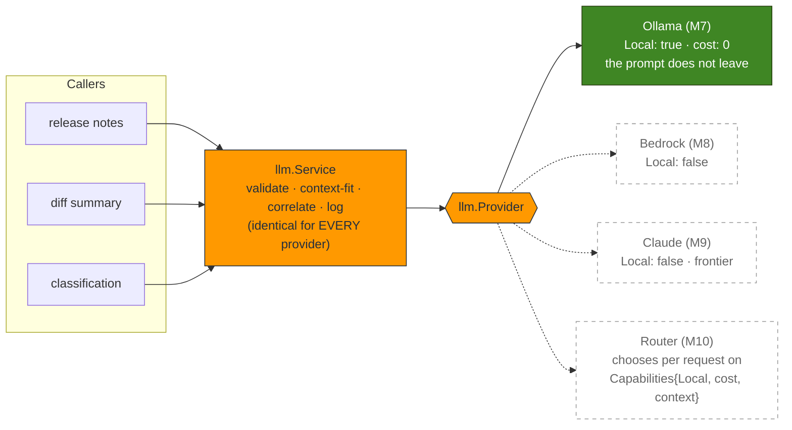
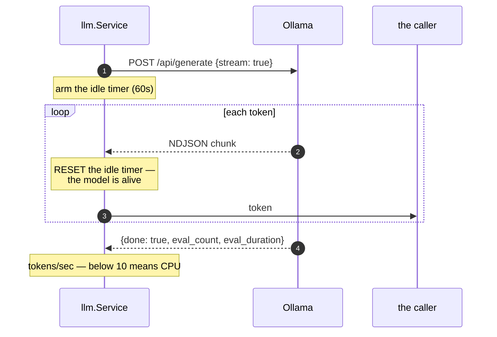
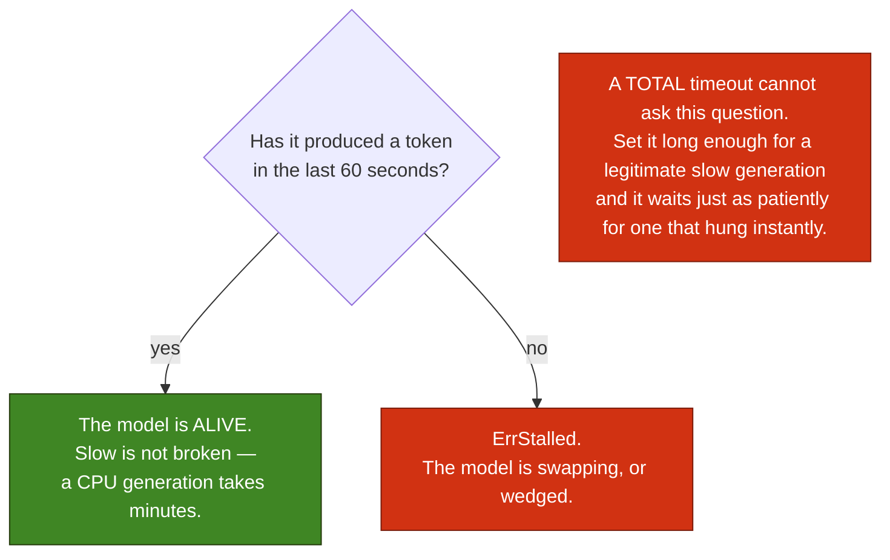
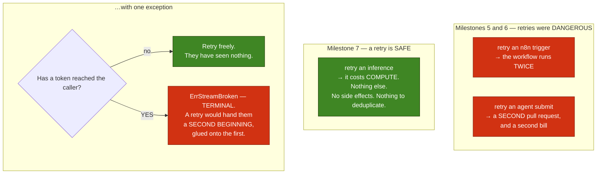
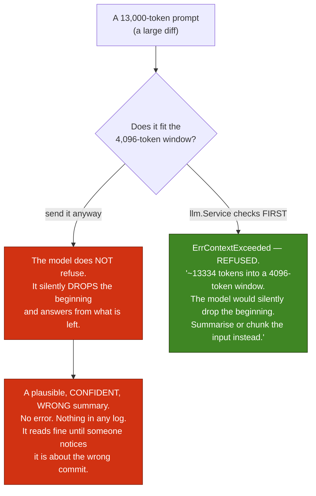

# Inference Diagrams — Milestone 7

> **Milestone 7 — Ollama Integration.**
> These diagrams describe the integration in [`internal/llm`](../../internal/llm)
> (the provider abstraction) and [`internal/ollama`](../../internal/ollama) (the
> client). They accompany the blog post,
> [Running Local LLMs with Ollama on AWS](../blog/running-local-llms-with-ollama-on-aws.md),
> and the reference, [INFERENCE.md](../../INFERENCE.md).
>
> **Ollama itself is not deployed here.** The instance, the GPU and the models on
> disk belong to `ollama-on-aws`. This repository owns *the provider abstraction that
> calls it*.

> **This is a snapshot of Milestone 7.** For what is deployed **today**, see
> **[The Platform As Built](current-architecture.md)**, the living diagram.

Five diagrams, sharing the colour key of the earlier sets.

## 1. Two consumers of inference

The correction to a claim Milestone 6 made in bold, and the reason it is not a
contradiction.

Milestone 6 said *"the platform calls no model; the agent does"*. That is still true
of **the agent's** inference — it calls its own model, behind its own boundary, and
nothing here is in that path.

What has changed is that **not everything worth doing with a model needs an agent.**
"Summarise this diff" is one prompt and one completion: no shell, no tools, no loop.
Routing it through an agent means paying for an errand when what you wanted was a
function call. So the platform now has an inference plane of its own — the one the
architecture has had on paper since Milestone 1.

## 2. The provider abstraction

Why the interface exists *before* there is a second provider: because the second,
third and fourth are the roadmap.

A provider abstraction retro-fitted at Milestone 10, on top of three call sites that
each learned Ollama's JSON shape, is a rewrite. Added now, it is an interface with one
implementation.

**`internal/llm` does not import `internal/ollama`** — the mechanical test that the
seam is real rather than decorative.

## 3. Streaming, and the timeout that actually works

The useful question is not *"has this finished?"* but *"has it produced a single token
recently?"* — and only a stream can answer it. That is why streaming is the default and
why `OLLAMA_IDLE_TIMEOUT` matters more than `OLLAMA_TIMEOUT`.

## 4. A retry is safe here — until the first token

The mirror image of the last two milestones.

The sink is a **side effect**: the caller may already have written those tokens to a
terminal, a websocket, or a file. This applies to stalls too — a stall after output is
a stream that broke by going quiet — so the error wraps **both**: `ErrStalled` (the
cause, which the log reports) and `ErrStreamBroken` (the consequence, which stops the
retry).

## 5. The silent-truncation trap

The failure that does the most damage while looking most like success.

The estimate is deliberately **pessimistic** — code tokenises far worse than prose, so
refusing a prompt that would have fitted is a much better way to be wrong than allowing
one that gets quietly halved.

Which makes `OLLAMA_CONTEXT_TOKENS` the one setting where **being wrong is invisible**.
