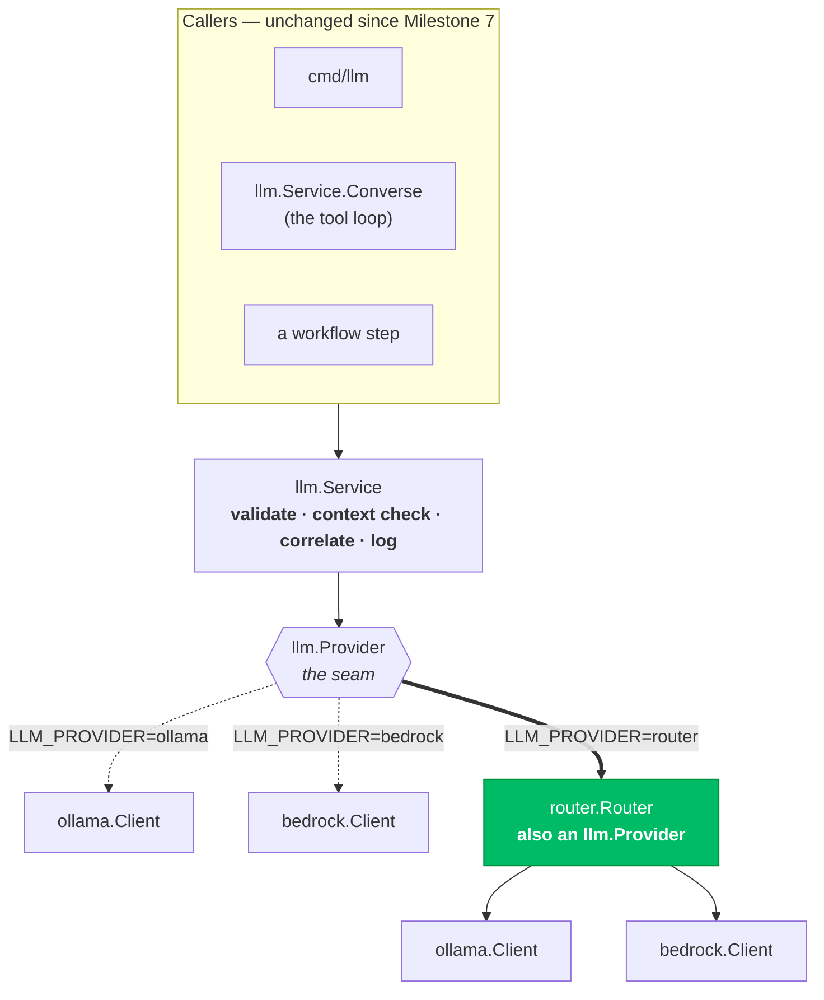
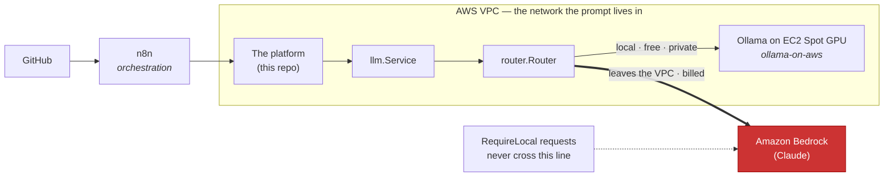
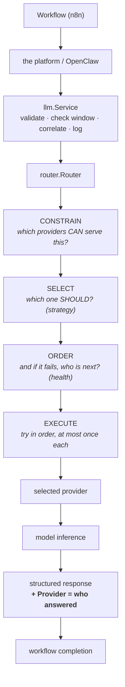
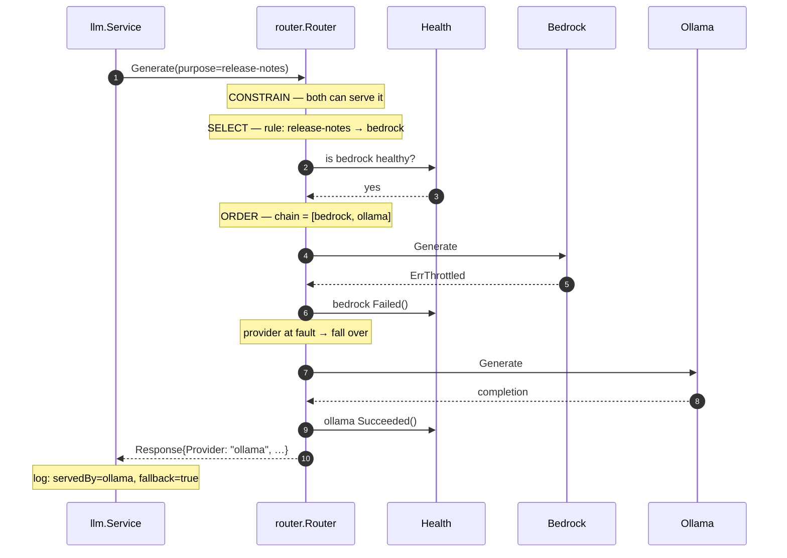
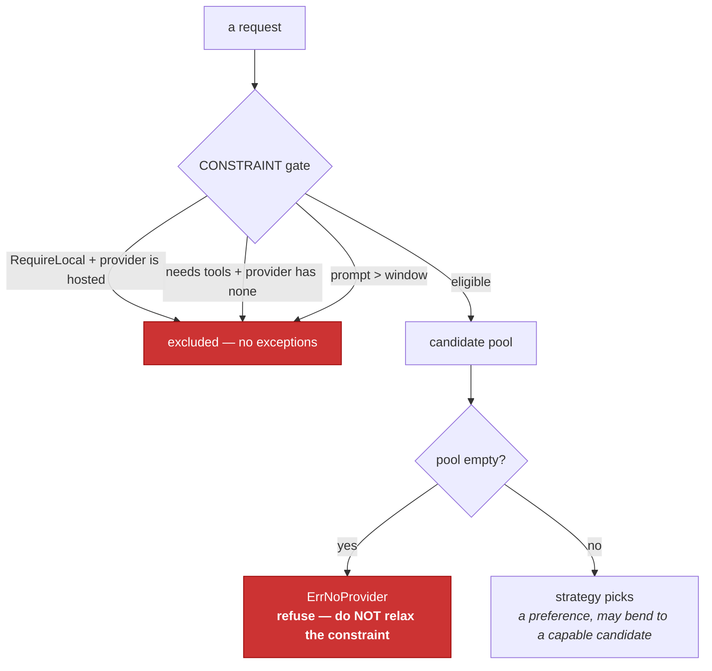
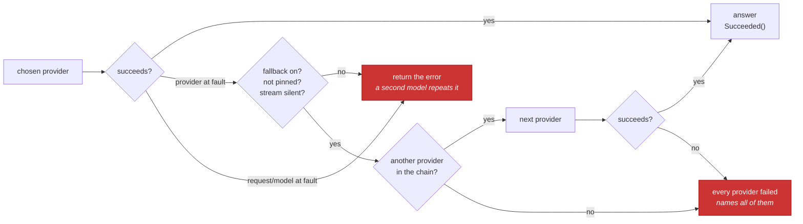
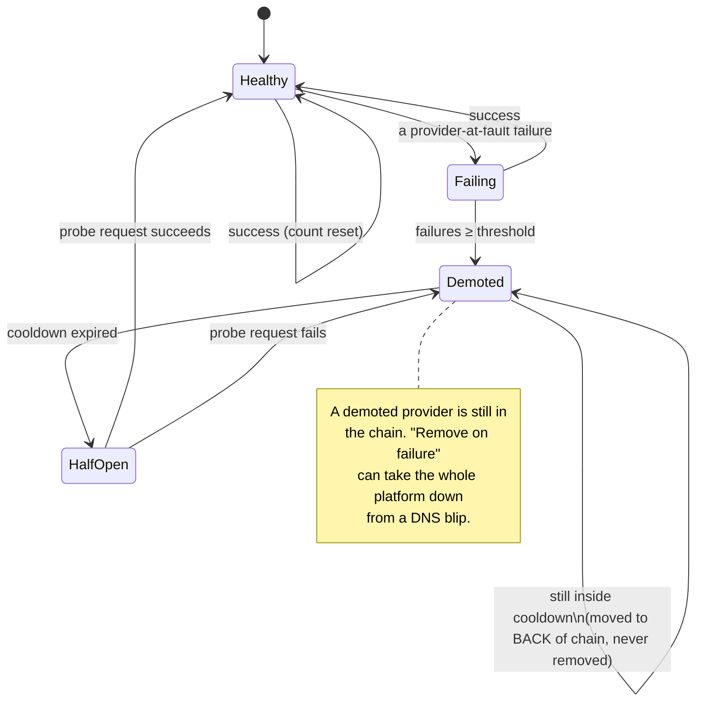
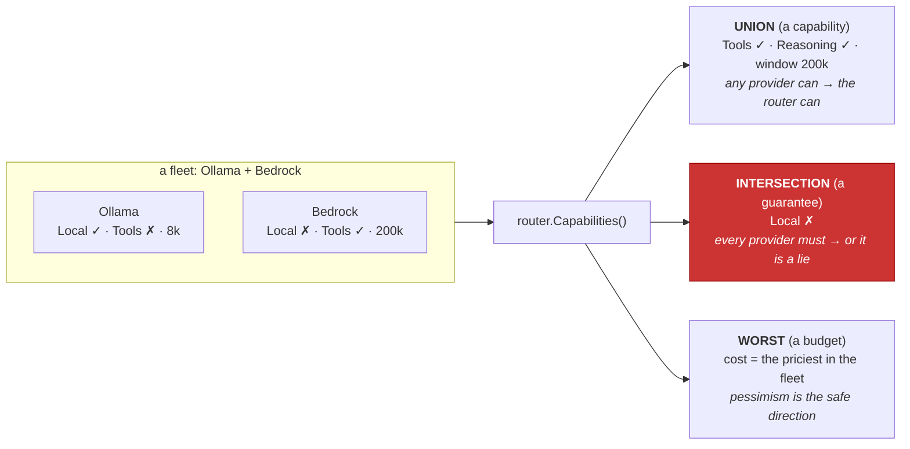
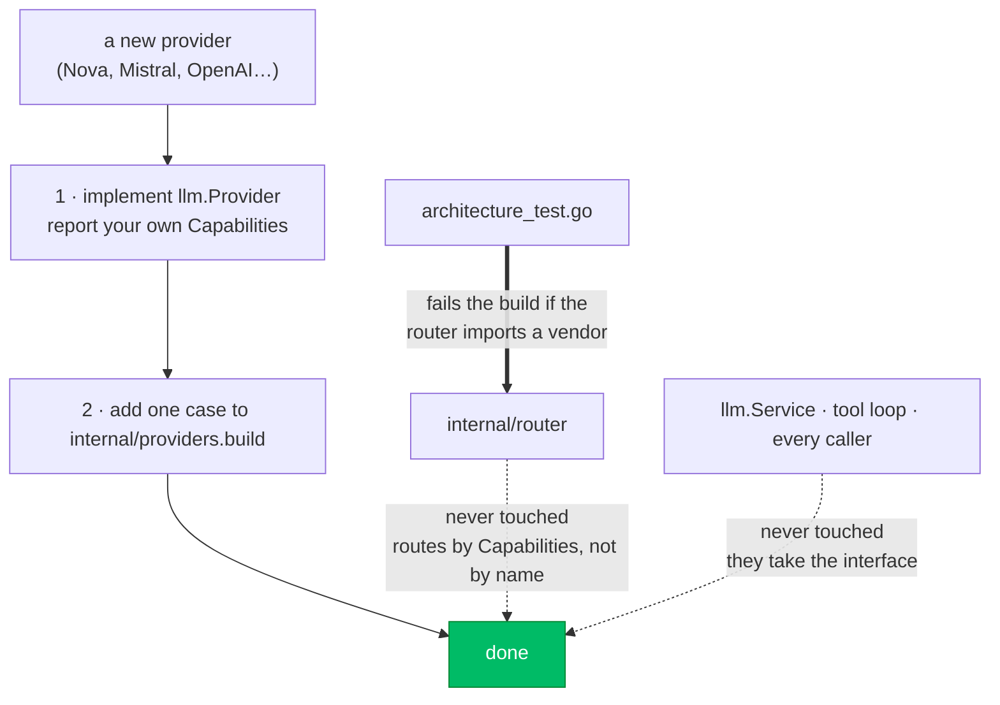

# Router Diagrams — Milestone 10

> **Milestone 10 — Hybrid AI Routing.**
> These diagrams describe [`internal/router`](../../internal/router) (the routing layer)
> and the additions to [`internal/providers`](../../internal/providers) (the factory that
> now builds it). They accompany the blog post,
> [Building Hybrid AI Workflows with Ollama and Amazon Bedrock](../blog/building-hybrid-ai-workflows-with-ollama-and-amazon-bedrock.md),
> and the reference, [ROUTING.md](../../ROUTING.md).
>
> **No model is deployed here.** Ollama's GPU belongs to `ollama-on-aws`; Bedrock is AWS's
> to run. This repository owns the layer that **chooses between them** — and, crucially,
> that layer never learns which providers exist.
>
> The interface these diagrams sit behind is [Milestone 7's](ollama-diagrams.md). It did
> not change. The router **is** an `llm.Provider`.

## Contents

- [1. The router is a provider](#1-the-router-is-a-provider)
- [2. High-level architecture](#2-high-level-architecture)
- [3. The request lifecycle](#3-the-request-lifecycle)
- [4. Routing sequence: constrain, select, order, execute](#4-routing-sequence-constrain-select-order-execute)
- [5. Preference vs constraint](#5-preference-vs-constraint)
- [6. The fallback flow](#6-the-fallback-flow)
- [7. Health as a circuit breaker](#7-health-as-a-circuit-breaker)
- [8. The three things that must never fail over](#8-the-three-things-that-must-never-fail-over)
- [9. Capabilities: union vs guarantee](#9-capabilities-union-vs-guarantee)
- [10. Adding a provider](#10-adding-a-provider)

## 1. The router is a provider

The whole milestone in one picture: a `Router` occupies the slot a single client used to,
and it holds clients of the same kind it is. Nothing above the interface changed.

## 2. High-level architecture

Where the router sits in the platform, and what stays behind whose boundary. The prompt
leaving the network is the fact the whole design is organised around.

## 3. The request lifecycle

One request, from workflow to completion. OpenClaw and n8n never learn a router exists.

## 4. Routing sequence: constrain, select, order, execute

The interesting path — a `purpose` rule sends the request to Bedrock, Bedrock throttles,
and the router falls over to Ollama. Note the order: constraints first, always.

## 5. Preference vs constraint

The idea the milestone turns on. A preference bends when it cannot be honoured; a constraint
does not, and empties the candidate list instead — at which point the request is refused.

## 6. The fallback flow

Direction-agnostic, and structurally loop-free: the chain is a subset of the enabled
providers, each appearing once, walked forwards.

## 7. Health as a circuit breaker

Why fallback without memory is a platform that is down. Demoted, never removed; recovers
through one half-open probe.

## 8. The three things that must never fail over

The router's real danger is a retry where retrying is unsafe. All three are refused
structurally, not by trusting a provider's error string.

```mermaid
flowchart TB
    subgraph a["1 · a stream that has spoken"]
        a1["token reached the caller"] --> a2["count &gt; 0 → do NOT fail over<br/><i>whatever the error</i>"]
        a2 --> a3["a 2nd provider = a 2nd beginning"]
    end
    subgraph b["2 · a tool has run"]
        b1["a Write tool changed the world"] --> b2["ErrEffectsCommitted → terminal"]
        b2 --> b3["fail over = run the workflow twice"]
    end
    subgraph c["3 · a conversation in progress"]
        c1["history has an assistant turn<br/>with tool calls / reasoning"] --> c2["PIN to the provider that started it"]
        c2 --> c3["signed reasoning + tool IDs<br/>cannot migrate to another model"]
    end

    classDef bad fill:#c33,stroke:#900,color:#fff;
    class a3,b3,c3 bad;
```

## 9. Capabilities: union vs guarantee

Combining several providers into one `Capabilities` is not a merge. Get the direction wrong
on `Local` and it is a security bug.

## 10. Adding a provider

The claim the milestone is really making. The router is not in the list of files you touch.

