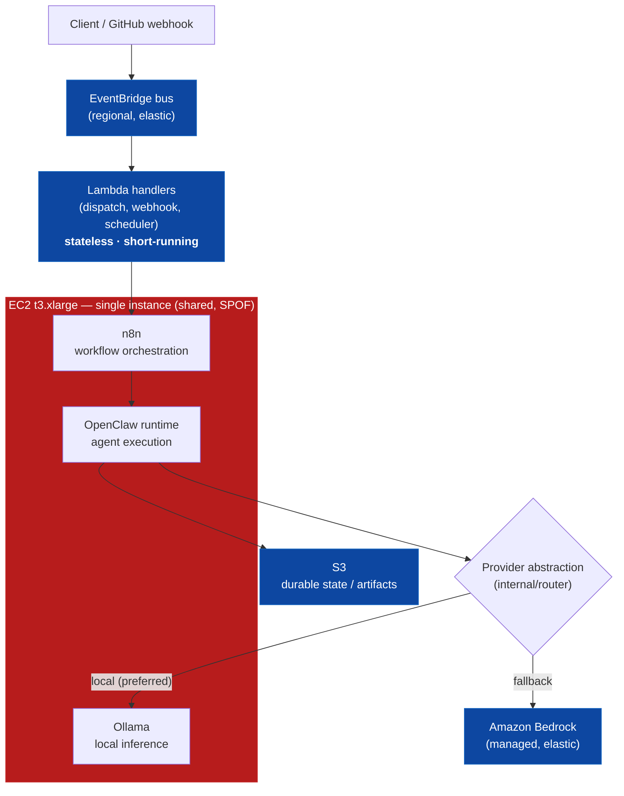
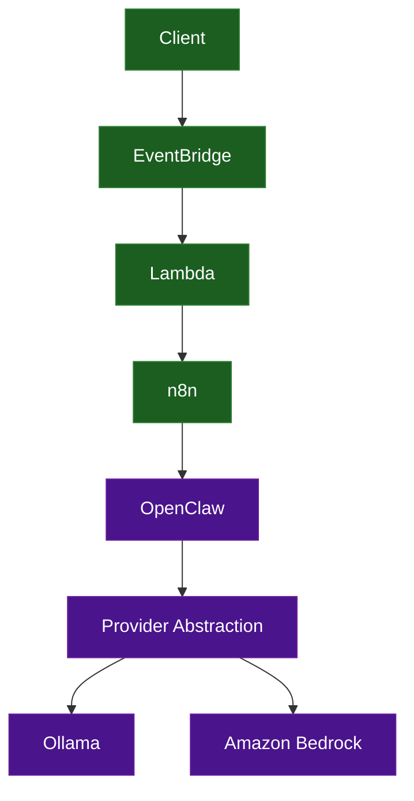
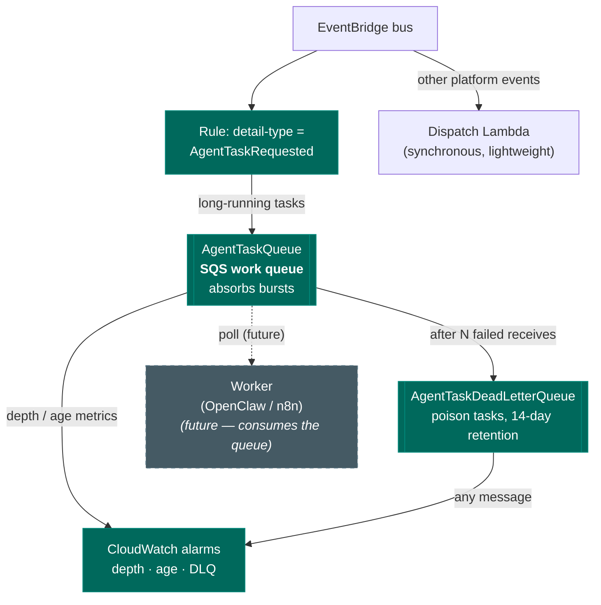

# Scalability Diagrams — Milestone 16

> **Milestone 16 — Scalability.**
> These diagrams show the platform as it runs today, the seam this milestone adds
> in [`infra/cloudformation/13-scalability.yaml`](../../infra/cloudformation/13-scalability.yaml),
> and how it evolves toward horizontal scale. They accompany the blog post,
> [Scaling an AI Agent Platform on AWS](../blog/scaling-an-ai-agent-platform-on-aws.md),
> and the reference, [SCALABILITY.md](../../SCALABILITY.md).
>
> **The one idea.** You cannot scale what you have not decoupled. Every diagram
> below is a variation on inserting one queue between arrival and execution.

## Reading the diagrams

**Solid** nodes and edges are **implemented and deployable today**. **Dashed** nodes
and edges labelled *(future)* are the horizontal-scaling architecture this milestone
lays the foundation for but does **not** build. The distinction is load-bearing:
this is a partial implementation, and the diagrams are honest about the line.

## Contents

- [1. Current architecture (as built)](#1-current-architecture-as-built)
- [2. Component interaction](#2-component-interaction)
- [3. The seam this milestone adds](#3-the-seam-this-milestone-adds)
- [4. Future scalable architecture](#4-future-scalable-architecture)
- [5. Queue depth as the scaling signal](#5-queue-depth-as-the-scaling-signal)

## 1. Current architecture (as built)

One EC2 instance runs Ollama, n8n, and the OpenClaw runtime; EventBridge and Lambda
are the event backbone; Bedrock is the managed inference fallback. Everything in this
diagram exists today. The bottleneck it exposes: the three workloads share one box,
and the event path in is synchronous.



## 2. Component interaction

The request path the milestone brief calls out, end to end. Lightweight
orchestration (the top half) is fast and synchronous; long-running AI execution (the
bottom half) is where the queue belongs.



## 3. The seam this milestone adds

A durable work queue between the event bus and the workers. The event rule selects
long-running task events by detail-type and routes them to SQS instead of the
synchronous dispatch Lambda. Everything solid here is deployed by `13-scalability.yaml`;
the **worker** that consumes the queue is dashed — it is the next milestone.



## 4. Future scalable architecture

Where the seam leads. Solid is today's single deployment; **dashed is the horizontal
architecture the queue makes a drop-in** — multiple EC2 workers in an Auto Scaling
group, concurrent n8n executions, replicated Ollama, all sharing one queue and one
durable store, all coordinated by events rather than by each other.

```mermaid
flowchart TB
    client["Client / webhook"]
    bus["EventBridge bus<br/>(stays central)"]
    queue[["AgentTaskQueue<br/>(the load-levelling seam)"]]

    subgraph fleet["Worker fleet — Auto Scaling group (future)"]
        w1["Worker 1<br/>OpenClaw + Ollama"]
        w2["Worker 2<br/>OpenClaw + Ollama"]
        w3["Worker N…<br/>scale on queue depth"]
    end

    bedrock["Amazon Bedrock<br/>(elastic overflow)"]
    s3["S3<br/>(one shared store, stays central)"]
    asg{{"Target-tracking policy<br/>on backlog metric<br/><i>(future)</i>"}}

    client --> bus --> queue
    queue -. "share-nothing:<br/>each task to one worker" .-> w1
    queue -. .-> w2
    queue -. .-> w3
    w1 -. "overflow when<br/>local saturates" .-> bedrock
    w2 -. .-> bedrock
    w1 --> s3
    w2 --> s3
    w3 --> s3
    queue -. "depth signal" .-> asg -. "add/remove workers" .-> fleet

    classDef now fill:#1b5e20,stroke:#2e7d32,color:#fff;
    classDef future fill:#455a64,stroke:#607d8b,color:#fff,stroke-dasharray:5 5;
    class bus,queue,s3,bedrock now;
    class fleet,w1,w2,w3,asg future;
```

## 5. Queue depth as the scaling signal

The metric that closes the loop. It is published today and wired to a human; the
only thing that changes to make scaling automatic is *who* reads it — a
target-tracking policy instead of an on-call engineer. The contract is identical.

```mermaid
flowchart LR
    arrivals["Task arrivals<br/>(bursty)"]
    queue[["AgentTaskQueue"]]
    depth["ApproximateNumberOfMessagesVisible<br/>ApproximateAgeOfOldestMessage"]

    human["On-call engineer<br/><b>(today)</b>"]
    policy["ASG target-tracking<br/><i>(future — same metric)</i>"]
    workers["Worker count"]

    arrivals --> queue --> depth
    depth --> human -. "add capacity by hand" .-> workers
    depth -. .-> policy -. "add/remove automatically" .-> workers
    workers -- "drain faster" --> queue

    classDef now fill:#00695c,stroke:#00897b,color:#fff;
    classDef future fill:#455a64,stroke:#607d8b,color:#fff,stroke-dasharray:5 5;
    class queue,depth,human now;
    class policy future;
```
