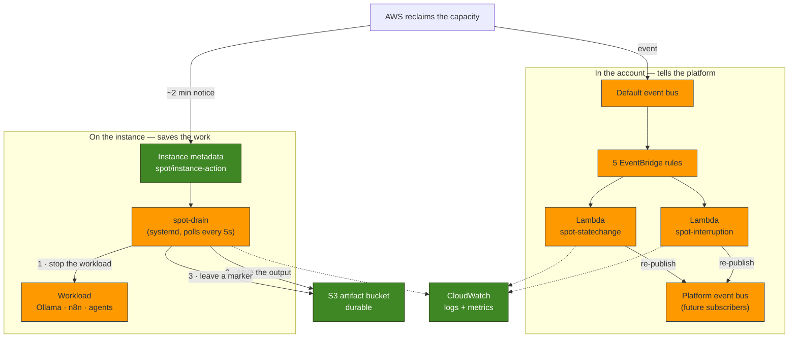
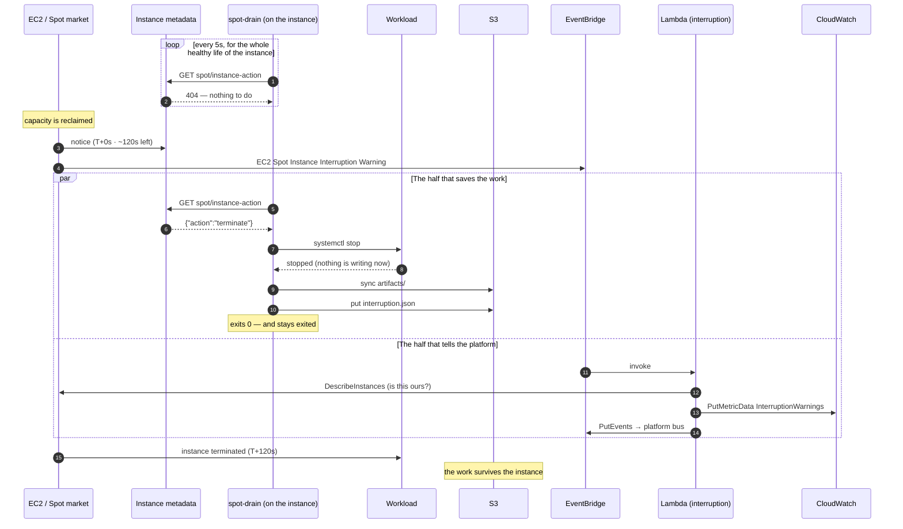
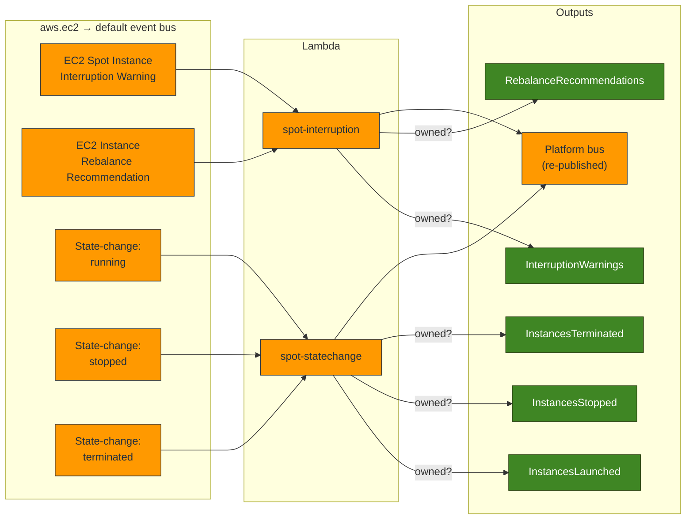
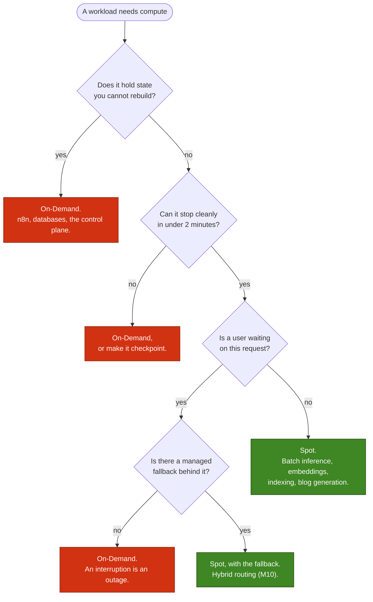
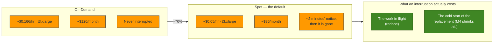

# Spot Interruption Diagrams — Milestone 3

> **Milestone 3 — EC2 Spot Instances.**
> These diagrams describe the interruption handling defined in
> [`infra/cloudformation/08-spot.yaml`](../../infra/cloudformation/08-spot.yaml)
> (the account-side handlers) and
> [`03-compute.yaml`](../../infra/cloudformation/03-compute.yaml) (the on-host
> drain agent), with the Go handlers in [`infra/lambda`](../../infra/lambda).
> They accompany the blog post,
> [Reducing AI Infrastructure Costs with EC2 Spot Instances](../blog/reducing-ai-infrastructure-costs-with-ec2-spot-instances.md),
> and the operational reference, [SPOT.md](../../infra/SPOT.md).

> **This is a snapshot of Milestone 3.** It is kept as it was written — the record of a
> decision at a point in time. For what is deployed **today**, see
> **[The Platform As Built](current-architecture.md)**, the living diagram.

Five diagrams. They share the vocabulary and colour key of the
[Milestone 2 diagrams](infrastructure-diagrams.md) (compute = orange,
storage = green).

## 1. The two halves of interruption handling

The single most important thing to see here is that **the reclaim decision leaves
AWS along two independent paths, and only one of them can save your work.**

The left path never leaves the instance: the drain agent sees the notice in the
instance metadata service and has about two minutes to stop the workload and get
its output into S3. The right path never touches the instance: EventBridge
delivers the same fact to Lambdas that count it, log it, and tell the rest of the
platform.

A Lambda in the account cannot flush a half-written file on a disk it cannot
reach. That is why both halves exist.

## 2. The interruption timeline

Two minutes, spent. The window opens when AWS writes the notice; it closes when
the instance is gone, whether or not anything finished.

Note what the Lambda path is *not* doing: it is not on the critical path of
saving anything. It runs in parallel, and it would be equally correct if it ran a
minute later.

## 3. Event routing

Five rules, two functions, one metric each. Everything is on the **default** bus,
because that is the only bus AWS services publish to — a rule matching
`source: aws.ec2` on a custom bus is valid, deploys cleanly, and never fires.

The rules cannot filter by tag (EC2's events carry none), so they match every
instance in the region and the **handlers** decide ownership by reading the
instance's `Project` and `Environment` tags.

## 4. Does this workload belong on Spot?

The decision is not about how important the work is. It is about **what it costs
to lose two minutes of it** — and whether anything is left behind that cannot be
rebuilt.

The pattern it encodes: **the plane that does the work goes on Spot; the plane
that remembers the work does not.**

## 5. What the discount buys, and what it costs

Spot is the same hardware, the same network, the same AMI. You are renting
capacity AWS has already built and cannot currently sell, on the condition that
it can have it back. The discount is the price of that condition.

On a `t3.xlarge` that is ~$84/month. On a `g5.xlarge` GPU it is ~$510/month, and
on a `g5.12xlarge` ~$2,850/month — which is where the discount stops being a
rounding error and starts deciding whether a project is affordable at all.

The trade is only good when the right-hand box is small. A 20-minute batch job
interrupted once a week is a trivially good deal; a 30-hour fine-tune that cannot
checkpoint is a terrible one. See
[When not to use Spot](../../infra/SPOT.md#when-not-to-use-spot).
