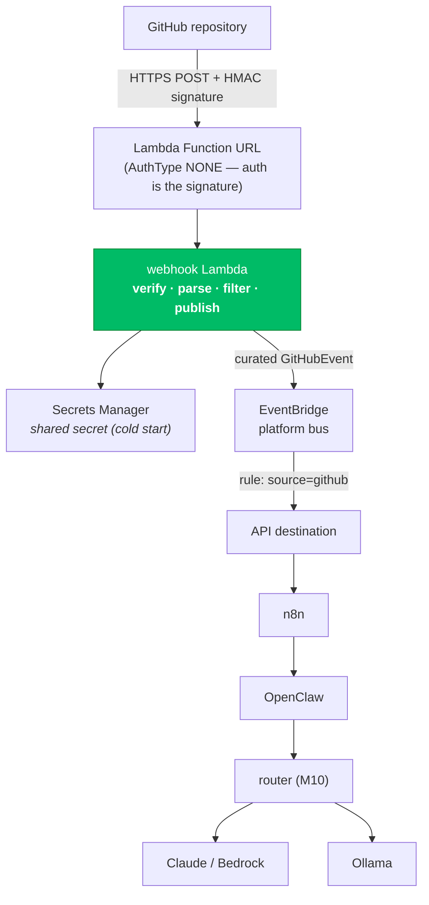
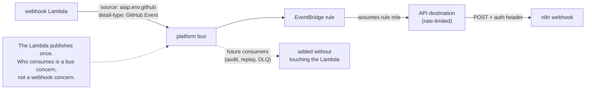
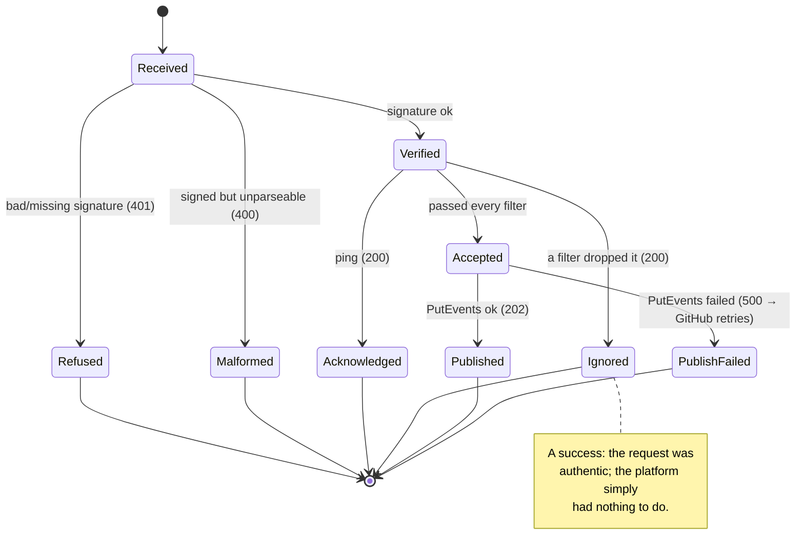
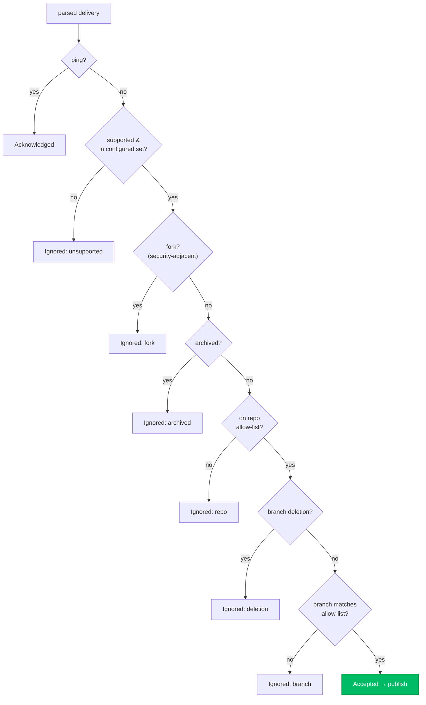
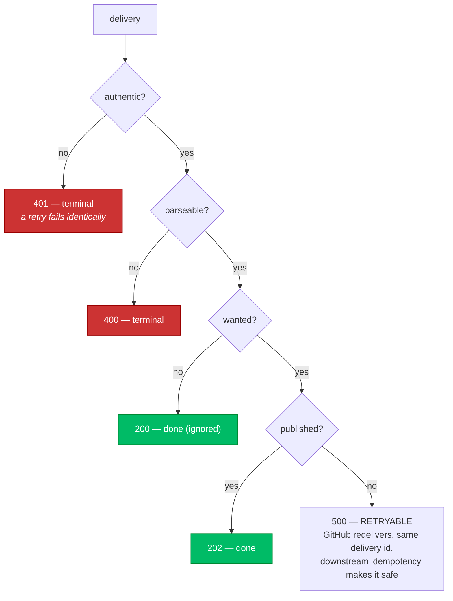
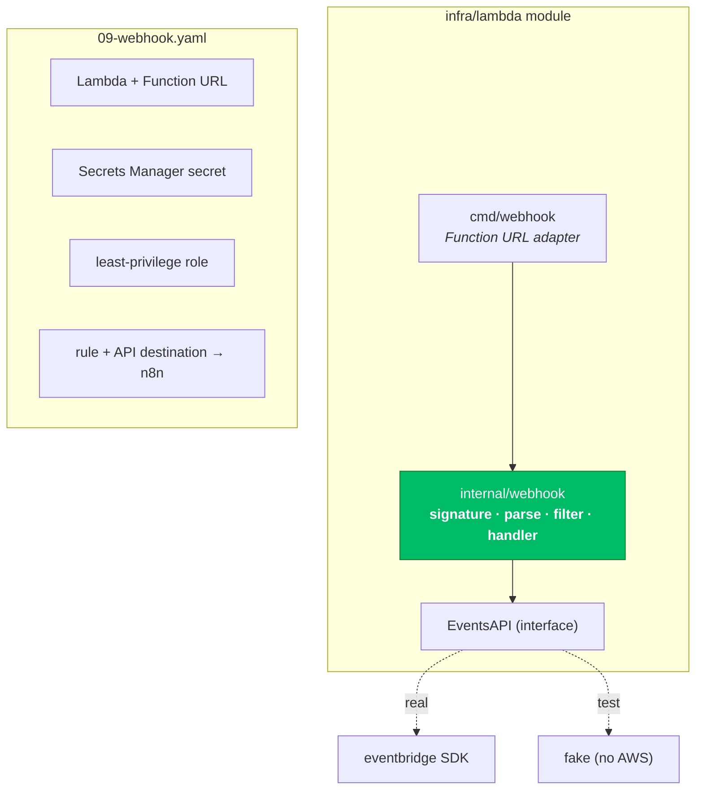

# Webhook Diagrams — Milestone 12

> **Milestone 12 — GitHub Webhook Automation.**
> These diagrams describe [`infra/lambda/internal/webhook`](../../infra/lambda/internal/webhook)
> (the handler) and [`infra/cloudformation/09-webhook.yaml`](../../infra/cloudformation/09-webhook.yaml)
> (the stack). They accompany the blog post,
> [Automating AI Workflows with GitHub Webhooks](../blog/automating-ai-workflows-with-github-webhooks.md),
> and the reference, [WEBHOOKS.md](../../WEBHOOKS.md).
>
> **The webhook does no work.** It verifies, filters, and publishes an event, then returns. n8n,
> OpenClaw, and the models are downstream consumers of the bus, on their own schedule.

## Contents

- [1. High-level architecture](#1-high-level-architecture)
- [2. The webhook sequence](#2-the-webhook-sequence)
- [3. Event routing](#3-event-routing)
- [4. The event lifecycle](#4-the-event-lifecycle)
- [5. Filtering: the decision](#5-filtering-the-decision)
- [6. Failure and retry](#6-failure-and-retry)
- [7. Component interaction](#7-component-interaction)

## 1. High-level architecture

GitHub is the producer; a Lambda behind a Function URL is the authenticated entry point;
EventBridge is the decoupling seam; everything else is a consumer.



## 2. The webhook sequence

One delivery, verified and published. Note the order: verify **before** parse, filter **before**
publish.

```mermaid
sequenceDiagram
    autonumber
    participant GH as GitHub
    participant L as Lambda
    participant SM as Secrets Manager
    participant EB as EventBridge

    Note over L: at cold start
    L->>SM: GetSecretValue (once)
    SM-->>L: shared secret

    GH->>L: POST / (event, delivery id, signature, body)
    L->>L: VERIFY signature over raw body (constant time)
    alt bad or missing signature
        L-->>GH: 401 (refused; nothing published)
    else authentic
        L->>L: PARSE (only the routing fields)
        L->>L: FILTER (supported? fork? archived? allow-list? branch?)
        alt filtered or ping
            L-->>GH: 200 (ignored/acknowledged; nothing published)
        else accepted
            L->>EB: PutEvents (curated GitHubEvent)
            alt published
                L-->>GH: 202 (accepted)
            else publish failed
                L-->>GH: 500 (retry me — same delivery id)
            end
        end
    end
```

## 3. Event routing

The curated event on the bus is matched by a rule and delivered to n8n via an API destination.
EventBridge is the point where one producer becomes many possible consumers.



## 4. The event lifecycle

A delivery's disposition — the three outcomes the logs distinguish, because "dropped",
"rejected", and "processed" are different things.



## 5. Filtering: the decision

Pure function of the delivery and the config. Safe-first (the drops where processing would be
*wrong*), then cheap-first (the merely uninteresting).



## 6. Failure and retry

Which failures ask GitHub to retry, and which are terminal. Only a publish failure is retryable —
everything else fails the same way forever, so retrying it is a storm.



## 7. Component interaction

Responsibilities and boundaries. The Lambda is in the `infra/lambda` module (edge
infrastructure), separate from the platform's application logic — it needs neither, because it
publishes an event rather than calling anything.


