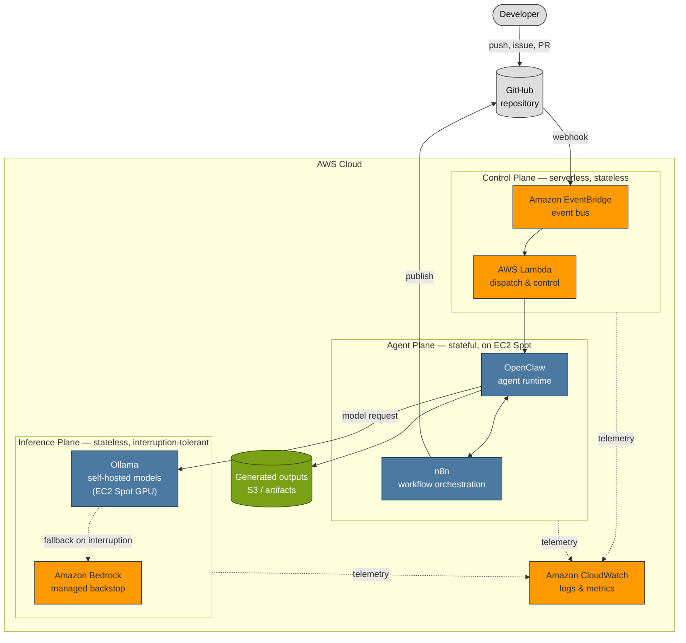

# Designing an AI Agent Platform on AWS

> **Milestone 1 — Initial Architecture.**
> This is a design document, not a deployment. No AWS resources exist, no
> infrastructure is provisioned, and no application code has been written. Its
> purpose is to settle the architecture — and the reasoning behind it — before
> the first template is authored. Forward-looking statements ("the platform
> will…") describe intent, not fact.

*Audience: software, cloud, DevOps, and AI engineers, and AWS architects.*

---

## Contents

- [Introduction](#introduction)
- [Design Goals](#design-goals)
- [High-Level Architecture](#high-level-architecture)
- [AWS Services](#aws-services)
- [Non-AWS Components](#non-aws-components)
- [Component Responsibilities](#component-responsibilities)
- [Data Flow](#data-flow)
- [Event Flow](#event-flow)
- [Deployment Strategy](#deployment-strategy)
- [Cost Optimisation](#cost-optimisation)
- [Security Considerations](#security-considerations)
- [Observability](#observability)
- [Scalability](#scalability)
- [Trade-offs](#trade-offs)
- [Future Roadmap](#future-roadmap)

---

## Introduction

### The problem

An AI agent is not a chatbot. A chatbot answers; an agent *acts*. It reads an
issue, edits files, runs commands, opens a pull request, and — if you let it —
publishes the result. That difference changes the engineering problem entirely.
An agent is a long-running, stateful process that spends real money per step and
holds a shell it will use on behalf of whoever last spoke to it.

Most teams that want to run agents reach for a hosted product and accept its
pricing, its data boundary, and its opinions. This project asks the harder
question: **what does it take to run autonomous agents on your own AWS account,
and run them well?** Well, here, means three things that hosted products hide:
predictable cost, an understood security boundary, and the freedom to change
model providers without rewriting the platform.

### Why an AI agent platform is useful

A single agent script is easy. A *platform* — the thing that lets many agents
run reliably, observably, and within budget — is where the engineering is. A
platform gives you:

- **One place for cross-cutting concerns.** Cost limits, logging, secrets, and
  the security sandbox are solved once, not per agent.
- **A provider abstraction.** Agents call "a model," not "Ollama" or "Bedrock."
  Which model actually answers is a routing decision the platform owns.
- **Event-driven triggering.** A GitHub event starts an agent; no one sits
  watching a queue.
- **A blast radius.** An agent with a shell is contained by infrastructure, not
  by trusting the prompt.

The first concrete workload is an agent that reads a repository and drafts the
technical post explaining it — including, eventually, posts like this one. But
the platform is the point; the first agent is how it earns its keep.

### Why AWS

Three properties of an agent map onto three things AWS does well:

- Agents are **event-triggered**, and AWS has a mature, serverless event
  backbone (EventBridge, Lambda) that costs nothing when idle.
- Agents doing **self-hosted inference are GPU-bound and interruption-tolerant**,
  and EC2 Spot sells exactly that capacity at a steep discount.
- Agents need a **hard security boundary**, and AWS IAM, VPC, and security groups
  are a well-understood way to build one.

AWS also offers a managed inference service, Amazon Bedrock, which becomes the
backstop that makes the Spot GPU strategy safe rather than reckless.

### High-level goals

1. Run autonomous agents on AWS at a cost that makes leaving them on defensible.
2. Keep the model provider a swappable seam, not a foundational dependency.
3. Contain the agent's blast radius with infrastructure, not hope.
4. Make cost, behaviour, and failure observable from day one.
5. Document every decision as a standalone post — the reasoning is the product.

---

## Design Goals

| Goal | What it means here |
| --- | --- |
| **Cost optimisation** | Idle infrastructure costs nothing; GPU runs on Spot; frontier models are reached only when justified. Cost is a first-class design input, not a post-launch surprise. |
| **High availability where appropriate** | The *control plane* stays available because it is serverless. The *inference plane* trades some availability for cost, and a managed backstop absorbs the difference. Not every tier needs four nines. |
| **Scalability** | Each plane scales on its own signal — queue depth for work, request rate for inference — so a spike in one does not oversize the others. |
| **Event-driven design** | Work begins in response to events, not on a schedule or a polling loop. Nothing runs waiting for something to happen. |
| **Loose coupling** | Components communicate through events and queues, not direct calls, so any one can be replaced or fail without taking its neighbours down. |
| **Maintainability** | Clear responsibility boundaries; each component owns one thing; infrastructure is code and is reviewed like code. |
| **Observability** | Logs, metrics, and events for every component, with agent-specific signals (tokens, iterations, provider mix) treated as first-class telemetry. |
| **Security** | Least privilege by default; the agent runs in a private subnet with no inbound internet access; prompt injection is treated as a privilege problem. |
| **Extensibility** | New agents, new model providers, and new event sources plug into defined contracts rather than requiring platform surgery. |
| **Open-source friendliness** | Self-hostable, dependency-light, documented in the open, and built on components a reader can run themselves. |

These goals are in tension, and the [Trade-offs](#trade-offs) section is where
that tension is made explicit rather than smoothed over.

---

## High-Level Architecture

The platform is decomposed into three planes, separated by **how much state they
hold** and **how much interruption they tolerate**. This is the single most
important decision in the design, because it determines what can run on cheap,
disappearing Spot capacity and what cannot.



Three ideas carry the whole design:

1. **Decompose by statefulness.** The inference plane holds no state between
   requests, so it can run on Spot capacity that vanishes with two minutes'
   notice. The agent plane holds a workspace and conversation state, so it
   cannot be treated so casually. Sorting components by this property is what
   lets the expensive tier — GPU inference — use the cheapest capacity.

2. **The provider is a seam.** Every model call passes through one abstraction.
   Because of that, a Spot GPU interruption mid-request can fail over to Bedrock
   and the agent never knows. That backstop is precisely what makes betting on
   Spot GPUs a sound decision rather than a gamble.

3. **The agent is a deputy with a shell.** OpenClaw can run commands. Its
   credentials, its network egress, and its filesystem are the security
   boundary — not the system prompt. An agent that cannot reach production
   secrets cannot leak them, however cleverly it is prompted.

The remaining sections describe each participant, then trace a request through
them.

The full set of architecture diagrams — high-level, event flow, component
interaction, and deployment boundaries — lives in
[docs/architecture/diagrams.md](../architecture/diagrams.md).

---

## AWS Services

Each service is chosen for a specific job. This section states that job, what
the service is responsible for, why it was picked, and what it costs you in
return — because every choice has a downside, and hiding it helps no one.

### Amazon EventBridge

- **Purpose** — The platform's event backbone. GitHub events, internal events,
  and future event sources all land here and are routed to handlers by rule.
- **Responsibilities** — Receive events, match them against rules, deliver them
  to targets, and dead-letter what cannot be delivered.
- **Advantages** — Serverless and idle-free; content-based routing decouples
  producers from consumers; native retries and dead-letter queues; a schema
  registry for event contracts.
- **Trade-offs** — At-least-once delivery means handlers must be idempotent.
  It is an AWS-native bus, so leaning on it is a deliberate step toward AWS;
  portability to another cloud would mean replacing it.

### AWS Lambda

- **Purpose** — The control-plane glue: validate an event, decide what should
  happen, and dispatch work. Short-lived, stateless coordination — never the
  agent's heavy lifting.
- **Responsibilities** — Verify webhook signatures, enforce idempotency, enqueue
  or dispatch work to the agent plane, and emit control events.
- **Advantages** — Scales to zero and to thousands automatically; pay per
  invocation; a natural fit for the short, bursty tasks of event handling.
- **Trade-offs** — The 15-minute execution ceiling and cold starts make it
  wrong for long agent runs — which is exactly why agents run on EC2, not
  Lambda. Keeping that boundary crisp is a design responsibility.

### Amazon CloudWatch

- **Purpose** — The observability substrate: logs, metrics, and alarms for every
  component.
- **Responsibilities** — Aggregate logs, store metrics (including custom
  agent-specific ones), raise alarms, and back operational dashboards.
- **Advantages** — Native to every AWS service; custom metrics and structured
  logs; alarms that can themselves emit events back into EventBridge.
- **Trade-offs** — Log and custom-metric costs grow with volume and need
  retention policies; it is capable but not a full distributed-tracing solution,
  which is deferred to a later milestone.

### EC2 Spot Instances

- **Purpose** — Cheap compute for the interruption-tolerant tiers: the agent
  runtime and, most importantly, GPU inference.
- **Responsibilities** — Run OpenClaw, n8n, and Ollama on capacity bought at a
  discount, and hand that capacity back gracefully when reclaimed.
- **Advantages** — Up to ~90% cheaper than On-Demand; the dominant cost of
  self-hosted inference is idle GPU, and Spot attacks it directly.
- **Trade-offs** — Instances can be reclaimed with a two-minute warning. That
  demands interruption handling, state that survives a restart, and the Bedrock
  backstop. It is a real engineering cost, paid deliberately to buy a large
  discount. (One consequence, recorded now: ASG *warm pools* do not support
  Spot, so cold-start mitigation must come from custom AMIs instead — see
  [Milestone 4](#future-roadmap).)

### AWS IAM

- **Purpose** — The permission model. Who and what may do what, enforced by the
  platform rather than by convention.
- **Responsibilities** — Scope every component to least privilege, isolate the
  agent's credentials from anything sensitive, and make the blast radius
  explicit and auditable.
- **Advantages** — Fine-grained, auditable, and the foundation of the security
  story; roles mean no long-lived credentials on instances.
- **Trade-offs** — Least-privilege policies are fiddly to get right and easy to
  get wrong in the permissive direction; policy sprawl needs active management.

### Amazon VPC

- **Purpose** — The network boundary. The agent plane lives in private subnets
  with no inbound path from the internet.
- **Responsibilities** — Segment public from private, route egress through a
  controlled path, and keep AWS-service traffic off the public internet via
  endpoints.
- **Advantages** — A strong, well-understood isolation primitive; VPC endpoints
  keep Bedrock and S3 traffic private; the natural home for an agent you do not
  fully trust.
- **Trade-offs** — NAT gateways and endpoints add cost and configuration; a
  misconfigured route or group silently widens the boundary, so it must be
  reviewed as carefully as code.

### Security Groups

- **Purpose** — Instance-level firewalls: the fine-grained "who may talk to whom"
  inside the VPC.
- **Responsibilities** — Permit only the connections each component actually
  needs — OpenClaw to Ollama, n8n to storage — and deny everything else by
  default.
- **Advantages** — Stateful, default-deny, and composable; a second layer of
  defence beneath subnet isolation.
- **Trade-offs** — Rule sets grow and drift as components are added; they guard
  the network layer only, so they complement rather than replace IAM.

### AWS CloudFormation

- **Purpose** — Infrastructure as code. The entire platform expressed as
  reviewable, versioned, reproducible templates.
- **Responsibilities** — Define every resource, manage stack lifecycle and
  updates via change sets, and export shared resources for component
  repositories to consume.
- **Advantages** — Native to AWS with no extra state backend to run; change sets
  preview a change before it applies; drift detection; a natural fit for a
  single-cloud platform.
- **Trade-offs** — More verbose and less expressive than Terraform, and
  AWS-only. The reasoning for choosing it anyway is in [Trade-offs](#trade-offs).

### Amazon Bedrock

- **Purpose** — Managed inference: the backstop that makes Spot GPUs safe, and
  the path to frontier capability without capacity planning.
- **Responsibilities** — Serve model requests that self-hosted capacity cannot —
  because it was interrupted, or because the task needs a model the platform
  does not host.
- **Advantages** — No capacity to manage; pay per token; access to models the
  platform would not host itself; the failover target that de-risks the whole
  inference plane.
- **Trade-offs** — Per-token cost is higher than amortised self-hosted inference
  at steady load, and it is an AWS-managed dependency. The routing layer exists
  to use it deliberately, not by default.

---

## Non-AWS Components

Three self-hosted, open-source components do work that AWS services do not, and
run *on* the AWS infrastructure above. Their deployments live in their own
repositories (see the [README](../../README.md#related-repositories)); this
platform defines the contracts they plug into.

### n8n

A self-hostable **workflow orchestration** engine. It sits between events and
actions, expressing multi-step processes — receive, transform, call, branch,
publish — as workflows that survive the loss of a node. It complements AWS by
giving non-trivial orchestration a durable, inspectable home that would
otherwise sprawl across many Lambda functions and step definitions. It is the
natural owner of the *publication* workflow: taking a finished artifact and
turning it into a pull request.

### OpenClaw

The **agent runtime** — the component that actually acts. It holds the shell,
the workspace, and the loop: read the task, call a model, run a tool, observe,
repeat, stop. It complements AWS by being the thing AWS deliberately does not
provide — an opinionated agent execution environment — while relying entirely on
AWS for its compute, its network boundary, and its credentials. It is the
"confused deputy," and everything in the [Security](#security-considerations)
section exists to contain it.

### Ollama

A **local inference server** for open-weight models. It serves models from the
platform's own GPU capacity on EC2 Spot, giving a known cost-per-token and
keeping routine inference off metered APIs. It complements AWS — and
specifically Bedrock — by being the cheap primary path, with Bedrock as the
managed fallback. The pairing is the whole point: Ollama for volume, Bedrock for
resilience and reach.

---

## Component Responsibilities

Every major component, what it owns, and what it needs. Inputs and outputs are
described at the level of contracts, not payloads.

| Component | Responsibility | Inputs | Outputs | Dependencies |
| --- | --- | --- | --- | --- |
| **EventBridge** | Route events to handlers | GitHub webhooks, internal events | Rule-matched deliveries; dead-letters | IAM |
| **Lambda (dispatch)** | Validate and dispatch work | Events from EventBridge | Work items; control events | EventBridge, IAM, work queue |
| **OpenClaw** | Run the agent task | Work items; model responses; workspace | Artifacts; tool actions; telemetry | Compute (Spot), inference plane, EFS, IAM |
| **n8n** | Orchestrate multi-step workflows | Control events; artifacts | Publish actions (PRs, comments); workflow state | OpenClaw, GitHub, EFS |
| **Ollama** | Serve self-hosted inference | Model requests | Model responses | Spot GPU, custom AMI |
| **Amazon Bedrock** | Serve managed / fallback inference | Model requests (on failover or by policy) | Model responses | IAM, VPC endpoint |
| **CloudWatch** | Observe the platform | Logs; metrics; events | Dashboards; alarms; alarm-events | All components |
| **IAM** | Enforce least privilege | Role and policy definitions | Scoped permissions | — (foundational) |
| **VPC + Security Groups** | Isolate the network | Subnet, route, and group config | The network boundary | — (foundational) |
| **S3 / EFS** | Persist artifacts and working state | Writes from OpenClaw, n8n | Durable objects; shared filesystem | IAM, VPC endpoint |
| **CloudFormation** | Provision everything, as code | Templates; parameters | Deployed, versioned stacks | IAM |

---

## Data Flow

The end-to-end lifecycle of one request — a developer's action becoming a
published result. The happy path first; failure handling is the
[next section](#event-flow).

```text
GitHub event
    ↓   a developer pushes, opens an issue, or opens a pull request
EventBridge
    ↓   a rule matches the event and routes it
Lambda
    ↓   verifies the webhook signature, enforces idempotency, enqueues work
EC2 Spot (Agent Plane)
    ↓   capacity is available (or is provisioned) to run the agent
OpenClaw
    ↓   reads the task, plans, and begins its loop
Ollama  ──►  Amazon Bedrock
    ↓   model requests go to self-hosted inference first,
        failing over to the managed backstop on interruption or by policy
Generated content
    ↓   the agent produces an artifact — a draft, a change, a comment
Storage / Publication
        the artifact is stored (S3), and n8n opens a pull request for human review
```

Stage by stage:

1. **GitHub event.** The trigger. A push, an issue, or a pull request becomes a
   signed webhook. GitHub is the system of record; the platform reacts to it.
2. **EventBridge.** The event is matched against rules and routed. Producers
   never know who consumes their events, which is what keeps the system loosely
   coupled.
3. **Lambda.** A short, stateless function verifies the webhook signature,
   deduplicates (the same event may arrive more than once), and hands a work
   item to the agent plane. It decides *whether* and *what*, never *how* — the
   heavy work is not its job.
4. **EC2 Spot.** The agent plane runs on Spot capacity. If none is warm, it is
   provisioned; custom AMIs keep that cold start short.
5. **OpenClaw.** The agent runs its loop: read, plan, call a model, run a tool,
   observe, repeat, and — governed by [loop engineering](#future-roadmap) — stop.
6. **Ollama → Bedrock.** Each model call is routed. Self-hosted Ollama answers by
   default; if its Spot GPU is reclaimed mid-task, or the task needs a model the
   platform does not host, the same call completes on Bedrock. The agent sees one
   "model," not two providers.
7. **Generated content.** The agent produces an artifact.
8. **Storage / publication.** The artifact is persisted to S3, and n8n runs the
   publication workflow — which, crucially, opens a *pull request* for a human to
   review. The platform drafts; a person merges.

---

## Event Flow

The data-flow above is the happy path. The event architecture is what makes the
platform survive the unhappy ones.

### Event-driven by design

Nothing polls. Nothing runs on a timer waiting for work. A component emits an
event when something happens, and interested components react. The control plane
costs nothing while no events flow, and the whole system's resting cost tends
toward zero.

### Decoupling

Producers and consumers never call each other directly. A GitHub event does not
know a Lambda exists; the Lambda does not know which agent will run. They share
only an *event contract*. Any component can be replaced, upgraded, or duplicated
behind that contract without its neighbours noticing — which is what makes the
platform extensible without surgery.

### Failure handling and retries

Because delivery is at-least-once and Spot capacity is unreliable, failure is
expected, not exceptional:

- **Unverified events** — a webhook that fails signature verification is
  dead-lettered at ingress and never reaches an agent.
- **Transient task failures** — a task that fails on a reclaimed instance is
  retried with exponential backoff on fresh capacity.
- **Exhausted retries** — a task that keeps failing is dead-lettered for
  inspection rather than retried forever.
- **Idempotency** — because the same event may be delivered twice, handlers are
  designed so that processing it twice is safe.

The full event lifecycle, including the dead-letter paths, is
[Diagram 2](../architecture/diagrams.md#diagram-2--event-flow).

### Future extensibility

New event sources (a schedule, a chat message, another repository) and new
consumers (a second kind of agent, a metrics sink) attach to the same bus under
new rules. Growth is additive: a new rule and a new target, not a rewrite.

---

## Deployment Strategy

*Planned. Authored in [Milestone 2](#future-roadmap); described here so the
philosophy is settled first.*

- **Infrastructure as code, exclusively.** Every resource is defined in a
  template and provisioned from it. Nothing is created by hand in the console;
  the templates are the truth.
- **CloudFormation** is the IaC tool (reasoning in [Trade-offs](#trade-offs)),
  organised as decomposed stacks — networking, security, compute — with shared
  resources exported for component repositories to import.
- **GitHub Actions** validates and deploys: templates are linted and their
  change sets reviewed on pull requests, and applied on merge. Infrastructure
  changes are reviewed exactly like application changes.
- **Environment separation.** Distinct environments (for example a low-cost
  development account and, later, production) are separated by account or by
  parameterised stack, never by editing shared infrastructure in place.
- **Cost-optimised by default.** The default environment provisions the minimum:
  Spot where possible, serverless where possible, and nothing left running idle.
- **Future production deployment.** Production hardening — stricter isolation,
  higher-availability configuration, tighter change control — is deferred to the
  production-readiness phase rather than bolted on early.

This milestone deliberately produces **no templates and no workflows.** It
settles what they will express.

---

## Cost Optimisation

Cost is a design input here, not an afterthought, because an agent platform's
natural failure mode is a large bill for idle GPUs. The architecture prefers, in
order:

- **EC2 Spot** for every interruption-tolerant tier. Idle GPU is the dominant
  cost of self-hosted inference, and Spot is the most direct discount on it — up
  to roughly 90% off On-Demand.
- **Serverless services** (EventBridge, Lambda) for the control plane, so it
  costs nothing between events. There is no always-on coordinator to pay for.
- **Event-driven execution**, so compute runs only in response to real work,
  never on a polling loop.
- **Automatic startup and shutdown**, so capacity exists while there is work and
  is released when there is not.
- **Minimal idle infrastructure** as a standing rule: the resting cost of the
  platform should trend toward the cost of its storage.
- **Deliberate use of managed inference.** Bedrock's per-token price is reached
  only on failover or when a task genuinely needs it, so the expensive path is
  the exception, not the default.

The expected benefit is a platform whose cost tracks its *use*: near-zero at
rest, scaling with genuine work, and with the most expensive resource — GPU —
bought at the deepest available discount. A measured cost model, replacing these
expectations with numbers, is a milestone of its own.

---

## Security Considerations

The organising principle: **an autonomous agent is a confused deputy with a
shell.** It will do what it is told by whatever manages to tell it something,
including a malicious instruction hidden in an issue it was asked to read. So
prompt injection is not treated as a content-filtering problem but as a
**privilege-escalation** problem. An agent that cannot reach a secret cannot
leak it, however it is persuaded.

- **IAM and least privilege.** Every component gets the narrowest role that lets
  it do its job. The agent's role in particular is scoped away from anything
  sensitive; it holds no standing credentials to production systems.
- **Network isolation.** The agent runs in a private subnet with **no inbound
  path from the internet**. It reaches out — to model APIs and GitHub — through a
  controlled NAT egress, and to AWS services through VPC endpoints that keep that
  traffic off the public internet.
- **Secrets management.** Credentials live in a managed secret store, are
  injected at runtime, and never sit in an AMI, an environment file, or a
  template.
- **HTTPS everywhere.** All external communication — webhooks in, API calls and
  git pushes out — is encrypted in transit.
- **Authentication.** Inbound webhooks are signature-verified before anything
  acts on them; unverified events are dead-lettered at the boundary.
- **Human in the loop.** The agent's output arrives as a pull request, not a
  merge. A person approves what is published; the agent never publishes
  unattended.

**Future improvements** — a formal sandbox around the agent's tool execution,
fine-grained egress allow-lists, automated secret rotation, and audit tooling —
are the subject of the dedicated security milestone. This section states the
boundary the platform starts from; that milestone hardens it.

---

## Observability

If the platform is going to be *boring to operate*, an operator has to be able to
see what it is doing, what it is spending, and how it is failing.

- **CloudWatch Logs.** Every component ships structured logs to a central place,
  so a single request can be followed across the control, agent, and inference
  planes.
- **CloudWatch Metrics.** Standard infrastructure metrics, plus **custom
  agent-specific metrics** that generic monitoring would miss: tokens consumed,
  loop iterations per task, the split between self-hosted and managed inference,
  and Spot interruption counts. These are the numbers that actually explain an
  agent platform's behaviour and cost.
- **Event monitoring.** Because the platform is event-driven, the event stream
  is itself a signal. Dead-letter volume, retry rates, and delivery failures are
  monitored as health indicators; a CloudWatch alarm can emit an event back onto
  the bus and trigger a reaction.
- **Future tracing.** Distributed tracing across the planes — following one
  task's full causal chain — is a deliberate later step, once the log and metric
  foundations are in place.

Observability is treated as a standing requirement of every component, not a
milestone that happens once and is forgotten.

---

## Scalability

Each plane scales independently, on its own signal, so a surge in one never
forces the others to grow with it.

- **Horizontal scaling.** Agent and inference capacity scale out by adding
  instances, not by enlarging one. The stateless inference plane scales most
  freely; the stateful agent plane scales within the limits its state imposes.
- **Event-driven scaling.** Queue depth is the scaling signal for work, and
  request rate for inference. Capacity follows demand rather than a fixed
  schedule, and there is no idle fleet sized for a peak that rarely comes.
- **Spot capacity.** The inference plane draws from Spot across instance types
  and availability zones, so scaling out also diversifies away from any single
  pool being reclaimed at once.
- **Future containerisation.** Moving the self-hosted components onto a container
  orchestrator would sharpen bin-packing and speed scaling further; it is a
  candidate evolution, deliberately not adopted on day one to keep the initial
  design legible.
- **Future multi-region.** Multi-region — for latency or for surviving the loss
  of a region — is out of scope for the initial architecture and is noted as a
  later consideration once single-region behaviour is well understood.

The honest limits of this model — where the stateful agent plane stops scaling
cleanly — are documented in the dedicated scalability milestone rather than
hand-waved here.

---

## Trade-offs

Every decision below bought something and cost something. Naming both is the
point of an architecture document.

### Spot instead of On-Demand

- **For** — up to ~90% cheaper, and idle GPU is the platform's dominant cost.
- **Against** — two-minute reclamation forces interruption handling, durable
  state, and a fallback path.
- **Verdict** — taken, because the discount is large and the interruption cost is
  payable with the Bedrock backstop. Spot without a backstop would be reckless;
  with one, it is simply cheap.

### CloudFormation instead of Terraform

- **For** — native to AWS, no separate state backend to run and secure, change
  sets, drift detection, and a clean fit for a single-cloud platform.
- **Against** — more verbose and less expressive than Terraform, and AWS-only.
- **Verdict** — taken, because this platform is deliberately AWS-native and the
  operational simplicity of no external state outweighs the ergonomics. A
  multi-cloud goal would reverse this.

### EventBridge as the backbone

- **For** — serverless, content-based routing, native retries and dead-letter
  queues, and strong decoupling.
- **Against** — at-least-once delivery forces idempotency, and it is an AWS-native
  dependency.
- **Verdict** — taken; the decoupling and the idle-free cost are exactly what an
  event-driven platform needs, and idempotency is good discipline regardless.

### Lambda for control, not for agents

- **For** — scales to zero, pay-per-use, ideal for short bursty coordination.
- **Against** — a 15-minute ceiling and cold starts make it wrong for long runs.
- **Verdict** — taken *for the control plane only*. The limitation defines a
  crisp boundary: coordination on Lambda, agent execution on EC2. The constraint
  is a feature — it keeps the two concerns from bleeding together.

### n8n for orchestration

- **For** — durable, inspectable, self-hostable multi-step workflows that would
  otherwise sprawl across many functions.
- **Against** — another stateful component to run and secure, versus staying
  purely serverless.
- **Verdict** — taken; complex publication and orchestration logic deserves a
  home built for it, and n8n's state lives on the same durable storage the agent
  plane already needs.

### Ollama for primary inference

- **For** — known cost-per-token, no metered API for routine work, full control
  of the models served.
- **Against** — you operate GPU infrastructure, with all the capacity and
  interruption concerns that brings.
- **Verdict** — taken as the *primary* path, precisely because Bedrock backs it
  up. The pairing — cheap self-hosted volume, managed fallback — is stronger than
  either alone.

### Bedrock for managed and fallback inference

- **For** — no capacity to manage, access to models the platform would not host,
  and the failover target that de-risks the entire Spot GPU strategy.
- **Against** — higher per-token cost at steady load, and a managed AWS
  dependency.
- **Verdict** — taken *as a backstop and a reach*, not a default. The routing
  layer's whole job is to use it deliberately.

---

## Future Roadmap

This milestone is, on purpose, only architecture and planning. It produces
documents and diagrams — no infrastructure, no templates, no application code.
Everything above is the foundation the following milestones build on, in order:

| Phase | Milestones |
| --- | --- |
| **Foundation** | **M1 · Initial Architecture** *(this document)* |
| **Infrastructure** | M2 · CloudFormation · M3 · EC2 Spot · M4 · Custom AMIs |
| **Workloads** | M5 · n8n · M6 · OpenClaw |
| **Inference & routing** | M7 · Ollama · M8 · Bedrock · M9 · Claude · M10 · Hybrid Routing |
| **Agent behaviour & operations** | M11 · Loop Engineering · M12 · GitHub Webhooks · M13 · Monitoring |
| **Production readiness** | M14 · Security · M15 · Cost · M16 · Scalability |
| **Beyond** | M17 · Future Extensions · then MCP Integration |

The full roadmap, with an objective and expected outcome for every milestone, is
in the [project README](../../README.md#roadmap). Each milestone is intended to
become its own post in this series — the next one being **Milestone 2**, where
this architecture stops being a diagram and becomes a CloudFormation stack.

---

*This post is Milestone 1 of an open, in-progress project. It describes a design,
not a running system. Follow the [roadmap](../../README.md#roadmap) as it is
built.*
