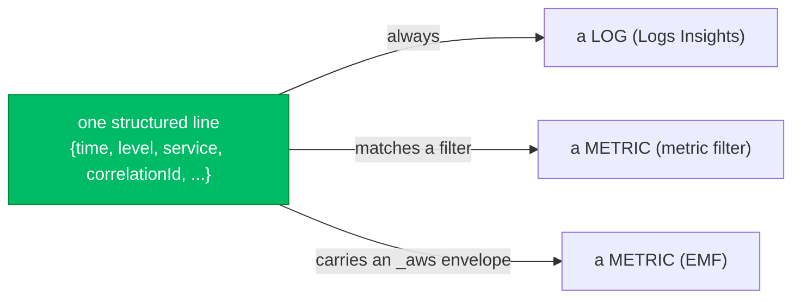
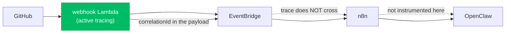

# Monitoring an AI Agent Platform with CloudWatch

> **Milestone 13 — Monitoring & Observability.**
> This milestone gives the platform eyes: centralized logs, custom metrics,
> dashboards, alarms, health probes, and X-Ray tracing, all through Amazon
> CloudWatch. It builds a shared observability library
> ([`internal/observability`](../../internal/observability)), a CLI to exercise it
> ([`cmd/observe`](../../cmd/observe)), and the monitoring stack
> ([`infra/cloudformation/10-monitoring.yaml`](../../infra/cloudformation/10-monitoring.yaml)).
> It does **not** build a second logging system, a metrics vendor integration, or
> tracing into services this repository does not deploy — those are out of scope by
> design, and the reasons are in the post.

*Audience: engineers who have added logging to six services, one line at a time,
and later discovered that no single query spans them, that the one dashboard that
mattered was built on a metric nobody was emitting, and that the alarm fired at 3am
about a dependency a restart could never fix.*

---

## Contents

- [Why CloudWatch, and not a better tool](#why-cloudwatch-and-not-a-better-tool)
- [The observability layer is one agreement, written once](#the-observability-layer-is-one-agreement-written-once)
- [One line, two products: logs and metrics are the same bytes](#one-line-two-products-logs-and-metrics-are-the-same-bytes)
- [The field that matters is the one that spans services](#the-field-that-matters-is-the-one-that-spans-services)
- [Redaction is a property of the handler, not a discipline](#redaction-is-a-property-of-the-handler-not-a-discipline)
- [EMF, or why the metric costs nothing the log did not](#emf-or-why-the-metric-costs-nothing-the-log-did-not)
- [Memory and disk are the metrics AWS cannot see](#memory-and-disk-are-the-metrics-aws-cannot-see)
- [Liveness and readiness are different questions](#liveness-and-readiness-are-different-questions)
- [Tracing that admits where it stops](#tracing-that-admits-where-it-stops)
- [An alarm you cannot act on is noise](#an-alarm-you-cannot-act-on-is-noise)
- [Lessons learned](#lessons-learned)
- [What comes next](#what-comes-next)

## Why CloudWatch, and not a better tool

There are better dashboards than CloudWatch's. There are cheaper log stores and
prettier trace viewers. The platform uses CloudWatch anyway, and the reason is the
same one that runs through every milestone: **the integration you do not have to
build and secure is the one that is already there.**

Every component this platform touches already speaks CloudWatch without being asked.
Lambda ships its own invocation, error, duration and throttle metrics and its logs,
with no code. EC2 ships CPU, network and status checks. The CloudWatch agent — baked
into the AMI since Milestone 4 — ships whatever else you configure. IAM already
scopes who may write where. Adding a third-party observability vendor would mean a
new credential in every role, a new egress path out of a network whose whole design
is that prompts do not leave it, a new bill, and a new thing to be down. CloudWatch
is the boring choice, and boring is the entire product goal
([the vision](../../README.md#vision) is that agents should be *boring to operate*).

The trade is real and worth naming: you accept CloudWatch's rougher edges — metric
extraction that is asynchronous, a query language that is not Splunk's — in exchange
for zero new trust boundaries. On a platform whose central security claim is about
what leaves the network, that is not a close call.

## The observability layer is one agreement, written once

Here is the uncomfortable thing this milestone started from: **the platform was
already logging everywhere, and that was the problem.** n8n, OpenClaw, the inference
plane, the loop controller — each already emitted structured lines, timed its work,
classified its errors. Six packages each doing observability "roughly the same way"
is not observability. It is five near-misses from a dashboard that cannot span them:
one writes `correlationId`, another `correlation_id`, a third drops the field on the
error path, and the query that was supposed to follow a GitHub delivery from the
webhook to the pull request quietly returns three unrelated things.

So `internal/observability` is not a new logger. It is the **agreement** — the field
names, the metric format, the redaction rule, the health contract — written once, in
a place anything can depend on. Its value is not the code. Its value is that there is
exactly one of it.

Which is why it returns a plain `*slog.Logger`:

```go
log := observability.New(observability.ConfigFromEnv())
```

Every package in the repository already takes a `*slog.Logger`. Making the standard
a bespoke `Logger` type with its own methods would have made "adopt the standard" a
rewrite — and a standard that is a rewrite is a standard nobody adopts. This way,
adopting it is a change to *how the logger is constructed*, one line per binary, and
not a change to a single call site.

And it is a **leaf**: it imports only the standard library, and
[`internal/architecture_test.go`](../../internal/architecture_test.go) fails the
build if that ever changes. The reason is exactly the reason the format validator is
a leaf. The observability layer is the one utility that must be usable from *every*
package; the moment it imported `internal/workflow` "just for the correlation type",
the inference plane could no longer use it without dragging the workflow engine in
behind it, and the thing that was supposed to be usable everywhere would be usable
almost nowhere.

## One line, two products: logs and metrics are the same bytes

The single idea the whole milestone rests on: a structured log line and a metric are
the same bytes seen two ways. The platform emits **one** line; CloudWatch reads it as
a searchable log and — if it matches a metric filter, or carries an EMF envelope — as
a graphable, alarmable metric.



This is not a trick to save keystrokes. It is what keeps a metric and its
explanation together. When `WorkflowFailures` ticks up, the line that incremented it
*also* says which workflow, for which correlation ID, and why — because it is the
same line. The alternative, emitting a metric here and a log there, is how you end up
with a graph that says something is wrong and no way to get from the graph to the
reason.

## The field that matters is the one that spans services

If you keep one field, keep `correlationId`. It is derived stably from the
originating event (a GitHub delivery ID), so the same event — retried by GitHub,
replayed by an operator — always produces the same ID, and every line the platform
emits because of that event carries it. In an incident, it is the difference between
"grep six log groups and hope" and one query.

The correlation fields ride on the `context.Context`, not on every function
signature:

```go
ctx = observability.WithFields(ctx, observability.Fields{
    CorrelationID: "push:delivery-abc-123",
    WorkflowID:    "blog-generator",
})
log.InfoContext(ctx, "workflow completed")
// → {"level":"INFO","msg":"workflow completed","service":"workflow",
//    "correlationId":"push:delivery-abc-123","workflowId":"blog-generator", ...}
```

A function five frames down that has a context but never heard of a GitHub delivery
still logs the right correlation ID, because the handler stamped it once and the
context carried it. That is the only kind of correlation that survives contact with a
real codebase — the kind nobody has to remember to thread through.

## Redaction is a property of the handler, not a discipline

The platform's prompts are full of somebody's source code, and its config is full of
tokens. A log group is a database that gets backed up. Put those two facts together
and "we redact secrets before logging" — a rule enforced by each caller remembering —
is a leak with a date on it.

So redaction is wired into the handler. Every attribute of every line passes through
a rule that replaces the value of anything whose key looks sensitive, at any depth:

```
log.Info("configured", "token", "abc123", "repository", "teddynted/platform")
→ {"token":"[REDACTED]","repository":"teddynted/platform", ...}
```

Two kinds of value are caught: **credentials** (`token`, `secret`, `authorization`,
an API key — a leaked one is compromised) and **repository content** (`prompt`,
`completion`, `payload` — not secret exactly, but *somebody's source*, and a log
group is not where it belongs). Matching is on a normalised key and a suffix, so
`api_key`, `API-Key`, `n8n_api_key` and `webhook_token` are one rule. The caller who
logs a secret by mistake — and someone always does — does not leak it, because the
backstop is in the one place every line goes through.

## EMF, or why the metric costs nothing the log did not

The obvious way to emit a custom metric is the `PutMetricData` API. It works, and it
has three costs the platform would rather not pay: a network call in the hot path (so
the act of measuring can slow or fail the thing measured), an IAM grant every
emitting role then holds, and a second system to reason about when a metric goes
missing.

The [CloudWatch Embedded Metric Format](https://docs.aws.amazon.com/AmazonCloudWatch/latest/monitoring/CloudWatch_Embedded_Metric_Format.html)
removes all three. A metric is a specially-shaped JSON *log line* with an `_aws`
envelope naming the namespace, dimensions and metrics. CloudWatch reads the envelope
and extracts real metrics from it — asynchronously, at no extra API cost, under the
logging permission the process already has:

```json
{"_aws":{"Timestamp":1700000000000,"CloudWatchMetrics":[{"Namespace":"aiap/app",
"Dimensions":[["Service","Workflow"]],"Metrics":[{"Name":"WorkflowDurationMs","Unit":"Milliseconds"}]}]},
"Service":"workflow","Workflow":"blog-generator","WorkflowDurationMs":1450,"message":"workflow completed"}
```

That line is both a log (searchable, correlation IDs intact) and a metric (graphable,
alarmable). One write, two products, no new permission. The `observability.Emitter`
builds the envelope from typed calls — `Duration`, `Count`, `Gauge` — because a
hand-written envelope that is subtly malformed produces *no metric and no error*, and
a silent nothing is the worst failure a metric can have. The dashboards and alarms in
the stack are the belt-and-braces to that: metric *filters* over the plain logs give
error and failure counts even from a service that only ever logs.

One rule the format quietly enforces, and the package documents loudly: **dimension
on things with a small bounded set of values, never on an identifier.** Dimension on
the model name and you can graph latency per model; dimension on the request ID and
you have created a million one-point metrics and a bill to match.

## Memory and disk are the metrics AWS cannot see

Building the infrastructure dashboard surfaced a gap that had been there since
Milestone 4 and that nobody had needed until there was a dashboard to notice it: the
baked CloudWatch agent shipped **logs only**. EC2 gives you CPU, network and status
checks from outside the guest for free — but memory and disk live *inside* the guest,
and AWS cannot see them. An "infrastructure utilization" dashboard without memory and
disk is a dashboard that is missing the two numbers that most often explain why a box
fell over.

So the agent config baked into the AMI grew a `metrics` section — `mem_used_percent`,
`disk_used_percent`, rolled up to an `InstanceId` dimension. It is a small change with
a milestone-shaped consequence: it takes an AMI rebuild to land, because the platform
does not hand-edit running instances (Milestone 4's whole argument). Patching the
agent config is a deployment, which is exactly as it should be.

## Liveness and readiness are different questions

The health library serves two probes, and the distinction between them is where the
whole story lives — because getting it backwards is a classic way to turn an outage
into a worse one.

- **`/healthz` — liveness:** is *this process* healthy? Failure means **restart me**.
- **`/readyz` — readiness:** can I do useful work — are my dependencies reachable?
  Failure means **stop routing to me** (`503`, try elsewhere).

Put a dependency check — "is n8n reachable" — into liveness, and the first time n8n
blips, every instance fails its liveness probe and gets restarted. Restarting does
not fix n8n. You have added a fleet-wide crash loop to a dependency outage. So the
same check means one thing under readiness (route around me) and would be a disaster
under liveness, and the library makes them separate registries with separate
meanings rather than one list with a flag. `HTTPCheck` — the probe most dependencies
need — sends no credentials on purpose: it answers "can I reach it", not "can I use
it", so a rotated token never becomes a restart.

## Tracing that admits where it stops

The webhook Lambda runs with X-Ray active tracing, and the observability layer stamps
the trace ID onto every log line, so a trace and the logs that explain it join up.
That is the part worth building. The part worth *not* building — and saying so — is
everything past the platform's own boundary.



Two honest limits. First, OpenClaw, Ollama and n8n are deployed by their own
repositories; the platform cannot instrument the inside of a service it does not
deploy, and a trace that reaches that boundary and stops is the truthful picture.
Second, a trace does not survive EventBridge — and that is not a gap, it is the
*point*: the webhook publishing an event and n8n consuming it later are two
transactions on purpose (a webhook must never block on the work). Drawing a single
trace across that seam would assert a causal line the architecture specifically
removed. The correlation ID crosses where the trace cannot, and that is the right
tool for a decoupled system.

This package deliberately does not create segments or sample — that is the X-Ray
SDK's job. A half-instrumented trace looks complete and is not, which is worse than
none.

## An alarm you cannot act on is noise

Every alarm the stack creates points at one SNS topic and sends both its ALARM and
its OK transition, because "it recovered" is as operationally useful as "it broke".
The alarms are chosen to be *actionable*: `excessive-retries` fires on a burst of
exhausted retries (a dependency is down, not just a bad request); `instance-unhealthy`
fires on the *approach* to failure; `failed-orchestrations` fires when an agent's
output was rejected as credential-shaped — observability serving security. Thresholds
are conservative defaults, and every one is a template parameter, because a dev
environment that pages you is one you mute, and a muted alarm is worse than no alarm.

One limitation is written down rather than hidden: the host alarms are bound to a
specific `InstanceId`, so when a Spot instance is reclaimed and replaced, they go to
`INSUFFICIENT_DATA` until the new instance's metrics are wired in. Per-instance alarms
are the honest shape for a single-instance platform; the Auto Scaling group
(Milestone 16) is what lets them move to an ASG dimension and survive a replacement.

## Lessons learned

- **The problem was not too little logging; it was too many logging *styles*.** The
  fix was one agreement, not more code.
- **A metric and a log should be the same line.** EMF makes that literal, and keeps
  the number and its reason together.
- **Redaction and correlation must live in the handler and the context**, or they are
  a discipline, and disciplines lapse on a Tuesday.
- **The metrics AWS gives you for free stop at the guest boundary.** Memory and disk
  need the agent, and noticing that was worth a dashboard.
- **Liveness and readiness are not two names for one probe.** The difference is
  whether failure means "restart" or "route around", and mixing them amplifies
  outages.
- **The best tracing story includes where tracing stops.** A boundary admitted is
  worth more than a trace implied.

## What comes next

The observability layer is deliberately ahead of some of the workloads it will watch
— exactly as Milestone 2's log groups were created before the services that write to
them. What is left is adoption and refinement: wiring the standard logger and the EMF
emitter through the long-running services as they come online, composite alarms to
cut noise, anomaly-detection thresholds instead of static ones, a logs subscription
for cheap long-term retention, and the ASG-dimensioned host alarms that Milestone 16
unlocks. The agreement is in place; the rest is a service at a time.
