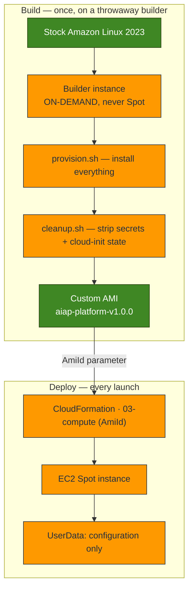

# Optimizing EC2 Spot Instance Startup with Custom AMIs

> **Milestone 4 — Custom AMIs.**
> The image pipeline, the templates, and the numbers in this post are all real:
> the AMI was built on a live AWS account, and the startup times were measured by
> launching both kinds of instance and asking cloud-init how long it took.

*Audience: AWS architects, cloud, DevOps and platform engineers, and the AI
engineers whose jobs spend more time booting than working.*

[Milestone 3](reducing-ai-infrastructure-costs-with-ec2-spot-instances.md) put this
platform's compute on EC2 Spot, at about 70% off, and made its interruptions
survivable. It also left a hole I did not name at the time.

A Spot instance can be reclaimed with **two minutes' notice**. Our instance spent
its first **76 seconds** running `dnf update` and installing Docker. Read those two
sentences together and the problem is obvious: for more than half of its eviction
window, that instance could do nothing — and one reclaimed in that window has done
**no work at all**. It downloaded packages, was taken away, and left nothing behind.
We had built a machine that could spend most of its life installing itself.

This post is about closing that gap by shipping a machine image where the work is
already done.

---

## Contents

- [Why startup time matters more for AI](#why-startup-time-matters-more-for-ai)
- [The trouble with installing at boot](#the-trouble-with-installing-at-boot)
- [What a custom AMI actually is](#what-a-custom-ami-actually-is)
- [Architecture](#architecture)
- [What to bake, and what never to bake](#what-to-bake-and-what-never-to-bake)
- [Building the image](#building-the-image)
- [The two-phase build, and why it has to be](#the-two-phase-build-and-why-it-has-to-be)
- [The CloudFormation](#the-cloudformation)
- [UserData, before and after](#userdata-before-and-after)
- [The numbers](#the-numbers)
- [Immutable infrastructure](#immutable-infrastructure)
- [Versioning and rollback](#versioning-and-rollback)
- [Security: an AMI is a filesystem you might share](#security-an-ami-is-a-filesystem-you-might-share)
- [Cost](#cost)
- [Common pitfalls](#common-pitfalls)
- [Lessons learned](#lessons-learned)
- [What comes next](#what-comes-next)

---

## Why startup time matters more for AI

For a long-lived web server, a slow boot is a shrug. You do it once a quarter,
during a deploy, and then the instance runs for months. The boot cost is amortised
into invisibility.

AI compute is not shaped like that. It is **bursty and horizontal**: you launch
many short-lived instances rather than a few long-lived ones. A batch of
embeddings, a repository to index, a blog post to draft — each is minutes of work
on a node that exists only for that job. And the boot cost is paid **per instance,
every single time**.

Which produces an absurd ratio. This platform's install-at-boot instance takes
**76 seconds** to become useful (measured — see [The numbers](#the-numbers)). Put a
90-second job on it and **46% of that instance's life is spent installing software
it will use for a minute and a half.** The boot is not overhead on the workload; the
boot is *half* the workload.

And 76 seconds is the *good* case: a warm package mirror, a fast instance, and no
Ollama. Add a 1.5 GB model runtime, or a slow mirror, or a smaller instance, and it
grows — while the job does not.

Then Spot sharpens it into something worse than waste. A Spot instance carries a
**two-minute** eviction notice. An instance that needs 76 seconds before it can do
anything is an instance that spends **more than half its eviction window** getting
ready — and one reclaimed in that window did nothing, produced nothing, and cost you
money to watch it download packages. The cheaper the compute, the more instances you
churn, and the more often you pay that boot.

**Spot's economics make you launch constantly. A slow boot makes every launch
expensive. The two multiply.**

## The trouble with installing at boot

Look at what our Milestone 3 instance actually did on launch:

```bash
#!/bin/bash
dnf -y update                       # hundreds of MB, minutes
dnf -y install docker git python3   # a package mirror, and hope
curl -fsSL https://go.dev/dl/...    # a third party, at boot
cat > /usr/local/bin/spot-drain     # write out a program, from a string, in YAML
systemctl enable --now spot-drain
```

Three separate problems live in there, and only the first is about speed.

**It is slow**, obviously. 76 seconds, measured, every time, on every instance —
and that is the *best* case.

**It is fragile.** Every one of those lines is a network call, and every network
call is a way to fail. The package mirror can be slow. A GitHub release can move. A
TLS handshake can fail. And when one does, you find out at the worst possible
moment — on a fresh instance, in production, unattended.

**And its failures are silent.** This is the part that should genuinely worry you.
UserData has **no retry, no rollback, and nowhere good to report a failure.** It
runs once, as root, on a machine nobody is watching. If step 14 of 40 fails, the
instance still boots. It still passes its EC2 status checks. It still shows up in
the console as `running`, and it is quietly, invisibly broken. Nothing pages you.
The only evidence is a line in `/var/log/cloud-init-output.log` on a disposable
instance that will be gone by morning.

I did not have to invent that failure to write about it. **It happened while
building this milestone** — see [Lessons learned](#lessons-learned).

## What a custom AMI actually is

An Amazon Machine Image is a **snapshot of a disk, plus the metadata to boot it**.
Nothing more mystical than that.

The stock Amazon Linux 2023 image is one. What we build is the same thing, one step
further along: the same disk, after `dnf update` and Docker and Go and Node and
Python have already been installed. Every instance launched from it starts from
that disk, already complete.

That is the whole trick. **The work does not go away. It moves.**

|  | Install at boot | Baked into an AMI |
| --- | --- | --- |
| When the work happens | every launch | once, at build |
| Who waits for it | a Spot instance that may be reclaimed | a builder nobody is waiting for |
| If it fails | silently, in production, unattended | loudly, at build time, in front of you |
| Needs the internet at boot | yes | **no** |
| Boot time | 76 s (measured) | **2.5 s** (measured) |

Read the second row again, because it is the one that matters most and gets the
least attention. Baking does not merely make the boot faster. It **moves every
failure from launch-time to build-time** — from a place where failure is silent and
unattended to a place where failure is loud, visible, and free.

## Architecture



The builder is **On-Demand, deliberately.** A Spot builder can be reclaimed halfway
through a ten-minute build, and a half-built image is the one artefact an AMI
pipeline must never produce. It runs for minutes and costs about a cent.

This is the one place in the entire platform where Spot is the wrong answer — and
it is a direct application of the rule from the last milestone: *Spot is for work
you could lose and merely be annoyed.* Losing a build you are about to stamp onto
every future instance is not "merely annoying".

### Why the build is a script, not CloudFormation

Because **CloudFormation has no resource type that builds an AMI.** It can
*consume* one — that is exactly what the `AmiId` parameter is for — but producing
one is a *procedure*: launch, provision, verify, snapshot. Not a declaration.
Wrapping a procedure in a custom resource gets you the same procedure plus a
Lambda.

The clean way to say it: **building the image is a pipeline concern; consuming it
is an infrastructure concern; the AMI ID is the interface between them.** The
compute stack does not know or care how its image was made, and the build does not
know where the image is used.

*(EC2 Image Builder is the managed version of exactly this, and for a large fleet
it is the right answer. I did not use it here: the mechanics are the thing worth
learning, and they are the same mechanics Image Builder runs on your behalf.)*

## What to bake, and what never to bake

One rule decides every case:

> **Bake what is the same everywhere. Configure what differs.**

A single AMI is shared by dev, staging and prod. So anything that varies between
them is *not* baked — UserData writes it at boot. Anything identical everywhere
*is* baked.

| Baked | Configured at boot |
| --- | --- |
| OS patches, Docker, Go, Node, Python, git | The artifact bucket name |
| The CloudWatch agent (installed, template config) | The CloudWatch log group |
| The Spot drain agent's **code** | The drain agent's **configuration** |
| Ollama's **binary** (optional) | Ollama's **models** |

Two of these taught me something.

**Being forced to bake something is an excellent test of whether it was properly
parameterised.** In Milestone 3, the drain agent read its config from
`/etc/aiap/drain.env` — a path with the *project name* in it. That is fine in a
template that knows the project name. It is fatal in an image: an image containing
that path is an image that only works for one project, which is not an image, it is
a snapshot. It now reads `/etc/spot-drain.env`, and everything environment-specific
lives *inside* that file. The AMI did not break the abstraction; it **exposed** that
the abstraction was already broken and nobody had noticed.

**Never bake a model.** Ollama's binary is ~1.5 GB and belongs in the image —
pulling it at boot is precisely the tax we are removing. But a *model* is many
gigabytes, changes on a completely different cadence from the OS, and would be
frozen into **every AMI version you retain**. You would pay snapshot storage for
the same weights, again and again, once per version, forever. Models go in S3.

The general form: **bake things that change with the OS. Do not bake things that
change on their own schedule.**

## Building the image

```bash
make -C infra ami                       # next patch version
make -C infra ami AMI_VERSION=2.0.0     # explicit
make -C infra ami INSTALL_OLLAMA=true   # +1.5 GB
```

**4.5 minutes**, measured, from launching the builder to the image being available
— nearly all of it `dnf update` and downloads. **That is the point.** It is time paid
once, by a machine nobody is waiting for, instead of on every launch by a Spot
instance that may be reclaimed before it finishes.

Versions are **pinned** in the provisioning script:

```bash
GO_VERSION="${GO_VERSION:-1.23.4}"
NODE_MAJOR="${NODE_MAJOR:-20}"
COMPOSE_VERSION="${COMPOSE_VERSION:-v2.32.1}"
```

An unpinned "latest" is how two builds of "v3" end up with different Go compilers
and one of them mysteriously fails. If the image is supposed to be deterministic,
its inputs have to be.

And every build writes a **manifest into the image**:

```json
{ "builtAt": "…", "baseAmi": "ami-…", "go": "go1.23.4",
  "docker": "Docker version 25.…", "node": "v20.…", "python": "3.9.…" }
```

Six weeks from now, "which Go is on this thing?" should be answered by reading a
file, not by inferring it from an AMI name someone chose in a hurry.

## The two-phase build, and why it has to be

The obvious design is one script: install everything, clean up, snapshot. It does
not survive contact with reality, and the reasons are worth more than the code.

**Cleanup destroys the two things provisioning is standing on.**

`cloud-init clean` deletes cloud-init's copy of the script that cloud-init is
*currently executing*. Bash reads a script incrementally — it does not slurp the
whole file into memory — so deleting it mid-run can truncate the rest of your
build. The build "succeeds" having silently skipped its last few steps.

And cleanup stops the SSM agent, which is the only channel available to **verify
that provisioning worked at all**. Kill it there and the build has no way to report
its own result.

So the build is two phases, and the boundary between them is a fact, not a
preference:

```mermaid
sequenceDiagram
    autonumber
    participant S as build-ami.sh
    participant B as Builder
    participant SSM
    participant EC2

    S->>B: UserData → provision.sh
    B->>B: install everything; write the manifest
    B->>B: touch ami-build.done
    loop poll
        S->>SSM: done? failed? where are you?
        SSM-->>S: the last line of the build log
    end
    Note over S,B: phase 1 CONFIRMED — only now is cleanup safe
    S->>SSM: run cleanup.sh
    B->>B: strip credentials, keys, machine-id, SSM registration
    B->>B: cloud-init clean → shutdown
    Note over S,B: the SSM command never replies.<br/>Cleanup killed the agent. Expected.
    S->>EC2: wait instance-stopped ← the real success signal
    S->>EC2: create-image, tag, terminate the builder
```

Note the signal design, because it is the part people get wrong. Phase 2 **cannot
report success** — it deliberately kills its own reporting channel and then powers
the machine off. So success is not "the command returned 0". Success is **the
instance reaching `stopped`**. When a step destroys the thing that would tell you it
worked, you need an out-of-band signal, and EC2's own state is one that cannot lie.

The clean shutdown also earns its keep: the snapshot is taken from a **quiesced
filesystem**, rather than with `--no-reboot` against a live one that might be
halfway through a write.

## The CloudFormation

One parameter carries the entire milestone:

```yaml
AmiId:
  Type: String
  Default: ""
  AllowedPattern: "^(ami-[0-9a-f]{8,17})?$"
  Description: >-
    Custom AMI to launch from. Empty falls back to the stock Amazon Linux 2023
    image, and the instance installs everything it needs at boot.
```

```yaml
Conditions:
  HasCustomAmi: !Not [!Equals [!Ref AmiId, ""]]
```

```yaml
ImageId: !If [HasCustomAmi, !Ref AmiId, !Ref LatestAmiId]
```

And that single condition also selects the UserData, which is where the whole idea
becomes visible in code.

The AMI ID is **never hard-coded**. `make deploy-ami` resolves the newest image
tagged `Project=<project>` and `Component=platform-ami` and passes it in — which is
why `build-ami.sh` tags so fussily. **The tags are not documentation; they are the
lookup.** An AMI ID pasted into a runbook is an ID that is wrong within a month.

## UserData, before and after

This is the milestone, in one comparison.

**Before — install at boot (~150 lines):**

```bash
#!/bin/bash
set -euo pipefail
dnf -y update                                    # minutes
command -v aws >/dev/null || dnf -y install awscli-2
install -d /var/lib/ai-platform/artifacts
cat > /etc/spot-drain.env <<ENV ... ENV
cat > /usr/local/bin/spot-drain <<'DRAIN'        # ~90 lines of program,
...                                              # embedded in a string,
DRAIN                                            # inside YAML
cat > /etc/systemd/system/spot-drain.service <<'UNIT' ... UNIT
systemctl daemon-reload
systemctl enable --now spot-drain.service
```

**After — baked (~30 lines, most of them comments):**

```bash
#!/bin/bash
set -euo pipefail

cat > /etc/spot-drain.env <<ENV
ARTIFACT_BUCKET="aiap-dev-artifacts-…"
ARTIFACT_DIR="/var/lib/ai-platform/artifacts"
DRAIN_LOG="/var/log/spot-drain.log"
DRAIN_UNITS="…"
POLL_SECONDS="5"
ENV
systemctl start spot-drain.service

sed -i 's|${LOG_GROUP}|/aiap/dev/platform|g' "$cwa"
amazon-cloudwatch-agent-ctl -a fetch-config -m ec2 -s -c "file:$cwa"
```

Not one line of the second block installs anything, **because there is nothing left
to install.** It writes configuration and starts a service that is already present.

The reliability argument is stronger than the tidiness one. In the first block there
are perhaps a dozen ways to fail, and *every one of them is a download*. In the
second there is essentially one: a typo in a config value. **The baked path cannot
fail on a package mirror, because it never talks to one.**

There is also a subtler win. That 90-line drain agent, embedded as a string inside
YAML inside CloudFormation, was genuinely awful: no syntax highlighting, no
`shellcheck`, `${...}` escaping traps (`Fn::Sub` eats `${VAR}` unless you write
`${!VAR}`), and a bug in it is a bug you find in production. Baked, it is a **file**
— reviewable, testable, lintable, and diffable.

*(It still exists in both places, because an instance launched without a custom AMI
has to write it out somehow. So `make lint` runs a check that fails the build if the
embedded copy drifts from the canonical file. A comment saying "keep these in sync"
is not a mechanism.)*

## The numbers

Measured, not estimated. Two `c5.xlarge` instances, same subnet, minutes apart. The
only difference is **where the software came from** — and both run *the very same*
`provision.sh`, one at boot and one at build time. Running the same script both ways
is what makes this a measurement rather than an anecdote.

Both were verified afterwards to actually *have* Docker and Go, which turns out to
matter enormously (see below).

```bash
make -C infra startup-benchmark
```

| | Install at boot | **Baked into an AMI** | |
| --- | --- | --- | --- |
| **UserData** (the part an AMI removes) | 75.12 s | **0.058 s** | **~1,300× faster** |
| **Total boot** (cloud-init, end to end) | 76.06 s | **2.54 s** | **~30× faster** |
| Docker, Go present | ✅ | ✅ | identical outcome |
| Drain agent running | ✅ | ✅ | |
| Network calls during boot | many | **zero** | |

**73.5 seconds, gone from every single launch.** And the shape of the win is
clearer in the first row than the second: UserData went from *seventy-five seconds*
to *fifty-eight milliseconds*, because the baked path does not install — it writes a
config file and starts a service that is already there.

The 2.54 s that remains is close to the floor: kernel, systemd, and cloud-init
deciding there is nothing to do. You cannot optimise that away, and you should not
try.

### The number the platform actually gets

The benchmark above is a *like-for-like* comparison: both instances run the same
script, and neither does anything else. The **real** deployed instance does a little
more — its UserData also starts the CloudWatch agent — so it boots in **6.20 s**
(4.76 s of UserData, nearly all of it the agent starting).

I am quoting both because quoting only the 2.54 s would be cherry-picking. The
honest summary is:

| | Install at boot | Baked (deployed, real) |
| --- | --- | --- |
| Total boot | 76.06 s | **6.20 s** — still **12× faster** |

The instance is doing *more* than the benchmark's, and it still boots in a tenth of
the time. And 4.76 s of "UserData" is now almost entirely one service starting —
not a single package downloaded.

Put the two-minute Spot notice next to those numbers:

- **Install at boot:** 76 s of a 120 s eviction window is spent getting ready.
  An interruption in the first minute costs you *everything*, because there was
  nothing yet to lose.
- **Baked:** 2.5 s. The instance is working for ~98% of the window.

That is the milestone, in one comparison.

### What the build costs, on the other side of the ledger

The work did not vanish, it moved:

| | |
| --- | --- |
| Build time (launch → AMI available) | **4.5 minutes** |
| Build cost (a `t3.large`, On-Demand) | **~$0.01** |
| Paid | **once**, by a machine nobody is waiting for |

Four and a half minutes, once, to remove 73.5 seconds from every launch forever. On
the tenth instance you are ahead; by the hundredth the question is not worth asking.

### A number that was a lie

The first time I ran this benchmark, install-at-boot reported **1.26 seconds** —
*faster than the baked image*. Which would have been a wonderful result if it were
not nonsense.

It had installed nothing. A bad S3 path meant the provisioning script was never
downloaded, `chmod` failed on a missing file, UserData exited, and cloud-init
cheerfully reported a beautifully quick boot.

**A boot that does nothing is very fast.** I nearly published that number, and it
would have *under*sold the AMI by a factor of thirty while looking like precision.
The benchmark now refuses to report a result unless both instances can prove they
have Docker and Go — because the failure mode of a benchmark is not "wrong", it is
"plausible".

## Immutable infrastructure

> **Never change a running instance. Build a new image and replace it.**

The platform had already committed to this without being able to afford it. Milestone
2 made the root volume `DeleteOnTermination: true` and put nothing durable on the
instance. Milestone 3 added a drain agent *because* the instance is disposable.
Milestone 4 is what makes disposability **cheap**: replacement is only a viable
strategy when the replacement boots ready.

What it buys:

- **Every instance is identical.** Not "configured the same" — *the same bytes*.
  Configuration drift cannot happen if configuration never happens.
- **The environment is a version**, not a state some sequence of scripts happened to
  reach.
- **A failed change is not an incident.** It is the previous AMI ID.
- **There is no "works on the old instances" bug**, because there are no old
  instances — only old images, which you can boot and inspect.

And what it costs: you give up hotfixing by hand. That is the trade, and on Spot it
is not really a trade at all. **An instance you hand-fixed can be reclaimed two
minutes later, taking the fix with it** — and the replacement comes up from the
image, without it. A hotfix on ephemeral compute is a fix with a random expiry date
that nothing records. The image *is* the environment: change the image, or change
nothing.

## Versioning and rollback

AMIs are named from a semantic version — `aiap-platform-v1.0.0` — and the version is
also a tag, which is what the tooling queries.

| Bump | When |
| --- | --- |
| **Major** | Something built on the image breaks: a runtime removed, a path moved |
| **Minor** | New software; existing contracts intact |
| **Patch** | Rebuild with no intended change: OS patches, a base-AMI refresh |

Two rules that are not negotiable:

**An AMI is immutable.** A version is built once and never rebuilt. The build script
*refuses* to rebuild an existing version — a name collision is a hard error, not a
silent replacement of an image that instances may still be running.

**Never delete what might be the rollback.** `make ami-prune` keeps the newest
three.

And then rollback, the payoff, is almost anticlimactic:

```bash
make ami-list                          # find the previous version
make deploy-ami AMI_ID=ami-<previous>  # done
```

The instance is replaced with one built from the older image. No uninstall, no
reverse migration, no repair. **The old image still exists, exactly as it was when
it worked.** Compare that with rolling back a patched-in-place box: running commands
to undo commands, on a machine whose state you are inferring rather than knowing.

## Security: an AMI is a filesystem you might share

Here is the mental model that makes the security rules obvious instead of a
checklist:

**An AMI is a filesystem that can be copied to another account, or made public with
a single API call — and unlike a running instance, nobody is watching it.**

Whatever is on the builder's disk when the snapshot is taken is on the disk of
**every instance ever launched from that image, forever, in every account it is ever
shared with.**

So the last thing the build does, immediately before the snapshot, is remove:

- **Credentials.** The build had an instance profile, and the SDK and CLI cache
  those credentials *on disk*. Short-lived is not "gone".
- **`authorized_keys`.** A key authorised on the builder is authorised on every
  instance from the image.
- **SSH *host* keys.** Bake them and every instance presents the same host identity —
  which silently defeats the entire point of host key verification.
- **`machine-id`.** Must be unique per instance.
- **The SSM registration.** The agent registered the *builder*. Left in the image,
  every instance claims to be that builder, and they fight over the identity.
- **Shell history, dnf caches, `/var/log/*`.** History outlives the terminal that
  made it; caches are pure snapshot cost; the builder's logs are actively misleading
  on a fresh instance.

**Never bake a secret.** Identity comes from the **instance profile at runtime** —
rotated by AWS, scoped by IAM, never on a disk you might share. And if a secret ever
does reach an image: rotate it, then deregister the AMI **and delete its snapshots**.
Deregistering alone leaves the data sitting there.

### The one that is silent

```bash
cloud-init clean --logs --seed
```

cloud-init records **on disk** that it has already run for this instance. Bake that
state into the image, and cloud-init on a *new* instance concludes it has nothing to
do — and **UserData never runs.**

The instance boots. It passes its status checks. It reports healthy. And it is
completely unconfigured: no drain agent, no log group, nothing. There is no error
anywhere, because from cloud-init's point of view nothing went wrong.

One line is the difference between an image that works and an image that only
appears to. It is the first thing I would check on any custom AMI that "boots fine
but doesn't do anything".

## Cost

An AMI is free. **Its snapshot is not** — and that is the entire cost model.

| Item | Rate | Here |
| --- | --- | --- |
| AMI registration | free | $0 |
| EBS snapshot | ~$0.05/GB-month | ~30 GB → **~$0.75/mo per version** |
| Retaining 3 versions | | **~$2.25/mo** |
| One build (`t3.large`, ~10 min) | ~$0.083/hr | **~$0.01** |

Snapshots are **incremental within a lineage**, so rebuilding from the same base with
mostly the same packages does not cost a fresh 30 GB — only the changed blocks. The
real number is below the worst case in that table.

**The trade is not close.** Two or three dollars a month of snapshot storage buys:
minutes → seconds on every launch; a boot that cannot fail on a download; Spot
instances that do work instead of installing themselves; and a rollback that is an
AMI ID instead of an incident. Against a compute bill in the tens or hundreds of
dollars, it is a rounding error that deletes an entire class of failure.

There is exactly one way to get this wrong: **never pruning.** Forty retained
versions of a 30 GB image is ~$60/month of snapshots for images nobody will ever
boot. And because deregistering an AMI does *not* delete its snapshot, it is
entirely possible to "delete" your AMIs and keep paying for them indefinitely.
`make ami-prune` deletes both.

## Common pitfalls

1. **Not running `cloud-init clean`.** UserData never runs again. Silent. Fixes
   nothing, breaks everything.
2. **Baking a secret.** An AMI can be shared and copied. Rotate, deregister, *and*
   delete the snapshots.
3. **Baking the SSM registration or `machine-id`.** Every instance claims to be the
   builder.
4. **Building on Spot.** A half-built image is the one thing the pipeline must never
   produce.
5. **Unpinned versions.** Two builds of "v3" with different compilers.
6. **Rebuilding an existing version.** AMIs are immutable. Bump the version.
7. **Deregistering without deleting snapshots.** You are still paying.
8. **Pruning to zero.** You have just deleted your rollback.
9. **Baking a model** (or anything that changes on its own schedule). You will store
   a frozen copy in every version, forever.
10. **Snapshotting a running instance** (`--no-reboot`). The filesystem may be
    mid-write. Stop it first.

## Lessons learned

**The AMI moves failure from launch-time to build-time — and that is worth more than
the speed.** I did not have to invent an example. The first build of this image
*failed*, on `pip3 install --upgrade requests`: on Amazon Linux 2023, `requests` is
installed by RPM, and pip cannot uninstall an RPM-managed package. It dies with
`Cannot uninstall requests … RECORD file not found`.

Now: on the **install-at-boot** path, that identical failure would have happened on a
Spot instance, at boot, unattended, in production. The instance would have come up,
passed its health checks, and been quietly broken — and I would have found out later,
from a symptom, on a machine that no longer existed. On the **baked** path it failed
on a builder, in front of me, with a log, and it cost about one cent and four
minutes. Nothing reached production, because nothing that fails a build can.

That is the real argument for custom AMIs, and it is not the one in the title.
Speed is what you notice. **Moving your failures somewhere you can see them is what
you keep.**

**Being forced to bake something reveals whether it was ever properly
parameterised.** The drain agent read `/etc/aiap/drain.env` — a *project name*, in a
*path*, in code I had already shipped and reviewed. It was invisible until I tried
to put it in an image shared by three environments. Baking is a hard test of the
config/code boundary, and the test found a bug.

**When a step destroys its own reporting channel, you need an out-of-band signal.**
Cleanup stops the SSM agent and powers the machine off, so it *cannot* report
success. The signal is the instance reaching `stopped` — a fact EC2 owns and the
instance cannot lie about. Any step that removes the thing that would tell you it
worked has to be verified from outside.

**A comment asking two files to stay in sync is not a mechanism.** The drain agent
has to exist both in the image and in the UserData of an instance that has no image.
The honest fix is a check that fails the build — which is now what `make lint` does.

**A broken benchmark looks like a good result.** My first measurement said
install-at-boot booted in 1.26 seconds, beating the custom AMI. It had installed
nothing. A benchmark's failure mode is not "obviously wrong" — it is *plausible*, and
plausible is what gets published. The benchmark now refuses to report a number unless
both instances can prove they have the software, because I do not trust myself to
notice the next time a result flatters me.

## What comes next

**Milestone 5 — self-hosted n8n**, the first workload that actually runs on this
foundation. It arrives on an instance that boots ready, which is precisely what the
last four milestones were for.

Two things deliberately left undone, and worth naming so the gaps are explicit:

- **A scheduled rebuild pipeline.** The image freezes the OS at build time, so a
  baked image gets *staler* every day — that is the trade for determinism. Patching
  is now a deployment, not an `ssh`, and it should be a *cron job*, not a human
  remembering. A monthly rebuild-and-roll (with the old AMI as the rollback) is the
  right shape; a manual `make ami` is only the seed of it.
- **Auto Scaling.** This platform still runs exactly one instance. A fast-booting
  image is what makes an Auto Scaling group with a mixed-instances policy *work* —
  it is the difference between "the interrupted instance is replaced in four
  minutes" and "in forty seconds". Milestone 16 collects that debt, and the launch
  template has been sitting there since Milestone 2 waiting for it.

Until then: the instance boots in seconds, the boot cannot fail on a download, and
rolling back is an AMI ID.

---

*The implementation is in [`infra/`](../../infra): the image pipeline in
[`scripts/`](../../infra/scripts), the `AmiId` boot path in
[`cloudformation/03-compute.yaml`](../../infra/cloudformation/03-compute.yaml), the
operational reference in [AMI.md](../../infra/AMI.md), and the diagrams in
[ami-diagrams.md](../architecture/ami-diagrams.md).*
