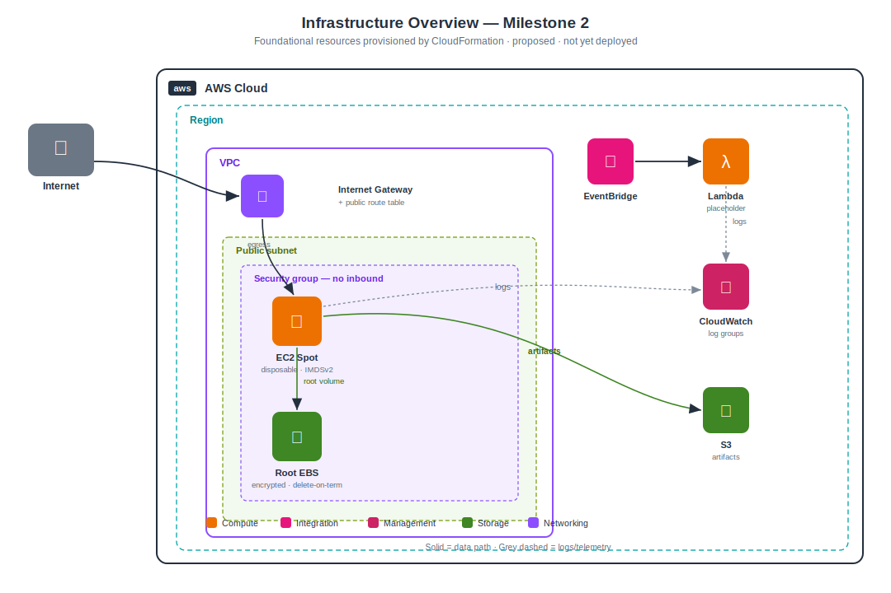
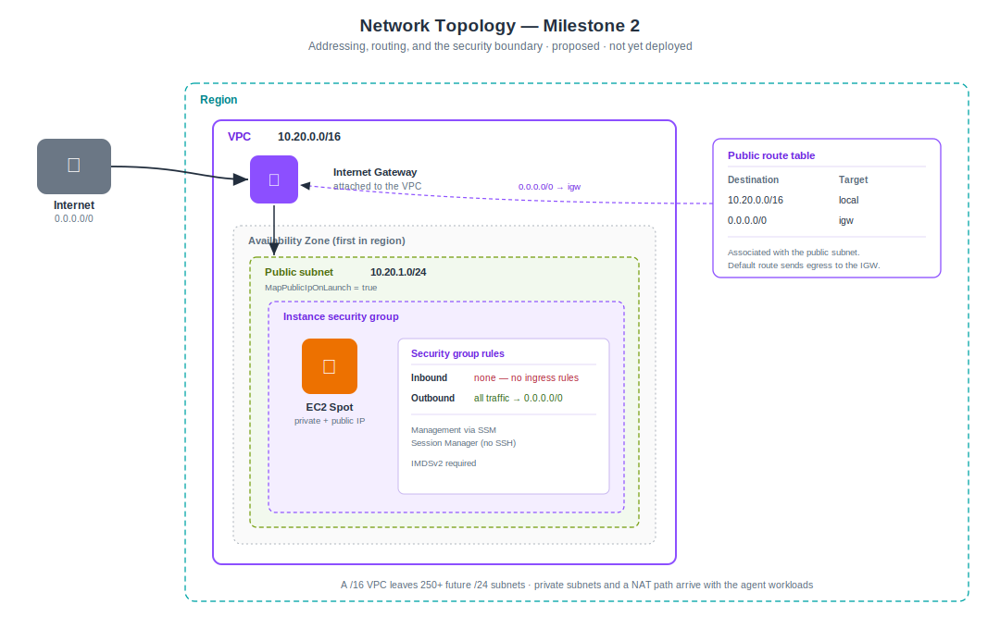
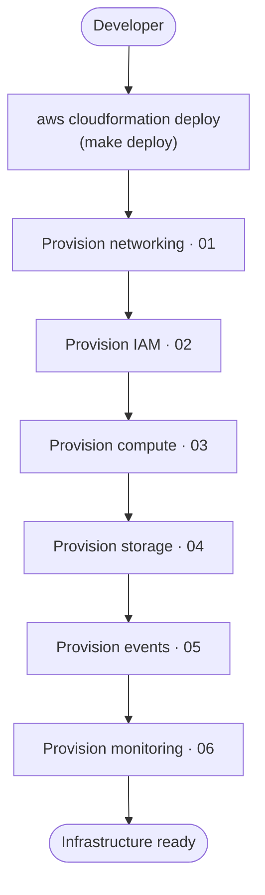

# Provisioning an AI Agent Platform with CloudFormation

> **Milestone 2 — CloudFormation Infrastructure.**
> This milestone provisions the platform's foundational AWS infrastructure as
> code. The templates are written to production standards and validated with
> `cfn-lint`, but they were **not deployed to a live AWS account** while this was
> authored — there was none available. Treat "the stack creates…" as "the
> template declares…", and deploy to a throwaway environment before relying on
> anything here.

*Audience: AWS architects, cloud, DevOps, and platform engineers, and the
software and AI engineers who will build on this foundation.*

The [Milestone 1 post](designing-an-ai-agent-platform-on-aws.md) designed the
platform on paper. This one turns the foundation of that design into
CloudFormation you can `deploy`. It is the least glamorous milestone and one of
the most important: everything after it inherits the network, the identity
model, and the cost profile established here.

---

## Contents

- [Introduction](#introduction)
- [Why Infrastructure as Code](#why-infrastructure-as-code)
- [Why CloudFormation](#why-cloudformation)
- [Infrastructure Overview](#infrastructure-overview)
- [Network Design](#network-design)
- [IAM Design](#iam-design)
- [EC2 Spot Strategy](#ec2-spot-strategy)
- [Ephemeral Compute Philosophy](#ephemeral-compute-philosophy)
- [Why EBS Is Disposable](#why-ebs-is-disposable)
- [Why S3 Is Used for Durable Storage](#why-s3-is-used-for-durable-storage)
- [Monitoring](#monitoring)
- [Security](#security)
- [Cost Optimization](#cost-optimization)
- [Deployment Walkthrough](#deployment-walkthrough)
- [Lessons Learned](#lessons-learned)
- [Future Roadmap](#future-roadmap)

---

## Introduction

An AI agent platform has an awkward shape for infrastructure. Its most expensive
component — GPU inference — is also its most interruption-tolerant, which argues
for cheap, disappearing capacity. Its most valuable output — generated content —
must outlive any single machine, which argues for durable managed storage. And
the thing doing the work holds a shell, which argues for a hard identity and
network boundary.

Milestone 2 lays the foundation those arguments imply: a dedicated network, a
least-privilege identity model, one **disposable** EC2 Spot instance, a
**durable** S3 bucket, an event backbone, and centralised logging. It installs no
application software — OpenClaw, Ollama, and n8n arrive later. The goal is a
foundation that is cheap to run, safe by default, and easy to extend without
rework.

Everything is in [`infra/cloudformation`](../../infra/cloudformation), split into
six small stacks.

## Why Infrastructure as Code

The console is where infrastructure goes to become unreproducible. Click-built
resources have no history, no review, and no reliable teardown; six months later
nobody can say why a security group has the rule it has, or recreate the
environment in a second region.

Infrastructure as code fixes all three: the template *is* the documentation, a
change is a diff that can be reviewed, and the same file produces the same
environment every time. For a disposable-compute platform it is not optional —
if instances are cattle, the thing that describes them has to be authoritative
and repeatable. Every resource in this milestone is declared in a template;
nothing is created by hand.

## Why CloudFormation

The project commits to CloudFormation, and only CloudFormation — no Terraform,
CDK, or Pulumi. The reasoning:

- **No state to run.** CloudFormation keeps stack state in the service itself.
  There is no state file to store, lock, encrypt, or lose — one less piece of
  critical infrastructure to operate.
- **Native change sets and drift detection.** A change can be previewed before it
  applies, and CloudFormation can report when reality has diverged from the
  template.
- **It is the AWS-native substrate.** This is a deliberately AWS-centric
  platform. The portability Terraform buys is a benefit we are choosing not to
  pay for, in exchange for operational simplicity.

The cost is real and worth naming: CloudFormation's YAML is more verbose and less
expressive than Terraform's HCL, and it is AWS-only. Milestone 1 recorded this
trade-off in [ADR form](designing-an-ai-agent-platform-on-aws.md#trade-offs); the
conclusion holds. For a single-cloud platform that values one less stateful
dependency, CloudFormation is the right tool.

## Infrastructure Overview

Six stacks, each owning one concern, linked only by CloudFormation
exports/imports so any one can be read and reviewed alone:

| Stack | Owns |
| --- | --- |
| `01-network` | VPC, public subnet, internet gateway, route table, security group |
| `02-iam` | EC2 role + instance profile, Lambda role — least privilege |
| `03-compute` | Launch template, disposable EC2 Spot instance, encrypted root EBS |
| `04-storage` | S3 artifact bucket — encrypted, versioned, TLS-only |
| `05-events` | EventBridge bus, rule, placeholder Lambda |
| `06-observability` | CloudWatch log groups with retention |



The shape to notice: the EC2 instance and its root volume are the only things
inside the VPC's security boundary, and they are the only things that are
disposable. Everything durable or serverless — S3, the event bus, the log groups
— sits outside that boundary and outlives any instance.

## Network Design

A dedicated VPC, `10.20.0.0/16`, with a single public subnet, `10.20.1.0/24`, in
the first availability zone.



**Addressing.** A `/16` VPC with `/24` subnets is deliberate headroom: it leaves
over 250 future subnets for the private subnets, database subnets, and
multi-AZ spread that later milestones need, without ever re-addressing.

**Why a public subnet, and no NAT gateway.** This is the milestone's most
consequential cost decision. The foundation instance needs *outbound* internet —
to bootstrap, pull models, and reach Git and model APIs — but no *inbound*
access. A public subnet gives it outbound through the internet gateway, which is
free. The alternative, a private subnet, would need a NAT gateway at roughly
**$32/month** plus data processing charges, for an instance that accepts no
inbound connections anyway. The agent workloads *will* move to private subnets
with a NAT path when they run untrusted code (the M1 security model), but the
foundation does not need to pay for that yet.

**Security at the network edge.** The instance security group declares **no
inbound rules at all**. Nothing on the internet can open a connection to it.
Outbound is allowed so the instance can do its outbound-only job; tightening
egress to explicit allow-lists is the security milestone's work. Management
happens through SSM Session Manager, not an SSH port — so there is no port 22 to
attack and no key to leak.

## IAM Design

Three principals, each scoped to exactly what it needs and nothing more.

**EC2 instance role.** Three capabilities:

1. **SSM Session Manager**, via the AWS-managed `AmazonSSMManagedInstanceCore`
   policy — the AWS-recommended, tightly-scoped way to enable keyless access,
   and the reason no SSH rule exists.
2. **The artifact bucket, and only that bucket.** `ListBucket` on the bucket
   ARN, and object read/write/delete on its contents — not `s3:*` on `*`.
3. **This project's log groups, and only those.** Log writes are scoped to the
   `/${ProjectName}/${Environment}/*` namespace.

**Lambda execution role.** Logging only, and even that is scoped to
`/aws/lambda/${ProjectName}-${Environment}-*` rather than the broad AWS-managed
basic-execution policy, which permits creating log groups of any name.

**Instance profile.** Binds the EC2 role to the instance.

The rule throughout: **no wildcard resource ARNs.** Where a resource is created
in another stack, IAM scopes to it by the shared naming convention — the bucket
name and log-group names are deterministic — so the policies stay tight without
importing, and the stacks stay loosely coupled. Every grant is commented in
[`02-iam.yaml`](../../infra/cloudformation/02-iam.yaml) with why it exists.

## EC2 Spot Strategy

The single instance is purchased on the **Spot market**, at up to ~70–90% off
On-Demand. For a development foundation — and later for GPU inference, where idle
capacity is the dominant cost — that discount is the whole game.

CloudFormation's `AWS::EC2::Instance` cannot request Spot directly (a gotcha the
[Lessons Learned](#lessons-learned) section returns to), so the instance is
launched from an **`AWS::EC2::LaunchTemplate`** that sets
`InstanceMarketOptions: { MarketType: spot }`. This is not a workaround so much as
a head start: the next milestone places that same launch template behind an Auto
Scaling group for interruption recovery, with no re-architecting.

**Interruption behaviour.** Spot capacity can be reclaimed with a two-minute
warning. The instance is configured to **terminate** on interruption, not stop —
because it holds nothing worth stopping for. **Recovery** in this milestone is
simply to re-deploy the stack; automated recovery via an Auto Scaling group is
Milestone 3.

**Trade-off versus On-Demand.** On-Demand would remove interruptions and the need
to design for them. Spot trades that guarantee for a large discount, and the
platform is built to make the trade cheap: because the instance is disposable and
the durable state lives in S3, an interruption costs a restart, not data.

## Ephemeral Compute Philosophy

The organising principle of the whole compute layer: **the instance is cattle,
not a pet.** It can be terminated and recreated at any moment — by a Spot
interruption, a stack update, or an operator — and nothing of value is lost
because nothing of value lives on it.

This is what makes the Spot discount safe to take, patching trivial (replace the
image, not patch the instance), and scaling a matter of adding instances rather
than growing one. It imposes one discipline in return, and the rest of the
architecture exists to honour it: **no durable state on the instance, ever.**
Anything that must survive is written to a managed service.

## Why EBS Is Disposable

The instance has exactly one volume: the root volume. It is:

- **Encrypted** — encryption at rest, on by default.
- **`DeleteOnTermination: true`** — it dies with the instance.
- **`gp3`** — the current-generation general-purpose SSD, cheaper and more
  predictable than `gp2`.
- **Sized for the OS and runtime temp only** (30 GiB by default) — never for
  application state.

There is deliberately **no second volume and no persistent block storage.** The
root volume exists only for the lifetime of the instance; software is installed
at boot by the launch template's user-data, not baked into a volume that must be
preserved. So the volume holds no application state, no AI models, no generated
content, and no configuration — all of that either arrives at bootstrap or lives
in a managed service.

The benefit is that there is no volume to back up, migrate, snapshot, or reattach,
and no orphaned EBS to pay for after an instance dies. The trade-off is that
anything on the instance is gone when it goes — which is precisely the property
we want, because it forces durable data into the store built for it.

## Why S3 Is Used for Durable Storage

If EBS is disposable, durable data needs a home. That home is S3, because
durability is exactly what S3 is for and exactly what instance storage is not.

The artifact bucket — for the generated blog posts, documentation, exports, and
shared assets of later milestones — is configured as:

- **Encrypted at rest** with S3-managed keys (no per-request KMS cost).
- **Versioned**, so a generated artifact is never silently overwritten, with a
  lifecycle rule expiring old versions to bound the cost of that history.
- **Private**, with every public-access block on and ACLs disabled
  (`BucketOwnerEnforced`).
- **TLS-only**, via a bucket policy that denies any request not over HTTPS —
  encryption in transit, enforced.
- **Retained on stack deletion**, so a teardown of the infrastructure never
  destroys durable artifacts by accident.

S3 over EBS, in one line: eleven-nines durability, no capacity to manage, and it
outlives every instance — none of which a disposable root volume offers.

## Monitoring

Observability starts where it should: with somewhere for logs to land and a
policy for how long they live. This milestone provisions **CloudWatch log
groups** — one for platform/instance logs, one for the future agent workloads,
and one for the Lambda — each with an explicit **retention** (14 days by default,
raised for staging and production). Declaring the Lambda's log group explicitly,
rather than letting Lambda create it implicitly, is what lets its retention be
controlled and its IAM scope stay tight.

That is deliberately all for now. Alarms, custom agent metrics (tokens, loop
iterations, provider mix), dashboards, and tracing are the observability
milestone's work; there is no value in dashboards over infrastructure that does
nothing yet. What matters here is that the destinations exist, retention is
bounded, and nothing logs to an unmanaged, unbounded, or overly-permissive place.

## Security

Security is designed in, not added later. The decisions, and why each was made:

- **No inbound network access.** The security group has no ingress rules;
  management is through SSM. There is no attack surface to reach.
- **IMDSv2 required.** The launch template sets `HttpTokens: required`, so
  instance metadata needs a session token — closing the SSRF-to-credential-theft
  path that IMDSv1 leaves open.
- **Least-privilege IAM, no wildcards.** Every role is scoped to specific
  resources or a project-owned name prefix, documented grant by grant.
- **Encryption at rest** on the root EBS volume and the S3 bucket.
- **Encryption in transit** enforced by the bucket's TLS-only policy.
- **No public storage.** All S3 public-access blocks on; ACLs disabled.
- **No standing secrets on the instance.** It has an instance-profile role, not
  long-lived keys; nothing sensitive is baked into the AMI or user-data.

Each of these maps to a decision the security milestone will deepen — egress
allow-lists, a formal tool sandbox, secret rotation — but the foundation starts
from a defensible position rather than an open one.

## Cost Optimization

The foundation is designed to cost almost nothing at rest, through five choices:

1. **EC2 Spot** instead of On-Demand — the single biggest lever, ~70–90% off.
2. **No NAT gateway** — the public-subnet decision saves ~$32/month per NAT.
3. **Serverless where possible** — Lambda, EventBridge, and CloudWatch cost
   effectively nothing at the foundation's volumes.
4. **Disposable infrastructure** — no idle EBS, no orphaned volumes, no
   always-on managed database.
5. **Appropriate sizing** — a `t3.micro` for the foundation (free-tier
   eligible), sized up only if a workload ever needs it.

A rough development estimate (`us-east-1`, part-time use):

| Resource | Est. monthly (USD) |
| --- | --- |
| EC2 (`t3.micro`) | ~$0 on the free tier; else ~$0–8 |
| Root EBS (30 GiB gp3) | ~$0 on the free tier; else ~$2.40 |
| S3, Lambda, EventBridge, CloudWatch | <$2 combined |
| VPC / IGW / SG / routes (no NAT) | $0 |
| **Total** | **~$0–12 / month** (near $0 on the free tier) |

Stop the instance overnight and it drops further. The architecture's resting
cost trends toward the cost of its storage — which is the goal.

## Deployment Walkthrough

The stacks deploy in dependency order. Networking and IAM first, because compute
imports from both; storage and observability are independent.



With the [`infra/Makefile`](../../infra/Makefile):

```bash
cd infra
make lint       # validate every template with cfn-lint
make deploy     # deploy all six stacks in order
make outputs    # show each stack's outputs
make delete     # tear down (the artifact bucket is retained)
```

Every environment value is a parameter — region, environment, instance type,
volume size, CIDRs, log retention — so the same templates produce a `dev`, a
`staging`, or a `prod` environment with different overrides and nothing
hard-coded. Full parameter and command reference:
[`infra/README.md`](../../infra/README.md).

## Lessons Learned

**`AWS::EC2::Instance` cannot request Spot.** The obvious first draft set
`InstanceMarketOptions` on the instance directly; `cfn-lint` rejected it
immediately, because that property lives on a launch template, not the instance
resource. The fix — launch the instance from an `AWS::EC2::LaunchTemplate` — is
better than the original intent, because the same launch template is what the
Auto Scaling group in the next milestone needs. A linter caught a design
improvement, not just a typo. It is the clearest argument in this milestone for
validating templates before trusting them.

**Loose coupling beats convenience.** Scoping IAM to resources by naming
convention, rather than importing every ARN, kept the stacks from becoming a
tangle of cross-stack imports that dictate deploy order and resist change. The
small cost — a naming convention that must stay consistent — is documented and
worth it.

**Validation is not deployment.** These templates pass `cfn-lint` cleanly and
their imports were checked against their exports, but they were not deployed to a
live account here. `cfn-lint` catches structural and best-practice errors; it
does not catch a Spot capacity shortage, an account limit, or an IAM condition
that behaves differently at runtime. The honest status is *validated, not
deployed* — run `make validate` against your account and deploy to a throwaway
environment first.

## Future Roadmap

This milestone built the foundation; the layers above it slot in without rework:

- **Milestone 3 — EC2 Spot** places the launch template behind an Auto Scaling
  group for interruption recovery.
- **Milestone 4 — Custom AMIs** bakes dependencies into the image to cut
  cold-start time.
- **Later milestones** add private subnets and a NAT path for the agent
  workloads, VPC endpoints, alarms and dashboards, and CI/CD for the
  infrastructure itself.

The full sequence is in the [roadmap](../../README.md#roadmap). The foundation is
deliberately minimal and deliberately extensible: every later milestone adds
resources, and none of them should need to rewrite what is here.

---

*This post is Milestone 2 of an open, in-progress project. The templates are
validated but not yet deployed; follow the
[roadmap](../../README.md#roadmap) as the platform is built.*
