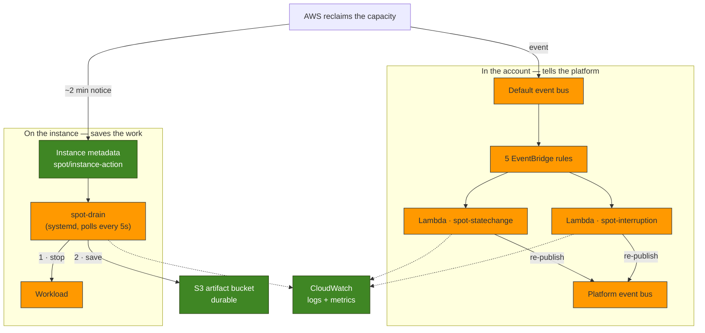

# Reducing AI Infrastructure Costs with EC2 Spot Instances

> **Milestone 3 — EC2 Spot Instances.**
> This milestone makes the platform's compute cheap and keeps it trustworthy. The
> templates and handlers are validated (`cfn-lint`, `go test`) and deployed by CI
> to a development account. The drain agent has been exercised end to end against
> a stubbed metadata service; the numbers below are illustrative, because Spot
> prices move.

*Audience: AWS architects, cloud, DevOps and platform engineers, and the AI
engineers who will have to explain the bill.*

The [previous post](provisioning-an-ai-agent-platform-with-cloudformation.md)
provisioned this platform's foundation as CloudFormation, and quietly bought its
compute on the Spot market. That was a bill I had not yet earned the right to
enjoy. Spot is only cheap if you can survive losing the instance — and nothing in
Milestone 2 could.

This post is about earning it: what Spot actually is, what the two-minute warning
does and does not let you do, and the piece of the design I got wrong the first
time.

---

## Contents

- [Why AI infrastructure is expensive](#why-ai-infrastructure-is-expensive)
- [What EC2 Spot Instances are](#what-ec2-spot-instances-are)
- [The Spot pricing model](#the-spot-pricing-model)
- [Why AI workloads fit Spot](#why-ai-workloads-fit-spot)
- [Architecture](#architecture)
- [The mistake: a Lambda cannot save your work](#the-mistake-a-lambda-cannot-save-your-work)
- [The drain agent](#the-drain-agent)
- [Event-driven interruption handling](#event-driven-interruption-handling)
- [The CloudFormation](#the-cloudformation)
- [The Lambda handlers](#the-lambda-handlers)
- [IAM: scoping the unscopeable](#iam-scoping-the-unscopeable)
- [What it costs, and what it saves](#what-it-costs-and-what-it-saves)
- [When not to use Spot](#when-not-to-use-spot)
- [Common pitfalls](#common-pitfalls)
- [Lessons learned](#lessons-learned)
- [What comes next](#what-comes-next)

---

## Why AI infrastructure is expensive

Not for the reason people usually give. It is not that GPUs are pricey per hour —
though they are. It is that **AI workloads are shaped in a way that wastes them.**

An agent platform is bursty. It indexes a repository, thinks hard for four
minutes, writes a draft, and then does nothing for six hours until the next
webhook. A GPU instance sized for the busy minute is idle for the rest of the
day, and an idle GPU costs exactly what a busy one does. Multiply by an
always-on development environment nobody remembered to turn off, and the bill is
mostly *nothing happening*, billed at the rate of something happening.

There are three honest levers:

1. **Run less.** Turn it off when nobody is using it — the
   [instance scheduler](../../infra/SCHEDULER.md), roughly 40% off.
2. **Run smaller.** Right-size, and route cheap requests to cheap models —
   Milestone 10.
3. **Pay less for the same thing.** Which is this milestone, and it is the
   biggest single lever: **~70% off, for the same hardware.**

They compose. This post is about the third.

## What EC2 Spot Instances are

A Spot Instance is spare EC2 capacity — hardware AWS has already built, racked,
and powered, and cannot currently sell at the On-Demand price. Rather than let it
idle, AWS rents it at a deep discount on one condition: **it can take it back,
with about two minutes' notice.**

That is the whole deal. It is worth being precise about what is *not* different,
because the myths do damage:

- It is **the same hardware**. Not older, not throttled, not oversubscribed.
- It is **the same AMI, network, IAM, and storage**. Your code cannot tell.
- It is **not preemptible-when-busy** or slower under load.
- The **price is not an auction you can lose by bidding low** (more on that
  below — this myth is the expensive one).

The only difference is who keeps the instance under contention. You are a tenant
on a month-to-month lease at 30% of market rent, and the landlord can give you two
minutes' notice.

## The Spot pricing model

Two things about Spot pricing are worth internalising, because between them they
account for most of the bad decisions I see.

**1. You pay the market price, not your bid.** Spot prices move gradually with
supply and demand per instance type, per Availability Zone. You are charged the
current price for the hour you use, whatever your maximum is.

**2. Therefore `MaxPrice` does not make Spot cheaper.** This is the trap. The
parameter looks like a discount lever and is not one:

```yaml
SpotMaxPrice:
  Type: String
  Default: ""
  Description: >-
    Optional maximum hourly price for the Spot instance, in USD (e.g. 0.08).
    Leave empty — the default and the recommendation — to cap at the On-Demand
    price, which is what Spot charges at worst anyway. A lower cap does not
    make the instance cheaper (you always pay the market price, not your bid);
    it only makes it interruptible sooner and harder to launch. Set it as a
    spend guard rail, not as a discount.
```

Setting `MaxPrice` below the market price does not lower your bill by one cent.
It means that when the price rises above your cap, your instance is **interrupted**
— and, until it falls back, a new one will not launch. You have bought yourself
strictly more interruptions and exactly zero savings. Leave it empty, capped at
the On-Demand price, and take the market price gratefully.

**Capacity, not price, is what actually bites.** The modern failure mode is not
"the price spiked" — it is "there is no `g5.xlarge` capacity in this AZ right
now". A one-time Spot request that cannot be filled simply does not launch.

I did not have to wait long to be proved right. Deploying this very milestone
failed:

```text
Resource handler returned message: "There is no Spot capacity available
that matches your request."
```

Not a price problem — Spot was $0.066 against an On-Demand $0.166, so the
discount was there for the taking. Not a quota problem either; that one says `Max
spot instance count exceeded`. There was simply no `t3.xlarge` to be had in this
platform's Availability Zone. And you cannot outbid your way to capacity that
does not exist: **capacity is not for sale.**

The useful move is to stop guessing and ask AWS, with the Spot placement score
API (10 is best, 1 is worst):

```bash
aws ec2 get-spot-placement-scores --region us-east-1 \
  --instance-types t3.xlarge --target-capacity 1 \
  --target-capacity-unit-type units --single-availability-zone
```

Which said, bluntly, that my AZ scored **1 out of 10** — for `t3.xlarge`, and for
every other 4-vCPU type I tried. I switched to a `c5.xlarge` (which scored 3) and
it launched.

That is a patch, not a fix, and it is worth being honest about which. This
platform runs **one** instance, in **one** subnet, in **one** AZ, of **one**
type. That is zero capacity flexibility *by construction*, and no amount of
interruption handling repairs it — interruption handling protects your **work**,
not your **ability to launch**. The real answer is diversification across types
and AZs, which is a fleet-level property, and the reason
[Milestone 16](#what-comes-next) exists.

### One-time vs persistent requests

| | One-time (`terminate`) — the default | Persistent (`stop`) |
| --- | --- | --- |
| On interruption | instance is **terminated**, gone | instance is **stopped**, disk preserved |
| Comes back? | no — nothing retries | yes — AWS restarts it when capacity returns |
| Can be stopped/started? | **no** | yes — required by the [scheduler](../../infra/SCHEDULER.md) |
| Fits | disposable, replaceable compute | a box you want to keep |

This platform defaults to **one-time and disposable**. That choice is what makes
everything else in this post load-bearing: nothing is coming back, so anything
not saved is lost.

## Why AI workloads fit Spot

Because most AI work is **idempotent, restartable, and nobody is waiting.**

Embeddings are the cleanest example: recompute a chunk and you get the same
vector. Interrupt the job halfway and you have lost only the chunk in flight.
Batch inference over a backlog, indexing a repository, generating documentation,
drafting a blog post from a diff — all the same shape. The unit of work is
minutes, the output is a file, and the deadline is "today".

| Workload | Spot? | Why |
| --- | --- | --- |
| Batch inference | ✅ ideal | Restartable per item. |
| Embeddings generation | ✅ ideal | Idempotent and parallel. |
| Repository indexing / analysis | ✅ ideal | Re-reading a repo is cheap; the output is a file. |
| Technical blog generation | ✅ good | Minutes long, drafts to S3, nobody waiting on a keystroke. |
| Background / scheduled jobs | ✅ good | Late is acceptable — that is what "background" means. |
| Ollama, offline inference | ✅ good | Model reload is the only real cost of a restart. |
| Ollama, interactive serving | ⚠️ with a fallback | An interruption mid-conversation is user-visible. |
| **n8n (the orchestrator)** | ❌ no | It holds workflow state. It is the thing that *reschedules* interrupted work — it cannot be the thing that gets interrupted. |
| **The control plane** | ❌ no | It must outlive the compute it manages. |

The pattern, and it is the whole architecture in one line: **the plane that does
the work goes on Spot; the plane that remembers the work does not.**

## Architecture

Here is the shape of what this milestone builds. The important thing to see is
that **the reclaim decision leaves AWS along two independent paths.**



The left path saves your work and never leaves the instance. The right path tells
the platform and never touches the instance. Getting that division right took me
two attempts.

## The mistake: a Lambda cannot save your work

My first design had one half. EventBridge catches the interruption warning,
Lambda handles it — done. It is the design the phrase "event-driven interruption
handling" invites you to build, and every architecture diagram of Spot handling I
had in my head looked like it.

Then I wrote down what the Lambda would actually *do* with those two minutes, and
the design fell over.

The Lambda runs **in the account**. The work is **on the instance** — a
half-written embeddings batch on a root volume with `DeleteOnTermination: true`.
The Lambda cannot flush that file. It cannot stop the process still writing to
it. It has no more access to that disk than you do from your laptop. It could
call `ssm:SendCommand` and hope, but it would be racing a cold start, an
EventBridge delivery, and an SSM agent poll, all inside a window measured in
seconds — to do something the instance could simply have done itself, instantly,
having known first.

Because the instance *does* know first. AWS writes the notice to the instance
metadata service, and something running locally can see it within its polling
interval:

```bash
curl -H "X-aws-ec2-metadata-token: $token" \
  http://169.254.169.254/latest/meta-data/spot/instance-action
```

That reframes the whole milestone. Interruption handling is **two cooperating
halves**, and neither is sufficient alone:

| | Runs | Sees the notice via | Job |
| --- | --- | --- | --- |
| **Drain agent** | on the instance | instance metadata (IMDS) | Stop the workload. Save its output. |
| **Lambda handlers** | in the account | EventBridge | Count it. Log it. Tell the platform. |

The drain agent makes Spot **safe**. The Lambdas make it **observable**. A design
with only the Lambdas — the one I nearly shipped, and the one most tutorials show
— is a design that watches your work being deleted and files a metric about it.

## The drain agent

It is a shell script and a systemd unit, installed by the launch template's user
data. Deliberately dull technology: this thing runs when the platform is being
taken away from it, and that is the wrong moment to discover a dependency.

The loop, in essence:

```bash
while true; do
  token="$(imds_token)" || { sleep "$POLL_SECONDS"; continue; }

  # 404 until AWS issues a notice — the healthy path, every time.
  notice="$(imds_get "$token" spot/instance-action)" || {
    sleep "$POLL_SECONDS"
    continue
  }

  instance_id="$(imds_get "$token" instance-id)"
  drain "$notice" "$instance_id"
  exit 0
done
```

The metadata path **404s for the entire healthy life of the instance**. The error
branch is the normal case; a response body is the exception that matters. Polling
every 5 seconds is AWS's recommendation, and the arithmetic is why: the window is
~120 seconds, and every second spent not noticing is a second not draining.

And the drain itself, in the order it must happen:

```bash
drain() {
  notice="$1"; instance_id="$2"
  log "interruption notice: $notice"

  # 1. Stop the workloads, so nothing is still writing while we upload.
  for unit in ${DRAIN_UNITS:-}; do
    systemctl stop "$unit" || log "WARNING: could not stop $unit"
  done

  # 2. Save the work. This is the entire reason the agent exists.
  aws s3 sync "$ARTIFACT_DIR" \
    "s3://$ARTIFACT_BUCKET/drain/$instance_id/artifacts/" --only-show-errors

  # 3. Leave a marker, so a post-mortem can tell a clean drain from a crash.
  echo "$notice" > /tmp/interruption.json
  aws s3 cp /tmp/interruption.json \
    "s3://$ARTIFACT_BUCKET/drain/$instance_id/interruption.json" --only-show-errors

  log "drain complete"
}
```

Stop **first**, then upload. Upload a directory something is still writing to and
you get a torn file, which is worse than no file, because you will trust it.

Then it exits 0 and stays exited — `Restart=on-failure`, deliberately not
`always`. A restarted agent would find the same notice still sitting in the
metadata service and drain a second time, uploading over the work it just saved.

The contract with future workloads is one sentence: **write anything worth keeping
to `/var/lib/<project>/artifacts`.** Everything else on that volume dies with the
instance, because `DeleteOnTermination: true` — which was already true in
Milestone 2, and is only now safe to mean it.

### The bug that only appears when it matters

I tested the agent against a fake metadata service before I trusted it, which is
how I found this:

```bash
DRAIN_UNITS=ollama.service n8n.service     # in a file the agent sources
```

The agent sources that file. Bash reads that line as "assign `ollama.service` to
`DRAIN_UNITS`, then **run the command `n8n.service`**". Command not found — and
with `set -u`, the agent then died on the *next* line, referencing a variable
that never got set.

Here is what makes it nasty. The agent starts fine. It polls fine. It sits there
looking perfectly healthy for weeks. It dies **at the exact moment the
interruption arrives** — having stopped nothing and saved nothing — because that
is the first moment it reads the variable. A test that only checks "is the agent
running?" passes right up until the day it matters.

The fix is one pair of quotes in the template, and a default that cannot fail:

```yaml
DRAIN_UNITS="${DrainUnits}"        # quoted, in the generated env file
```
```bash
for unit in ${DRAIN_UNITS:-}; do   # and a default, so `set -u` can never abort a drain
```

The lesson generalises past bash: **code that only executes during a failure must
be executed during a test.** An interruption path you have never run is a
hypothesis, not a feature.

## Event-driven interruption handling

That is the instance's half. The account's half is EventBridge, and its job is
different: not to *save* anything, but to make the fleet's behaviour **visible**,
and to give the rest of the platform something to react to.

Five rules, five events, all documented:

| Event | Meaning | Handler | Metric |
| --- | --- | --- | --- |
| `EC2 Spot Instance Interruption Warning` | ~2 minutes left | `spot-interruption` | `InterruptionWarnings` |
| `EC2 Instance Rebalance Recommendation` | Elevated risk (advisory) | `spot-interruption` | `RebalanceRecommendations` |
| State-change → `running` | Launched | `spot-statechange` | `InstancesLaunched` |
| State-change → `stopped` | Stopped | `spot-statechange` | `InstancesStopped` |
| State-change → `terminated` | Destroyed | `spot-statechange` | `InstancesTerminated` |

The **rebalance recommendation** is the one people miss. It can arrive well before
the interruption warning — sometimes without one ever following. It is advice
("move if you can"), not a deadline. In a fleet it is your chance to drain
*without* a stopwatch running.

### Two traps in the event wiring

**The rules must live on the default bus.** Milestone 2 built the platform a
dedicated event bus, and it is genuinely the right place for the platform's own
events. So the obvious move is to put these rules on it — and it is wrong. AWS
services publish only to the account's **default** bus, and there is no way to
make EC2 publish anywhere else. A rule matching `source: aws.ec2` on a custom bus
is valid YAML, passes `cfn-lint`, deploys cleanly, and **never fires**. It is a
mistake that looks exactly like working code, which is the worst kind.

So the rules sit on the default bus, and the handlers *re-publish* onto the
platform bus. That crossing is not a workaround; it is the seam. Later milestones
subscribe to a clean platform event and never learn it began life as an EC2
service event.

**And the rules cannot filter to your own instances.** EC2's events carry an
instance ID and **no tags**. There is nothing to match on. These rules fire for
every instance in the region, including ones this platform has never heard of.

So ownership is decided in the handler, by looking the instance up and reading
its tags:

```go
func (h *Handler) owns(tags []ec2types.Tag) bool {
	var project, environment string
	for _, tag := range tags {
		switch aws.ToString(tag.Key) {
		case TagProject:
			project = aws.ToString(tag.Value)
		case TagEnvironment:
			environment = aws.ToString(tag.Value)
		}
	}
	return project == h.Cfg.Project && environment == h.Cfg.Environment
}
```

An event for a foreign instance is a **successful no-op**, never an error. A
handler that failed on other people's instances would page you for someone else's
deploy — and in a shared account, that is most of the traffic.

Which promotes two tags from housekeeping to load-bearing:

```yaml
- Key: Project
  Value: !Ref ProjectName
- Key: Environment
  Value: !Ref Environment
```

**An instance without those tags is invisible to its own interruption handling.**

## The CloudFormation

Milestone 2 already bought Spot through a launch template, because
`AWS::EC2::Instance` cannot request Spot directly. Milestone 3 adds the price cap
and — more importantly — the drain agent to its user data:

```yaml
InstanceMarketOptions:
  !If
    - UseSpot
    - MarketType: spot
      SpotOptions:
        SpotInstanceType: !If [StoppableSpot, persistent, one-time]
        InstanceInterruptionBehavior: !Ref SpotInterruptionBehavior
        MaxPrice: !If [HasSpotMaxPrice, !Ref SpotMaxPrice, !Ref "AWS::NoValue"]
    - !Ref "AWS::NoValue"
```

Note `!Ref "AWS::NoValue"` twice. On-Demand omits the market block *entirely* —
not an empty one — and an unset `MaxPrice` omits the property rather than sending
an empty string. CloudFormation's way of saying "this key should not exist".

Adding user data to a launch template creates a new template version, and the
instance tracks the latest version, so **redeploying replaces the instance.**
That is fine. It is *supposed* to be fine — the instance is disposable, and if
replacing it lost something, that something was in the wrong place. This milestone
is the first time that claim gets tested, and it is a pleasant feeling when a
design decision you made on principle two months ago turns out to be true.

The new stack, [`08-spot.yaml`](../../infra/cloudformation/08-spot.yaml), is
ordinary: five rules, two functions, one role, two log groups, five invoke
permissions. Each rule gets its **own** `AWS::Lambda::Permission` scoped to that
rule's ARN, so a stray rule elsewhere in the account cannot drive these handlers.

## The Lambda handlers

Two functions, in Go, sharing one package. Two, not one, deliberately: the
interruption path is the one that matters during an incident, and I do not want
its log group, its errors, its retries, or its concurrency tangled up with the
far higher-volume state-change traffic. Each function rejects the other's events
loudly, because an event arriving at the wrong function means a rule points at
the wrong target — and the *right* function is not seeing it at all.

What a handler does with an interruption is modest, and honest about it: record
the metric, re-publish the event, log it. It does not pretend to drain anything.

The two details worth stealing:

**Use the event's timestamp, not the clock.**

```go
Timestamp: aws.Time(event.Time),
```

A retried invocation must not smear one interruption across two minutes of the
graph. The metric is a statement about when AWS reclaimed the instance, not about
when Lambda got round to noticing.

**And check `FailedEntryCount`.**

```go
// PutEvents answers 200 even when it accepted none of the entries: the
// per-entry failures are in the body. Not reading them is the classic way to
// build an event pipeline that silently drops events.
if out.FailedEntryCount > 0 {
	return fmt.Errorf("event bus %s rejected the event (%s)", ...)
}
```

`PutEvents` returns HTTP 200 while rejecting every entry you gave it. Trusting the
status code is the classic way to build an event pipeline that loses events
quietly and passes all its tests.

The metrics carry an `InstanceType` dimension, which is the point of collecting
them at all. **"How often is this interrupted?" is a question about a type in an
AZ**, and it is the number that decides whether a workload belongs on Spot. Two
weeks of data turns "Spot feels risky" into "Spot interrupted us four times last
month, and each one cost us nine minutes" — and *that* is a sentence you can put
in front of someone who has to sign off on the trade.

## IAM: scoping the unscopeable

Two of the four permissions these handlers need cannot be scoped by resource ARN
at all, and both are instructive.

**`ec2:DescribeInstances` does not support resource-level permissions.** It is
`*` or nothing. What saves it is that it is the *only* EC2 permission the
handlers hold:

```yaml
- Sid: DescribeInstancesForOwnershipCheck
  Effect: Allow
  Action: ec2:DescribeInstances
  Resource: "*"
```

They can look, and they cannot touch. Nothing in this milestone can stop, start,
or terminate an instance — worth stating plainly, because "the Lambda that
handles interruptions" sounds like something that ought to have termination
rights, and it emphatically should not.

**`cloudwatch:PutMetricData` takes no resource ARN either** — but it has a
condition key, and that is a real scope:

```yaml
- Sid: PutSpotMetrics
  Effect: Allow
  Action: cloudwatch:PutMetricData
  Resource: "*"
  Condition:
    StringEquals:
      cloudwatch:namespace: !Sub "${ProjectName}/spot"
```

This role can write metrics into this project's namespace and **nowhere else**.
`Resource: "*"` with a condition that narrows it is not a wildcard — it is the
only expressible form of a genuinely narrow grant, and it is worth knowing the
difference between the two when you are reading someone else's policy.

## What it costs, and what it saves

Steady-state, `us-east-1`, the platform's default `t3.xlarge`:

| Purchase | ~$/hour | 24×7 | Interruptible? |
| --- | --- | --- | --- |
| On-Demand | ~$0.166 | ~$120/mo | no |
| **Spot (the default)** | **~$0.05** | **~$36/mo** | yes |
| Spot + [scheduler](../../infra/SCHEDULER.md) (14h/day) | ~$0.05 | ~$21/mo | yes |

**~$84/month** on one small instance. Which is real money and not, by itself, an
argument. The argument is what happens when the instance is the one an AI platform
actually wants:

| Instance | On-Demand 24×7 | Spot 24×7 | Saved |
| --- | --- | --- | --- |
| `t3.xlarge` | ~$120/mo | ~$36/mo | ~$84/mo |
| `g5.xlarge` (GPU inference) | ~$730/mo | ~$220/mo | **~$510/mo** |
| `g5.12xlarge` (larger models) | ~$4,100/mo | ~$1,250/mo | **~$2,850/mo** |

*(Illustrative. Spot prices move, and vary by region and AZ.)*

At GPU scale the discount stops being an optimisation and starts deciding whether
a project happens at all. A side project that cannot justify $730/month can
justify $220. **That is the actual thesis of this milestone**: Spot is what makes
a self-hosted inference tier affordable for people who do not have a platform
team's budget — and the interruption handling is the price of admission.

**And an interruption is not free.** Pretending otherwise is how people get
burned. It costs: the work in flight (redone) plus the cold start of the
replacement (minutes — and the reason Milestone 4 bakes an AMI). If a job takes
20 minutes and you are interrupted once a week, that is a trivially good trade.
If a job takes 30 hours and cannot checkpoint, it is a terrible one, and no amount
of clever event handling will fix it.

## When not to use Spot

The section most write-ups skip, which is a shame, because it is the one that
saves people:

- **Anything holding state you cannot rebuild.** A database. A queue's only
  broker. n8n. If losing it loses data, it does not go on Spot.
- **Long, uncheckpointed jobs.** A 30-hour fine-tune *will* be interrupted, and
  you will start again. Checkpoint, or pay On-Demand.
- **Latency-critical serving with no fallback.** An interrupted inference endpoint
  with nothing behind it is an outage. Spot is fine *behind* a managed backstop —
  which is exactly the hybrid routing Milestone 10 builds.
- **Anything that cannot drain in two minutes.** If a clean shutdown takes ten
  minutes, the window is not long enough and your drain is a fiction.
- **Capacity you must have right now.** Spot can be simply unavailable.

The rule of thumb: **Spot is for compute you could lose and merely be annoyed.**

## Common pitfalls

Collected, because I hit four of them:

1. **Believing a Lambda can drain the instance.** It cannot. It is in the wrong
   place. Put an agent on the box.
2. **Putting the `aws.ec2` rules on your custom event bus.** Deploys cleanly,
   never fires.
3. **Setting `MaxPrice` low to "save money".** Saves nothing, buys interruptions.
4. **Forgetting the ownership tags.** The events carry none, so an untagged
   instance is invisible to its own interruption handling.
5. **Trusting `PutEvents`' HTTP 200.** Check `FailedEntryCount`.
6. **Uploading before stopping the writer.** A torn artifact is worse than none.
7. **`Restart=always` on the drain agent.** It re-drains over its own work.
8. **Never testing the interruption path.** It is the one path that only runs when
   things are already going wrong. See the quoting bug above.

## Lessons learned

**The two-minute warning is not a lot of time, and it is not for you.** It is for
the *instance*. Any design that spends it on control-plane round trips has spent
it. Ask "what is physically closest to the work?" and the architecture answers
itself.

**Ephemeral compute is a promise you have to keep.** Milestone 2 declared the
instance disposable and set `DeleteOnTermination: true`. That was a claim, and
this milestone is where it gets audited. The drain agent is not an addition to
that design — it is the part that makes the earlier design *true*.

**The failure path needs a test more than the happy path does.** The quoting bug
sat behind a variable that was only read during an interruption. Everything looked
healthy. It would have failed exactly once, at the only moment it mattered, and
the evidence would have died with the instance. If you take one thing from this
post, take that.

**Least privilege is sharper than "avoid `*`".** Two of the four permissions here
*must* be `Resource: "*"`. The real questions are: is it read-only, is it the only
permission of its kind, and can a condition key narrow it? A policy with a
justified wildcard and a condition beats a policy with no wildcards and no
thought.

**Interruption handling is not availability.** This is the lesson the failed
deploy taught me, and I had written the post without it. Everything in this
milestone protects the *work* on the instance. Not one line of it helps when
there is no instance to be had — and "no Spot capacity in this AZ" is a
first-class, ordinary Tuesday failure, not an edge case. Surviving interruptions
and being able to launch at all are two different problems, and I had quietly
assumed solving the first bought me something towards the second. It buys nothing.

**And the boring saving is the big one.** Spot is a checkbox and a shell script.
It cut this platform's compute bill by 70% — more than any clever architectural
optimisation in the roadmap will, and it took less code than the release tooling
in this repository's `cmd/` directory.

## What comes next

**Milestone 4 — Custom AMIs.** The cost of an interruption is mostly the cold
start of what replaces it. Baking the dependencies into the image attacks that
number directly, and Spot is what makes it worth attacking.

The bigger prize is further out, and worth naming so it is clear what this
milestone deliberately did *not* do. This platform runs **one** instance. One
instance on Spot is honest but fragile: when it goes, it is gone until someone
redeploys. The real answer is an **Auto Scaling group with a mixed-instances
policy** — several instance types, several AZs, `capacity-optimized` allocation —
which turns "the instance was interrupted" into "a replacement is already
running", and makes the capacity problem disappear behind diversification.

That is Milestone 16, and it is deferred on purpose: it is a scalability change,
not a cost change, and mixing the two would have hidden this milestone's actual
lesson behind a much larger diff. Milestone 2 already provisions the instance
through a **launch template** — which is precisely so that dropping it behind an
ASG later is a change of container, not a rewrite.

Until then: the compute is 70% cheaper, the interruptions are counted, and the
work survives them.

---

*The implementation is in [`infra/`](../../infra): the templates in
[`cloudformation/`](../../infra/cloudformation), the Go handlers in
[`lambda/`](../../infra/lambda), the operational reference in
[SPOT.md](../../infra/SPOT.md), and the diagrams in
[spot-diagrams.md](../architecture/spot-diagrams.md).*
