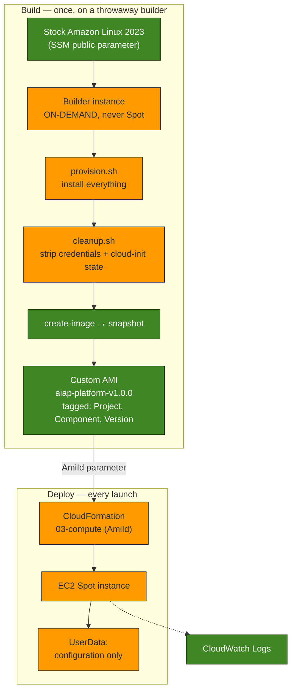
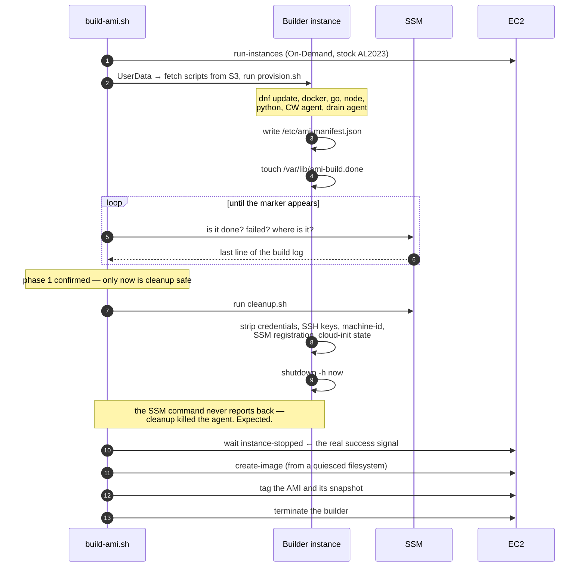
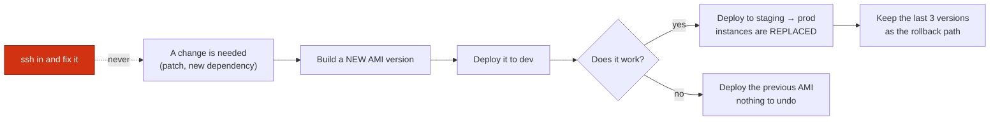

# Custom AMIs

Boot the platform's compute in **seconds instead of minutes**, by shipping a
machine image where the software is already installed.

- **Build** — a versioned AMI, from a throwaway builder, by one script
- **Launch** — Spot instances from that image, through the compute stack
- **Configure** — UserData does nothing but set the few values that differ per environment
- **Replace** — never patch a running instance; build a new image and roll

Provisioned by [`03-compute.yaml`](cloudformation/03-compute.yaml) (the `AmiId`
parameter) and built by [`scripts/build-ami.sh`](scripts/build-ami.sh).

The *why* is in the blog post,
[Optimizing EC2 Spot Instance Startup with Custom AMIs](../docs/blog/optimizing-ec2-spot-instance-startup-with-custom-amis.md).
This file is the operational reference.

## Contents

- [Why this matters on Spot](#why-this-matters-on-spot)
- [What is baked, and what is not](#what-is-baked-and-what-is-not)
- [Architecture](#architecture)
- [Building an AMI](#building-an-ami)
- [Deploying onto an AMI](#deploying-onto-an-ami)
- [Versioning](#versioning)
- [Rollback](#rollback)
- [Immutable infrastructure](#immutable-infrastructure)
- [Startup comparison](#startup-comparison)
- [Security: what must never be in an AMI](#security-what-must-never-be-in-an-ami)
- [Cost](#cost)
- [Maintenance](#maintenance)
- [AI workloads](#ai-workloads)
- [Cleanup](#cleanup)
- [Troubleshooting](#troubleshooting)

## Why this matters on Spot

A slow boot is an annoyance on an On-Demand instance. On Spot it is a **direct
loss of the thing you are paying for**.

AWS can reclaim a Spot instance with two minutes' notice. This platform's
install-at-boot instance took **76 seconds** to become useful — more than half that
eviction window — and an interruption arriving in it catches an instance that has
done **no work at all**: it downloaded packages, was reclaimed, and left nothing
behind. Do that repeatedly and you have built a machine that exists only to install
itself.

Baking the image inverts it. The work happens **once**, at build time, on an
On-Demand builder that nobody is waiting for and that cannot be interrupted. Every
instance afterwards boots ready.

The three properties compound:

| | Install at boot | Baked into an AMI |
| --- | --- | --- |
| Work done per launch | all of it, every time | none |
| Depends on the internet at boot | yes — dnf, GitHub, go.dev | no |
| Ways the boot can fail | every download | essentially none |
| Time before it is useful | **76 s** (measured) | **2.5 s** (measured) |

The reliability gain is the one people undersell. An install-at-boot instance
depends, *on every single launch*, on a package mirror being up, a GitHub release
still existing, and a TLS handshake succeeding. A baked instance depends on none
of that, because it already happened, and it happened somewhere a failure was
cheap and visible.

## What is baked, and what is not

One rule decides everything:

> **Bake what is the same everywhere. Configure what differs.**

One AMI is shared by dev, staging and prod. So anything that varies between them
is *not* baked — it is written at boot by UserData. Anything identical everywhere
*is* baked. Get the boundary wrong and you have either an image that only works in
one environment, or a boot that still has to think.

| Baked into the image | Configured at boot |
| --- | --- |
| OS patches (`dnf update`) | The artifact bucket name |
| Docker + Compose plugin | The CloudWatch log group |
| Go, Node, Python, git, jq | Which systemd units the drain agent stops |
| The CloudWatch agent (installed, config template) | The environment (`dev`/`staging`/`prod`) |
| The Spot drain agent's **code** | The drain agent's **configuration** |
| `/var/lib/ai-platform/artifacts` | Anything with a secret in it |
| Ollama's **binary** (optional) | Ollama's **models** |

Two of those are worth dwelling on.

**The drain agent had to become project-agnostic to be bakeable.** In Milestone 3
it read `/etc/aiap/drain.env` — a path with the *project name* in it. An image
containing that path is an image that only works for one project, which is not an
image, it is a snapshot. It now reads `/etc/spot-drain.env`, and everything that
varies lives inside that file. **Being forced to bake something is an excellent
test of whether it was properly parameterised.**

**Never bake a model.** Ollama's binary is ~1.5 GB and belongs in the image
(pulling it at boot is precisely the tax we are removing). A *model* is many
gigabytes, changes on a completely different cadence from the OS, and would be
frozen into every AMI version you retain — you would pay snapshot storage for the
same weights, over and over, per version. Models belong in S3 or on a volume.

## Architecture



The builder is **On-Demand, deliberately**. A Spot builder can be reclaimed
halfway through a build, and a half-built image is the one thing an AMI pipeline
must never produce. It runs for ~4.5 minutes and costs about a cent. This is the one
place in the platform where Spot is the wrong answer — which is itself the lesson
of [Milestone 3](SPOT.md#when-not-to-use-spot): Spot is for work you could lose and
merely be annoyed.

### Why the build is a script and not CloudFormation

CloudFormation has **no resource type that builds an AMI**. It can *consume* one —
that is exactly what the `AmiId` parameter is — but producing one is a procedure
(launch, provision, verify, snapshot), not a declaration. Wrapping that procedure
in a custom resource means the same steps plus a Lambda.

Building the image is a **pipeline** concern. Consuming it is an **infrastructure**
concern. The AMI ID is the interface between them, and keeping that seam clean is
why the compute stack does not know or care how its image was made.

*(EC2 Image Builder is the managed version of exactly this, and for a large fleet
it is the right answer. It is not used here: this milestone's service list is EC2,
AMIs, CloudFormation, IAM and CloudWatch Logs — and the mechanics are the thing
worth learning, because they are the mechanics Image Builder runs on your behalf.)*

### The build is two phases, and it has to be



Cleanup **cannot** be the tail of the provisioning script, and finding out why is
half the education of this milestone:

- `cloud-init clean` deletes the very script cloud-init is executing. Bash reads a
  script incrementally, so deleting it mid-run can truncate the rest of the build.
- Cleanup stops the SSM agent — which is the only channel available to verify that
  provisioning worked at all. Kill it there and the build has no way to report.

So phase 1 ends by planting a marker and stopping. The orchestrator reads the
marker over SSM, and **only then** triggers cleanup.

## Building an AMI

```bash
cd infra

make ami                              # next patch version (1.0.0 → 1.0.1)
make ami AMI_VERSION=2.0.0            # an explicit version
make ami INSTALL_OLLAMA=true          # include Ollama (~1.5 GB larger)
make ami-list                         # what exists
```

Prerequisites: the core stacks deployed (the builder uses the network, the
instance profile, and the artifact bucket), plus the AWS CLI and `jq`.

The build takes about **4.5 minutes** (measured, launch → image available), almost
all of it `dnf update` and the downloads. That is the entire point: it is time paid
**once**, by a machine nobody is waiting for, instead of on every launch by a Spot
instance that may be reclaimed before it finishes.

The builder is terminated on every exit path — success, failure, or Ctrl-C. A
forgotten builder is an instance you are paying for and an IAM role left running.

### What ends up in the image

Every build writes `/etc/ami-manifest.json` **into the image**, so six weeks later
"which Go is on this thing?" is answered by reading a file, not by guessing from
the AMI name:

```json
{
  "builtAt": "2026-07-13T18:10:22Z",
  "baseAmi": "ami-0abc…",
  "kernel": "6.1.…",
  "docker": "Docker version 25.…",
  "go": "go1.23.4",
  "node": "v20.…",
  "python": "3.11.…",
  "cloudwatchAgent": "amazon-cloudwatch-agent-…",
  "ollama": "none"
}
```

Versions are **pinned** in `provision.sh` (`GO_VERSION`, `NODE_MAJOR`,
`COMPOSE_VERSION`). An unpinned "latest" is how two builds of "v3" end up with
different compilers and one of them mysteriously fails.

## Deploying onto an AMI

```bash
make deploy-ami                    # newest AMI, resolved from tags
make deploy-ami AMI_ID=ami-0abc…   # a specific one (e.g. rolling back)
```

`deploy-ami` finds the newest image tagged `Project=<project>` and
`Component=platform-ami` and passes it to the compute stack's `AmiId` parameter.
**The AMI ID is never hard-coded** — an ID pasted into a command is an ID that is
wrong within a month.

Changing `AmiId` changes the launch template, which **replaces the instance**. That
is not a side effect to be tolerated; it *is* the deployment model. See
[Immutable infrastructure](#immutable-infrastructure).

To go back to install-at-boot (no custom AMI), deploy with an empty `AmiId`:

```bash
aws cloudformation deploy --stack-name aiap-dev-03-compute \
  --template-file cloudformation/03-compute.yaml \
  --parameter-overrides ProjectName=aiap Environment=dev AmiId= \
  --capabilities CAPABILITY_NAMED_IAM --region us-east-1
```

## Versioning

AMIs are named from a semantic version: **`aiap-platform-v1.2.0`**. The name alone
tells you what you are looking at, and the version is also a tag, which is what the
tooling actually queries.

| Bump | When | Example |
| --- | --- | --- |
| **Major** | A change that breaks something built on the image — a runtime removed, a path moved, an incompatible major upgrade | Go 1.x → 2.x; dropping Python |
| **Minor** | New software added; existing contracts intact | adding Ollama; adding a runtime |
| **Patch** | Rebuild with no intended change: OS patches, a security update, a base-AMI refresh | monthly patch rebuild |

Two rules that are not negotiable:

1. **An AMI is immutable.** A version is built once and never rebuilt. `build-ami.sh`
   refuses to rebuild an existing version — a name collision is a hard error, not a
   silent replacement of an image instances may still be running.
2. **Nothing is ever deleted while it might be the rollback.** `make ami-prune`
   keeps the newest `KEEP=3` versions.

## Rollback

This is the payoff of immutability, and it is almost anticlimactic:

```bash
make ami-list                      # find the previous version
make deploy-ami AMI_ID=ami-<previous>
```

The instance is replaced with one built from the older image. There is no
"uninstall", no reverse migration, no repair. **The old image still exists, exactly
as it was when it worked** — which is the entire reason `ami-prune` keeps three
versions rather than one.

Rolling back a mutable, patched-in-place instance means running commands to undo
commands, on a box whose state you are inferring. Rolling back an immutable one
means pointing at the previous image.

## Immutable infrastructure

> **Never change a running instance. Build a new image and replace it.**

The platform already committed to this in Milestone 2 (`DeleteOnTermination: true`,
nothing durable on the instance) and Milestone 3 (a drain agent, because the
instance is disposable). Milestone 4 is what makes it *usable*: replacement is
cheap only when the replacement boots ready.



What this buys, in practice:

- **Every instance is identical.** Not "configured the same" — *the same bytes*.
  Configuration drift cannot happen if configuration never happens.
- **The environment is reproducible.** The image is a version, not a state that a
  sequence of successful (and possibly partially-failed) scripts happened to reach.
- **A failed change is not an outage.** It is the previous AMI ID.
- **There is no "works on the old instances" bug**, because there are no old
  instances — only old images, which you can boot and inspect.

The thing you give up is the ability to hotfix by hand. That is the point. On a
Spot fleet the instance may vanish two minutes after you fixed it, taking the fix
with it — and now the fleet is inconsistent in a way nothing records.

## Startup comparison

Measure it yourself, on real instances, rather than trusting a table:

```bash
make startup-benchmark
```

It launches two instances of the same type in the same subnet, minutes apart, and
the only difference is where the software came from:

- **A — install-at-boot**: stock Amazon Linux 2023, running *the very same*
  `provision.sh` as UserData.
- **B — baked**: the custom AMI, where that script already ran at build time.

Running the *same script* both ways is what makes this a measurement and not an
anecdote. Nothing differs except **when** the work happened.

It reports cloud-init's own numbers — `Total Time` (the whole boot) and
`config-scripts-user` (UserData alone, which is the part the AMI removes). That is
the honest definition of "when could this instance have started doing work?", and
it excludes the EC2 provisioning both paths pay equally.

Measured on this platform (`c5.xlarge`, `us-east-1`):

| | Install at boot | **Baked** | |
| --- | --- | --- | --- |
| UserData (what the AMI removes) | 75.12 s | **0.058 s** | ~1,300× |
| Total boot (cloud-init) | 76.06 s | **2.54 s** | ~30× |
| Network calls at boot | many | **zero** | |

**73.5 seconds removed from every launch.** Against a two-minute Spot eviction
window, that is the difference between an instance that spends most of its notice
period getting ready and one that is working within three seconds.

That benchmark is like-for-like (both instances run the same script and nothing
else). The **deployed** instance does slightly more — its UserData also starts the
CloudWatch agent — and boots in **6.20 s** (verified on the live stack). Still
**12× faster** than install-at-boot, while doing more work.

The build that bought it: **4.5 minutes, once, for about a cent.**

> **A benchmark that cannot fail is not a benchmark.** The first run of this script
> reported install-at-boot booting in *1.26 seconds* — faster than the AMI — because
> a bad S3 path meant it downloaded nothing and installed nothing. A boot that does
> nothing is very fast. The script now refuses to report a result unless both
> instances can prove they have Docker and Go.

See the [blog post](../docs/blog/optimizing-ec2-spot-instance-startup-with-custom-amis.md#the-numbers)
for the full analysis.

### Why UserData gets simpler, and why that matters

| | Install at boot | Baked |
| --- | --- | --- |
| UserData | ~150 lines | ~30 lines (mostly comments) |
| What it does | update the OS, install Docker/Go/Node/Python, write out the drain agent, then configure | configure |
| Network calls at boot | many | none |
| Failure modes | every download | a typo in the config |

A simpler UserData is not a tidiness argument. **UserData has no retry, no rollback,
and nowhere good to report a failure.** It runs once, as root, on a machine nobody
is watching, and if step 14 of 40 fails the instance still boots, still passes its
status checks, and is quietly broken. Every line you remove is a line that cannot
fail that way. The baked path's UserData cannot fail on a download because it does
not make one.

## Security: what must never be in an AMI

An AMI is a **filesystem that can be copied**, shared with other accounts, or made
public with a single API call — and unlike a running instance, nobody is watching
it. Whatever is on the builder's disk when the snapshot is taken is on the disk of
**every instance ever launched from that image, forever, in every account it is
ever shared with.**

`cleanup.sh` runs immediately before the snapshot and removes:

| Removed | Why |
| --- | --- |
| `~/.aws`, cached SDK/CLI credentials | The build had an instance profile, and the SDK caches its credentials on disk. Short-lived is not "gone". |
| Docker config / registry tokens | Same reason, different file. |
| Shell history | Build scripts routinely echo things they should not. |
| `authorized_keys` | A key authorised on the builder is authorised on *every* instance from the image. |
| SSH **host** keys | Bake them and every instance presents the same host identity — which silently defeats host key verification. |
| `machine-id` | Must be unique per instance; a baked one gives every instance the same identity to systemd and journald. |
| SSM registration | The agent registered the *builder*. Left behind, every instance claims to be that builder and they fight over it. |
| dnf caches, `/var/log/*` | Image size (= snapshot cost, monthly, per version), and the builder's logs are actively misleading on a fresh instance. |
| **cloud-init state** | See below. |

**Never bake a secret.** No credentials, no tokens, no private keys, no `.env`.
Identity comes from the **instance profile at runtime** — rotated by AWS, scoped by
IAM, and never on a disk you might share. If a secret ever does reach an image,
treat it as disclosed: rotate the secret, then deregister the AMI *and delete its
snapshots* (deregistering alone leaves the data).

Also: **minimise what you install.** Every package is attack surface that ships to
every instance. Ollama is off by default partly for this reason.

### The cloud-init trap

This one is worth its own heading, because it is silent:

```bash
cloud-init clean --logs --seed
```

cloud-init records **on disk** that it has already run for this instance. If that
state is baked into the image, cloud-init on a *new* instance concludes it has
nothing to do — and **UserData never runs**. The instance boots, passes its status
checks, reports healthy… and is completely unconfigured. No drain agent. No log
group. No error, anywhere.

One line is the difference between an image that works and an image that only
appears to.

## Cost

An AMI costs nothing. **Its snapshot does** — and that is the whole cost model.

| Item | Rate | This platform |
| --- | --- | --- |
| AMI registration | free | $0 |
| EBS snapshot (where the cost lives) | ~$0.05/GB-month | ~30 GB image → **~$0.75/mo per version** |
| Retained versions (`KEEP=3`) | | **~$2.25/mo** |
| Build (a `t3.large` for ~10 min, On-Demand) | ~$0.083/hr | **~$0.01 per build** |
| With Ollama (+~1.5 GB) | | +~$0.08/mo per version |

Snapshots are **incremental** within a lineage: rebuilding from the same base AMI
with mostly the same packages does not cost a fresh 30 GB every time — only the
changed blocks. So the real cost of retaining three versions is well below the
table's worst case.

**The trade is not close.** ~$2–3/month of snapshot storage buys:

- minutes → seconds of boot, on every launch;
- a boot that cannot fail on a package download;
- Spot instances that do work instead of installing themselves;
- a rollback that is an AMI ID rather than an incident.

Against a compute bill in the tens or hundreds of dollars a month, this is a
rounding error that removes an entire class of failure. The one way to get it wrong
is to **never prune** — 40 retained versions of a 30 GB image is ~$60/month of
snapshots for images nobody will ever boot. `make ami-prune` exists for exactly
that, and it deletes the **snapshots** too: deregistering an AMI alone leaves the
snapshot behind, silently billing forever.

## Maintenance

**Patch cadence.** The image freezes the OS at build time, so a baked image gets
*staler* every day — that is the trade for determinism. Rebuild on a schedule
(monthly is a reasonable default) and after any critical CVE:

```bash
make ami                # patch bump: same software, current patches
make deploy-ami         # roll it out — the instance is replaced
make ami-prune KEEP=3   # retire the old ones, snapshots and all
```

This is the honest cost of immutability: patching is now a *deployment*, not an
`ssh` and a `dnf update`. In exchange, "is this instance patched?" has an answer
you can read off a tag, instead of one you have to go and check.

**When to rebuild:** OS/security patches · a dependency version changes · new
software the platform needs · the base AMI is refreshed by AWS.

**When *not* to rebuild:** anything that only changes *configuration*. If a value
differs between environments, it belongs in UserData and a rebuild is the wrong
tool — you would be baking an environment into an image, which is how one AMI
quietly becomes three.

## AI workloads

Why this milestone matters more for AI than for a typical web service:

| Workload | What the AMI removes | Why it matters |
| --- | --- | --- |
| **Ollama inference** | Pulling a 1.5 GB binary and a runtime on every launch | The difference between a Spot node that serves and one that is still downloading when it is reclaimed |
| **Batch inference** | Python, CUDA-adjacent deps, model client libraries | Each batch node starts working immediately; a short job is no longer mostly setup |
| **Embeddings generation** | The same, times N nodes | Setup cost is paid **per instance**, so it multiplies exactly where you scale out |
| **Repository analysis** | git, Go, Node, Docker | The job is minutes long; a 4-minute install on a 6-minute job is not overhead, it is the job |
| **Blog generation** | The agent runtime and its dependencies | Latency the user actually feels |
| **Scheduled / background jobs** | Everything | A job that runs for 90 seconds cannot afford a 4-minute boot. Without an AMI, **the boot is the workload.** |
| **OpenClaw / agent runtime** | Docker, the runtime, the toolchain | Agents are restarted often; each restart pays the boot |

The pattern: **AI compute is bursty and horizontal.** You launch many short-lived
instances rather than few long-lived ones, and the boot cost is paid *per instance,
every time*. It is precisely the workload shape where a slow boot compounds — and
precisely the one where Spot's economics make you launch and lose instances
constantly.

An AMI turns "this node will be useful in four minutes" into "this node is useful
now", which is the difference between Spot being a discount and Spot being a
liability.

## Cleanup

```bash
make ami-prune KEEP=3    # retire old versions AND their snapshots
make ami-prune KEEP=0    # remove all of them (nothing left to roll back to)
```

Deregistering an AMI does **not** delete its snapshot. That is the single most
common way to keep paying for images you thought you deleted; `ami-prune` deletes
both. The build's S3 inputs live under `s3://<artifact-bucket>/ami-build/` and are
a few kilobytes.

## Troubleshooting

| Symptom | Cause / fix |
| --- | --- |
| **UserData never ran; the instance is unconfigured but healthy** | cloud-init state was baked into the image. `cleanup.sh` must run `cloud-init clean --logs --seed`. This is *silent* — check `/var/log/cloud-init-output.log` for a boot that simply has no UserData in it. |
| `AMI … already exists` | Correct, and deliberate. AMIs are immutable — bump `AMI_VERSION` rather than rebuilding a version something may be running. |
| Build hangs, then times out | Read the last line the build printed: `build-ami.sh` streams the builder's log line over SSM. Usually a package mirror or a pinned download that has moved. |
| The builder is still running after a failure | It should not be — the script terminates it on every exit path. `aws ec2 describe-instances --filters "Name=tag:Component,Values=ami-builder"` and terminate by hand. |
| Instance from the AMI has no drain agent running | The unit has `ConditionPathExists=/etc/spot-drain.env`. If UserData did not write it, the agent will not start — which is the intended behaviour, not a bug. Check UserData ran at all (see the cloud-init trap). |
| Every instance shows up as the same one in Session Manager | The SSM registration was baked. `cleanup.sh` removes it; if you built the image by hand, you skipped that step. |
| Snapshots still on the bill after deleting AMIs | Deregistering an AMI does not delete its snapshot. `make ami-prune` does both. |
| The image is enormous | dnf caches were not cleaned, or Ollama is on (~1.5 GB). Size is snapshot cost, monthly, per retained version. |
| `make lint` fails on the drain agent | The copy embedded in `03-compute.yaml` has drifted from `scripts/ami/spot-drain.sh`. Run `make drain-sync`. |
| `Max spot instance count exceeded` on `deploy-ami` | Not about the AMI. Deploying a new image **replaces** the instance, and CloudFormation creates the replacement *before* deleting the original — so it transiently needs **double** the Spot vCPUs. See the [infra README](README.md#troubleshooting). |
| The benchmark says install-at-boot is *faster* than the AMI | It installed nothing. A boot that does nothing is very fast. `startup-benchmark.sh` now refuses to report a result unless both instances can prove they have Docker and Go — but if you are benchmarking by hand, check that first. |
