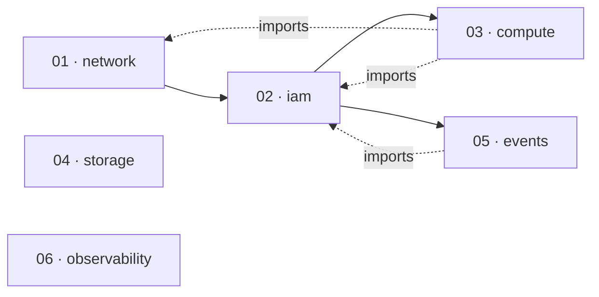

# Infrastructure — Milestone 2

The AI Agent Platform's foundational AWS infrastructure, as CloudFormation.

> **Design, then deploy.** These templates are validated (`cfn-lint`) and written
> to production standards, but they have **not been deployed to a live AWS
> account** as part of this milestone — there was no account in the authoring
> environment. See [Validation & limitations](#validation--limitations).

The *why* behind every decision here is in the blog post,
[Provisioning an AI Agent Platform with CloudFormation](../docs/blog/provisioning-an-ai-agent-platform-with-cloudformation.md).
This file is the operational reference.

## What this provisions

A dedicated VPC, a disposable EC2 Spot instance, a durable S3 bucket, an
EventBridge bus with a placeholder Lambda, and CloudWatch log groups — the
foundation later milestones build on. It installs **no** application software
(OpenClaw, Ollama, n8n come later).

## Repository layout

```text
infra/
├── Makefile                     convenience wrapper around the AWS CLI
└── cloudformation/
    ├── 01-network.yaml          VPC, public subnet, IGW, route table, security group
    ├── 02-iam.yaml              EC2 role + instance profile, Lambda role (least privilege)
    ├── 03-compute.yaml          launch template + disposable EC2 Spot instance, encrypted root EBS
    ├── 04-storage.yaml          S3 artifact bucket (encrypted, versioned, TLS-only)
    ├── 05-events.yaml           EventBridge bus + rule + placeholder Lambda
    ├── 06-observability.yaml    CloudWatch log groups with retention
    └── params/
        └── dev.example.json     example parameter values
```

Each template is a standalone stack. They are linked only by CloudFormation
exports/imports, so any one can be read, reviewed, or updated on its own.

## Deploy order

The stacks form a dependency chain. Deploy in ascending order; tear down in
descending order.



`03-compute` imports the subnet, security group, and instance profile;
`05-events` imports the Lambda role. `04-storage` and `06-observability` have no
imports. The IAM stack grants access to the bucket and log groups by naming
convention, so it does not need to import them.

## Prerequisites

- An AWS account and credentials configured (`aws configure` or a profile/role).
- AWS CLI v2.
- `cfn-lint` for local validation (`pip install cfn-lint`).
- Permission to create the resource types above, including named IAM roles.

## Deploy

With the [Makefile](Makefile):

```bash
cd infra

make lint                 # validate every template with cfn-lint
make deploy               # deploy all six stacks in order
make outputs              # show every stack's outputs
make delete               # tear down (the artifact bucket is retained)
```

Override any setting on the command line:

```bash
make deploy PROJECT=aiap ENV=staging REGION=us-east-1
```

Or deploy one stack at a time:

```bash
make deploy-01-network
make deploy-02-iam
# ...
```

Equivalent raw AWS CLI, for a single stack:

```bash
aws cloudformation deploy \
  --stack-name aiap-dev-01-network \
  --template-file cloudformation/01-network.yaml \
  --capabilities CAPABILITY_NAMED_IAM \
  --parameter-overrides ProjectName=aiap Environment=dev \
  --region eu-west-1
```

## Continuous integration & deployment

[`.github/workflows/infra.yml`](../.github/workflows/infra.yml) wires these
templates into GitHub Actions.

- **Validation** runs on every pull request and push that touches `infra/`. It
  lints every template with `cfn-lint` and checks that each cross-stack import
  has a matching export. It needs no AWS credentials.
- **Deployment** is manual: trigger the workflow from the Actions tab, choose an
  environment, and type `deploy` to confirm. The job assumes an IAM role over
  OIDC — there are no long-lived secrets.

Deployment requires one-time setup:

1. Create an IAM OIDC identity provider for `token.actions.githubusercontent.com`.
2. Create a deploy role that trusts this repository, and set its ARN as the
   repository (or environment) variable `AWS_DEPLOY_ROLE_ARN`.
3. Set the target region as the variable `AWS_REGION`.
4. Create GitHub environments `dev`, `staging`, and `prod`; add required
   reviewers to `prod` for a manual approval gate.

Until that is configured, the validation job still runs and the deploy job is
simply never triggered.

## Parameters

Every environment-specific value is a parameter; nothing is hard-coded. Defaults
are tuned for a low-cost development environment.

| Parameter | Default | Stacks | Notes |
| --- | --- | --- | --- |
| `ProjectName` | `aiap` | all | Prefix for names and exports. Keep consistent across stacks. |
| `Environment` | `dev` | all | `dev` \| `staging` \| `prod`. |
| `VpcCidr` | `10.20.0.0/16` | network | Room for future subnets. |
| `PublicSubnetCidr` | `10.20.1.0/24` | network | The foundation's single subnet. |
| `InstanceType` | `t3.large` | compute | GPU types are chosen when Ollama arrives. |
| `RootVolumeSize` | `30` | compute | GiB. OS and runtime temp only. |
| `SshKeyName` | *(empty)* | compute | Empty disables SSH; use SSM Session Manager. |
| `LogRetentionDays` | `14` | events, observability | Raise for staging/prod. |
| `NoncurrentVersionExpirationDays` | `90` | storage | Bounds versioning cost. |
| `LatestAmiId` | *(SSM)* | compute | Resolves the latest Amazon Linux 2023 AMI; do not override. |

## Cost

Designed to cost almost nothing at rest. Rough **development** estimate
(`eu-west-1`, one `t3.large` Spot instance, light use):

| Resource | Basis | Est. monthly (USD) |
| --- | --- | --- |
| EC2 Spot (`t3.large`) | ~70% off On-Demand; ~$0.025/hr, run part-time | ~$5–18 |
| Root EBS (30 GiB gp3) | $0.08/GiB-month | ~$2.40 |
| S3 (artifacts) | a few GiB + requests | <$1 |
| Lambda | placeholder, near-zero invocations | ~$0 (free tier) |
| EventBridge | custom bus, low event volume | ~$0 |
| CloudWatch Logs | low volume, 14-day retention | <$1 |
| VPC / IGW / SG / routes | no NAT gateway | $0 |
| **Total** | | **~$10–25 / month** |

The single largest saving is architectural: a **public subnet with no NAT
gateway** avoids ~$32/month per NAT. Running the Spot instance only when needed
(stop the stack overnight) drops the total further. There are no always-on
managed services in the foundation.

## Security overview

- **No inbound access.** The security group declares no ingress rules; the
  instance is reached through SSM Session Manager, not SSH.
- **IMDSv2 required.** Instance metadata needs a session token, blocking
  SSRF-style credential theft.
- **Least-privilege IAM.** No wildcard resource ARNs; the EC2 role can reach
  only this project's bucket and log groups, and the Lambda role only its own
  log group.
- **Encryption at rest.** The root EBS volume and the S3 bucket are encrypted.
- **Encryption in transit.** The bucket policy denies any non-TLS request.
- **No public storage.** All S3 public-access blocks are on and ACLs are
  disabled.

Full reasoning: the blog's [Security](../docs/blog/provisioning-an-ai-agent-platform-with-cloudformation.md#security) section.

## Validation & limitations

- **Validated** with `cfn-lint` (all six templates pass with no errors or
  warnings), and cross-stack imports were checked against their exports.
- **Not deployed.** These templates were authored and validated without a live
  AWS account, so an end-to-end `create-stack` was not performed. Before relying
  on them, run `make validate` (server-side validation) and deploy to a
  throwaway environment first.
- **Assumptions.** The artifact bucket name embeds the account ID and region to
  stay globally unique; the IAM stack assumes the naming convention in
  [02-iam.yaml](cloudformation/02-iam.yaml) matches the resources it grants
  access to. Keep `ProjectName` and `Environment` identical across all stacks.

## What comes next

`03-compute` already provisions its instance through a **launch template**, so
the next milestone can place that template behind an Auto Scaling group for
Spot interruption recovery without re-architecting. Private subnets, a NAT path,
VPC endpoints, alarms, and dashboards arrive in their respective milestones —
see the [roadmap](../README.md#roadmap).
