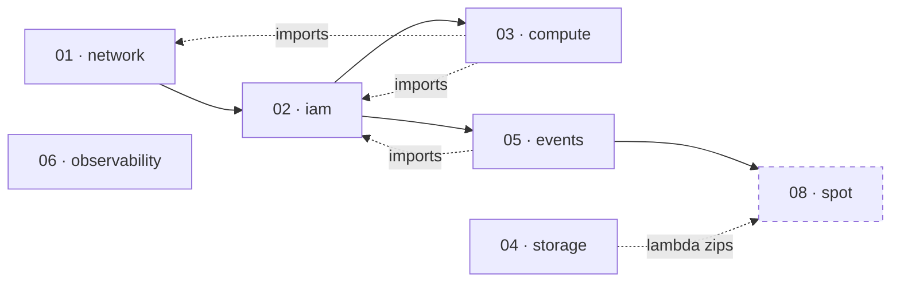

# Infrastructure — Milestones 2 and 3

The AI Agent Platform's foundational AWS infrastructure, as CloudFormation.

> **Design, then deploy.** These templates are validated (`cfn-lint`) and written
> to production standards. See [Validation & limitations](#validation--limitations)
> for exactly how far they have been exercised against a live account.

The *why* behind every decision here is in the blog posts:
[Provisioning an AI Agent Platform with CloudFormation](../docs/blog/provisioning-an-ai-agent-platform-with-cloudformation.md)
(Milestone 2) and
[Reducing AI Infrastructure Costs with EC2 Spot Instances](../docs/blog/reducing-ai-infrastructure-costs-with-ec2-spot-instances.md)
(Milestone 3). This file is the operational reference.

## What this provisions

A dedicated VPC, a disposable EC2 Spot instance, a durable S3 bucket, an
EventBridge bus with a placeholder Lambda, and CloudWatch log groups — the
foundation later milestones build on. It installs **no** application software
(OpenClaw, Ollama, n8n come later).

**Milestone 3** adds the interruption handling that makes the Spot instance safe
to actually use: a drain agent on the instance that saves its work when AWS
reclaims it, and EventBridge rules and Lambdas in the account that count, log,
and re-publish every Spot event. See **[SPOT.md](SPOT.md)**.

> **Educational scope.** This project is built to learn from. The compute
> defaults to a `t3.xlarge` on **Spot** (~$0.05/hour, ~$36/month; ~$0.17/hour
> On-Demand — see [Cost](#cost)); set `InstanceType=t3.micro` for a **free-tier**,
> near-zero-cost environment. It
> deliberately does not run a large **GPU** instance: later milestones
> *configure* the agent software (Ollama included) but do not run real model
> inference, as GPU instances are costly (~$1/hour) and new accounts have zero
> GPU/Spot quota, which would block a deploy. Everything scales by changing
> `InstanceType` / `PurchaseOption` and requesting the matching quota. See
> [Cost](#cost) and [Troubleshooting](#troubleshooting).

## Repository layout

```text
infra/
├── Makefile                     convenience wrapper around the AWS CLI
├── SCHEDULER.md                 the instance scheduler, documented
├── SPOT.md                      Spot interruption handling, documented
├── cloudformation/
│   ├── 01-network.yaml          VPC, public subnet, IGW, route table, security group
│   ├── 02-iam.yaml              EC2 role + instance profile, Lambda role (least privilege)
│   ├── 03-compute.yaml          launch template + disposable EC2 Spot instance + drain agent
│   ├── 04-storage.yaml          S3 artifact bucket (encrypted, versioned, TLS-only)
│   ├── 05-events.yaml           EventBridge bus + rule + placeholder Lambda
│   ├── 06-observability.yaml    CloudWatch log groups with retention
│   ├── 07-scheduler.yaml        add-on: scheduled start/stop of the instance
│   ├── 08-spot.yaml             add-on: Spot interruption rules, handlers, IAM, metrics
│   └── params/
│       └── dev.example.json     example parameter values
└── lambda/                      the Go Lambdas (one module)
    ├── cmd/start · cmd/stop                 the scheduler's handlers (07)
    ├── cmd/interruption · cmd/statechange   the Spot handlers (08)
    └── internal/ec2sched · internal/spot    their logic, unit-tested
```

Each template is a standalone stack. They are linked only by CloudFormation
exports/imports, so any one can be read, reviewed, or updated on its own.

`01`–`06` are the core, deployed by `make deploy` with nothing but the AWS CLI.
`07` and `08` are **add-ons**: they carry Go code, so they need the Go toolchain
and the artifact bucket, and each has its own deploy target.

## Deploy order

The stacks form a dependency chain. Deploy in ascending order; tear down in
descending order.



`03-compute` imports the subnet, security group, and instance profile;
`05-events` imports the Lambda role. `04-storage` and `06-observability` have no
imports. The IAM stack grants access to the bucket and log groups by naming
convention, so it does not need to import them.

`08-spot` (the add-on) imports the event bus from `05-events` — it re-publishes
Spot events onto it — and reads its Lambda code from the `04-storage` bucket, so
both must exist first. `07-scheduler` likewise reads its code from the bucket.

## Prerequisites

- An AWS account and credentials configured (`aws configure` or a profile/role).
- AWS CLI v2.
- `cfn-lint` for local validation (`pip install cfn-lint`).
- Permission to create the resource types above, including named IAM roles.

## Deploy

With the [Makefile](Makefile):

```bash
cd infra

make lint                 # validate every template with cfn-lint
make deploy               # deploy the six core stacks in order (AWS CLI only)
make spot                 # add Spot interruption handling (needs Go) — Milestone 3
make outputs              # show every stack's outputs
make delete               # tear down (the artifact bucket is retained)
```

Override any setting on the command line:

```bash
make deploy PROJECT=aiap ENV=staging REGION=us-east-1
```

Or deploy one stack at a time:

```bash
make deploy-01-network
make deploy-02-iam
# ...
```

Equivalent raw AWS CLI, for a single stack:

```bash
aws cloudformation deploy \
  --stack-name aiap-dev-01-network \
  --template-file cloudformation/01-network.yaml \
  --capabilities CAPABILITY_NAMED_IAM \
  --parameter-overrides ProjectName=aiap Environment=dev \
  --region us-east-1
```

## Continuous integration & deployment

[`.github/workflows/infra.yml`](../.github/workflows/infra.yml) wires these
templates into GitHub Actions.

- **Validation** runs on every pull request and push that touches `infra/`. It
  lints every template with `cfn-lint` and checks that each cross-stack import
  has a matching export. It needs no AWS credentials.
- **`dev` deploys automatically** when infra changes land on `main`: once a pull
  request merges, the workflow validates and then deploys the `dev` environment
  with no further action.
- **`staging` and `prod` stay manual**: trigger the workflow from the Actions
  tab, choose the environment, and type `deploy` to confirm — so a promotion is
  never a one-click accident.

Every deploy assumes an IAM role over OIDC; there are no long-lived secrets.
Pull requests never deploy — they only validate.

### One-time deploy setup

Deployment needs an AWS OIDC provider and a deploy role. An account admin creates
both, idempotently, with:

```bash
make -C infra bootstrap        # PROJECT and REGION are overridable
```

[`scripts/bootstrap-github-oidc.sh`](scripts/bootstrap-github-oidc.sh):

1. creates (or updates) the IAM OIDC identity provider for
   `token.actions.githubusercontent.com`;
2. creates (or updates) a deploy role trusting **this repository**, with a
   starter permissions policy scoped to this project's resources
   ([`scripts/deploy-role-policy.json`](scripts/deploy-role-policy.json) —
   tighten before production);
3. sets the repository variables `AWS_DEPLOY_ROLE_ARN` and `AWS_REGION`, if the
   GitHub CLI is authenticated (otherwise it prints them for you to set by hand).

It is safe to re-run: every step checks before it creates. Create the GitHub
environments `dev`, `staging`, and `prod` yourself, and add required reviewers to
`prod` for a manual approval gate.

Until this is done, the validation job still runs and the deploy job is simply
never triggered.

### A reminder on first push

[`.githooks/pre-push`](../.githooks/pre-push) prints a one-time, **non-blocking**
notice if deployment is not configured yet, pointing at `make bootstrap`. It
never creates anything and never blocks a push — bootstrapping cloud IAM is a
deliberate admin action, not a side effect of pushing. Enable the repository's
hooks once per clone:

```bash
make -C infra install-hooks    # sets core.hooksPath to .githooks
```

## Parameters

Every environment-specific value is a parameter; nothing is hard-coded. Defaults
are tuned for a low-cost development environment.

| Parameter | Default | Stacks | Notes |
| --- | --- | --- | --- |
| `ProjectName` | `aiap` | all | Prefix for names and exports. Keep consistent across stacks. |
| `Environment` | `dev` | all | `dev` \| `staging` \| `prod`. |
| `VpcCidr` | `10.20.0.0/16` | network | Room for future subnets. |
| `PublicSubnetCidr` | `10.20.1.0/24` | network | The foundation's single subnet. |
| `InstanceType` | `t3.xlarge` | compute | 4 vCPU/16 GiB, not free-tier (~$0.05/hr on the default Spot, ~$0.17/hr On-Demand). Set `t3.micro` for a free-tier environment. |
| `PurchaseOption` | `spot` | compute | `spot` or `on-demand`. Use `on-demand` if the account's Spot quota is zero. |
| `SpotInterruptionBehavior` | `terminate` | compute | `terminate` (one-time request, disposable) or `stop` (persistent request, stoppable — required by the scheduler). |
| `SpotMaxPrice` | *(empty)* | compute | Empty caps at the On-Demand price. A lower cap does **not** make Spot cheaper — see [SPOT.md](SPOT.md#parameters). |
| `RootVolumeSize` | `30` | compute | GiB. OS and runtime temp only. |
| `SshKeyName` | *(empty)* | compute | Empty disables SSH; use SSM Session Manager. |
| `SubnetId` / `SecurityGroupId` | *(empty)* | compute | Empty imports from the network stack. Override to use an existing VPC. |
| `DrainUnits` | *(empty)* | compute | systemd units the drain agent stops on interruption, e.g. `"ollama.service"`. |
| `DrainPollSeconds` | `5` | compute | How often the drain agent polls IMDS for an interruption notice. |
| `LogRetentionDays` | `14` | events, observability, spot | Raise for staging/prod. |
| `NoncurrentVersionExpirationDays` | `90` | storage | Bounds versioning cost. |
| `LatestAmiId` | *(SSM)* | compute | Resolves the latest Amazon Linux 2023 AMI; override to pin one. |
| `RebalanceRuleState` | `ENABLED` | spot | `DISABLED` to ignore the advisory rebalance signal. |

## Cost

Rough **development** estimate (`us-east-1`, the default `t3.xlarge`, light use).
The default purchase option is **Spot**, which is ~70% cheaper than On-Demand,
so the default configuration is the cheapest row below:

| Resource | Basis | Est. monthly (USD) |
| --- | --- | --- |
| EC2 (`t3.xlarge`, **Spot** — the default) | ~$0.05/hr, ~70% off On-Demand | ~$36 (24×7) |
| ...or On-Demand (needed to schedule stop/start) | ~$0.166/hr | ~$120 (24×7) / ~$70 (scheduled) |
| Root EBS (30 GiB gp3) | $0.08/GiB-month | ~$2.40 |
| S3 (artifacts) | a few GiB + requests | <$1 |
| Lambda | placeholder + Spot handlers, low invocations | ~$0 (free tier) |
| EventBridge | custom bus, low event volume | ~$0 |
| CloudWatch Logs | low volume, 14-day retention | <$1 |
| CloudWatch metrics (Spot) | 5 custom metrics | ~$1.50 |
| VPC / IGW / SG / routes | no NAT gateway | $0 |
| **Total** | | **~$42/mo (Spot default) to ~$127/mo (On-Demand 24×7)** |

The instance dominates the bill, and the purchase option dominates the instance.
The **default one-time Spot** instance is cheapest (~$36/mo) but is *disposable*:
it terminates on interruption and **cannot be stopped**, so it can't use the
scheduler. That disposability is safe to rely on only because Milestone 3's
[drain agent](SPOT.md#the-drain-agent) gets the instance's work into S3 before it
goes. Two other levers each cut cost a different way: the
[instance scheduler](#instance-scheduler-optional-add-on) needs a *stoppable*
instance (On-Demand or persistent Spot) and then runs it 18:00–08:00 only
(~40% off that compute); and **`t3.micro` as a free-tier override** — set
`InstanceType=t3.micro` and the compute and its volume are effectively free on a
first-year account. The largest *architectural* saving is a **public subnet with
no NAT gateway** (~$32/month per
NAT avoided). There are no always-on managed services in the foundation.

The saving scales with the instance, which is the whole argument for Spot on AI
workloads: ~$84/month on the default `t3.xlarge`, but ~$510/month on a
`g5.xlarge` GPU. See [SPOT.md](SPOT.md#cost).

## Security overview

- **No inbound access.** The security group declares no ingress rules; the
  instance is reached through SSM Session Manager, not SSH.
- **IMDSv2 required.** Instance metadata needs a session token, blocking
  SSRF-style credential theft.
- **Least-privilege IAM.** No wildcard resource ARNs; the EC2 role can reach
  only this project's bucket and log groups, and the Lambda role only its own
  log group. The Spot handlers hold exactly one EC2 permission —
  `DescribeInstances` — so they can look and cannot touch: nothing in Milestone 3
  can stop, start, or terminate an instance. Where an action admits no resource
  ARN at all (`cloudwatch:PutMetricData`), it is scoped by condition key instead.
- **Encryption at rest.** The root EBS volume and the S3 bucket are encrypted.
- **Encryption in transit.** The bucket policy denies any non-TLS request.
- **No public storage.** All S3 public-access blocks are on and ACLs are
  disabled.

Full reasoning: the blog's [Security](../docs/blog/provisioning-an-ai-agent-platform-with-cloudformation.md#security) section.

## Troubleshooting

**`Max spot instance count exceeded` on the compute stack.** The account's Spot
quota is zero or too low — common on new accounts. Two fixes:

- *Proper fix (keep Spot):* request a Spot quota increase, then redeploy. The
  quota is measured in vCPUs; a `t3.xlarge` needs 4 (a `t3.micro`, 2).

  ```bash
  aws service-quotas request-service-quota-increase \
    --service-code ec2 --quota-code L-34B43A08 \
    --desired-value 8 --region us-east-1
  ```

- *Immediate workaround (On-Demand):* deploy without Spot. Locally,
  `make deploy PURCHASE=on-demand`; in CI, set the repository variable
  `AWS_PURCHASE_OPTION` to `on-demand`. Switch back to Spot once the quota
  increase is approved.

**A stack is `ROLLBACK_COMPLETE` / `CREATE_FAILED`.** A create that fails leaves
the stack in a state CloudFormation cannot update, so it must be deleted before
it can be recreated. `make deploy` now does this for you: before deploying each
stack it checks the state and deletes a wedged one first (healthy, absent, and
in-progress stacks are left alone). So just fix the cause and re-run
`make deploy`; use `make delete` only to tear everything down (the artifact
bucket is retained).

**`bucket … already exists` on the storage stack.** The artifact bucket has
`DeletionPolicy: Retain`, so it survives when `04-storage` is deleted — by
`make delete`, a manual delete, or the self-healing above removing a wedged
storage stack. A plain *create* of the bucket then fails, because its name is
deterministic (`aiap-dev-artifacts-<account>-<region>`) and already taken.

`make deploy` now handles this for you: before deploying the storage stack it
detects an orphaned bucket (stack absent, bucket present) and **imports** it into
a fresh stack instead of recreating it — so just re-run `make deploy`. Under the
hood it runs a CloudFormation `IMPORT` change set against a bucket-only template
(the bucket policy stripped, since an import cannot create other resources in the
same step), then the normal deploy adds the policy back and reconciles drift. The
bucket's contents are preserved throughout. `make import-storage` does the same
for that one stack if you want to fix storage on its own.

**The instance was replaced when I redeployed compute.** Expected. The drain
agent and the ownership tags live in the launch template, so adding them creates
a new template version, and the instance tracks the latest version. The instance
is disposable by design — if replacing it lost something, that something was on
the root volume and should have been in
[`/var/lib/<project>/artifacts`](SPOT.md#the-drain-agent), which the drain agent
copies to S3.

**Spot events never reach the handlers.** The rules must be on the account's
**default** event bus. AWS services cannot publish to a custom bus, so a rule
matching `source: aws.ec2` on the platform bus deploys cleanly and never fires.
See [SPOT.md](SPOT.md#why-the-rules-are-on-the-default-bus).

## Validation & limitations

- **Validated** with `cfn-lint` (all eight templates pass with no errors or
  warnings), and cross-stack imports were checked against their exports.
- **The Go handlers are unit-tested** (`make -C infra lambda-test`), including the
  ownership filter, the interruption deadline, and the two ways `PutEvents` can
  fail. **The drain agent was exercised end to end** against a stubbed instance
  metadata service: it polls, detects the notice, stops its units in order, syncs
  the artifacts, and exits without re-draining.
- **Deployment is being shaken out on a live account.** The stacks have been
  applied via CI; the first real run surfaced an account-level Spot quota (see
  [Troubleshooting](#troubleshooting)), which the `PurchaseOption` parameter now
  works around. Treat the templates as validated and in early real-world use,
  not yet battle-tested — deploy to a throwaway environment before relying on
  them.
- **Assumptions.** The artifact bucket name embeds the account ID and region to
  stay globally unique; the IAM stack assumes the naming convention in
  [02-iam.yaml](cloudformation/02-iam.yaml) matches the resources it grants
  access to. Keep `ProjectName` and `Environment` identical across all stacks.

## Instance scheduler (optional add-on)

To cut cost further, an optional scheduler starts the instance each evening and
stops it each morning, using two Go Lambdas driven by EventBridge Scheduler
([`07-scheduler.yaml`](cloudformation/07-scheduler.yaml), code in
[`lambda/`](lambda)):

```bash
make package                                        # build + upload the Lambdas
make deploy-scheduler INSTANCE_ID=i-… TIMEZONE=Africa/Johannesburg
```

The instance must be **stoppable** — an On-Demand instance, or a Spot instance
launched with `SpotInterruptionBehavior=stop`. Full documentation, including the
architecture, IAM, timezone and schedule editing, cost model, and troubleshooting,
is in **[SCHEDULER.md](SCHEDULER.md)**.

## Spot interruption handling (Milestone 3)

The compute stack buys Spot by default. Milestone 3 is what makes that safe: a
**drain agent** on the instance that stops the workload and saves its output to
S3 within the two-minute reclaim window, and **EventBridge rules and Lambdas** in
the account that count, log, and re-publish every Spot event
([`08-spot.yaml`](cloudformation/08-spot.yaml), code in [`lambda/`](lambda)):

```bash
make spot                                   # build the handlers and deploy
make simulate-interruption INSTANCE_ID=i-…  # rehearse an interruption
```

The key idea, and the reason there are two halves: **a Lambda cannot save your
work.** Only something running on the instance can stop the workload and flush
its output before the disk goes away. Full documentation — the events, the drain
agent, the IAM, the metrics, when *not* to use Spot, and which AI workloads suit
it — is in **[SPOT.md](SPOT.md)**.

## What comes next

`03-compute` already provisions its instance through a **launch template**, so a
later milestone can place that template behind an Auto Scaling group — which is
what turns "the instance was interrupted and its work is safe in S3" into "the
instance was interrupted and a replacement is already running". Milestone 4 bakes
a custom AMI, which shrinks the cold start that an interruption costs. Private
subnets, a NAT path, VPC endpoints, alarms, and dashboards arrive in their
respective milestones — see the [roadmap](../README.md#roadmap).
