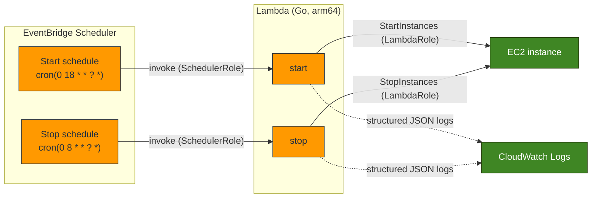

# Instance Scheduler

Start the platform's EC2 instance every evening and stop it every morning, so a
development environment costs nothing while no one is using it.

- **Start** — 18:00 daily
- **Runs** — overnight
- **Stop** — 08:00 daily
- **Repeats** — every day, in a configurable timezone

Two Go Lambda functions (start and stop) are driven by two
[EventBridge Scheduler](https://docs.aws.amazon.com/scheduler/latest/UserGuide/what-is-scheduler.html)
schedules. It is provisioned by [`cloudformation/07-scheduler.yaml`](cloudformation/07-scheduler.yaml)
and the Go code lives in [`lambda/`](lambda).

> **Prerequisite: the instance must be *stoppable*.** A Spot instance can only be
> stopped and started if it was launched with the **`stop`** interruption
> behaviour (a *persistent* request). The compute stack's default Spot instance
> uses `terminate` (a *one-time* request) and **cannot be stopped** — only
> terminated. Deploy the compute stack with `SpotInterruptionBehavior=stop`, or
> use an **On-Demand** instance (always stoppable, and free-tier eligible for
> `t3.micro`). See [Cost considerations](#cost-considerations).

## Architecture



Each schedule assumes the **SchedulerRole** (which may only invoke these two
functions) and calls its Lambda. The Lambda assumes the **LambdaRole** (which
may only start/stop *this one* instance, describe instances, and write its own
logs), reads the current instance state, and acts only if needed.

## How it works

The two Lambdas share one package, [`ec2sched`](lambda/internal/ec2sched). Each
run:

1. reads the target instance's current state (`DescribeInstances`);
2. **starts** only if the instance is `stopped`/`stopping`, or **stops** only if
   it is `running`/`pending`;
3. treats "already in the target state" as a **successful no-op**, not an error;
4. errors only on a real failure (a terminated instance, an API error).

This idempotency means a schedule that fires against an already-running (or
already-stopped) instance does the right thing — nothing — and a retried
invocation never double-acts.

## Deployment

The scheduler is an **optional add-on**, kept out of the core `make deploy`
because it needs the Go toolchain and a target instance ID.

Prerequisites: the [core stacks](README.md) deployed (it uses the storage
stack's artifact bucket for the Lambda code), the Go toolchain, and the
`zip` CLI.

```bash
cd infra

# 1. Build both Lambdas (arm64) and upload their zips to the artifact bucket:
make package

# 2. Deploy the scheduler, pointing it at the instance to control:
make deploy-scheduler INSTANCE_ID=i-0123456789abcdef0 TIMEZONE=Africa/Johannesburg
```

`INSTANCE_ID` is the instance the compute stack created — find it with
`make outputs` (the `03-compute` stack's `InstanceId`).

Tear it down with `make delete-scheduler`.

## CloudFormation parameters

| Parameter | Default | Notes |
| --- | --- | --- |
| `ProjectName` | `aiap` | Prefix for names. Match the other stacks. |
| `Environment` | `dev` | Match the other stacks. |
| `InstanceId` | *(required)* | The instance to start/stop. |
| `ScheduleTimezone` | `UTC` | IANA name, e.g. `Africa/Johannesburg`. Not hard-coded. |
| `StartSchedule` | `cron(0 18 * * ? *)` | When to start. |
| `StopSchedule` | `cron(0 8 * * ? *)` | When to stop. |
| `LogRetentionDays` | `14` | Lambda log retention. |
| `LambdaCodeBucket` | *(required)* | S3 bucket with the zips (set by `make package`). |
| `StartCodeKey` / `StopCodeKey` | `scheduler/start.zip` / `scheduler/stop.zip` | S3 keys of the zips. |
| `LambdaTimeoutSeconds` | `30` | Lambda timeout; the calls return quickly. |

## Required IAM permissions

The template creates two least-privilege roles:

- **LambdaRole** (assumed by the Lambdas):
  - `ec2:StartInstances`, `ec2:StopInstances` — scoped to the **one** instance's
    ARN, nothing else.
  - `ec2:DescribeInstances` — on `*`, because this action does not support
    resource-level permissions (it is read-only).
  - `logs:CreateLogStream`, `logs:PutLogEvents` — scoped to the two Lambda log
    groups.
- **SchedulerRole** (assumed by `scheduler.amazonaws.com`):
  - `lambda:InvokeFunction` — scoped to the **two** functions, with an
    `aws:SourceAccount` condition to prevent a confused-deputy.

To *deploy* the stack you need permission to create these roles, the Lambdas,
the log groups, and the schedules (covered by the project's deploy role).

## Scheduling

EventBridge Scheduler runs each schedule on a cron expression:

| | Expression | Meaning |
| --- | --- | --- |
| Start | `cron(0 18 * * ? *)` | minute 0, hour 18, every day |
| Stop | `cron(0 8 * * ? *)` | minute 0, hour 8, every day |

The fields are `cron(minutes hours day-of-month month day-of-week year)`. `?` in
day-of-week means "no specific value" (paired with `*` day-of-month = every day).

### Timezone

`ScheduleExpressionTimezone` makes the times local, so `cron(0 18 …)` fires at
18:00 **in `ScheduleTimezone`**, not UTC. Set `TIMEZONE=` (or the
`ScheduleTimezone` parameter) to any
[IANA name](https://en.wikipedia.org/wiki/List_of_tz_database_time_zones), e.g.
`Africa/Johannesburg`, `Europe/London`, `America/New_York`. Daylight-saving
transitions are handled by the scheduler.

### Modifying the schedule

Change the cron parameters and redeploy — no code change:

```bash
# Run 20:00–06:00 instead of 18:00–08:00:
make deploy-scheduler INSTANCE_ID=i-… \
  # via the template parameters StartSchedule / StopSchedule
```

Or edit `StartSchedule` / `StopSchedule` in the deploy command's
`--parameter-overrides`. Examples:

| Goal | Start | Stop |
| --- | --- | --- |
| Weekdays only | `cron(0 18 ? * MON-FRI *)` | `cron(0 8 ? * MON-FRI *)` |
| Every 6 hours (rate) | `rate(6 hours)` | — |

To pause the schedule without deleting it, set a schedule's `State` to
`DISABLED` (in the console or template) — the resources stay, nothing fires.

## Manual start and stop

The schedule does not stop you controlling the instance by hand. Invoke a
Lambda directly:

```bash
aws lambda invoke --function-name aiap-dev-scheduler-start /dev/stdout --region us-east-1
aws lambda invoke --function-name aiap-dev-scheduler-stop  /dev/stdout --region us-east-1
```

or use the EC2 API directly:

```bash
aws ec2 start-instances --instance-ids i-0123456789abcdef0 --region us-east-1
aws ec2 stop-instances  --instance-ids i-0123456789abcdef0 --region us-east-1
```

Because the Lambdas are idempotent, a manual action followed by a scheduled one
(or vice versa) is always safe.

## Cost considerations

**Why scheduling reduces cost.** A stopped instance incurs **no compute
charges** — you pay only for its EBS storage. Running 18:00–08:00 means the
instance is up 14 hours a day and stopped for 10, so you pay for ~58% of the
compute you would pay for around the clock — roughly a **40% compute saving**,
before any free-tier credit.

| Instance | 24×7 (On-Demand) | 14h/day scheduled | Saving |
| --- | --- | --- | --- |
| `t3.micro` | ~$7.50/mo | ~$4.40/mo | ~$3/mo (or $0 on the free tier) |
| `t3.large` | ~$60/mo | ~$35/mo | ~$25/mo |
| `g5.xlarge` (GPU) | ~$730/mo | ~$425/mo | ~$305/mo |

The saving scales with instance size — modest for the educational `t3.micro`,
substantial for the GPU instances a real inference tier would use.

**Spot considerations.** Scheduling stop/start requires a **persistent** Spot
request (`SpotInterruptionBehavior=stop`). A persistent request keeps trying to
maintain the instance, so during the *running* window it will bring the instance
back after a Spot interruption — which is what you want. During the *stopped*
window the instance stays stopped.

**What happens if AWS interrupts the Spot instance.** With the `stop`
interruption behaviour, an interruption **stops** the instance (state preserved)
rather than terminating it, and the persistent request restarts it when capacity
returns. With the default `terminate` behaviour it would be destroyed — which is
why that instance cannot be scheduled.

**Stopping vs terminating.**

| | Stop (what the scheduler does) | Terminate |
| --- | --- | --- |
| Instance | preserved, restartable | destroyed |
| Root EBS volume | preserved (you pay for it) | deleted (`DeleteOnTermination`) |
| On-disk state | kept | gone |
| Compute charge while off | none | none |
| To bring back | `start-instances` | recreate from scratch |

The scheduler **stops** so the instance — and anything installed on it — is
there again in the evening. It never terminates.

## Troubleshooting

| Symptom | Cause / fix |
| --- | --- |
| Stop fails: *"Only Spot Instances that specify 'stop' … can be stopped"* | The instance is a one-time Spot instance. Redeploy compute with `SpotInterruptionBehavior=stop`, or use On-Demand. |
| Lambda error: *"INSTANCE_ID … is not set"* | The stack was deployed without `InstanceId`; redeploy with it. |
| Nothing happens at the scheduled time | Check the schedule's timezone; confirm the schedule `State` is `ENABLED`; check the Lambda's CloudWatch logs. |
| `ResourceNotFoundException` on deploy | `make package` was not run, or the S3 keys/bucket are wrong. |
| Instance restarts itself after a manual stop | Expected for a persistent Spot request during the running window — that is the interruption-recovery behaviour. Use the stop schedule, or disable the request, to keep it down. |

Follow one run end to end in the Lambda's log group,
`/aws/lambda/aiap-dev-scheduler-start` (or `-stop`).

## Example CloudWatch logs

The Lambdas emit structured JSON, one object per line. A start that acted:

```json
{"time":"2026-07-11T18:00:02Z","level":"INFO","msg":"read instance state","instanceId":"i-0abc123","action":"start","state":"stopped"}
{"time":"2026-07-11T18:00:02Z","level":"INFO","msg":"start requested","instanceId":"i-0abc123","action":"start"}
```

A stop that found the instance already stopped (a no-op success):

```json
{"time":"2026-07-11T08:00:01Z","level":"INFO","msg":"read instance state","instanceId":"i-0abc123","action":"stop","state":"stopped"}
{"time":"2026-07-11T08:00:01Z","level":"INFO","msg":"already stopped or stopping; nothing to do","instanceId":"i-0abc123","action":"stop","state":"stopped"}
```

A failure:

```json
{"time":"2026-07-11T18:00:02Z","level":"ERROR","msg":"StartInstances failed","instanceId":"i-0abc123","action":"start","error":"operation error EC2: StartInstances, … IncorrectSpotRequestState"}
```

The Lambda's return value carries the same fields, so an EventBridge Scheduler
target retry or a manual `invoke` shows the outcome directly.

## Example EventBridge Scheduler configuration

The start schedule, as CloudFormation renders it:

```yaml
Type: AWS::Scheduler::Schedule
Properties:
  Name: aiap-dev-start
  State: ENABLED
  ScheduleExpression: "cron(0 18 * * ? *)"
  ScheduleExpressionTimezone: "Africa/Johannesburg"
  FlexibleTimeWindow:
    Mode: "OFF"                 # fire at the exact time
  Target:
    Arn: <start-lambda-arn>
    RoleArn: <scheduler-role-arn>
    RetryPolicy:
      MaximumRetryAttempts: 3
      MaximumEventAgeInSeconds: 3600
```

Inspect the deployed schedule with:

```bash
aws scheduler get-schedule --name aiap-dev-start --region us-east-1
```
